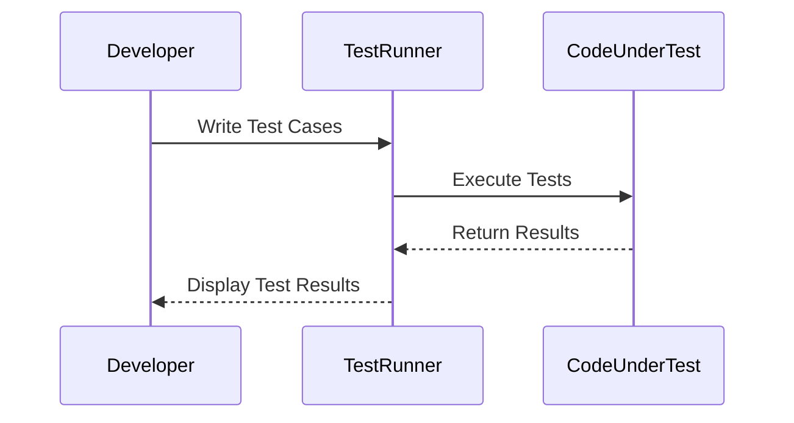

## 15.1 Unit Testing in Dart

Unit testing is a fundamental aspect of software development that ensures individual components of your codebase function as expected. In Dart, unit testing is facilitated by the `test` package, which provides a robust framework for writing and running tests. This section will guide you through the essentials of unit testing in Dart, covering best practices, code examples, and effective use of the `test` package to ensure robust and reliable Flutter applications.

### Understanding Unit Testing

Unit testing involves testing the smallest parts of an application, known as units, in isolation from the rest of the application. These units are typically individual functions or methods. The primary goal of unit testing is to validate that each unit of the software performs as designed.

#### Why Unit Testing?

- **Early Bug Detection**: Unit tests help identify bugs early in the development process, reducing the cost and effort required to fix them.
- **Code Refactoring**: With a comprehensive suite of unit tests, developers can refactor code with confidence, knowing that any regressions will be caught by the tests.
- **Documentation**: Unit tests serve as documentation for the code, illustrating how each unit is expected to behave.
- **Improved Design**: Writing unit tests encourages developers to write modular and decoupled code, leading to better software design.

### Setting Up Unit Testing in Dart

To get started with unit testing in Dart, you need to set up your development environment with the necessary tools and libraries.

#### Installing the `test` Package

The `test` package is the standard testing library for Dart. To include it in your project, add the following dependency to your `pubspec.yaml` file:

```yaml
dev_dependencies:
  test: ^1.16.0
```

After adding the dependency, run `dart pub get` to install the package.

#### Writing Your First Test

Let's write a simple test to demonstrate how the `test` package works. Consider a Dart function that adds two numbers:

```dart
int add(int a, int b) {
  return a + b;
}
```

To test this function, create a new file in the `test` directory, for example, `math_test.dart`, and write the following test:

```dart
import 'package:test/test.dart';

int add(int a, int b) => a + b;

void main() {
  test('adds two numbers', () {
    expect(add(2, 3), equals(5));
  });
}
```

#### Running Tests

To run your tests, use the `dart test` command in your terminal. This command will execute all tests in the `test` directory and report the results.

### Best Practices for Unit Testing

Writing effective unit tests involves more than just checking if your code works. Here are some best practices to follow:

#### Organizing Tests

- **Structure**: Organize your tests in a directory structure that mirrors your source code. This makes it easier to find and maintain tests.
- **Naming**: Use descriptive names for your test files and test cases. This helps in understanding the purpose of each test at a glance.

#### Writing Effective Assertions

Assertions are the core of unit testing. They verify that the code behaves as expected. The `test` package provides several assertion functions, such as `expect`, `equals`, `isTrue`, and `isFalse`.

- **Use Specific Assertions**: Use the most specific assertion available. For example, use `equals` instead of `isTrue` when checking for equality.
- **Test Edge Cases**: Ensure that your tests cover edge cases and not just the "happy path."

#### Test Coverage

- **Aim for High Coverage**: Strive for high test coverage, but don't sacrifice code quality for the sake of coverage. Focus on testing critical and complex parts of your code.
- **Use Coverage Tools**: Use tools like `dart test --coverage` to measure your test coverage and identify untested code.

### Advanced Testing Techniques

As you become more comfortable with unit testing, you can explore more advanced techniques to enhance your tests.

#### Mocking and Stubbing

Mocking and stubbing are techniques used to simulate the behavior of complex objects or external systems. This is particularly useful when testing code that interacts with databases, APIs, or other external services.

- **Mocking**: Create mock objects that mimic the behavior of real objects. Use libraries like `mockito` to simplify this process.
- **Stubbing**: Replace parts of your application with simplified implementations that return fixed responses.

#### Parameterized Tests

Parameterized tests allow you to run the same test logic with different inputs. This is useful for testing functions with multiple input scenarios.

```dart
import 'package:test/test.dart';

int add(int a, int b) => a + b;

void main() {
  group('add', () {
    final testCases = [
      [1, 1, 2],
      [2, 3, 5],
      [-1, 1, 0],
    ];

    for (var testCase in testCases) {
      test('adds ${testCase[0]} and ${testCase[1]}', () {
        expect(add(testCase[0], testCase[1]), equals(testCase[2]));
      });
    }
  });
}
```

### Visualizing the Testing Process

To better understand the testing process, let's visualize the flow of a typical unit test using a sequence diagram.



This diagram illustrates the interaction between the developer, the test runner, and the code under test during the testing process.

### Try It Yourself

To solidify your understanding of unit testing in Dart, try modifying the code examples provided. Experiment with different test cases, assertions, and mocking techniques. Consider testing more complex functions or classes to challenge yourself further.

### Knowledge Check

- **What is the primary goal of unit testing?**
- **How do you install the `test` package in a Dart project?**
- **What is the purpose of assertions in unit tests?**
- **Explain the difference between mocking and stubbing.**
- **How can you measure test coverage in a Dart project?**

### Summary

Unit testing is an essential practice for ensuring the reliability and maintainability of your Dart applications. By following best practices and leveraging the capabilities of the `test` package, you can write effective tests that catch bugs early, facilitate refactoring, and serve as documentation for your code. Remember, this is just the beginning. As you progress, you'll build more complex and interactive applications. Keep experimenting, stay curious, and enjoy the journey!

## Quiz Time!



### What is the primary goal of unit testing?

- [x] To validate that each unit of the software performs as designed.
- [ ] To test the entire application as a whole.
- [ ] To replace manual testing entirely.
- [ ] To ensure the application is bug-free.

> **Explanation:** Unit testing focuses on validating individual components or units of the software to ensure they function correctly.

### How do you install the `test` package in a Dart project?

- [x] By adding it to the `dev_dependencies` section in `pubspec.yaml`.
- [ ] By downloading it from the Dart website.
- [ ] By including it in the `dependencies` section in `pubspec.yaml`.
- [ ] By running `dart install test`.

> **Explanation:** The `test` package is added to the `dev_dependencies` section of `pubspec.yaml` because it is used during development and testing, not in production.

### What is the purpose of assertions in unit tests?

- [x] To verify that the code behaves as expected.
- [ ] To document the code.
- [ ] To replace the need for comments.
- [ ] To improve code performance.

> **Explanation:** Assertions are used in unit tests to check that the code produces the expected results, helping to identify bugs.

### Explain the difference between mocking and stubbing.

- [x] Mocking involves creating objects that mimic real objects, while stubbing involves replacing parts of the application with simplified implementations.
- [ ] Mocking and stubbing are the same.
- [ ] Mocking is used for testing, while stubbing is used for production.
- [ ] Stubbing is more advanced than mocking.

> **Explanation:** Mocking and stubbing are techniques used to simulate the behavior of complex objects or external systems in tests, with mocking focusing on behavior and stubbing on responses.

### How can you measure test coverage in a Dart project?

- [x] By using the `dart test --coverage` command.
- [ ] By manually counting the lines of code tested.
- [ ] By using the `dart coverage` package.
- [ ] By running `dart analyze`.

> **Explanation:** The `dart test --coverage` command is used to measure test coverage, helping to identify untested code.

### What is the benefit of parameterized tests?

- [x] They allow running the same test logic with different inputs.
- [ ] They simplify the test setup process.
- [ ] They improve test performance.
- [ ] They eliminate the need for assertions.

> **Explanation:** Parameterized tests enable testing functions with multiple input scenarios, increasing test coverage and efficiency.

### Which package is commonly used for mocking in Dart?

- [x] `mockito`
- [ ] `test`
- [ ] `flutter_test`
- [ ] `dart_mock`

> **Explanation:** The `mockito` package is widely used in Dart for creating mock objects in tests.

### What is a key advantage of high test coverage?

- [x] It helps identify untested code and ensures critical parts are tested.
- [ ] It guarantees the application is bug-free.
- [ ] It reduces the need for manual testing.
- [ ] It improves application performance.

> **Explanation:** High test coverage ensures that critical and complex parts of the code are tested, reducing the risk of undetected bugs.

### What should you focus on when writing unit tests?

- [x] Testing critical and complex parts of the code.
- [ ] Testing every single line of code.
- [ ] Writing as many tests as possible.
- [ ] Ensuring tests run quickly.

> **Explanation:** Focus on testing critical and complex parts of the code to ensure reliability and maintainability.

### True or False: Unit tests can serve as documentation for the code.

- [x] True
- [ ] False

> **Explanation:** Unit tests illustrate how each unit is expected to behave, serving as documentation for the code.




