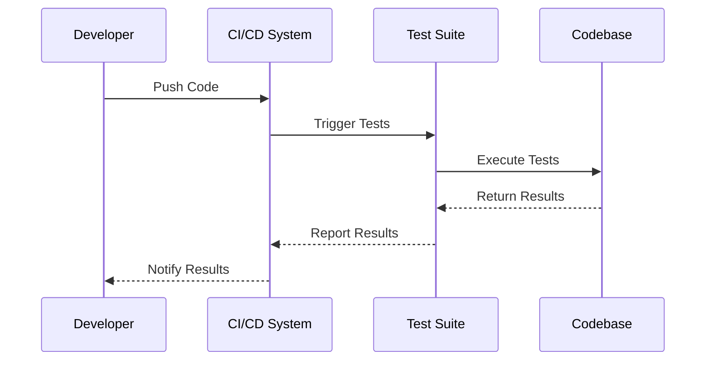

## 15.10 Testing Best Practices

In the realm of software development, testing is a cornerstone for ensuring the reliability, performance, and quality of applications. As Dart and Flutter developers, mastering testing best practices is crucial for delivering robust and maintainable software. This section will guide you through the essential practices for writing effective tests, maintaining a healthy test suite, and leveraging testing frameworks to their fullest potential.

### Writing Good Tests

Writing good tests is an art that balances between ensuring comprehensive coverage and maintaining simplicity. Here are some key principles to consider:

#### 1. **Clarity and Simplicity**

- **Explain the Purpose**: Each test should have a clear purpose. Use descriptive names for test functions that convey what the test is verifying.
- **Use Comments Wisely**: While code should be self-explanatory, comments can be helpful to explain complex logic or the intent behind certain assertions.

#### 2. **Isolation**

- **Test in Isolation**: Ensure that each test is independent and does not rely on the state or outcome of another test. This prevents cascading failures and makes debugging easier.
- **Mock External Dependencies**: Use mocking to isolate the unit of work from external dependencies like databases or network calls.

#### 3. **Determinism**

- **Ensure Consistency**: Tests should produce the same result every time they are run. Avoid using random data or relying on external systems that can introduce variability.

#### 4. **Coverage**

- **Aim for High Coverage**: While 100% coverage is not always feasible, strive for a high level of coverage, especially for critical parts of your application.
- **Balance Coverage with Quality**: High coverage does not always equate to high-quality tests. Ensure that tests are meaningful and cover edge cases.

#### 5. **Performance**

- **Optimize Test Execution**: Tests should run quickly to encourage frequent execution. Optimize slow tests by profiling and addressing bottlenecks.
- **Parallelize Tests**: Use parallel execution to speed up the test suite, especially for large projects.

### Test Maintenance

Maintaining a healthy test suite is essential for long-term project success. Here are some strategies to keep your tests in top shape:

#### 1. **Regular Refactoring**

- **Refactor Tests Alongside Code**: As the codebase evolves, ensure that tests are updated to reflect changes. This prevents tests from becoming obsolete or incorrect.
- **Simplify Complex Tests**: Regularly review and simplify complex tests to improve readability and maintainability.

#### 2. **Continuous Integration**

- **Automate Test Execution**: Integrate tests into your CI/CD pipeline to ensure they are run automatically with every code change.
- **Monitor Test Results**: Regularly review test results to catch and address failures promptly.

#### 3. **Handling Flaky Tests**

- **Identify and Fix Flaky Tests**: Flaky tests that pass or fail intermittently can erode trust in the test suite. Identify the root cause and address it promptly.
- **Quarantine Flaky Tests**: Temporarily isolate flaky tests to prevent them from affecting the overall test suite's reliability.

#### 4. **Documentation**

- **Document Test Cases**: Maintain documentation for complex test cases to help new team members understand the test suite.
- **Use Test Reports**: Generate and review test reports to gain insights into test coverage and areas that need improvement.

### Code Examples

Let's explore some code examples to illustrate these best practices.

#### Example 1: Writing a Simple Unit Test

```dart
import 'package:test/test.dart';

// A simple function to add two numbers
int add(int a, int b) => a + b;

void main() {
  test('add should return the sum of two numbers', () {
    // Arrange
    int a = 2;
    int b = 3;

    // Act
    int result = add(a, b);

    // Assert
    expect(result, equals(5));
  });
}
```

In this example, we demonstrate a simple unit test for an `add` function. The test is clear, isolated, and deterministic.

#### Example 2: Mocking External Dependencies

```dart
import 'package:test/test.dart';
import 'package:mockito/mockito.dart';

// A simple service that fetches data from an API
class ApiService {
  Future<String> fetchData() async {
    // Simulate a network call
    return 'data from API';
  }
}

// Mock class for ApiService
class MockApiService extends Mock implements ApiService {}

void main() {
  test('fetchData should return data from API', () async {
    // Arrange
    final apiService = MockApiService();
    when(apiService.fetchData()).thenAnswer((_) async => 'mock data');

    // Act
    final result = await apiService.fetchData();

    // Assert
    expect(result, equals('mock data'));
  });
}
```

Here, we use the `mockito` package to mock an external API service, allowing us to test the `fetchData` method in isolation.

### Visualizing Test Processes

To better understand the testing process, let's visualize the flow of a typical test execution using a sequence diagram.



This diagram illustrates the interaction between a developer, the CI/CD system, the test suite, and the codebase during a typical test execution process.

### References and Links

For further reading on testing best practices, consider the following resources:

- [Dart Testing Documentation](https://dart.dev/guides/testing)
- [Flutter Testing Guide](https://flutter.dev/docs/testing)
- [Mockito Package](https://pub.dev/packages/mockito)

### Knowledge Check

To reinforce your understanding, consider the following questions:

1. What are the key principles of writing good tests?
2. How can you ensure tests are isolated and independent?
3. Why is it important to maintain a high level of test coverage?
4. What strategies can be used to handle flaky tests?
5. How can continuous integration improve test maintenance?

### Embrace the Journey

Remember, mastering testing best practices is a journey. As you progress, you'll develop a deeper understanding of how to write effective tests and maintain a healthy test suite. Keep experimenting, stay curious, and enjoy the journey!

## Quiz Time!



### What is a key principle of writing good tests?

- [x] Clarity and Simplicity
- [ ] Complexity and Depth
- [ ] Randomness and Variability
- [ ] Dependency and Coupling

> **Explanation:** Clarity and simplicity ensure that tests are easy to understand and maintain.

### How can you ensure tests are isolated?

- [x] Mock External Dependencies
- [ ] Use Random Data
- [ ] Rely on External Systems
- [ ] Share State Between Tests

> **Explanation:** Mocking external dependencies helps isolate the unit of work from external factors.

### Why is high test coverage important?

- [x] It ensures critical parts of the application are tested.
- [ ] It guarantees bug-free software.
- [ ] It reduces the need for code reviews.
- [ ] It eliminates the need for documentation.

> **Explanation:** High test coverage ensures that critical parts of the application are tested, reducing the risk of undetected bugs.

### What should you do with flaky tests?

- [x] Identify and Fix Them
- [ ] Ignore Them
- [ ] Delete Them
- [ ] Run Them More Often

> **Explanation:** Flaky tests should be identified and fixed to maintain the reliability of the test suite.

### How can continuous integration improve test maintenance?

- [x] Automates Test Execution
- [ ] Increases Code Complexity
- [ ] Reduces Test Coverage
- [ ] Eliminates the Need for Testing

> **Explanation:** Continuous integration automates test execution, ensuring tests are run consistently with every code change.

### What is the purpose of using comments in tests?

- [x] Explain Complex Logic
- [ ] Increase Code Length
- [ ] Obfuscate Code Intent
- [ ] Reduce Readability

> **Explanation:** Comments can help explain complex logic or the intent behind certain assertions.

### How can you optimize test execution?

- [x] Parallelize Tests
- [ ] Use Random Data
- [ ] Increase Test Complexity
- [ ] Reduce Test Coverage

> **Explanation:** Parallelizing tests can speed up the execution of the test suite.

### What is a benefit of documenting test cases?

- [x] Helps New Team Members Understand the Test Suite
- [ ] Increases Code Complexity
- [ ] Reduces Test Coverage
- [ ] Eliminates the Need for Comments

> **Explanation:** Documentation helps new team members understand the test suite and its purpose.

### What is the role of a CI/CD system in testing?

- [x] Automates Test Execution and Notifies Results
- [ ] Increases Code Complexity
- [ ] Reduces Test Coverage
- [ ] Eliminates the Need for Testing

> **Explanation:** A CI/CD system automates test execution and notifies developers of the results.

### True or False: High test coverage guarantees bug-free software.

- [ ] True
- [x] False

> **Explanation:** High test coverage does not guarantee bug-free software; it only ensures that more parts of the application are tested.


