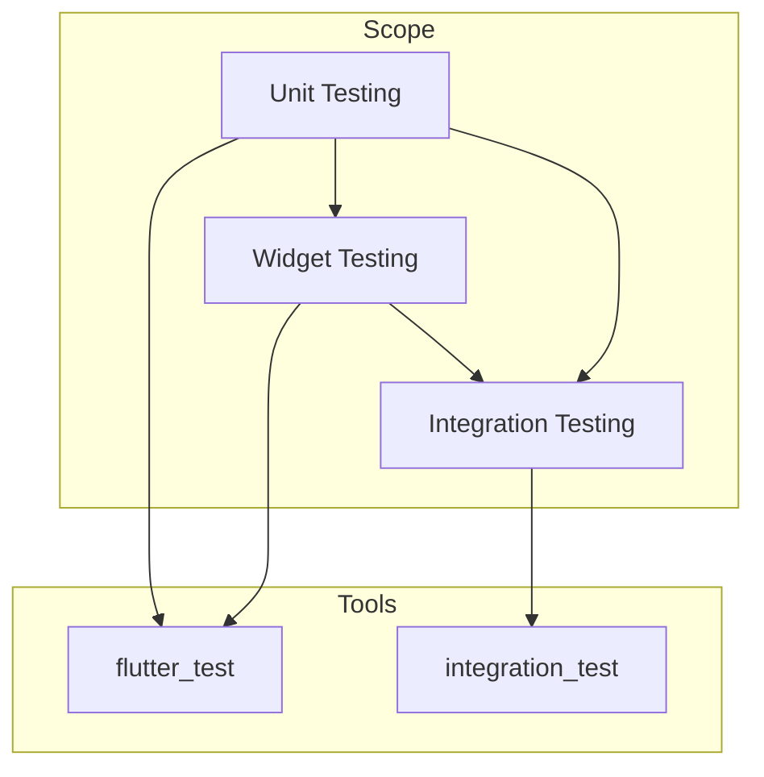

## 15.11 Using Flutter's Testing Frameworks

In the world of software development, testing is a crucial step that ensures the reliability and quality of applications. Flutter, being a powerful UI toolkit for building natively compiled applications for mobile, web, and desktop from a single codebase, provides robust testing frameworks to facilitate this process. In this section, we will delve into the various testing frameworks available in Flutter, explore their features, and demonstrate how to effectively utilize them to enhance your Flutter development process.

### Understanding Flutter's Testing Frameworks

Flutter offers three primary types of testing: unit testing, widget testing, and integration testing. Each type serves a specific purpose and is essential for ensuring the overall quality of your application.

#### 1. Unit Testing

**Unit Testing** focuses on testing individual units of code, such as functions or classes, in isolation. This type of testing is crucial for verifying the correctness of your logic and ensuring that each component behaves as expected.

- **Purpose**: Validate the functionality of a specific piece of code.
- **Tools**: Flutter provides the `flutter_test` package, which includes a rich set of utilities for writing unit tests.

##### Example: Unit Testing a Dart Function

Let's consider a simple Dart function that calculates the factorial of a number:

```dart
int factorial(int n) {
  if (n < 0) throw ArgumentError('Negative numbers are not allowed');
  return n <= 1 ? 1 : n * factorial(n - 1);
}
```

To test this function, we can write a unit test as follows:

```dart
import 'package:flutter_test/flutter_test.dart';

void main() {
  test('Factorial of 0 should be 1', () {
    expect(factorial(0), 1);
  });

  test('Factorial of 5 should be 120', () {
    expect(factorial(5), 120);
  });

  test('Factorial of negative number should throw error', () {
    expect(() => factorial(-1), throwsArgumentError);
  });
}
```

In this example, we use the `test` function from the `flutter_test` package to define our test cases. The `expect` function is used to assert that the actual output matches the expected output.

#### 2. Widget Testing

**Widget Testing** is a more comprehensive form of testing that focuses on verifying the behavior and appearance of individual widgets. This type of testing is essential for ensuring that your UI components render correctly and respond to user interactions as expected.

- **Purpose**: Test the UI components in isolation.
- **Tools**: The `flutter_test` package provides utilities for rendering widgets in a test environment.

##### Example: Widget Testing a Flutter Button

Consider a simple Flutter widget that displays a button and a counter:

```dart
import 'package:flutter/material.dart';

class CounterButton extends StatefulWidget {
  @override
  _CounterButtonState createState() => _CounterButtonState();
}

class _CounterButtonState extends State<CounterButton> {
  int _counter = 0;

  void _incrementCounter() {
    setState(() {
      _counter++;
    });
  }

  @override
  Widget build(BuildContext context) {
    return Column(
      children: [
        Text('Counter: $_counter'),
        ElevatedButton(
          onPressed: _incrementCounter,
          child: Text('Increment'),
        ),
      ],
    );
  }
}
```

To test this widget, we can write a widget test as follows:

```dart
import 'package:flutter_test/flutter_test.dart';
import 'package:flutter/material.dart';
import 'counter_button.dart'; // Import your widget file

void main() {
  testWidgets('Counter increments when button is pressed', (WidgetTester tester) async {
    // Build the widget
    await tester.pumpWidget(MaterialApp(home: CounterButton()));

    // Verify initial counter value
    expect(find.text('Counter: 0'), findsOneWidget);

    // Tap the button and trigger a frame
    await tester.tap(find.byType(ElevatedButton));
    await tester.pump();

    // Verify counter value after tap
    expect(find.text('Counter: 1'), findsOneWidget);
  });
}
```

In this example, we use the `testWidgets` function to define our widget test. The `WidgetTester` class provides methods for interacting with the widget tree, such as `pumpWidget` to build the widget and `tap` to simulate user interactions.

#### 3. Integration Testing

**Integration Testing** is the most comprehensive form of testing, focusing on testing the entire application or large parts of it. This type of testing is essential for verifying that all components work together as expected.

- **Purpose**: Test the entire application or large parts of it.
- **Tools**: Flutter provides the `integration_test` package for writing integration tests.

##### Example: Integration Testing a Flutter App

Consider a simple Flutter app with a home screen and a detail screen:

```dart
import 'package:flutter/material.dart';

void main() {
  runApp(MyApp());
}

class MyApp extends StatelessWidget {
  @override
  Widget build(BuildContext context) {
    return MaterialApp(
      home: HomeScreen(),
    );
  }
}

class HomeScreen extends StatelessWidget {
  @override
  Widget build(BuildContext context) {
    return Scaffold(
      appBar: AppBar(title: Text('Home')),
      body: Center(
        child: ElevatedButton(
          onPressed: () {
            Navigator.push(
              context,
              MaterialPageRoute(builder: (context) => DetailScreen()),
            );
          },
          child: Text('Go to Detail'),
        ),
      ),
    );
  }
}

class DetailScreen extends StatelessWidget {
  @override
  Widget build(BuildContext context) {
    return Scaffold(
      appBar: AppBar(title: Text('Detail')),
      body: Center(child: Text('Detail Screen')),
    );
  }
}
```

To test this app, we can write an integration test as follows:

```dart
import 'package:flutter_test/flutter_test.dart';
import 'package:integration_test/integration_test.dart';
import 'package:flutter/material.dart';
import 'package:my_app/main.dart'; // Import your app file

void main() {
  IntegrationTestWidgetsFlutterBinding.ensureInitialized();

  testWidgets('Navigate to detail screen', (WidgetTester tester) async {
    // Build the app
    await tester.pumpWidget(MyApp());

    // Verify initial screen
    expect(find.text('Home'), findsOneWidget);
    expect(find.text('Detail Screen'), findsNothing);

    // Tap the button and trigger a frame
    await tester.tap(find.byType(ElevatedButton));
    await tester.pumpAndSettle();

    // Verify detail screen
    expect(find.text('Detail Screen'), findsOneWidget);
  });
}
```

In this example, we use the `IntegrationTestWidgetsFlutterBinding` to initialize the integration test environment. The `pumpAndSettle` method is used to wait for all animations and transitions to complete before verifying the final state.

### Advanced Testing Techniques

In addition to the basic testing frameworks, Flutter also provides advanced testing techniques for testing animations and platform-specific behavior.

#### Testing Animations

Animations are a crucial part of modern applications, providing a smooth and engaging user experience. Testing animations ensures that they behave as expected and do not introduce any performance issues.

##### Example: Testing a Flutter Animation

Consider a simple Flutter widget with an animated opacity:

```dart
import 'package:flutter/material.dart';

class AnimatedOpacityWidget extends StatefulWidget {
  @override
  _AnimatedOpacityWidgetState createState() => _AnimatedOpacityWidgetState();
}

class _AnimatedOpacityWidgetState extends State<AnimatedOpacityWidget> {
  double _opacity = 0.0;

  void _toggleOpacity() {
    setState(() {
      _opacity = _opacity == 0.0 ? 1.0 : 0.0;
    });
  }

  @override
  Widget build(BuildContext context) {
    return Column(
      children: [
        AnimatedOpacity(
          opacity: _opacity,
          duration: Duration(seconds: 1),
          child: Text('Fade In/Out'),
        ),
        ElevatedButton(
          onPressed: _toggleOpacity,
          child: Text('Toggle Opacity'),
        ),
      ],
    );
  }
}
```

To test this animation, we can write a widget test as follows:

```dart
import 'package:flutter_test/flutter_test.dart';
import 'package:flutter/material.dart';
import 'animated_opacity_widget.dart'; // Import your widget file

void main() {
  testWidgets('Animated opacity changes when button is pressed', (WidgetTester tester) async {
    // Build the widget
    await tester.pumpWidget(MaterialApp(home: AnimatedOpacityWidget()));

    // Verify initial opacity
    final animatedOpacityFinder = find.byType(AnimatedOpacity);
    expect(tester.widget<AnimatedOpacity>(animatedOpacityFinder).opacity, 0.0);

    // Tap the button and trigger a frame
    await tester.tap(find.byType(ElevatedButton));
    await tester.pump(); // Start the animation

    // Verify opacity during animation
    await tester.pump(Duration(milliseconds: 500)); // Halfway through the animation
    expect(tester.widget<AnimatedOpacity>(animatedOpacityFinder).opacity, greaterThan(0.0));

    // Complete the animation
    await tester.pumpAndSettle();
    expect(tester.widget<AnimatedOpacity>(animatedOpacityFinder).opacity, 1.0);
  });
}
```

In this example, we use the `pump` method to advance the animation by a specific duration and verify the opacity at different stages of the animation.

#### Testing Platform-Specific Behavior

Flutter allows you to write platform-specific code using the `Platform` class and conditional imports. Testing platform-specific behavior ensures that your application behaves correctly on different platforms.

##### Example: Testing Platform-Specific Code

Consider a simple Flutter widget that displays a different message based on the platform:

```dart
import 'package:flutter/material.dart';
import 'dart:io' show Platform;

class PlatformMessageWidget extends StatelessWidget {
  @override
  Widget build(BuildContext context) {
    String message = Platform.isIOS ? 'Hello, iOS user!' : 'Hello, Android user!';
    return Text(message);
  }
}
```

To test this widget, we can write a widget test as follows:

```dart
import 'package:flutter_test/flutter_test.dart';
import 'package:flutter/material.dart';
import 'platform_message_widget.dart'; // Import your widget file

void main() {
  testWidgets('Displays correct message for iOS', (WidgetTester tester) async {
    // Simulate iOS platform
    debugDefaultTargetPlatformOverride = TargetPlatform.iOS;

    // Build the widget
    await tester.pumpWidget(MaterialApp(home: PlatformMessageWidget()));

    // Verify message
    expect(find.text('Hello, iOS user!'), findsOneWidget);

    // Reset platform override
    debugDefaultTargetPlatformOverride = null;
  });

  testWidgets('Displays correct message for Android', (WidgetTester tester) async {
    // Simulate Android platform
    debugDefaultTargetPlatformOverride = TargetPlatform.android;

    // Build the widget
    await tester.pumpWidget(MaterialApp(home: PlatformMessageWidget()));

    // Verify message
    expect(find.text('Hello, Android user!'), findsOneWidget);

    // Reset platform override
    debugDefaultTargetPlatformOverride = null;
  });
}
```

In this example, we use the `debugDefaultTargetPlatformOverride` variable to simulate different platforms and verify the correct message is displayed.

### Best Practices for Using Flutter's Testing Frameworks

To make the most of Flutter's testing frameworks, consider the following best practices:

1. **Write Tests Early**: Start writing tests early in the development process to catch issues before they become more complex.

2. **Use Descriptive Test Names**: Use descriptive names for your test cases to make it clear what each test is verifying.

3. **Keep Tests Independent**: Ensure that each test case is independent and does not rely on the outcome of other tests.

4. **Test Edge Cases**: Consider edge cases and unexpected inputs to ensure your application handles them gracefully.

5. **Automate Testing**: Use continuous integration (CI) tools to automate your testing process and ensure that tests are run consistently.

6. **Monitor Test Coverage**: Use tools to monitor test coverage and identify areas of your code that need more testing.

7. **Refactor Tests**: Regularly refactor your tests to keep them maintainable and up-to-date with changes in your application.

### Visualizing the Testing Process

To better understand the testing process in Flutter, let's visualize the relationship between the different types of tests and their scope:



**Diagram Description**: This diagram illustrates the hierarchy and scope of the different types of tests in Flutter. Unit testing focuses on individual units of code, widget testing focuses on UI components, and integration testing encompasses the entire application. The `flutter_test` package is used for unit and widget testing, while the `integration_test` package is used for integration testing.

### Try It Yourself

Now that we've covered the basics of using Flutter's testing frameworks, it's time to try it yourself. Here are a few exercises to help you practice:

1. **Modify the CounterButton Widget**: Add a decrement button to the `CounterButton` widget and write a test to verify its functionality.

2. **Test a Custom Animation**: Create a custom animation widget and write a test to verify its behavior at different stages of the animation.

3. **Simulate Different Platforms**: Modify the `PlatformMessageWidget` to display a different message for web platforms and write tests to verify the behavior on different platforms.

4. **Automate Your Tests**: Set up a CI pipeline to automate your tests and ensure they are run consistently.

### Knowledge Check

Before we wrap up, let's reinforce what we've learned with a few questions:

- What are the three primary types of testing in Flutter?
- How can you simulate different platforms in a widget test?
- What is the purpose of the `pumpAndSettle` method in a widget test?
- Why is it important to keep tests independent?

### Embrace the Journey

Remember, mastering Flutter's testing frameworks is an ongoing journey. As you continue to develop your skills, you'll find new ways to improve your testing process and ensure the quality of your applications. Keep experimenting, stay curious, and enjoy the journey!

## Quiz Time!



### What are the three primary types of testing in Flutter?

- [x] Unit Testing, Widget Testing, Integration Testing
- [ ] Unit Testing, System Testing, Acceptance Testing
- [ ] Widget Testing, System Testing, Integration Testing
- [ ] Unit Testing, Acceptance Testing, Integration Testing

> **Explanation:** Flutter provides three primary types of testing: unit testing, widget testing, and integration testing, each serving a specific purpose in the development process.

### How can you simulate different platforms in a widget test?

- [x] By using the `debugDefaultTargetPlatformOverride` variable
- [ ] By using the `Platform` class directly
- [ ] By modifying the `MaterialApp` widget
- [ ] By using a third-party package

> **Explanation:** The `debugDefaultTargetPlatformOverride` variable allows you to simulate different platforms in a widget test.

### What is the purpose of the `pumpAndSettle` method in a widget test?

- [x] To wait for all animations and transitions to complete
- [ ] To build the widget tree
- [ ] To simulate user interactions
- [ ] To verify the final state of the widget

> **Explanation:** The `pumpAndSettle` method is used to wait for all animations and transitions to complete before verifying the final state of the widget.

### Why is it important to keep tests independent?

- [x] To ensure that each test case does not rely on the outcome of other tests
- [ ] To make tests easier to write
- [ ] To reduce the number of test cases
- [ ] To improve test coverage

> **Explanation:** Keeping tests independent ensures that each test case does not rely on the outcome of other tests, making them more reliable and easier to maintain.

### What package is used for integration testing in Flutter?

- [x] `integration_test`
- [ ] `flutter_test`
- [ ] `test`
- [ ] `flutter_driver`

> **Explanation:** The `integration_test` package is used for integration testing in Flutter.

### Which method is used to simulate user interactions in a widget test?

- [x] `tap`
- [ ] `pump`
- [ ] `pumpAndSettle`
- [ ] `find`

> **Explanation:** The `tap` method is used to simulate user interactions, such as tapping a button, in a widget test.

### What is the purpose of the `expect` function in a test?

- [x] To assert that the actual output matches the expected output
- [ ] To build the widget tree
- [ ] To simulate user interactions
- [ ] To initialize the test environment

> **Explanation:** The `expect` function is used to assert that the actual output matches the expected output in a test.

### What is the role of the `flutter_test` package?

- [x] To provide utilities for writing unit and widget tests
- [ ] To provide utilities for writing integration tests
- [ ] To provide utilities for writing system tests
- [ ] To provide utilities for writing acceptance tests

> **Explanation:** The `flutter_test` package provides utilities for writing unit and widget tests in Flutter.

### How can you verify the behavior of an animation in a widget test?

- [x] By using the `pump` method to advance the animation by a specific duration
- [ ] By using the `tap` method to simulate user interactions
- [ ] By using the `find` method to locate widgets
- [ ] By using the `expect` function to assert the final state

> **Explanation:** The `pump` method is used to advance the animation by a specific duration, allowing you to verify its behavior at different stages.

### True or False: Automated testing is not necessary for small Flutter applications.

- [ ] True
- [x] False

> **Explanation:** Automated testing is beneficial for applications of all sizes, as it helps ensure reliability and quality, and can catch issues early in the development process.


