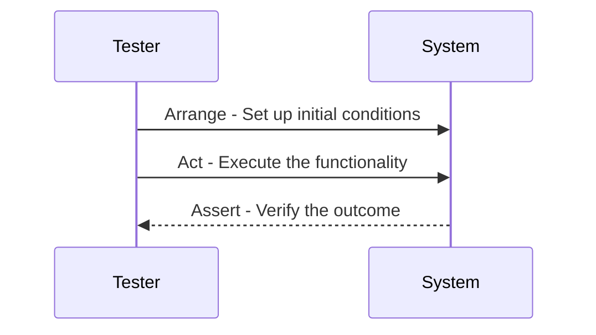

## 15.12 Arrange-Act-Assert Pattern

In the realm of software development, testing is an indispensable practice that ensures the reliability and quality of code. Among the various testing methodologies, the Arrange-Act-Assert (AAA) pattern stands out for its simplicity and effectiveness in structuring tests. This pattern is particularly beneficial in Dart and Flutter development, where clarity and maintainability are paramount. In this section, we will delve into the intricacies of the Arrange-Act-Assert pattern, exploring its components, benefits, and practical applications in Dart testing.

### Understanding the Arrange-Act-Assert Pattern

The Arrange-Act-Assert pattern is a testing methodology that divides a test case into three distinct sections:

1. **Arrange**: Set up the necessary conditions and inputs for the test.
2. **Act**: Execute the code or functionality being tested.
3. **Assert**: Verify that the outcome is as expected.

This structure not only enhances the readability of test cases but also promotes a systematic approach to testing, making it easier to identify and isolate issues.

#### Key Components of the AAA Pattern

- **Arrange**: In this phase, you prepare everything needed for the test. This includes initializing objects, setting up dependencies, and configuring the environment. The goal is to create a controlled context in which the test can be executed.

- **Act**: Here, you perform the action that you want to test. This could be calling a method, triggering an event, or executing a function. The act phase is where the actual testing takes place, and it should be as concise as possible to focus on the behavior being tested.

- **Assert**: Finally, you verify that the results of the act phase meet the expected outcomes. This involves checking return values, state changes, or any other observable effects. Assertions should be clear and specific to ensure that the test accurately reflects the intended behavior.

### Benefits of Using the Arrange-Act-Assert Pattern

- **Enhanced Readability**: By clearly separating the setup, execution, and verification phases, the AAA pattern makes tests easier to read and understand. This is particularly useful for teams, as it allows developers to quickly grasp the purpose and flow of a test.

- **Improved Maintainability**: The structured nature of the AAA pattern facilitates easier maintenance and updates to test cases. Changes to the setup or assertions can be made independently, reducing the risk of introducing errors.

- **Consistency Across Tests**: Adopting the AAA pattern promotes a consistent approach to writing tests, which can be beneficial in large projects with multiple contributors. Consistency helps in maintaining a uniform testing style and simplifies onboarding for new team members.

### Implementing the Arrange-Act-Assert Pattern in Dart

Let's explore how to implement the Arrange-Act-Assert pattern in Dart with practical examples. We'll start with a simple example and gradually introduce more complex scenarios.

#### Example 1: Testing a Simple Function

Consider a function that calculates the sum of two integers:

```dart
int add(int a, int b) {
  return a + b;
}
```

We can write a test for this function using the AAA pattern:

```dart
import 'package:test/test.dart';

void main() {
  test('add should return the sum of two integers', () {
    // Arrange
    int a = 5;
    int b = 3;

    // Act
    int result = add(a, b);

    // Assert
    expect(result, equals(8));
  });
}
```

**Explanation**:
- **Arrange**: We initialize the integers `a` and `b` with values 5 and 3, respectively.
- **Act**: We call the `add` function with `a` and `b` as arguments and store the result.
- **Assert**: We verify that the result is equal to 8 using the `expect` function.

#### Example 2: Testing a Class Method

Let's consider a more complex scenario where we have a class representing a bank account:

```dart
class BankAccount {
  double balance;

  BankAccount(this.balance);

  void deposit(double amount) {
    balance += amount;
  }

  void withdraw(double amount) {
    if (amount <= balance) {
      balance -= amount;
    } else {
      throw Exception('Insufficient funds');
    }
  }
}
```

We can write tests for the `deposit` and `withdraw` methods using the AAA pattern:

```dart
import 'package:test/test.dart';

void main() {
  group('BankAccount', () {
    test('deposit should increase the balance', () {
      // Arrange
      var account = BankAccount(100.0);

      // Act
      account.deposit(50.0);

      // Assert
      expect(account.balance, equals(150.0));
    });

    test('withdraw should decrease the balance', () {
      // Arrange
      var account = BankAccount(100.0);

      // Act
      account.withdraw(30.0);

      // Assert
      expect(account.balance, equals(70.0));
    });

    test('withdraw should throw an exception for insufficient funds', () {
      // Arrange
      var account = BankAccount(100.0);

      // Act & Assert
      expect(() => account.withdraw(150.0), throwsException);
    });
  });
}
```

**Explanation**:
- **Arrange**: We create a `BankAccount` instance with an initial balance.
- **Act**: We perform the `deposit` or `withdraw` operation.
- **Assert**: We check the balance or verify that an exception is thrown.

### Visualizing the Arrange-Act-Assert Pattern

To better understand the flow of the Arrange-Act-Assert pattern, let's visualize it using a sequence diagram:



**Diagram Description**: This sequence diagram illustrates the interaction between the tester and the system under test. The tester first arranges the necessary conditions, then acts by executing the functionality, and finally asserts the expected outcome.

### Advanced Usage of the Arrange-Act-Assert Pattern

As we delve deeper into the AAA pattern, let's explore some advanced scenarios and best practices for using this pattern in Dart testing.

#### Handling Asynchronous Code

In Dart, asynchronous operations are common, especially in Flutter applications. The AAA pattern can be adapted to handle asynchronous code using the `async` and `await` keywords.

Consider a function that fetches data from an API:

```dart
Future<String> fetchData() async {
  // Simulate a network call
  await Future.delayed(Duration(seconds: 2));
  return 'Data from API';
}
```

We can write a test for this function using the AAA pattern:

```dart
import 'package:test/test.dart';

void main() {
  test('fetchData should return data from API', () async {
    // Arrange
    // No setup needed for this simple example

    // Act
    String result = await fetchData();

    // Assert
    expect(result, equals('Data from API'));
  });
}
```

**Explanation**:
- **Arrange**: In this case, no setup is needed.
- **Act**: We await the result of the `fetchData` function.
- **Assert**: We verify that the result matches the expected string.

#### Testing with Mocks and Stubs

In more complex applications, you may need to test interactions with external dependencies or services. Mocks and stubs can be used to simulate these dependencies, allowing you to focus on the behavior of the code under test.

Consider a service that interacts with a database:

```dart
class DatabaseService {
  Future<void> saveData(String data) async {
    // Simulate saving data to a database
  }
}
```

We can use a mock to test a function that relies on `DatabaseService`:

```dart
import 'package:mockito/mockito.dart';
import 'package:test/test.dart';

class MockDatabaseService extends Mock implements DatabaseService {}

void main() {
  test('should save data to the database', () async {
    // Arrange
    var mockDatabaseService = MockDatabaseService();
    when(mockDatabaseService.saveData(any)).thenAnswer((_) async => null);

    // Act
    await mockDatabaseService.saveData('Test data');

    // Assert
    verify(mockDatabaseService.saveData('Test data')).called(1);
  });
}
```

**Explanation**:
- **Arrange**: We create a mock instance of `DatabaseService` and set up its behavior.
- **Act**: We call the `saveData` method on the mock.
- **Assert**: We verify that the method was called with the expected arguments.

### Best Practices for Using the Arrange-Act-Assert Pattern

- **Keep Tests Focused**: Each test should focus on a single behavior or aspect of the code. This makes it easier to identify the cause of a failure and simplifies maintenance.

- **Use Descriptive Names**: Test names should clearly describe the behavior being tested. This helps in understanding the purpose of the test at a glance.

- **Minimize Setup Complexity**: The arrange phase should be as simple as possible. Complex setups can make tests difficult to read and maintain.

- **Avoid Logic in Tests**: Tests should not contain complex logic or calculations. The purpose of a test is to verify behavior, not to perform computations.

- **Use Mocks and Stubs Wisely**: While mocks and stubs are useful for isolating the code under test, overuse can lead to brittle tests. Use them judiciously to maintain test reliability.

### Common Pitfalls and How to Avoid Them

- **Overcomplicating Tests**: Avoid adding unnecessary complexity to tests. Keep them simple and focused on the behavior being tested.

- **Neglecting Edge Cases**: Ensure that tests cover a range of scenarios, including edge cases and error conditions.

- **Ignoring Test Failures**: When a test fails, investigate the cause and address it promptly. Ignoring failures can lead to undetected issues in the codebase.

- **Lack of Test Coverage**: Strive for comprehensive test coverage to ensure that all critical paths and functionalities are tested.

### Try It Yourself

To reinforce your understanding of the Arrange-Act-Assert pattern, try modifying the code examples provided. Experiment with different scenarios, such as:

- Adding more test cases for edge conditions.
- Using the AAA pattern to test a different function or class.
- Implementing asynchronous tests with varying delays.

### References and Further Reading

- [Dart Testing Documentation](https://dart.dev/guides/testing)
- [Mockito Package for Dart](https://pub.dev/packages/mockito)
- [Effective Dart: Testing](https://dart.dev/guides/language/effective-dart/testing)

### Knowledge Check

- What are the three phases of the Arrange-Act-Assert pattern?
- How does the AAA pattern enhance test readability?
- Why is it important to keep the arrange phase simple?
- How can mocks and stubs be used in the AAA pattern?

### Embrace the Journey

Remember, mastering the Arrange-Act-Assert pattern is just one step in your journey to becoming a proficient Dart and Flutter developer. As you continue to explore and experiment with testing patterns, you'll gain deeper insights into writing robust and maintainable code. Keep pushing the boundaries, stay curious, and enjoy the process of learning and growing as a developer.

## Quiz Time!



### What are the three phases of the Arrange-Act-Assert pattern?

- [x] Arrange, Act, Assert
- [ ] Setup, Execute, Verify
- [ ] Initialize, Perform, Check
- [ ] Prepare, Run, Confirm

> **Explanation:** The Arrange-Act-Assert pattern consists of three phases: Arrange, Act, and Assert, which structure tests into setup, execution, and verification.

### How does the Arrange-Act-Assert pattern enhance test readability?

- [x] By separating setup, execution, and verification
- [ ] By using complex logic in tests
- [ ] By minimizing test coverage
- [ ] By ignoring test failures

> **Explanation:** The AAA pattern enhances readability by clearly separating the setup, execution, and verification phases, making tests easier to understand.

### Why is it important to keep the arrange phase simple?

- [x] To maintain test readability and ease of maintenance
- [ ] To add complexity to the test
- [ ] To perform computations
- [ ] To ensure test failures are ignored

> **Explanation:** Keeping the arrange phase simple helps maintain readability and ease of maintenance, avoiding unnecessary complexity.

### How can mocks and stubs be used in the AAA pattern?

- [x] To simulate external dependencies
- [ ] To add complexity to tests
- [ ] To perform calculations
- [ ] To ignore test failures

> **Explanation:** Mocks and stubs simulate external dependencies, allowing tests to focus on the behavior of the code under test.

### What should be avoided in the act phase of the AAA pattern?

- [x] Complex logic and calculations
- [ ] Simple method calls
- [ ] Clear assertions
- [ ] Descriptive test names

> **Explanation:** The act phase should avoid complex logic and calculations, focusing on executing the functionality being tested.

### What is a common pitfall when using the AAA pattern?

- [x] Overcomplicating tests
- [ ] Using descriptive names
- [ ] Keeping tests focused
- [ ] Covering edge cases

> **Explanation:** Overcomplicating tests is a common pitfall, as it can make them difficult to read and maintain.

### How can the AAA pattern be adapted for asynchronous code?

- [x] By using async and await
- [ ] By ignoring asynchronous operations
- [ ] By adding complex logic
- [ ] By minimizing test coverage

> **Explanation:** The AAA pattern can be adapted for asynchronous code by using async and await to handle asynchronous operations.

### What is the purpose of the assert phase in the AAA pattern?

- [x] To verify the outcome of the act phase
- [ ] To set up initial conditions
- [ ] To execute the functionality
- [ ] To simulate external dependencies

> **Explanation:** The assert phase verifies the outcome of the act phase, ensuring that the results meet the expected outcomes.

### Why is consistency important when using the AAA pattern?

- [x] It promotes a uniform testing style
- [ ] It adds complexity to tests
- [ ] It minimizes test coverage
- [ ] It ignores test failures

> **Explanation:** Consistency promotes a uniform testing style, simplifying onboarding and maintenance in large projects.

### True or False: The AAA pattern is only applicable to Dart and Flutter development.

- [ ] True
- [x] False

> **Explanation:** False. The AAA pattern is a widely used testing methodology applicable to various programming languages and frameworks, not just Dart and Flutter.


