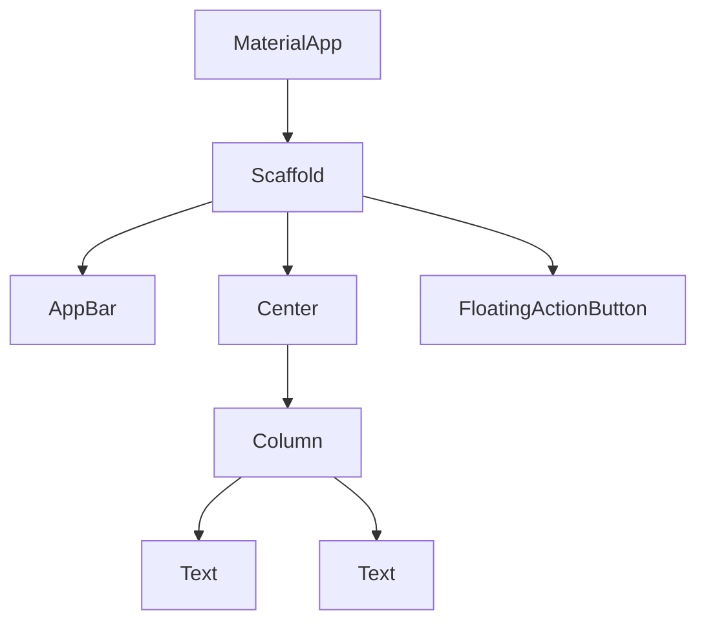

## 15.2 Widget Testing in Flutter

In the world of Flutter development, ensuring that your UI components behave as expected is crucial for delivering high-quality applications. Widget testing in Flutter allows developers to validate the appearance and behavior of their widgets, ensuring that they render correctly and respond to user interactions as intended. This section will guide you through the essentials of widget testing, focusing on using the `WidgetTester` class to simulate user interactions and perform rendering tests.

### Introduction to Widget Testing

Widget testing is a form of automated testing that focuses on individual components of your Flutter application. Unlike unit tests, which test the smallest parts of your code in isolation, widget tests verify the behavior of Flutter widgets. They ensure that your UI components render correctly and respond to user interactions as expected.

#### Why Widget Testing?

- **Confidence in UI Changes**: Widget tests provide a safety net when making changes to the UI, ensuring that modifications do not introduce regressions.
- **Automated Verification**: Automate the verification of UI components, reducing the need for manual testing.
- **Faster Feedback Loop**: Quickly identify issues during development, allowing for rapid iteration and improvement.
- **Improved Code Quality**: Encourage better design practices by promoting testable code.

### Setting Up Your Flutter Environment for Testing

Before diving into widget testing, ensure your Flutter environment is set up correctly. This involves configuring your development environment and understanding the testing framework provided by Flutter.

#### Installing Flutter

If you haven't already, install Flutter by following the official [Flutter installation guide](https://flutter.dev/docs/get-started/install). Ensure that your development environment is configured correctly and that you have access to a code editor such as Visual Studio Code or Android Studio.

#### Configuring Your Project for Testing

To enable testing in your Flutter project, ensure that the `flutter_test` package is included in your `pubspec.yaml` file:

```yaml
dev_dependencies:
  flutter_test:
    sdk: flutter
```

Run `flutter pub get` to install the dependencies.

### Understanding the `WidgetTester` Class

The `WidgetTester` class is a powerful tool provided by Flutter for testing widgets. It allows you to simulate user interactions, such as tapping, dragging, and entering text, and verify the resulting changes in the widget tree.

#### Key Methods of `WidgetTester`

- **pumpWidget**: Renders a widget in the test environment.
- **tap**: Simulates a tap gesture on a widget.
- **enterText**: Simulates text entry into a widget.
- **pump**: Advances the clock and rebuilds the widget tree.
- **pumpAndSettle**: Advances the clock until there are no pending animations.

### Writing Your First Widget Test

Let's start by writing a simple widget test to verify the behavior of a button that increments a counter.

#### Example: Counter App

Consider a basic counter app with a button that increments a counter displayed on the screen.

```dart
import 'package:flutter/material.dart';

void main() => runApp(MyApp());

class MyApp extends StatelessWidget {
  @override
  Widget build(BuildContext context) {
    return MaterialApp(
      home: CounterPage(),
    );
  }
}

class CounterPage extends StatefulWidget {
  @override
  _CounterPageState createState() => _CounterPageState();
}

class _CounterPageState extends State<CounterPage> {
  int _counter = 0;

  void _incrementCounter() {
    setState(() {
      _counter++;
    });
  }

  @override
  Widget build(BuildContext context) {
    return Scaffold(
      appBar: AppBar(
        title: Text('Counter App'),
      ),
      body: Center(
        child: Column(
          mainAxisAlignment: MainAxisAlignment.center,
          children: <Widget>[
            Text(
              'You have pushed the button this many times:',
            ),
            Text(
              '$_counter',
              style: Theme.of(context).textTheme.headline4,
            ),
          ],
        ),
      ),
      floatingActionButton: FloatingActionButton(
        onPressed: _incrementCounter,
        tooltip: 'Increment',
        child: Icon(Icons.add),
      ),
    );
  }
}
```

#### Writing the Test

Now, let's write a widget test to verify that the counter increments when the button is pressed.

```dart
import 'package:flutter/material.dart';
import 'package:flutter_test/flutter_test.dart';
import 'package:my_app/main.dart';

void main() {
  testWidgets('Counter increments smoke test', (WidgetTester tester) async {
    // Build our app and trigger a frame.
    await tester.pumpWidget(MyApp());

    // Verify that our counter starts at 0.
    expect(find.text('0'), findsOneWidget);
    expect(find.text('1'), findsNothing);

    // Tap the '+' icon and trigger a frame.
    await tester.tap(find.byIcon(Icons.add));
    await tester.pump();

    // Verify that our counter has incremented.
    expect(find.text('0'), findsNothing);
    expect(find.text('1'), findsOneWidget);
  });
}
```

#### Explanation

- **pumpWidget**: Builds the widget tree for the `MyApp` widget.
- **expect**: Asserts that the initial counter value is 0.
- **tap**: Simulates a tap on the FloatingActionButton.
- **pump**: Rebuilds the widget tree to reflect the changes.
- **expect**: Asserts that the counter value has incremented to 1.

### Rendering Tests

Rendering tests focus on verifying that widgets appear as expected. They ensure that the visual representation of your UI components matches the design specifications.

#### Example: Verifying Widget Appearance

Let's write a test to verify that a custom widget renders correctly.

```dart
import 'package:flutter/material.dart';
import 'package:flutter_test/flutter_test.dart';

class CustomWidget extends StatelessWidget {
  final String title;
  final Color color;

  CustomWidget({required this.title, required this.color});

  @override
  Widget build(BuildContext context) {
    return Container(
      color: color,
      child: Center(
        child: Text(
          title,
          style: TextStyle(fontSize: 24),
        ),
      ),
    );
  }
}

void main() {
  testWidgets('CustomWidget has a title and color', (WidgetTester tester) async {
    // Build the widget.
    await tester.pumpWidget(MaterialApp(
      home: CustomWidget(title: 'Hello', color: Colors.blue),
    ));

    // Verify the title is displayed.
    expect(find.text('Hello'), findsOneWidget);

    // Verify the widget has the correct color.
    final container = tester.widget<Container>(find.byType(Container));
    expect((container.decoration as BoxDecoration).color, Colors.blue);
  });
}
```

#### Explanation

- **pumpWidget**: Builds the widget tree for the `CustomWidget`.
- **expect**: Asserts that the text 'Hello' is displayed.
- **widget**: Retrieves the `Container` widget to verify its color.

### Simulating User Interactions

Simulating user interactions is a crucial aspect of widget testing. It allows you to verify that your UI components respond correctly to user input.

#### Example: Simulating Text Entry

Let's simulate text entry into a `TextField` widget.

```dart
import 'package:flutter/material.dart';
import 'package:flutter_test/flutter_test.dart';

class TextInputWidget extends StatelessWidget {
  @override
  Widget build(BuildContext context) {
    return MaterialApp(
      home: Scaffold(
        body: TextField(
          key: Key('textField'),
        ),
      ),
    );
  }
}

void main() {
  testWidgets('TextField receives input', (WidgetTester tester) async {
    // Build the widget.
    await tester.pumpWidget(TextInputWidget());

    // Enter text into the TextField.
    await tester.enterText(find.byKey(Key('textField')), 'Hello Flutter');

    // Verify the text is entered.
    expect(find.text('Hello Flutter'), findsOneWidget);
  });
}
```

#### Explanation

- **enterText**: Simulates entering text into the `TextField`.
- **expect**: Asserts that the entered text is displayed.

### Advanced Widget Testing Techniques

As you become more comfortable with basic widget testing, you can explore advanced techniques to enhance your test coverage and reliability.

#### Using `pumpAndSettle`

The `pumpAndSettle` method is useful for waiting until all animations have completed before proceeding with assertions.

```dart
await tester.pumpAndSettle();
```

#### Testing Asynchronous Widgets

For widgets that involve asynchronous operations, use the `pump` method with a duration to simulate the passage of time.

```dart
await tester.pump(Duration(seconds: 1));
```

#### Handling Stateful Widgets

When testing stateful widgets, ensure that you account for state changes by using the `setState` method within your tests.

### Visualizing Widget Hierarchies

Understanding the widget hierarchy is crucial for effective widget testing. Use tools like the Flutter Inspector to visualize the widget tree and identify potential issues.



#### Diagram Explanation

- **MaterialApp**: The root of the widget tree.
- **Scaffold**: Provides the basic structure for the app.
- **AppBar**: Displays the app's title.
- **Center**: Centers its child widgets.
- **Column**: Arranges its children vertically.
- **Text**: Displays text on the screen.
- **FloatingActionButton**: A button that triggers actions.

### Best Practices for Widget Testing

- **Keep Tests Isolated**: Ensure that each test is independent and does not rely on the state of other tests.
- **Use Descriptive Test Names**: Clearly describe the purpose of each test to improve readability and maintainability.
- **Test Edge Cases**: Consider edge cases and unexpected inputs to ensure robust widget behavior.
- **Leverage Mocks and Stubs**: Use mocks and stubs to isolate the widget under test from external dependencies.

### Common Pitfalls and How to Avoid Them

- **Ignoring Widget Hierarchy**: Failing to understand the widget hierarchy can lead to incorrect assertions. Use the Flutter Inspector to visualize the widget tree.
- **Overlooking Asynchronous Operations**: Ensure that you account for asynchronous operations by using `pump` and `pumpAndSettle`.
- **Neglecting Edge Cases**: Test for edge cases and unexpected inputs to ensure comprehensive coverage.

### Try It Yourself

Experiment with the provided code examples by modifying the widget properties or adding new interactions. For instance, try changing the color of the `CustomWidget` or adding a new button to the `CounterPage`.

### Conclusion

Widget testing in Flutter is an essential practice for ensuring the quality and reliability of your UI components. By mastering the use of the `WidgetTester` class and understanding the intricacies of rendering tests, you can build robust applications that deliver a seamless user experience. Remember, this is just the beginning. As you progress, you'll build more complex and interactive applications. Keep experimenting, stay curious, and enjoy the journey!

## Quiz Time!



### What is the primary purpose of widget testing in Flutter?

- [x] To verify the behavior and appearance of UI components.
- [ ] To test the performance of the application.
- [ ] To check the security vulnerabilities in the code.
- [ ] To ensure the application compiles without errors.

> **Explanation:** Widget testing focuses on verifying the behavior and appearance of UI components to ensure they render correctly and respond to user interactions as expected.

### Which class is primarily used for widget testing in Flutter?

- [x] WidgetTester
- [ ] WidgetBuilder
- [ ] WidgetInspector
- [ ] WidgetRenderer

> **Explanation:** The `WidgetTester` class is used to simulate user interactions and verify the behavior of widgets in Flutter.

### What method is used to simulate a tap gesture in widget tests?

- [x] tap
- [ ] click
- [ ] press
- [ ] touch

> **Explanation:** The `tap` method is used to simulate a tap gesture on a widget during testing.

### How can you verify that a widget has rendered with the correct text?

- [x] Use the `expect` function with `find.text`
- [ ] Use the `assert` function with `find.text`
- [ ] Use the `verify` function with `find.text`
- [ ] Use the `check` function with `find.text`

> **Explanation:** The `expect` function, combined with `find.text`, is used to assert that a widget has rendered with the correct text.

### What is the purpose of the `pumpAndSettle` method?

- [x] To wait until all animations have completed before proceeding with assertions.
- [ ] To simulate a network request in the test environment.
- [ ] To reset the state of the widget tree.
- [ ] To initialize the widget tree for testing.

> **Explanation:** The `pumpAndSettle` method is used to wait until all animations have completed, ensuring that the widget tree is stable before making assertions.

### Which tool can be used to visualize the widget hierarchy in Flutter?

- [x] Flutter Inspector
- [ ] Widget Viewer
- [ ] UI Analyzer
- [ ] Widget Explorer

> **Explanation:** The Flutter Inspector is a tool that allows developers to visualize the widget hierarchy and identify potential issues.

### What is a common pitfall when testing asynchronous widgets?

- [x] Overlooking the need to simulate the passage of time with `pump`.
- [ ] Forgetting to import the `flutter_test` package.
- [ ] Using the wrong version of Flutter.
- [ ] Testing widgets in isolation.

> **Explanation:** When testing asynchronous widgets, it's important to simulate the passage of time using `pump` to account for asynchronous operations.

### What is the benefit of using descriptive test names?

- [x] Improves readability and maintainability of tests.
- [ ] Reduces the execution time of tests.
- [ ] Increases the performance of the application.
- [ ] Ensures compatibility with all devices.

> **Explanation:** Descriptive test names improve the readability and maintainability of tests by clearly describing their purpose.

### How can you simulate text entry into a `TextField` widget?

- [x] Use the `enterText` method with `find.byKey`
- [ ] Use the `typeText` method with `find.byKey`
- [ ] Use the `inputText` method with `find.byKey`
- [ ] Use the `writeText` method with `find.byKey`

> **Explanation:** The `enterText` method, combined with `find.byKey`, is used to simulate text entry into a `TextField` widget.

### True or False: Widget tests can replace the need for manual testing entirely.

- [ ] True
- [x] False

> **Explanation:** While widget tests automate the verification of UI components, they cannot entirely replace the need for manual testing, which is essential for uncovering issues that automated tests may miss.


