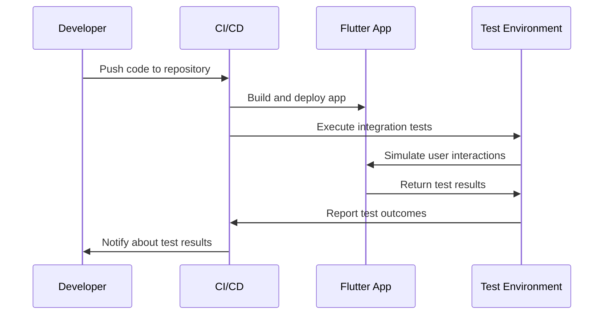

## 15.3 Integration Testing

Integration testing is a critical aspect of software development that ensures different components of an application work together as expected. In the context of Flutter, integration testing involves testing the entire app or significant parts of it to verify that all components interact correctly. This section will guide you through the process of performing integration testing in Flutter using the `flutter_driver` package, automating these tests, and integrating them into Continuous Integration (CI) pipelines.

### Understanding Integration Testing

Integration testing sits between unit testing and end-to-end testing in the testing pyramid. While unit tests focus on individual components and end-to-end tests cover the entire application flow, integration tests ensure that various parts of the application work together seamlessly.

#### Key Objectives of Integration Testing

- **Verify Component Interaction**: Ensure that different parts of the application communicate and function together as intended.
- **Identify Interface Defects**: Detect issues that arise when components interact, such as incorrect data passing or unexpected behavior.
- **Validate System Behavior**: Confirm that the application behaves as expected when integrated components are tested together.

### Introduction to `flutter_driver`

`flutter_driver` is a package provided by Flutter for integration testing. It allows you to write tests that interact with your app as a user would, simulating taps, gestures, and entering text. This package is particularly useful for testing the UI and ensuring that the app responds correctly to user interactions.

#### Setting Up `flutter_driver`

To get started with `flutter_driver`, you need to add it to your `dev_dependencies` in the `pubspec.yaml` file:

```yaml
dev_dependencies:
  flutter_driver:
    sdk: flutter
  test: any
```

After adding the dependency, run `flutter pub get` to install it.

### Writing Your First Integration Test

Let's walk through writing a simple integration test using `flutter_driver`. We'll create a test for a basic Flutter app that has a button, and when pressed, it increments a counter.

#### Step 1: Create a Flutter App

First, create a new Flutter app using the following command:

```bash
flutter create integration_test_example
```

Navigate to the newly created directory:

```bash
cd integration_test_example
```

#### Step 2: Implement the App

Open the `lib/main.dart` file and replace its content with the following code:

```dart
import 'package:flutter/material.dart';

void main() => runApp(MyApp());

class MyApp extends StatelessWidget {
  @override
  Widget build(BuildContext context) {
    return MaterialApp(
      home: CounterPage(),
    );
  }
}

class CounterPage extends StatefulWidget {
  @override
  _CounterPageState createState() => _CounterPageState();
}

class _CounterPageState extends State<CounterPage> {
  int _counter = 0;

  void _incrementCounter() {
    setState(() {
      _counter++;
    });
  }

  @override
  Widget build(BuildContext context) {
    return Scaffold(
      appBar: AppBar(
        title: Text('Counter App'),
      ),
      body: Center(
        child: Column(
          mainAxisAlignment: MainAxisAlignment.center,
          children: <Widget>[
            Text(
              'You have pushed the button this many times:',
            ),
            Text(
              '$_counter',
              key: Key('counter'),
              style: Theme.of(context).textTheme.headline4,
            ),
          ],
        ),
      ),
      floatingActionButton: FloatingActionButton(
        onPressed: _incrementCounter,
        tooltip: 'Increment',
        child: Icon(Icons.add),
        key: Key('increment'),
      ),
    );
  }
}
```

#### Step 3: Create the Integration Test

Create a new directory named `test_driver` in the root of your project. Inside this directory, create two files: `app.dart` and `app_test.dart`.

**app.dart**: This file will contain the entry point for the test.

```dart
import 'package:flutter_driver/driver_extension.dart';
import 'package:integration_test_example/main.dart' as app;

void main() {
  enableFlutterDriverExtension();
  app.main();
}
```

**app_test.dart**: This file will contain the actual test.

```dart
import 'package:flutter_driver/flutter_driver.dart';
import 'package:test/test.dart';

void main() {
  group('Counter App', () {
    FlutterDriver driver;

    setUpAll(() async {
      driver = await FlutterDriver.connect();
    });

    tearDownAll(() async {
      if (driver != null) {
        driver.close();
      }
    });

    test('starts at 0', () async {
      expect(await driver.getText(find.byValueKey('counter')), "0");
    });

    test('increments the counter', () async {
      await driver.tap(find.byValueKey('increment'));
      expect(await driver.getText(find.byValueKey('counter')), "1");
    });
  });
}
```

### Running the Integration Test

To run the integration test, use the following command:

```bash
flutter drive --target=test_driver/app.dart
```

This command will build the app, install it on a connected device or emulator, and execute the tests.

### Automating Integration Tests

Automating integration tests is crucial for maintaining a robust and reliable codebase. By integrating these tests into a CI pipeline, you can ensure that your app is tested automatically whenever changes are made.

#### Setting Up a CI Pipeline

There are several CI services available, such as GitHub Actions, Travis CI, and CircleCI. We'll use GitHub Actions as an example.

1. **Create a Workflow File**: In your project, create a `.github/workflows` directory and add a `flutter.yml` file.

2. **Define the Workflow**: Add the following content to the `flutter.yml` file:

```yaml
name: Flutter CI

on:
  push:
    branches:
      - main
  pull_request:
    branches:
      - main

jobs:
  build:
    runs-on: ubuntu-latest

    steps:
    - uses: actions/checkout@v2

    - name: Set up Flutter
      uses: subosito/flutter-action@v1
      with:
        flutter-version: '2.5.0'

    - name: Install dependencies
      run: flutter pub get

    - name: Run tests
      run: flutter drive --target=test_driver/app.dart
```

3. **Commit and Push**: Commit your changes and push them to your repository. GitHub Actions will automatically run the workflow whenever you push changes to the `main` branch or open a pull request.

### Best Practices for Integration Testing

- **Test Realistic Scenarios**: Focus on testing scenarios that reflect actual user interactions.
- **Keep Tests Isolated**: Ensure that tests do not depend on each other to avoid flaky tests.
- **Use Test Data**: Use mock data or a test environment to prevent tests from affecting production data.
- **Optimize Test Performance**: Keep tests efficient to minimize execution time and resource usage.

### Visualizing the Integration Testing Workflow

To better understand the integration testing workflow, let's visualize it using a sequence diagram.



### Try It Yourself

Experiment with the integration test by modifying the app or the test cases:

- **Add More Tests**: Extend the test suite by adding more scenarios, such as testing negative numbers or resetting the counter.
- **Simulate Different User Actions**: Try simulating different gestures, such as swipes or long presses, to test other parts of the app.
- **Integrate with Other CI Services**: Explore integrating your tests with other CI services like Travis CI or CircleCI.

### Knowledge Check

- **What is the primary purpose of integration testing?**
- **How does `flutter_driver` facilitate integration testing in Flutter?**
- **What are the benefits of automating integration tests?**

### Conclusion

Integration testing is an essential part of the software development lifecycle, ensuring that your Flutter app functions correctly when all components are combined. By leveraging `flutter_driver` and integrating tests into CI pipelines, you can maintain a high-quality codebase and deliver reliable applications. Remember, this is just the beginning. As you progress, you'll build more complex and interactive applications. Keep experimenting, stay curious, and enjoy the journey!

## Quiz Time!



### What is the primary purpose of integration testing?

- [x] To ensure different components of an application work together as expected.
- [ ] To test individual components in isolation.
- [ ] To verify the entire application flow from start to finish.
- [ ] To check the performance of the application under load.

> **Explanation:** Integration testing focuses on verifying that different components of an application interact correctly.

### Which package is used for integration testing in Flutter?

- [ ] flutter_test
- [x] flutter_driver
- [ ] test
- [ ] integration_test

> **Explanation:** `flutter_driver` is the package used for integration testing in Flutter, allowing for end-to-end testing of the app.

### What command is used to run integration tests with flutter_driver?

- [ ] flutter test
- [x] flutter drive --target=test_driver/app.dart
- [ ] flutter run
- [ ] flutter analyze

> **Explanation:** The `flutter drive --target=test_driver/app.dart` command is used to execute integration tests with `flutter_driver`.

### What is a key benefit of automating integration tests?

- [x] It ensures tests are run consistently and automatically with each code change.
- [ ] It eliminates the need for unit tests.
- [ ] It reduces the need for manual testing.
- [ ] It improves the app's performance.

> **Explanation:** Automating integration tests ensures they are run consistently and automatically, improving reliability and efficiency.

### In a CI/CD pipeline, what is the role of integration tests?

- [x] To verify that code changes do not break existing functionality.
- [ ] To deploy the application to production.
- [ ] To build the application.
- [ ] To write new code features.

> **Explanation:** Integration tests in a CI/CD pipeline verify that code changes do not break existing functionality, ensuring stability.

### How can you simulate user interactions in integration tests?

- [x] By using `flutter_driver` to simulate taps, gestures, and text input.
- [ ] By manually interacting with the app.
- [ ] By writing unit tests.
- [ ] By using performance testing tools.

> **Explanation:** `flutter_driver` allows for simulating user interactions such as taps, gestures, and text input in integration tests.

### What is a best practice for writing integration tests?

- [x] Keep tests isolated and independent from each other.
- [ ] Write tests that depend on each other.
- [ ] Use production data for testing.
- [ ] Focus only on testing the UI.

> **Explanation:** Keeping tests isolated and independent helps prevent flaky tests and ensures reliability.

### What should you do if an integration test fails in a CI pipeline?

- [x] Investigate the failure, fix the issue, and rerun the tests.
- [ ] Ignore the failure and proceed with deployment.
- [ ] Disable the failing test.
- [ ] Rewrite the entire test suite.

> **Explanation:** Investigating and fixing the issue ensures the reliability and stability of the application.

### What is the purpose of the `enableFlutterDriverExtension()` function?

- [x] To enable the Flutter Driver extension for integration testing.
- [ ] To start the Flutter application.
- [ ] To connect to a database.
- [ ] To deploy the application.

> **Explanation:** The `enableFlutterDriverExtension()` function enables the Flutter Driver extension, allowing for integration testing.

### True or False: Integration tests can replace unit tests.

- [ ] True
- [x] False

> **Explanation:** Integration tests cannot replace unit tests; they serve different purposes. Unit tests focus on individual components, while integration tests focus on component interactions.


