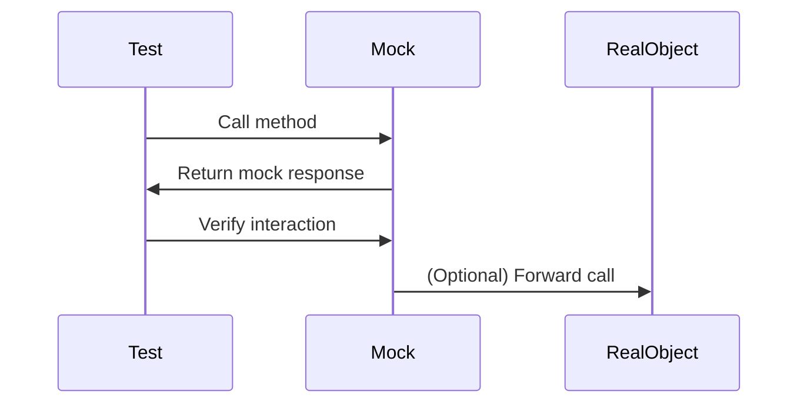

## 15.4 Mocking and Stubs in Pattern Implementation

In the realm of software development, especially when working with Dart and Flutter, testing is a critical component that ensures the reliability and robustness of your applications. One of the key techniques in testing is the use of mocking and stubs, which are instrumental in isolating tests and verifying interactions within your code. This section will delve into the concepts of mocking and stubs, their implementation using the `mockito` package, and how they integrate with design patterns to facilitate effective testing.

### Introduction to Mocking and Stubs

Mocking and stubs are both techniques used in unit testing to simulate the behavior of complex, real objects. They allow developers to test a unit of code in isolation by replacing dependencies with controlled, predictable substitutes.

- **Mocking**: Involves creating objects that simulate the behavior of real objects. Mocks are used to verify interactions between objects, such as method calls and their parameters.
- **Stubs**: Provide predefined responses to method calls made during the test. They are used to isolate the code under test from external dependencies.

### Importance of Mocking and Stubs in Testing

Mocking and stubs are crucial for several reasons:

1. **Isolation**: They allow you to test a unit of code independently from its dependencies, ensuring that tests are not affected by external factors.
2. **Control**: By using mocks and stubs, you can control the behavior of dependencies, making it easier to test edge cases and error conditions.
3. **Efficiency**: Tests run faster because they do not rely on real implementations, which might involve network calls or database access.
4. **Verification**: Mocks enable you to verify that certain interactions occur, such as method calls with specific arguments.

### Mocking with `mockito`

The `mockito` package is a popular choice for mocking in Dart. It provides a simple API for creating mock objects and verifying interactions.

#### Setting Up `mockito`

To use `mockito`, add it to your `pubspec.yaml` file:

```yaml
dev_dependencies:
  mockito: ^5.0.0
  build_runner: ^2.0.0
```

Run `flutter pub get` to install the package.

#### Creating a Mock

To create a mock, you need to define a class that extends `Mock` and implements the interface or class you want to mock.

```dart
import 'package:mockito/mockito.dart';

// Define a class to be mocked
class NetworkService {
  Future<String> fetchData() async {
    // Imagine this method fetches data from a network
    return 'Real Data';
  }
}

// Create a mock class
class MockNetworkService extends Mock implements NetworkService {}
```

#### Using Mocks in Tests

Once you have a mock, you can use it in your tests to simulate interactions and verify behaviors.

```dart
import 'package:flutter_test/flutter_test.dart';

void main() {
  group('NetworkService Tests', () {
    MockNetworkService mockNetworkService;

    setUp(() {
      mockNetworkService = MockNetworkService();
    });

    test('should fetch data successfully', () async {
      // Arrange: Set up the mock to return a specific value
      when(mockNetworkService.fetchData()).thenAnswer((_) async => 'Mock Data');

      // Act: Call the method under test
      final result = await mockNetworkService.fetchData();

      // Assert: Verify the result and interaction
      expect(result, 'Mock Data');
      verify(mockNetworkService.fetchData()).called(1);
    });
  });
}
```

### Stubs in Dart

Stubs are simpler than mocks and are used to provide fixed responses to method calls. They are particularly useful when you need to isolate the code under test from its dependencies.

#### Creating a Stub

A stub can be created by extending the class you want to stub and overriding the methods to return fixed values.

```dart
class StubNetworkService extends NetworkService {
  @override
  Future<String> fetchData() async {
    return 'Stub Data';
  }
}
```

#### Using Stubs in Tests

Stubs are used in a similar way to mocks, but they do not verify interactions.

```dart
void main() {
  group('NetworkService Tests with Stub', () {
    StubNetworkService stubNetworkService;

    setUp(() {
      stubNetworkService = StubNetworkService();
    });

    test('should fetch stub data', () async {
      // Act: Call the method under test
      final result = await stubNetworkService.fetchData();

      // Assert: Verify the result
      expect(result, 'Stub Data');
    });
  });
}
```

### Mocking and Stubs in Design Patterns

Design patterns often involve complex interactions between objects. Mocking and stubs can simplify testing these interactions by isolating components and verifying their behaviors.

#### Example: Testing the Singleton Pattern

The Singleton pattern ensures a class has only one instance and provides a global point of access to it. Testing a Singleton can be challenging because it maintains state across tests.

```dart
class SingletonService {
  static final SingletonService _instance = SingletonService._internal();

  factory SingletonService() {
    return _instance;
  }

  SingletonService._internal();

  String fetchData() {
    return 'Singleton Data';
  }
}

// Mocking Singleton
class MockSingletonService extends Mock implements SingletonService {}

void main() {
  group('SingletonService Tests', () {
    MockSingletonService mockSingletonService;

    setUp(() {
      mockSingletonService = MockSingletonService();
    });

    test('should fetch singleton data', () {
      // Arrange
      when(mockSingletonService.fetchData()).thenReturn('Mock Singleton Data');

      // Act
      final result = mockSingletonService.fetchData();

      // Assert
      expect(result, 'Mock Singleton Data');
      verify(mockSingletonService.fetchData()).called(1);
    });
  });
}
```

### Visualizing Mocking and Stubs

To better understand the flow of mocking and stubs in testing, let's visualize the process using a sequence diagram.



**Diagram Description**: This sequence diagram illustrates the interaction between a test, a mock object, and the real object. The test calls a method on the mock, which returns a predefined response. The test then verifies the interaction. Optionally, the mock can forward the call to the real object if needed.

### Best Practices for Mocking and Stubs

1. **Use Mocks for Interaction Testing**: When you need to verify that certain methods are called with specific arguments, use mocks.
2. **Use Stubs for Isolation**: When you only need to isolate the code under test and do not care about interactions, use stubs.
3. **Keep Tests Simple**: Avoid complex setup and teardown processes. Use mocks and stubs to simplify your tests.
4. **Avoid Over-Mocking**: Mock only what is necessary. Over-mocking can lead to brittle tests that are difficult to maintain.
5. **Document Your Tests**: Clearly document the purpose of each test and the behavior being verified.

### Common Pitfalls and How to Avoid Them

- **Over-Mocking**: Mocking too many dependencies can make tests hard to read and maintain. Focus on key interactions.
- **Ignoring State**: When testing stateful patterns like Singleton, ensure that state is reset between tests.
- **Complex Setup**: Simplify test setup by using factory methods or setup functions to create mocks and stubs.

### Try It Yourself

To solidify your understanding of mocking and stubs, try modifying the code examples provided:

1. **Change the Return Value**: Modify the mock to return different values and observe how it affects the test.
2. **Add More Verifications**: Verify additional interactions, such as the number of times a method is called.
3. **Create a New Stub**: Implement a stub for a different class and use it in a test.

### References and Further Reading

- [Mockito Package Documentation](https://pub.dev/packages/mockito)
- [Dart Testing Guide](https://dart.dev/guides/testing)
- [Flutter Testing Documentation](https://flutter.dev/docs/testing)

### Summary

Mocking and stubs are powerful tools in the arsenal of a Dart and Flutter developer. They enable you to test your code in isolation, verify interactions, and ensure that your applications are robust and reliable. By mastering these techniques, you can implement design patterns with confidence and maintain a high standard of code quality.

## Quiz Time!



### What is the primary purpose of using mocks in testing?

- [x] To verify interactions between objects
- [ ] To provide fixed responses to method calls
- [ ] To replace real objects with simpler versions
- [ ] To improve test performance

> **Explanation:** Mocks are primarily used to verify interactions, such as method calls and their parameters.

### Which package is commonly used for mocking in Dart?

- [x] mockito
- [ ] test
- [ ] flutter_test
- [ ] build_runner

> **Explanation:** The `mockito` package is widely used for creating mock objects in Dart.

### What is a stub used for in testing?

- [x] To provide predefined responses to method calls
- [ ] To verify method calls and interactions
- [ ] To simulate complex behaviors of real objects
- [ ] To improve test performance

> **Explanation:** Stubs provide fixed responses to method calls, isolating the code under test.

### How do you verify that a method was called using `mockito`?

- [x] Using the `verify` function
- [ ] Using the `when` function
- [ ] Using the `expect` function
- [ ] Using the `mock` function

> **Explanation:** The `verify` function is used to check that a method was called on a mock object.

### What is a common pitfall when using mocks?

- [x] Over-mocking
- [ ] Under-mocking
- [ ] Over-stubbing
- [ ] Under-stubbing

> **Explanation:** Over-mocking can lead to complex and hard-to-maintain tests.

### What is the benefit of using stubs over mocks?

- [x] Simplicity and isolation
- [ ] Interaction verification
- [ ] Complex behavior simulation
- [ ] Performance improvement

> **Explanation:** Stubs are simpler and provide isolation without verifying interactions.

### In which scenario would you prefer using a stub?

- [x] When you need to isolate the code under test
- [ ] When you need to verify method calls
- [ ] When you need to simulate complex behaviors
- [ ] When you need to improve test performance

> **Explanation:** Stubs are preferred for isolating the code under test without caring about interactions.

### What is the role of the `when` function in `mockito`?

- [x] To set up the behavior of a mock
- [ ] To verify method calls
- [ ] To create a mock object
- [ ] To provide fixed responses

> **Explanation:** The `when` function is used to define how a mock should behave when a method is called.

### What should you do to ensure state is reset between tests?

- [x] Use setup and teardown functions
- [ ] Use global variables
- [ ] Use static methods
- [ ] Use singleton patterns

> **Explanation:** Setup and teardown functions help reset state between tests.

### True or False: Mocks can be used to simulate complex behaviors of real objects.

- [x] True
- [ ] False

> **Explanation:** Mocks can simulate complex behaviors by defining how they should respond to method calls.



Remember, mastering mocking and stubs is a journey. As you continue to practice and apply these techniques, you'll become more proficient in writing effective and reliable tests for your Dart and Flutter applications. Keep experimenting, stay curious, and enjoy the process!
