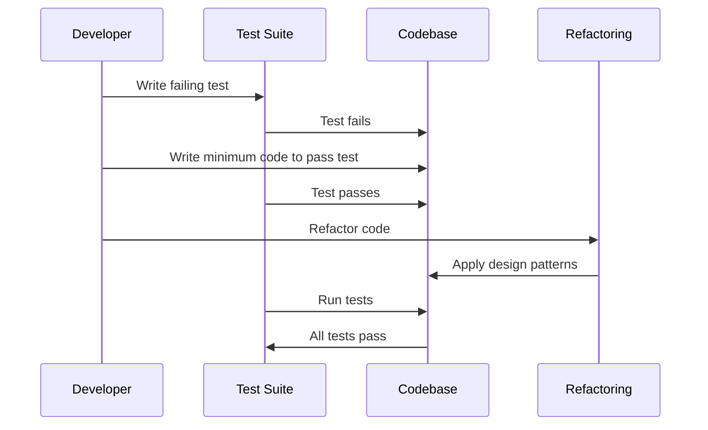

## 15.5 Test-Driven Development (TDD) with Design Patterns

Test-Driven Development (TDD) is a software development approach where tests are written before the actual code. This methodology not only ensures that the code meets its requirements but also influences the design of the software. When combined with design patterns, TDD can lead to robust, maintainable, and scalable applications. In this section, we will explore how TDD and design patterns complement each other in Dart and Flutter development.

### Understanding Test-Driven Development (TDD)

TDD is a development technique that emphasizes writing tests before writing the corresponding code. The process follows a simple cycle:

1. **Write a Test**: Begin by writing a test for a new feature or functionality. This test should fail initially, as the feature has not yet been implemented.
2. **Write the Code**: Implement the minimum amount of code necessary to pass the test.
3. **Refactor**: Improve the code's structure and design without changing its behavior. This step often involves applying design patterns to enhance code quality.
4. **Repeat**: Continue the cycle, gradually building up the functionality of the application.

#### Benefits of TDD

- **Improved Code Quality**: By writing tests first, developers are forced to think about the requirements and design of the code upfront.
- **Reduced Bugs**: Tests catch errors early in the development process, reducing the likelihood of bugs in the final product.
- **Documentation**: Tests serve as documentation for the code, explaining what it is supposed to do.
- **Facilitates Refactoring**: With a comprehensive suite of tests, developers can refactor code with confidence, knowing that any regressions will be caught by the tests.

### Writing Tests First: Driving Design with Tests

Writing tests first can significantly influence the design of your code. It encourages developers to write modular, loosely-coupled code that is easier to test. This approach aligns well with the principles of design patterns, which aim to solve common design problems in a reusable way.

#### Example: TDD in Action

Let's walk through a simple example of TDD in Dart. Suppose we want to implement a `Calculator` class with an `add` method.

1. **Write a Test**

```dart
import 'package:test/test.dart';
import 'calculator.dart';

void main() {
  test('Calculator adds two numbers', () {
    final calculator = Calculator();
    expect(calculator.add(2, 3), equals(5));
  });
}
```

2. **Write the Code**

```dart
class Calculator {
  int add(int a, int b) {
    return a + b;
  }
}
```

3. **Refactor**

In this simple example, there may not be much to refactor. However, as the application grows, you might apply design patterns to improve the code's structure.

### Applying Patterns: Structuring Code for Testability

Design patterns provide proven solutions to common design problems. When used in conjunction with TDD, they can help structure code in a way that is both testable and maintainable.

#### The Role of Design Patterns in TDD

Design patterns can guide the refactoring phase of TDD by providing templates for organizing code. They help ensure that the code is modular, reusable, and easy to test.

#### Common Design Patterns in TDD

1. **Singleton Pattern**: Ensures a class has only one instance and provides a global point of access to it. Useful for managing shared resources like configuration settings or logging.

2. **Factory Method Pattern**: Defines an interface for creating an object but lets subclasses alter the type of objects that will be created. This pattern is useful for creating test doubles or mocks.

3. **Observer Pattern**: Allows an object to notify other objects about changes in its state. This pattern is useful for implementing event-driven systems.

4. **Strategy Pattern**: Defines a family of algorithms, encapsulates each one, and makes them interchangeable. This pattern is useful for testing different algorithms or behaviors.

#### Example: Using the Factory Method Pattern with TDD

Let's consider a scenario where we need to create different types of notifications (e.g., email, SMS). We can use the Factory Method pattern to create these notifications.

1. **Write a Test**

```dart
import 'package:test/test.dart';
import 'notification_factory.dart';

void main() {
  test('NotificationFactory creates EmailNotification', () {
    final factory = NotificationFactory();
    final notification = factory.createNotification('email');
    expect(notification, isA<EmailNotification>());
  });
}
```

2. **Write the Code**

```dart
abstract class Notification {
  void send(String message);
}

class EmailNotification implements Notification {
  @override
  void send(String message) {
    print('Sending email: $message');
  }
}

class SMSNotification implements Notification {
  @override
  void send(String message) {
    print('Sending SMS: $message');
  }
}

class NotificationFactory {
  Notification createNotification(String type) {
    switch (type) {
      case 'email':
        return EmailNotification();
      case 'sms':
        return SMSNotification();
      default:
        throw Exception('Unknown notification type');
    }
  }
}
```

3. **Refactor**

In this example, the Factory Method pattern helps us create different types of notifications without changing the client code. This makes the code easier to test and extend.

### Visualizing TDD with Design Patterns

To better understand how TDD and design patterns work together, let's visualize the process using a sequence diagram.



### Key Participants in TDD with Design Patterns

- **Developer**: Writes tests and code, applies design patterns during refactoring.
- **Test Suite**: Contains tests that verify the functionality of the code.
- **Codebase**: The actual implementation of the application.
- **Refactoring**: The process of improving the code's structure and design.

### Applicability of TDD with Design Patterns

TDD with design patterns is applicable in various scenarios, including:

- **Complex Applications**: Where maintainability and scalability are crucial.
- **Collaborative Projects**: Where multiple developers work on the same codebase.
- **Legacy Systems**: Where refactoring is needed to improve code quality.
- **Rapid Prototyping**: Where quick iterations are required to validate ideas.

### Sample Code Snippet: TDD with the Observer Pattern

Let's implement a simple example using the Observer pattern with TDD.

1. **Write a Test**

```dart
import 'package:test/test.dart';
import 'subject.dart';

void main() {
  test('Observer is notified of changes', () {
    final subject = Subject();
    final observer = ConcreteObserver();
    subject.attach(observer);
    subject.setState(5);
    expect(observer.state, equals(5));
  });
}
```

2. **Write the Code**

```dart
abstract class Observer {
  void update(int state);
}

class ConcreteObserver implements Observer {
  int state = 0;

  @override
  void update(int state) {
    this.state = state;
  }
}

class Subject {
  final List<Observer> _observers = [];
  int _state = 0;

  void attach(Observer observer) {
    _observers.add(observer);
  }

  void setState(int state) {
    _state = state;
    _notifyObservers();
  }

  void _notifyObservers() {
    for (var observer in _observers) {
      observer.update(_state);
    }
  }
}
```

3. **Refactor**

In this example, the Observer pattern allows us to notify multiple observers of changes in the subject's state. This makes the code more flexible and easier to test.

### Design Considerations

When using TDD with design patterns, consider the following:

- **Testability**: Ensure that your code is easy to test by writing modular, loosely-coupled code.
- **Maintainability**: Use design patterns to improve the structure and design of your code.
- **Scalability**: Design your code to handle future changes and extensions.

### Differences and Similarities

TDD and design patterns share some similarities, such as promoting modular, reusable code. However, they differ in their focus: TDD emphasizes testing and requirements, while design patterns focus on solving design problems.

### Try It Yourself

Experiment with the code examples provided in this section. Try modifying the tests to cover additional scenarios or implement new features using different design patterns. This hands-on practice will deepen your understanding of TDD and design patterns.

### Knowledge Check

- How does TDD influence the design of your code?
- What are the benefits of using design patterns with TDD?
- How can the Factory Method pattern improve testability?

### Embrace the Journey

Remember, mastering TDD and design patterns is a journey. As you continue to practice these techniques, you'll become more proficient in writing clean, maintainable code. Keep experimenting, stay curious, and enjoy the process!

## Quiz Time!



### What is the first step in the TDD cycle?

- [x] Write a test
- [ ] Write the code
- [ ] Refactor
- [ ] Deploy the application

> **Explanation:** The first step in the TDD cycle is to write a test that initially fails.

### Which design pattern ensures a class has only one instance?

- [x] Singleton Pattern
- [ ] Factory Method Pattern
- [ ] Observer Pattern
- [ ] Strategy Pattern

> **Explanation:** The Singleton Pattern ensures a class has only one instance and provides a global point of access to it.

### What is the primary focus of TDD?

- [x] Testing and requirements
- [ ] Solving design problems
- [ ] Code optimization
- [ ] User interface design

> **Explanation:** TDD primarily focuses on testing and ensuring that the code meets its requirements.

### How does the Factory Method pattern help in TDD?

- [x] It allows creating test doubles or mocks
- [ ] It ensures a class has only one instance
- [ ] It notifies objects about changes in state
- [ ] It defines a family of algorithms

> **Explanation:** The Factory Method pattern helps in TDD by allowing the creation of test doubles or mocks.

### What is the benefit of writing tests first?

- [x] Improved code quality
- [x] Reduced bugs
- [ ] Increased code complexity
- [ ] Faster development

> **Explanation:** Writing tests first improves code quality and reduces bugs by ensuring that the code meets its requirements.

### Which pattern is useful for implementing event-driven systems?

- [x] Observer Pattern
- [ ] Singleton Pattern
- [ ] Factory Method Pattern
- [ ] Strategy Pattern

> **Explanation:** The Observer Pattern is useful for implementing event-driven systems by allowing objects to be notified of changes in state.

### What does the refactoring step in TDD involve?

- [x] Improving code structure and design
- [ ] Writing new tests
- [ ] Deploying the application
- [ ] Writing documentation

> **Explanation:** The refactoring step in TDD involves improving the code's structure and design without changing its behavior.

### How do design patterns complement TDD?

- [x] By providing templates for organizing code
- [ ] By increasing code complexity
- [ ] By reducing test coverage
- [ ] By focusing on user interface design

> **Explanation:** Design patterns complement TDD by providing templates for organizing code, making it more modular and testable.

### What is the role of the developer in TDD with design patterns?

- [x] Writing tests and code, applying design patterns
- [ ] Writing only tests
- [ ] Writing only code
- [ ] Designing user interfaces

> **Explanation:** The developer writes tests and code and applies design patterns during the refactoring phase.

### TDD primarily focuses on ensuring code meets its requirements.

- [x] True
- [ ] False

> **Explanation:** True. TDD focuses on writing tests to ensure that the code meets its requirements.


