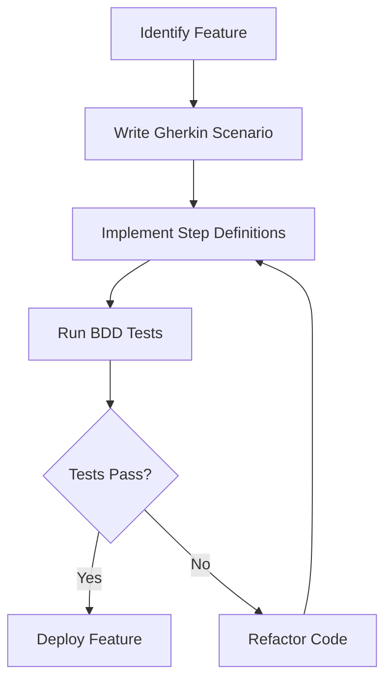

## 15.6 Behavior-Driven Development (BDD)

Behavior-Driven Development (BDD) is a software development approach that enhances collaboration between developers, testers, and non-technical stakeholders. By focusing on the behavior of an application, BDD ensures that all team members have a shared understanding of the requirements. In this section, we will delve into the principles of BDD, explore how it can be implemented in Dart and Flutter projects, and provide practical examples using Gherkin syntax.

### Introduction to Behavior-Driven Development

BDD is an extension of Test-Driven Development (TDD) that emphasizes collaboration and communication. It encourages teams to use a common language to describe the behavior of software, making it easier for everyone involved to understand the requirements and expectations.

#### Key Concepts of BDD

- **Collaborative Testing**: BDD involves all stakeholders in the testing process, ensuring that the software meets the needs of the business.
- **Gherkin Syntax**: A domain-specific language used to write test scenarios in a human-readable format.
- **Aligning Stakeholders**: BDD bridges the gap between technical and non-technical team members, facilitating better communication and understanding.

### The Role of Gherkin Syntax in BDD

Gherkin is a language used to write BDD test cases. It is designed to be readable by humans, allowing stakeholders to understand the behavior of the application without needing to know the technical details.

#### Structure of Gherkin Syntax

Gherkin scenarios are written in a simple format that includes:

- **Feature**: Describes the functionality being tested.
- **Scenario**: A specific example of the feature's behavior.
- **Given**: The initial context or state of the system.
- **When**: The action or event that triggers the behavior.
- **Then**: The expected outcome or result.

Here's an example of a Gherkin scenario:

```gherkin
Feature: User Login

  Scenario: Successful login
    Given the user is on the login page
    When the user enters valid credentials
    Then the user should be redirected to the dashboard
```

### Implementing BDD in Dart and Flutter

To implement BDD in Dart and Flutter, we can use the `gherkin` package, which provides tools for writing and executing Gherkin scenarios.

#### Setting Up the Gherkin Package

1. **Add the `gherkin` package to your `pubspec.yaml` file**:

```yaml
dependencies:
  flutter:
    sdk: flutter

dev_dependencies:
  flutter_test:
    sdk: flutter
  gherkin: ^2.0.0
```

2. **Install the dependencies**:

Run the following command in your terminal:

```bash
flutter pub get
```

#### Writing Gherkin Scenarios

Create a new file, `login.feature`, and write your Gherkin scenarios:

```gherkin
Feature: User Login

  Scenario: Successful login
    Given the user is on the login page
    When the user enters valid credentials
    Then the user should be redirected to the dashboard

  Scenario: Failed login
    Given the user is on the login page
    When the user enters invalid credentials
    Then the user should see an error message
```

#### Implementing Step Definitions

Step definitions are the glue between Gherkin scenarios and the actual code. Create a new Dart file, `login_steps.dart`, and implement the step definitions:

```dart
import 'package:gherkin/gherkin.dart';

class UserOnLoginPage extends Given {
  @override
  Future<void> executeStep() async {
    // Code to navigate to the login page
  }

  @override
  RegExp get pattern => RegExp(r'the user is on the login page');
}

class UserEntersValidCredentials extends When {
  @override
  Future<void> executeStep() async {
    // Code to enter valid credentials
  }

  @override
  RegExp get pattern => RegExp(r'the user enters valid credentials');
}

class UserRedirectedToDashboard extends Then {
  @override
  Future<void> executeStep() async {
    // Code to verify redirection to the dashboard
  }

  @override
  RegExp get pattern => RegExp(r'the user should be redirected to the dashboard');
}
```

#### Running BDD Tests

Create a test runner file, `bdd_test.dart`, to execute your BDD tests:

```dart
import 'package:gherkin/gherkin.dart';
import 'login_steps.dart';

void main() {
  final steps = [
    UserOnLoginPage(),
    UserEntersValidCredentials(),
    UserRedirectedToDashboard(),
  ];

  final config = TestConfiguration()
    ..features = [Glob(r'features/**.feature')]
    ..reporters = [ProgressReporter()]
    ..stepDefinitions = steps;

  GherkinRunner().execute(config);
}
```

Run the tests using the following command:

```bash
flutter test test/bdd_test.dart
```

### Aligning Stakeholders with BDD

One of the primary goals of BDD is to align stakeholders by making requirements accessible to all team members. This is achieved through:

- **Collaborative Workshops**: Involve stakeholders in writing Gherkin scenarios to ensure everyone has a shared understanding of the requirements.
- **Living Documentation**: Use Gherkin scenarios as documentation that evolves with the project, providing a clear and up-to-date reference for the application's behavior.
- **Continuous Feedback**: Regularly review and update scenarios based on feedback from stakeholders to ensure the software meets their needs.

### Benefits of BDD in Dart and Flutter Development

Implementing BDD in Dart and Flutter projects offers several advantages:

- **Improved Communication**: BDD fosters better communication between technical and non-technical team members, reducing misunderstandings and misinterpretations.
- **Increased Test Coverage**: By focusing on behavior, BDD encourages comprehensive testing, leading to higher test coverage and more robust applications.
- **Faster Development Cycles**: With clear requirements and expectations, teams can develop and deliver features more quickly and efficiently.
- **Enhanced Collaboration**: BDD promotes collaboration across the entire team, ensuring that everyone is working towards the same goals.

### Challenges and Considerations

While BDD offers many benefits, it also presents some challenges:

- **Initial Setup**: Setting up BDD tools and processes can be time-consuming, especially for teams new to the approach.
- **Maintaining Scenarios**: As the application evolves, keeping Gherkin scenarios up-to-date can be challenging, requiring regular reviews and updates.
- **Balancing Detail**: Writing scenarios that are too detailed can lead to maintenance issues, while scenarios that are too vague may not provide enough guidance.

### Best Practices for BDD in Dart and Flutter

To maximize the benefits of BDD, consider the following best practices:

- **Start Small**: Begin with a few key features and gradually expand your BDD efforts as the team becomes more comfortable with the approach.
- **Involve Stakeholders Early**: Engage stakeholders in the process from the beginning to ensure their needs and expectations are met.
- **Focus on Behavior**: Keep scenarios focused on the behavior of the application, avoiding implementation details that may change over time.
- **Regularly Review Scenarios**: Schedule regular reviews of Gherkin scenarios to ensure they remain relevant and accurate.
- **Automate Testing**: Integrate BDD tests into your continuous integration pipeline to catch issues early and ensure the application behaves as expected.

### Visualizing BDD Workflow

To better understand the BDD workflow, let's visualize the process using a flowchart:



**Figure 1: BDD Workflow**

This flowchart illustrates the iterative nature of BDD, where scenarios are written, step definitions are implemented, tests are run, and the process repeats until the tests pass.

### Try It Yourself

To gain hands-on experience with BDD in Dart and Flutter, try the following exercises:

1. **Modify the Login Feature**: Add a new scenario for a password reset feature. Write the Gherkin scenario and implement the step definitions.
2. **Create a New Feature**: Choose a feature from your current project and write Gherkin scenarios for it. Implement the step definitions and run the tests.
3. **Experiment with Gherkin Syntax**: Explore different ways to write scenarios using Gherkin syntax. Try using tables and examples to handle multiple test cases.

### Knowledge Check

Before we conclude, let's review some key concepts:

- What is the primary goal of BDD?
- How does Gherkin syntax facilitate collaboration?
- What are the benefits of using BDD in Dart and Flutter projects?
- What challenges might you encounter when implementing BDD?
- How can you ensure that Gherkin scenarios remain relevant and accurate?

### Conclusion

Behavior-Driven Development (BDD) is a powerful approach that enhances collaboration and communication in software development. By focusing on the behavior of an application and using Gherkin syntax, BDD ensures that all stakeholders have a shared understanding of the requirements. Implementing BDD in Dart and Flutter projects can lead to improved communication, increased test coverage, and faster development cycles. As you continue your journey with BDD, remember to involve stakeholders early, focus on behavior, and regularly review scenarios to ensure they remain relevant and accurate.

## Quiz Time!



### What is the primary goal of Behavior-Driven Development (BDD)?

- [x] To enhance collaboration and communication between stakeholders
- [ ] To focus solely on technical implementation details
- [ ] To replace Test-Driven Development (TDD)
- [ ] To eliminate the need for testing

> **Explanation:** BDD aims to improve collaboration and communication among all stakeholders by focusing on the behavior of the application.

### Which language is used to write BDD scenarios?

- [x] Gherkin
- [ ] Dart
- [ ] JavaScript
- [ ] Python

> **Explanation:** Gherkin is a domain-specific language used to write BDD scenarios in a human-readable format.

### What are the key components of a Gherkin scenario?

- [x] Feature, Scenario, Given, When, Then
- [ ] Class, Method, Variable, Function
- [ ] Setup, Execution, Verification, Teardown
- [ ] Input, Process, Output, Feedback

> **Explanation:** Gherkin scenarios are structured with Feature, Scenario, Given, When, and Then components.

### How does BDD benefit Dart and Flutter development?

- [x] By improving communication and increasing test coverage
- [ ] By reducing the need for documentation
- [ ] By focusing on implementation details
- [ ] By eliminating the need for stakeholder involvement

> **Explanation:** BDD improves communication among team members and increases test coverage, leading to more robust applications.

### What is a challenge of implementing BDD?

- [x] Maintaining scenarios as the application evolves
- [ ] Writing code without tests
- [ ] Focusing only on technical details
- [ ] Ignoring stakeholder input

> **Explanation:** One challenge of BDD is keeping Gherkin scenarios up-to-date as the application changes.

### What is the purpose of step definitions in BDD?

- [x] To connect Gherkin scenarios with the actual code
- [ ] To replace unit tests
- [ ] To document the application's architecture
- [ ] To eliminate the need for testing

> **Explanation:** Step definitions link Gherkin scenarios to the code that implements the behavior being tested.

### How can you ensure Gherkin scenarios remain relevant?

- [x] Regularly review and update scenarios
- [ ] Write scenarios only once at the start of the project
- [ ] Avoid involving stakeholders
- [ ] Focus solely on implementation details

> **Explanation:** Regularly reviewing and updating Gherkin scenarios ensures they remain relevant and accurate.

### What is a best practice for starting with BDD?

- [x] Start small and gradually expand
- [ ] Implement BDD for all features at once
- [ ] Focus only on technical implementation
- [ ] Avoid involving non-technical stakeholders

> **Explanation:** Starting small and gradually expanding your BDD efforts helps teams become comfortable with the approach.

### What is the role of stakeholders in BDD?

- [x] To provide input and ensure requirements are met
- [ ] To write all the code
- [ ] To focus solely on technical details
- [ ] To avoid involvement in the testing process

> **Explanation:** Stakeholders provide input and ensure that the software meets their needs and expectations.

### True or False: BDD eliminates the need for testing.

- [ ] True
- [x] False

> **Explanation:** BDD does not eliminate the need for testing; instead, it enhances the testing process by focusing on behavior and collaboration.



Remember, this is just the beginning. As you progress, you'll build more complex and interactive applications using BDD. Keep experimenting, stay curious, and enjoy the journey!
