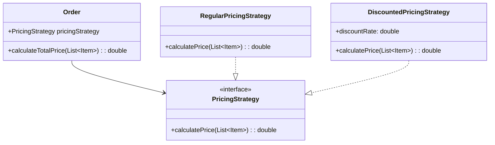

## 15.7 Refactoring with Design Patterns

Refactoring is a crucial process in software development that involves restructuring existing code without changing its external behavior. The primary goal is to improve the nonfunctional attributes of the software. In this section, we will delve into the art of refactoring using design patterns in Dart and Flutter, focusing on improving code quality, maintainability, and clarity.

### Understanding Refactoring

Refactoring is not just about cleaning up code; it's about enhancing the design of existing code. By refactoring, we aim to make the code more understandable, reduce complexity, and improve its extensibility. This process often involves identifying "code smells"—symptoms of deeper problems in the code—and applying design patterns to address these issues.

#### Key Objectives of Refactoring

- **Improving Code Quality**: By identifying and eliminating code smells, we can enhance the overall quality of the codebase.
- **Maintainability**: Refactoring improves the structure and clarity of the code, making it easier to maintain and extend.
- **Performance Optimization**: While not the primary goal, refactoring can sometimes lead to performance improvements.
- **Reducing Technical Debt**: By continuously refactoring, we can prevent the accumulation of technical debt, which can hinder future development.

### Identifying Code Smells

Code smells are indicators of potential problems in the code. They are not bugs but rather signs that the code may need refactoring. Common code smells include:

- **Duplicated Code**: Repeated code blocks that can be consolidated.
- **Long Methods**: Methods that are too long and perform multiple tasks.
- **Large Classes**: Classes that have too many responsibilities.
- **Feature Envy**: When a method in one class seems more interested in the data of another class.
- **Inappropriate Intimacy**: Classes that are too familiar with each other's internal details.

#### Example of a Code Smell

Consider a Dart class with duplicated code:

```dart
class Order {
  double calculateTotalPrice(List<Item> items) {
    double total = 0;
    for (var item in items) {
      total += item.price * item.quantity;
    }
    return total;
  }

  double calculateDiscountedPrice(List<Item> items, double discountRate) {
    double total = 0;
    for (var item in items) {
      total += item.price * item.quantity;
    }
    return total * (1 - discountRate);
  }
}
```

In this example, the code for calculating the total price is duplicated in both methods. This is a classic case of duplicated code smell.

### Applying Design Patterns for Refactoring

Design patterns provide proven solutions to common design problems. By applying design patterns during refactoring, we can address code smells and improve the design of the codebase.

#### Strategy Pattern

The Strategy Pattern is useful for refactoring code with multiple algorithms or behaviors. It allows us to define a family of algorithms, encapsulate each one, and make them interchangeable.

**Refactoring Example:**

Let's refactor the previous example using the Strategy Pattern:

```dart
abstract class PricingStrategy {
  double calculatePrice(List<Item> items);
}

class RegularPricingStrategy implements PricingStrategy {
  @override
  double calculatePrice(List<Item> items) {
    double total = 0;
    for (var item in items) {
      total += item.price * item.quantity;
    }
    return total;
  }
}

class DiscountedPricingStrategy implements PricingStrategy {
  final double discountRate;

  DiscountedPricingStrategy(this.discountRate);

  @override
  double calculatePrice(List<Item> items) {
    double total = 0;
    for (var item in items) {
      total += item.price * item.quantity;
    }
    return total * (1 - discountRate);
  }
}

class Order {
  PricingStrategy pricingStrategy;

  Order(this.pricingStrategy);

  double calculateTotalPrice(List<Item> items) {
    return pricingStrategy.calculatePrice(items);
  }
}
```

In this refactored version, we have encapsulated the pricing algorithms into separate strategy classes. This makes it easy to switch between different pricing strategies without modifying the `Order` class.

#### Observer Pattern

The Observer Pattern is ideal for refactoring code that requires notification of changes. It defines a one-to-many dependency between objects so that when one object changes state, all its dependents are notified and updated automatically.

**Refactoring Example:**

Consider a scenario where multiple UI components need to update when a data model changes:

```dart
class DataModel {
  int _value = 0;
  final List<Function(int)> _listeners = [];

  int get value => _value;

  set value(int newValue) {
    _value = newValue;
    _notifyListeners();
  }

  void addListener(Function(int) listener) {
    _listeners.add(listener);
  }

  void _notifyListeners() {
    for (var listener in _listeners) {
      listener(_value);
    }
  }
}
```

In this example, the `DataModel` class uses the Observer Pattern to notify listeners whenever its value changes.

### Visualizing Refactoring with Design Patterns

To better understand how design patterns can be applied during refactoring, let's visualize the process using a class diagram.



**Diagram Description:** This class diagram illustrates the use of the Strategy Pattern in the `Order` class. The `Order` class depends on the `PricingStrategy` interface, allowing it to use different pricing strategies interchangeably.

### Key Participants in Refactoring with Design Patterns

- **Client**: The entity that uses the design pattern to refactor code.
- **Context**: The class or module being refactored.
- **Strategy/Observer**: The design pattern applied to improve the code structure.

### Applicability of Design Patterns in Refactoring

Design patterns are applicable in various refactoring scenarios, including:

- **Improving Code Readability**: Patterns like Strategy and Observer can simplify complex code structures.
- **Enhancing Flexibility**: Patterns allow for easy modification and extension of code.
- **Reducing Code Duplication**: Patterns help eliminate duplicated code by encapsulating common behaviors.

### Sample Code Snippet: Refactoring with the Observer Pattern

Let's refactor a simple Dart application using the Observer Pattern to manage state changes:

```dart
class Subject {
  final List<Observer> _observers = [];

  void addObserver(Observer observer) {
    _observers.add(observer);
  }

  void removeObserver(Observer observer) {
    _observers.remove(observer);
  }

  void notifyObservers() {
    for (var observer in _observers) {
      observer.update();
    }
  }
}

abstract class Observer {
  void update();
}

class ConcreteObserver implements Observer {
  final String name;

  ConcreteObserver(this.name);

  @override
  void update() {
    print('$name has been notified!');
  }
}

void main() {
  var subject = Subject();
  var observer1 = ConcreteObserver('Observer 1');
  var observer2 = ConcreteObserver('Observer 2');

  subject.addObserver(observer1);
  subject.addObserver(observer2);

  subject.notifyObservers();
}
```

**Code Explanation:** In this example, the `Subject` class manages a list of observers and notifies them of changes. The `ConcreteObserver` class implements the `Observer` interface and responds to notifications.

### Design Considerations

When refactoring with design patterns, consider the following:

- **When to Use Patterns**: Use patterns when they simplify the code and improve its design. Avoid overusing patterns, as they can add unnecessary complexity.
- **Dart-Specific Features**: Leverage Dart's features, such as mixins and extension methods, to enhance pattern implementation.
- **Performance Implications**: Some patterns may introduce performance overhead. Evaluate the trade-offs between design improvements and performance.

### Differences and Similarities

Design patterns can sometimes be confused with one another. For example, the Strategy and State patterns are similar but serve different purposes. The Strategy Pattern is used for interchangeable algorithms, while the State Pattern is used for managing state transitions.

### Try It Yourself

Experiment with the code examples provided by modifying the strategies or observers. Try adding new strategies or observers to see how easily the code can be extended.

### Knowledge Check

- **Question**: What is the primary goal of refactoring?
- **Question**: How does the Strategy Pattern help in refactoring?
- **Question**: What are code smells, and why are they important in refactoring?

### Embrace the Journey

Remember, refactoring is an ongoing process. As you continue to develop and maintain software, regularly refactor your code to keep it clean, efficient, and maintainable. Keep experimenting, stay curious, and enjoy the journey of mastering Dart and Flutter development!

### References and Links

- [Refactoring Guru](https://refactoring.guru/)
- [Design Patterns in Dart](https://dart.dev/guides/language/design-patterns)
- [Flutter Documentation](https://flutter.dev/docs)

## Quiz Time!



### What is the primary goal of refactoring?

- [x] Improve code quality and maintainability
- [ ] Add new features
- [ ] Increase code complexity
- [ ] Reduce code readability

> **Explanation:** The primary goal of refactoring is to improve code quality and maintainability without changing its external behavior.

### Which design pattern is useful for refactoring code with multiple algorithms?

- [x] Strategy Pattern
- [ ] Observer Pattern
- [ ] Singleton Pattern
- [ ] Factory Pattern

> **Explanation:** The Strategy Pattern is useful for refactoring code with multiple algorithms, allowing them to be interchangeable.

### What is a code smell?

- [x] An indicator of potential problems in the code
- [ ] A bug in the code
- [ ] A feature request
- [ ] A design pattern

> **Explanation:** A code smell is an indicator of potential problems in the code, suggesting that it may need refactoring.

### How does the Observer Pattern help in refactoring?

- [x] It defines a one-to-many dependency between objects
- [ ] It encapsulates algorithms
- [ ] It creates a single instance of a class
- [ ] It provides a way to create objects

> **Explanation:** The Observer Pattern helps in refactoring by defining a one-to-many dependency between objects, allowing them to be notified of changes.

### What is the benefit of using design patterns in refactoring?

- [x] They provide proven solutions to common design problems
- [ ] They increase code complexity
- [ ] They make code less readable
- [ ] They reduce code flexibility

> **Explanation:** Design patterns provide proven solutions to common design problems, improving code structure and flexibility.

### What is the Strategy Pattern used for?

- [x] Interchangeable algorithms
- [ ] Managing state transitions
- [ ] Creating a single instance
- [ ] Defining object creation

> **Explanation:** The Strategy Pattern is used for interchangeable algorithms, allowing different strategies to be used interchangeably.

### What is the Observer Pattern used for?

- [x] Notifying objects of changes
- [ ] Encapsulating algorithms
- [ ] Creating a single instance
- [ ] Providing a way to create objects

> **Explanation:** The Observer Pattern is used for notifying objects of changes, defining a one-to-many dependency.

### What should be considered when refactoring with design patterns?

- [x] When to use patterns and performance implications
- [ ] Only the complexity of patterns
- [ ] The number of patterns used
- [ ] The length of the code

> **Explanation:** When refactoring with design patterns, consider when to use patterns and their performance implications.

### How can Dart-specific features enhance pattern implementation?

- [x] By using mixins and extension methods
- [ ] By avoiding patterns
- [ ] By increasing code complexity
- [ ] By reducing code readability

> **Explanation:** Dart-specific features like mixins and extension methods can enhance pattern implementation by providing additional flexibility.

### True or False: Refactoring should be done only once during the development process.

- [ ] True
- [x] False

> **Explanation:** Refactoring is an ongoing process that should be done regularly to maintain code quality and prevent technical debt.


