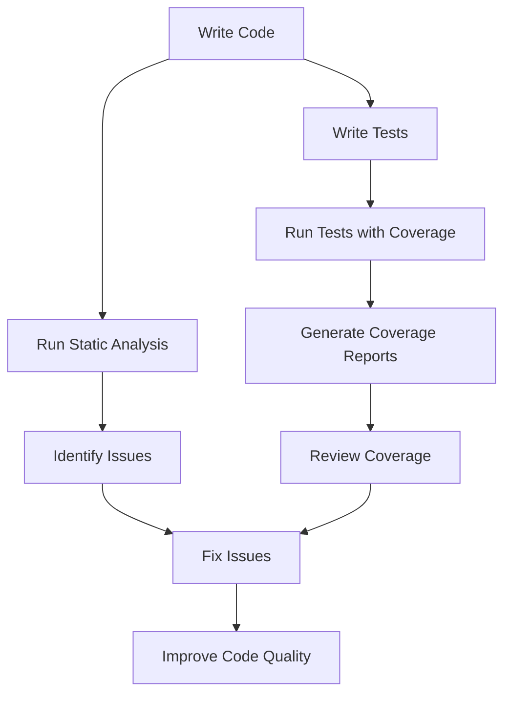

## 15.8 Code Coverage and Static Analysis

In the realm of software development, ensuring the quality and reliability of your code is paramount. This is especially true in Dart and Flutter development, where the dynamic nature of applications demands rigorous testing and adherence to coding standards. In this section, we will delve into the concepts of code coverage and static analysis, two essential practices that help developers measure test effectiveness and enforce coding standards.

### Introduction to Code Coverage

Code coverage is a metric used to determine how much of your code is executed during testing. It provides insights into which parts of your codebase are covered by tests and which are not, allowing you to identify areas that may require additional testing. Code coverage is typically expressed as a percentage, with higher percentages indicating more comprehensive test coverage.

#### Importance of Code Coverage

1. **Identifying Gaps in Testing**: Code coverage helps you identify untested parts of your code, ensuring that critical paths and edge cases are adequately tested.
2. **Improving Code Quality**: By highlighting areas of the code that lack tests, developers can focus on writing tests that improve the overall quality and reliability of the application.
3. **Facilitating Refactoring**: With high code coverage, developers can refactor code with confidence, knowing that existing tests will catch any regressions or unintended changes.
4. **Supporting Continuous Integration**: Code coverage metrics can be integrated into CI/CD pipelines, providing automated feedback on the effectiveness of tests with each code change.

### Measuring Code Coverage in Dart and Flutter

Dart and Flutter provide tools to measure code coverage, allowing developers to assess the effectiveness of their tests. The `dart test` command-line tool is commonly used to run tests and generate coverage reports.

#### Setting Up Code Coverage

To measure code coverage in a Dart or Flutter project, follow these steps:

1. **Install the Coverage Package**: Add the `coverage` package to your `dev_dependencies` in `pubspec.yaml`.

   ```yaml
   dev_dependencies:
     coverage: ^1.0.0
   ```

2. **Run Tests with Coverage**: Use the `dart test` command with the `--coverage` flag to run tests and generate a coverage report.

   ```bash
   dart test --coverage=coverage
   ```

3. **Generate Coverage Reports**: Use the `format_coverage` tool to convert the raw coverage data into a human-readable format, such as LCOV.

   ```bash
   dart run coverage:format_coverage --lcov --in=coverage --out=coverage/lcov.info --packages=.packages --report-on=lib
   ```

4. **Visualize Coverage Reports**: Use tools like `genhtml` to generate HTML reports from the LCOV data, allowing you to visualize coverage in a web browser.

   ```bash
   genhtml -o coverage/html coverage/lcov.info
   ```

#### Interpreting Coverage Reports

Coverage reports provide detailed insights into which lines of code were executed during testing. Key metrics include:

- **Line Coverage**: The percentage of lines executed by tests.
- **Branch Coverage**: The percentage of control flow branches (e.g., if-else statements) executed by tests.
- **Function Coverage**: The percentage of functions executed by tests.

### Enforcing Standards with Static Analysis

Static analysis involves examining code for potential errors, code smells, and adherence to coding standards without executing the code. It is a proactive approach to identifying issues early in the development process.

#### Benefits of Static Analysis

1. **Early Detection of Errors**: Static analysis tools can catch errors and potential bugs before the code is run, reducing the likelihood of runtime errors.
2. **Consistent Coding Standards**: By enforcing coding standards, static analysis helps maintain a consistent codebase, making it easier for teams to collaborate.
3. **Improved Code Quality**: Static analysis identifies code smells and anti-patterns, encouraging developers to write cleaner, more maintainable code.
4. **Enhanced Security**: By identifying potential security vulnerabilities, static analysis helps protect applications from common security threats.

#### Tools for Static Analysis in Dart and Flutter

Dart and Flutter developers have access to several static analysis tools that integrate seamlessly into the development workflow.

##### Dart Analyzer

The Dart Analyzer is a built-in tool that provides static analysis for Dart code. It checks for errors, warnings, and code style issues, helping developers adhere to best practices.

- **Usage**: The Dart Analyzer runs automatically in IDEs like IntelliJ IDEA and Visual Studio Code, providing real-time feedback as you write code.
- **Configuration**: Customize the analyzer's behavior by creating an `analysis_options.yaml` file in the root of your project.

   ```yaml
   analyzer:
     strong-mode: true
     errors:
       unused_import: warning
   ```

##### Linter

The Dart Linter is a static analysis tool that enforces coding standards and best practices. It provides a set of predefined rules that can be customized to fit your project's needs.

- **Usage**: The linter runs automatically as part of the Dart Analyzer, highlighting issues in your code.
- **Configuration**: Define linter rules in the `analysis_options.yaml` file.

   ```yaml
   linter:
     rules:
       - avoid_print
       - prefer_const_constructors
   ```

##### Flutter Analyze

Flutter Analyze is a command-line tool that provides static analysis for Flutter projects. It checks for errors, warnings, and code style issues specific to Flutter.

- **Usage**: Run `flutter analyze` in the terminal to perform a static analysis of your Flutter project.
- **Integration**: Integrate Flutter Analyze into your CI/CD pipeline to ensure code quality with each commit.

### Code Coverage and Static Analysis in Practice

To illustrate the practical application of code coverage and static analysis, let's explore a sample Flutter project.

#### Sample Flutter Project

Consider a simple Flutter application that displays a list of items fetched from a remote API. The application consists of the following components:

- **Model**: Defines the data structure for items.
- **Service**: Fetches data from the API.
- **UI**: Displays the list of items.

##### Model

```dart
class Item {
  final int id;
  final String name;

  Item({required this.id, required this.name});

  factory Item.fromJson(Map<String, dynamic> json) {
    return Item(
      id: json['id'],
      name: json['name'],
    );
  }
}
```

##### Service

```dart
import 'dart:convert';
import 'package:http/http.dart' as http;

class ApiService {
  Future<List<Item>> fetchItems() async {
    final response = await http.get(Uri.parse('https://api.example.com/items'));

    if (response.statusCode == 200) {
      List<dynamic> data = jsonDecode(response.body);
      return data.map((json) => Item.fromJson(json)).toList();
    } else {
      throw Exception('Failed to load items');
    }
  }
}
```

##### UI

```dart
import 'package:flutter/material.dart';

class ItemList extends StatelessWidget {
  final List<Item> items;

  ItemList({required this.items});

  @override
  Widget build(BuildContext context) {
    return ListView.builder(
      itemCount: items.length,
      itemBuilder: (context, index) {
        return ListTile(
          title: Text(items[index].name),
        );
      },
    );
  }
}
```

#### Writing Tests

To ensure the reliability of the application, we write unit tests for the `ApiService` and widget tests for the `ItemList`.

##### Unit Test for ApiService

```dart
import 'package:flutter_test/flutter_test.dart';
import 'package:http/http.dart' as http;
import 'package:http/testing.dart';
import 'package:my_app/api_service.dart';

void main() {
  test('fetchItems returns a list of items', () async {
    final client = MockClient((request) async {
      return http.Response('[{"id": 1, "name": "Item 1"}]', 200);
    });

    final apiService = ApiService(client: client);
    final items = await apiService.fetchItems();

    expect(items.length, 1);
    expect(items.first.name, 'Item 1');
  });
}
```

##### Widget Test for ItemList

```dart
import 'package:flutter/material.dart';
import 'package:flutter_test/flutter_test.dart';
import 'package:my_app/item_list.dart';

void main() {
  testWidgets('ItemList displays a list of items', (WidgetTester tester) async {
    final items = [Item(id: 1, name: 'Item 1')];

    await tester.pumpWidget(MaterialApp(
      home: Scaffold(
        body: ItemList(items: items),
      ),
    ));

    expect(find.text('Item 1'), findsOneWidget);
  });
}
```

#### Generating Coverage Reports

After writing tests, generate coverage reports to assess the effectiveness of your tests.

```bash
dart test --coverage=coverage
dart run coverage:format_coverage --lcov --in=coverage --out=coverage/lcov.info --packages=.packages --report-on=lib
genhtml -o coverage/html coverage/lcov.info
```

#### Analyzing Code with Static Analysis

Run static analysis tools to ensure code quality and adherence to standards.

```bash
flutter analyze
```

### Visualizing Code Coverage and Static Analysis

To better understand the relationship between code coverage and static analysis, let's visualize the process using a flowchart.



**Figure 1**: This flowchart illustrates the process of writing code, running tests with coverage, generating coverage reports, and using static analysis to identify and fix issues, ultimately improving code quality.

### Best Practices for Code Coverage and Static Analysis

1. **Aim for High Coverage**: Strive for high code coverage, but remember that 100% coverage does not guarantee bug-free code. Focus on testing critical paths and edge cases.
2. **Integrate into CI/CD**: Incorporate code coverage and static analysis into your CI/CD pipeline to ensure continuous feedback on code quality.
3. **Customize Analysis Rules**: Tailor static analysis rules to fit your project's needs, balancing strictness with flexibility.
4. **Regularly Review Reports**: Regularly review coverage and analysis reports to identify trends and areas for improvement.
5. **Encourage Team Adoption**: Foster a culture of quality by encouraging team members to adopt code coverage and static analysis practices.

### Try It Yourself

To reinforce your understanding of code coverage and static analysis, try the following exercises:

1. **Modify the Sample Project**: Add a new feature to the sample project and write tests to ensure it is covered by code coverage.
2. **Customize Analysis Rules**: Experiment with different static analysis rules in `analysis_options.yaml` and observe their impact on your code.
3. **Integrate into CI/CD**: Set up a CI/CD pipeline for the sample project that includes code coverage and static analysis checks.

### Conclusion

Code coverage and static analysis are indispensable tools in the Dart and Flutter developer's toolkit. By measuring test effectiveness and enforcing coding standards, these practices help ensure the quality, reliability, and maintainability of your applications. As you continue your journey in Dart and Flutter development, remember to leverage these tools to build robust, high-quality software.

## Quiz Time!



### What is code coverage?

- [x] A metric that determines how much of your code is executed during testing.
- [ ] A tool for measuring code performance.
- [ ] A method for debugging code.
- [ ] A technique for optimizing code.

> **Explanation:** Code coverage is a metric used to determine how much of your code is executed during testing, providing insights into which parts of your codebase are covered by tests.

### Which tool is used to measure code coverage in Dart?

- [x] `dart test`
- [ ] `flutter run`
- [ ] `dart analyze`
- [ ] `flutter build`

> **Explanation:** The `dart test` command-line tool is used to run tests and generate coverage reports in Dart.

### What is the purpose of static analysis?

- [x] To examine code for potential errors and adherence to coding standards without executing the code.
- [ ] To execute code and measure its performance.
- [ ] To compile code into machine language.
- [ ] To visualize code execution flow.

> **Explanation:** Static analysis involves examining code for potential errors, code smells, and adherence to coding standards without executing the code.

### Which file is used to configure the Dart Analyzer?

- [x] `analysis_options.yaml`
- [ ] `pubspec.yaml`
- [ ] `config.yaml`
- [ ] `settings.json`

> **Explanation:** The `analysis_options.yaml` file is used to configure the Dart Analyzer's behavior and customize static analysis rules.

### What is the benefit of integrating code coverage into CI/CD pipelines?

- [x] It provides automated feedback on the effectiveness of tests with each code change.
- [ ] It compiles code faster.
- [ ] It reduces the size of the codebase.
- [ ] It improves network performance.

> **Explanation:** Integrating code coverage metrics into CI/CD pipelines provides automated feedback on the effectiveness of tests with each code change, ensuring continuous code quality.

### What does the Dart Linter do?

- [x] Enforces coding standards and best practices.
- [ ] Compiles Dart code into machine language.
- [ ] Executes Dart code.
- [ ] Visualizes code execution flow.

> **Explanation:** The Dart Linter is a static analysis tool that enforces coding standards and best practices by providing a set of predefined rules.

### Which command is used to perform static analysis on a Flutter project?

- [x] `flutter analyze`
- [ ] `flutter run`
- [ ] `dart test`
- [ ] `flutter build`

> **Explanation:** The `flutter analyze` command is used to perform static analysis on a Flutter project, checking for errors, warnings, and code style issues.

### What is the purpose of the `coverage` package in Dart?

- [x] To generate coverage reports for Dart tests.
- [ ] To compile Dart code.
- [ ] To execute Dart code.
- [ ] To visualize code execution flow.

> **Explanation:** The `coverage` package is used to generate coverage reports for Dart tests, providing insights into test effectiveness.

### What is branch coverage?

- [x] The percentage of control flow branches executed by tests.
- [ ] The percentage of lines executed by tests.
- [ ] The percentage of functions executed by tests.
- [ ] The percentage of classes executed by tests.

> **Explanation:** Branch coverage is the percentage of control flow branches (e.g., if-else statements) executed by tests, providing insights into the thoroughness of test coverage.

### True or False: 100% code coverage guarantees bug-free code.

- [ ] True
- [x] False

> **Explanation:** While high code coverage is desirable, 100% coverage does not guarantee bug-free code. It is important to focus on testing critical paths and edge cases.


