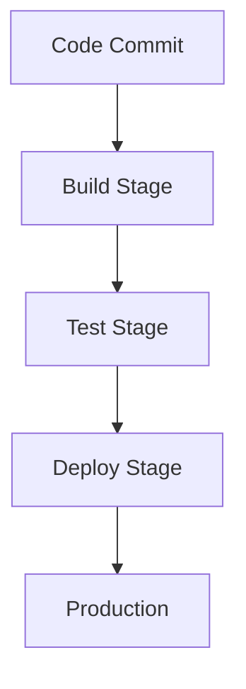

## 15.9 Continuous Integration and Delivery (CI/CD)

In the fast-paced world of software development, Continuous Integration and Delivery (CI/CD) have become essential practices for ensuring that code changes are seamlessly integrated and delivered to production environments. This section will guide you through the concepts, tools, and best practices for implementing CI/CD in Dart and Flutter projects. By the end of this chapter, you'll be equipped with the knowledge to automate builds, perform continuous testing, and streamline your development workflow.

### Understanding CI/CD

**Continuous Integration (CI)** is a development practice where developers frequently integrate code into a shared repository, ideally several times a day. Each integration is verified by an automated build and automated tests to detect integration errors as quickly as possible.

**Continuous Delivery (CD)** is an extension of CI that ensures that the software can be reliably released at any time. It involves automating the release process so that new changes can be deployed to production with minimal manual intervention.

#### Key Benefits of CI/CD

1. **Faster Time to Market**: By automating the integration and delivery process, teams can release features and fixes more quickly.
2. **Improved Code Quality**: Automated testing ensures that code changes do not introduce new bugs.
3. **Reduced Risk**: Smaller, more frequent releases reduce the risk of major issues in production.
4. **Enhanced Collaboration**: CI/CD fosters a culture of collaboration and shared responsibility among team members.

### Setting Up CI/CD for Dart and Flutter

To implement CI/CD for Dart and Flutter projects, you'll need to choose the right tools and configure your environment accordingly. Let's explore some popular tools and how they can be used in your workflow.

#### Choosing the Right CI/CD Tools

There are several tools available for CI/CD, each with its own strengths and weaknesses. Here are some popular options:

- **Jenkins**: An open-source automation server that supports building, deploying, and automating any project.
- **GitHub Actions**: A CI/CD service that integrates directly with GitHub repositories, allowing you to automate workflows.
- **Travis CI**: A hosted continuous integration service used to build and test software projects hosted on GitHub.
- **CircleCI**: A cloud-based CI/CD tool that automates the software development process using continuous integration and delivery.

#### Automating Builds with Jenkins

Jenkins is a powerful tool for automating builds and deployments. Let's walk through the process of setting up a Jenkins pipeline for a Flutter project.

1. **Install Jenkins**: Download and install Jenkins from the [official website](https://www.jenkins.io/).

2. **Configure Jenkins**: Set up Jenkins by installing necessary plugins such as the Git plugin and the Flutter plugin.

3. **Create a Jenkins Pipeline**: Define a Jenkinsfile in your project repository to specify the build steps.

```groovy
pipeline {
    agent any

    stages {
        stage('Checkout') {
            steps {
                git 'https://github.com/your-repo/flutter-project.git'
            }
        }
        stage('Build') {
            steps {
                sh 'flutter build apk'
            }
        }
        stage('Test') {
            steps {
                sh 'flutter test'
            }
        }
        stage('Deploy') {
            steps {
                // Deployment steps go here
            }
        }
    }
}
```

4. **Trigger Builds**: Configure Jenkins to trigger builds automatically when changes are pushed to the repository.

#### Automating Builds with GitHub Actions

GitHub Actions provides a seamless way to automate workflows directly within your GitHub repository. Here's how to set up a CI/CD pipeline for a Flutter project using GitHub Actions.

1. **Create a Workflow File**: In your repository, create a `.github/workflows/flutter.yml` file.

```yaml
name: Flutter CI

on:
  push:
    branches:
      - main

jobs:
  build:
    runs-on: ubuntu-latest

    steps:
    - uses: actions/checkout@v2
    - name: Set up Flutter
      uses: subosito/flutter-action@v1
      with:
        flutter-version: '2.5.0'
    - name: Install Dependencies
      run: flutter pub get
    - name: Run Tests
      run: flutter test
    - name: Build APK
      run: flutter build apk
```

2. **Commit and Push**: Commit the workflow file to your repository and push the changes. GitHub Actions will automatically trigger the workflow on each push to the main branch.

### Continuous Testing in CI/CD

Continuous testing is a critical component of CI/CD, ensuring that code changes do not break existing functionality. Let's explore how to implement continuous testing in Dart and Flutter projects.

#### Writing Unit Tests

Unit tests are essential for verifying the functionality of individual components. In Dart and Flutter, you can use the `test` package to write unit tests.

```dart
import 'package:test/test.dart';

void main() {
  test('String split', () {
    var string = 'Hello, World';
    expect(string.split(','), equals(['Hello', ' World']));
  });
}
```

#### Running Tests in CI/CD Pipelines

Integrate test execution into your CI/CD pipelines to ensure that tests are run automatically on each build.

- **Jenkins**: Add a `flutter test` step in your Jenkinsfile.
- **GitHub Actions**: Include a `flutter test` step in your workflow file.

### Visualizing CI/CD Pipelines

To better understand the flow of a CI/CD pipeline, let's visualize a typical pipeline using a Mermaid.js diagram.



**Diagram Description**: This diagram illustrates a simple CI/CD pipeline with stages for building, testing, and deploying code changes to production.

### Best Practices for CI/CD in Dart and Flutter

1. **Keep Pipelines Simple**: Avoid overly complex pipelines that are difficult to maintain.
2. **Use Caching**: Cache dependencies to speed up build times.
3. **Monitor Pipeline Performance**: Regularly review pipeline performance and optimize as needed.
4. **Secure Your Pipelines**: Implement security best practices to protect your CI/CD environment.

### Try It Yourself

Experiment with setting up a CI/CD pipeline for your Dart or Flutter project. Modify the provided Jenkinsfile or GitHub Actions workflow to include additional steps, such as code linting or deployment to a staging environment.

### Knowledge Check

- What are the key benefits of implementing CI/CD in a software development workflow?
- How can you automate builds for a Flutter project using Jenkins?
- What is the role of continuous testing in a CI/CD pipeline?

### Embrace the Journey

Remember, mastering CI/CD is a journey. As you gain experience, you'll discover new ways to optimize your pipelines and improve your development workflow. Keep experimenting, stay curious, and enjoy the process!

## Quiz Time!



### What is Continuous Integration (CI)?

- [x] A practice where developers frequently integrate code into a shared repository.
- [ ] A process of deploying code to production.
- [ ] A method of writing unit tests.
- [ ] A tool for managing code repositories.

> **Explanation:** Continuous Integration (CI) involves frequently integrating code into a shared repository, verified by automated builds and tests.

### Which tool is commonly used for automating builds in CI/CD?

- [x] Jenkins
- [ ] Visual Studio Code
- [ ] DartPad
- [ ] Flutter SDK

> **Explanation:** Jenkins is a popular tool for automating builds and deployments in CI/CD pipelines.

### What is the purpose of continuous testing in CI/CD?

- [x] To ensure code changes do not break existing functionality.
- [ ] To deploy code to production.
- [ ] To write new features.
- [ ] To manage code repositories.

> **Explanation:** Continuous testing ensures that code changes do not introduce new bugs or break existing functionality.

### How can you trigger a Jenkins build automatically?

- [x] By configuring Jenkins to trigger builds on code changes.
- [ ] By manually starting the build process.
- [ ] By writing new unit tests.
- [ ] By deploying code to production.

> **Explanation:** Jenkins can be configured to automatically trigger builds when changes are pushed to the repository.

### What is a key benefit of using GitHub Actions for CI/CD?

- [x] Seamless integration with GitHub repositories.
- [ ] Ability to write Dart code.
- [ ] Provides a code editor.
- [ ] Offers built-in unit testing.

> **Explanation:** GitHub Actions integrates directly with GitHub repositories, allowing for seamless automation of workflows.

### What is the role of a Jenkinsfile in a Jenkins pipeline?

- [x] To define the build steps for a project.
- [ ] To write unit tests.
- [ ] To deploy code to production.
- [ ] To manage code repositories.

> **Explanation:** A Jenkinsfile is used to define the build steps and stages for a Jenkins pipeline.

### What should you include in a CI/CD pipeline for a Flutter project?

- [x] Build, test, and deploy stages.
- [ ] Only a build stage.
- [ ] Only a test stage.
- [ ] Only a deploy stage.

> **Explanation:** A comprehensive CI/CD pipeline should include stages for building, testing, and deploying the project.

### How can caching improve CI/CD pipeline performance?

- [x] By speeding up build times.
- [ ] By writing unit tests.
- [ ] By deploying code to production.
- [ ] By managing code repositories.

> **Explanation:** Caching dependencies can significantly reduce build times, improving pipeline performance.

### What is a common security best practice for CI/CD pipelines?

- [x] Implementing security measures to protect the environment.
- [ ] Writing more unit tests.
- [ ] Deploying code to production more frequently.
- [ ] Using a single stage pipeline.

> **Explanation:** Implementing security best practices helps protect the CI/CD environment from vulnerabilities.

### True or False: Continuous Delivery (CD) ensures that software can be reliably released at any time.

- [x] True
- [ ] False

> **Explanation:** Continuous Delivery (CD) involves automating the release process to ensure software can be reliably released at any time.


