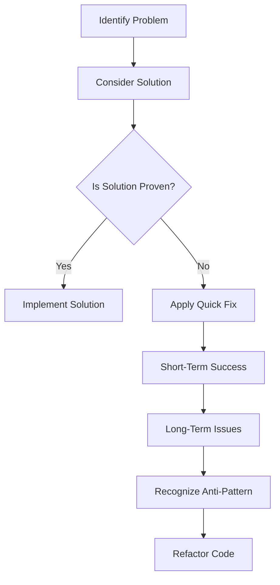

## 16.1 Definition and Impact of Anti-Patterns

In the realm of software development, the term "anti-pattern" is often used to describe a common response to a recurring problem that is ineffective and counterproductive. While design patterns provide proven solutions to common problems, anti-patterns represent the opposite: they are practices that may seem beneficial at first but ultimately lead to negative consequences. Understanding and recognizing anti-patterns is crucial for developers aiming to maintain high-quality code and efficient development processes.

### Understanding Anti-Patterns

Anti-patterns are essentially the "dark side" of design patterns. They emerge when developers apply solutions that initially appear to solve a problem but, in reality, create more issues than they resolve. These patterns can arise from a variety of factors, including lack of experience, misunderstanding of best practices, or pressure to deliver quickly without proper planning.

#### Definition of Anti-Patterns

An anti-pattern is a commonly used but ineffective solution to a recurring problem. It is a pattern of behavior or a structure in code that may seem logical or efficient at first glance but leads to negative outcomes such as increased complexity, reduced performance, or difficult maintenance.

**Key Characteristics of Anti-Patterns:**

- **Misleading Simplicity**: Anti-patterns often present a seemingly simple solution that masks underlying complexity.
- **Short-Term Gains, Long-Term Pain**: They may offer immediate benefits but result in long-term challenges.
- **Common Misconceptions**: Anti-patterns are often based on misunderstandings or misapplications of design principles.
- **Repetitive Occurrence**: They are recurring solutions that developers repeatedly fall back on, despite their drawbacks.

#### Recognizing Anti-Patterns

Identifying anti-patterns requires a keen understanding of both the problem at hand and the principles of effective software design. Developers must be vigilant in recognizing when a solution is leading them down the wrong path.

**Signs of Anti-Patterns:**

- **Code Smells**: Indicators of potential anti-patterns, such as overly complex code, duplicated logic, or excessive coupling.
- **Inconsistent Behavior**: Solutions that lead to unpredictable or inconsistent application behavior.
- **Maintenance Challenges**: Code that becomes increasingly difficult to maintain or extend over time.
- **Performance Bottlenecks**: Solutions that degrade application performance or scalability.

### Impact on Projects

The presence of anti-patterns in a project can have significant negative impacts on various aspects of software development. Understanding these impacts is essential for developers to prioritize the elimination of anti-patterns and promote best practices.

#### Impact on Maintainability

Anti-patterns often lead to code that is difficult to understand, modify, or extend. This can result in:

- **Increased Complexity**: Code becomes convoluted, making it challenging for developers to comprehend and work with.
- **Higher Maintenance Costs**: More time and resources are required to fix bugs or implement new features.
- **Technical Debt**: Accumulation of suboptimal code that requires refactoring or rewriting in the future.

#### Impact on Scalability

Anti-patterns can hinder an application's ability to scale effectively, both in terms of performance and architecture:

- **Performance Degradation**: Inefficient solutions can lead to slow response times and resource bottlenecks.
- **Limited Extensibility**: Rigid code structures make it difficult to adapt the application to new requirements or technologies.

#### Impact on Team Productivity

The presence of anti-patterns can also affect the productivity and morale of development teams:

- **Frustration and Burnout**: Developers may become frustrated with the challenges of working with poorly structured code.
- **Reduced Collaboration**: Code that is difficult to understand can hinder effective collaboration and knowledge sharing.
- **Increased Onboarding Time**: New team members may struggle to get up to speed with complex or poorly documented code.

### Common Anti-Patterns in Dart and Flutter

In the context of Dart and Flutter development, several anti-patterns are particularly prevalent. Recognizing these can help developers avoid common pitfalls and improve the quality of their applications.

#### Overusing Stateful Widgets

In Flutter, stateful widgets are a powerful tool for managing state within an application. However, overusing them can lead to complex and difficult-to-maintain code. Developers should strive to use stateful widgets judiciously and consider alternative state management solutions when appropriate.

#### Mismanaging Async/Await and Futures

Dart's asynchronous programming model is a powerful feature, but it can also lead to anti-patterns if not used correctly. Common issues include blocking the main thread, failing to handle exceptions, or creating complex and hard-to-follow async chains.

#### Tight Coupling and Dependency Issues

Tight coupling between components can make code difficult to test and maintain. Developers should aim to reduce dependencies and promote loose coupling through techniques such as dependency injection and interface-based design.

#### Ignoring Error Handling

Neglecting proper error handling can lead to unpredictable application behavior and difficult-to-diagnose bugs. Developers should implement comprehensive error handling strategies to ensure robust and reliable applications.

### Visualizing Anti-Patterns

To better understand the concept of anti-patterns, let's visualize a common anti-pattern scenario using a flowchart. This diagram illustrates the decision-making process that can lead to the adoption of an anti-pattern.



**Diagram Description**: This flowchart represents the typical lifecycle of an anti-pattern. It begins with identifying a problem and considering a solution. If the solution is not proven, a quick fix may be applied, leading to short-term success but long-term issues. Eventually, the anti-pattern is recognized, prompting refactoring efforts.

### Code Example: Avoiding Anti-Patterns in Dart

Let's explore a code example that demonstrates how to avoid a common anti-pattern in Dart. We'll focus on managing asynchronous operations effectively.

```dart
// Anti-pattern: Blocking the main thread with a long-running operation
void fetchData() {
  // Simulate a long-running operation
  for (int i = 0; i < 1000000000; i++) {
    // Perform some computation
  }
  print('Data fetched');
}

// Correct approach: Using async/await to handle long-running operations
Future<void> fetchDataAsync() async {
  await Future.delayed(Duration(seconds: 2)); // Simulate network delay
  print('Data fetched asynchronously');
}

void main() {
  // Avoid blocking the main thread
  fetchDataAsync();
  print('Main thread is free to perform other tasks');
}
```

**Code Explanation**: In the anti-pattern example, a long-running operation blocks the main thread, leading to poor application performance. The correct approach uses Dart's async/await feature to handle the operation asynchronously, allowing the main thread to remain responsive.

### Try It Yourself

To deepen your understanding of anti-patterns, try modifying the code example above. Experiment with different durations for the `Future.delayed` method and observe how it affects the application's responsiveness. Consider implementing error handling to manage potential exceptions during the asynchronous operation.

### References and Further Reading

- [Martin Fowler's Bliki on Anti-Patterns](https://martinfowler.com/bliki/AntiPattern.html)
- [Refactoring Guru: Anti-Patterns](https://refactoring.guru/antipatterns)
- [Dart Language Tour](https://dart.dev/guides/language/language-tour)
- [Flutter Documentation](https://flutter.dev/docs)

### Knowledge Check

Before moving on, let's review some key points:

- Anti-patterns are ineffective solutions to recurring problems that can lead to negative consequences.
- Recognizing anti-patterns involves identifying code smells, inconsistent behavior, and maintenance challenges.
- Anti-patterns can impact maintainability, scalability, and team productivity.
- Common anti-patterns in Dart and Flutter include overusing stateful widgets, mismanaging async/await, and ignoring error handling.

### Embrace the Journey

Remember, understanding anti-patterns is just the beginning. As you continue your journey in software development, strive to recognize and eliminate these patterns from your code. By doing so, you'll enhance the quality of your applications and contribute to a more efficient and productive development process. Keep experimenting, stay curious, and enjoy the journey!

## Quiz Time!



### What is an anti-pattern?

- [x] A commonly used but ineffective solution to a recurring problem.
- [ ] A proven solution to a common problem.
- [ ] A design pattern used in software development.
- [ ] A type of algorithm used in programming.

> **Explanation:** An anti-pattern is a commonly used but ineffective solution to a recurring problem, often leading to negative consequences.

### Which of the following is a characteristic of anti-patterns?

- [x] Misleading simplicity
- [ ] Proven effectiveness
- [ ] Long-term benefits
- [ ] Consistent behavior

> **Explanation:** Anti-patterns often present a misleading simplicity that masks underlying complexity, leading to long-term challenges.

### How can anti-patterns impact maintainability?

- [x] By increasing code complexity and maintenance costs.
- [ ] By simplifying code structure.
- [ ] By reducing technical debt.
- [ ] By improving code readability.

> **Explanation:** Anti-patterns can increase code complexity and maintenance costs, making it difficult to understand and modify the code.

### What is a common anti-pattern in Dart and Flutter development?

- [x] Overusing stateful widgets
- [ ] Using dependency injection
- [ ] Implementing design patterns
- [ ] Writing unit tests

> **Explanation:** Overusing stateful widgets is a common anti-pattern in Dart and Flutter development, leading to complex and difficult-to-maintain code.

### Which of the following is a sign of an anti-pattern?

- [x] Code smells
- [ ] Consistent behavior
- [ ] High performance
- [ ] Easy maintenance

> **Explanation:** Code smells are indicators of potential anti-patterns, such as overly complex code or duplicated logic.

### What is the impact of anti-patterns on team productivity?

- [x] They can lead to frustration and burnout.
- [ ] They improve collaboration and knowledge sharing.
- [ ] They reduce onboarding time for new team members.
- [ ] They enhance team morale.

> **Explanation:** The presence of anti-patterns can lead to frustration and burnout among developers, affecting team productivity.

### How can developers avoid anti-patterns in asynchronous programming?

- [x] By using async/await to handle long-running operations.
- [ ] By blocking the main thread with long-running operations.
- [ ] By ignoring error handling in async operations.
- [ ] By creating complex async chains.

> **Explanation:** Developers can avoid anti-patterns in asynchronous programming by using async/await to handle long-running operations, ensuring the main thread remains responsive.

### What is the correct approach to handle long-running operations in Dart?

- [x] Using async/await to handle operations asynchronously.
- [ ] Blocking the main thread with long-running operations.
- [ ] Ignoring exceptions during operations.
- [ ] Creating complex async chains.

> **Explanation:** The correct approach is to use async/await to handle long-running operations asynchronously, allowing the main thread to remain responsive.

### What should developers do when they recognize an anti-pattern in their code?

- [x] Refactor the code to eliminate the anti-pattern.
- [ ] Ignore the anti-pattern and continue development.
- [ ] Document the anti-pattern for future reference.
- [ ] Use the anti-pattern as a design pattern.

> **Explanation:** When developers recognize an anti-pattern, they should refactor the code to eliminate it and improve code quality.

### True or False: Anti-patterns can lead to increased technical debt.

- [x] True
- [ ] False

> **Explanation:** True. Anti-patterns can lead to increased technical debt, requiring refactoring or rewriting in the future.


