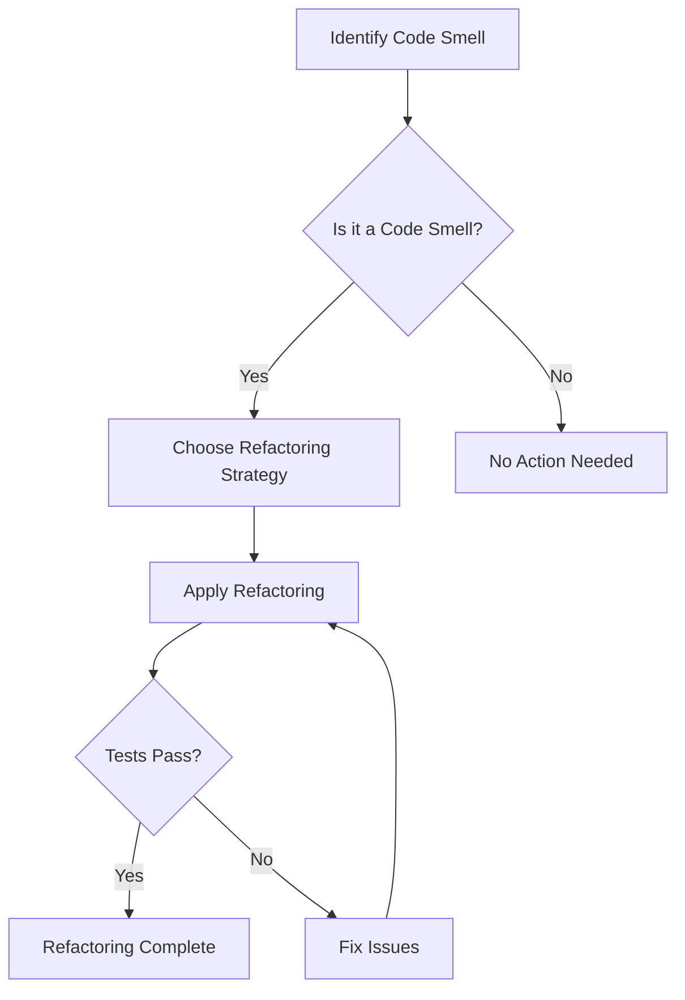

## 16.10 Refactoring Anti-Patterns

In the world of software development, refactoring is a crucial practice that involves restructuring existing code without changing its external behavior. The goal is to improve the code's structure, readability, and maintainability. However, refactoring can sometimes introduce anti-patterns—common but ineffective solutions that can lead to more problems than they solve. In this section, we will delve into identifying candidates for refactoring, explore effective refactoring strategies, and discuss tools and techniques to aid in the process.

### Identifying Candidates for Refactoring

Before we can refactor effectively, we must first identify the parts of our code that need improvement. This often involves recognizing "code smells," which are indicators of deeper issues in the codebase. Here are some common code smells to watch out for:

#### 1. **Duplicated Code**

Duplicated code is one of the most prevalent code smells. It occurs when the same code logic is repeated in multiple places. This can lead to maintenance nightmares, as changes in one place must be replicated elsewhere.

#### 2. **Long Methods**

Methods that are excessively long can be difficult to understand and maintain. They often try to do too much and can benefit from being broken down into smaller, more focused methods.

#### 3. **Large Classes**

Classes that have too many responsibilities can become unwieldy. This violates the Single Responsibility Principle (SRP) and makes the class difficult to manage.

#### 4. **Complex Conditionals**

Complex conditional logic can be hard to read and understand. Simplifying these conditionals can make the code more readable and maintainable.

#### 5. **Primitive Obsession**

Using primitive data types to represent complex entities can lead to code that is difficult to understand and modify. This often indicates a need for more abstraction.

#### 6. **Divergent Change**

When a class is frequently changed in different ways for different reasons, it indicates that the class has too many responsibilities.

#### 7. **Shotgun Surgery**

This occurs when a single change requires making many small changes to different classes. It indicates that the code is not well encapsulated.

#### 8. **Feature Envy**

When a method in one class is more interested in the data of another class than its own, it suggests that the method might belong in the other class.

#### 9. **Inappropriate Intimacy**

Classes that are too familiar with each other's internal details can lead to tightly coupled code, making changes difficult.

#### 10. **Lazy Class**

Classes that do not do enough to justify their existence can clutter the codebase and should be refactored or removed.

### Refactoring Strategies

Once we've identified code smells, we can apply various refactoring strategies to address them. Here are some common strategies:

#### Extract Method

**Intent**: Break down long methods into smaller, more manageable pieces.

**Applicability**: Use this when you have a method that is too long or complex.

**Example**:

```dart
class Order {
  void printOrderDetails() {
    // ... some code ...
    print('Order Details:');
    // ... more code ...
    print('Total: \$100');
  }
}
```

**Refactored**:

```dart
class Order {
  void printOrderDetails() {
    _printHeader();
    _printTotal();
  }

  void _printHeader() {
    print('Order Details:');
  }

  void _printTotal() {
    print('Total: \$100');
  }
}
```

#### Simplify Conditional

**Intent**: Make complex conditional logic easier to read and understand.

**Applicability**: Use this when you have nested or complex conditionals.

**Example**:

```dart
void processOrder(Order order) {
  if (order != null && order.isPaid && !order.isShipped) {
    // Process order
  }
}
```

**Refactored**:

```dart
void processOrder(Order order) {
  if (_canProcessOrder(order)) {
    // Process order
  }
}

bool _canProcessOrder(Order order) {
  return order != null && order.isPaid && !order.isShipped;
}
```

#### Introduce Parameter Object

**Intent**: Replace a group of parameters with a single object.

**Applicability**: Use this when a method takes multiple parameters that are often passed together.

**Example**:

```dart
void createOrder(String customerName, String product, int quantity) {
  // Create order
}
```

**Refactored**:

```dart
class OrderDetails {
  final String customerName;
  final String product;
  final int quantity;

  OrderDetails(this.customerName, this.product, this.quantity);
}

void createOrder(OrderDetails details) {
  // Create order
}
```

#### Replace Magic Number with Symbolic Constant

**Intent**: Replace hard-coded numbers with named constants to improve readability.

**Applicability**: Use this when you have numbers in your code that are not self-explanatory.

**Example**:

```dart
double calculateDiscount(double price) {
  return price * 0.1; // 10% discount
}
```

**Refactored**:

```dart
const double discountRate = 0.1;

double calculateDiscount(double price) {
  return price * discountRate;
}
```

### Tools and Techniques

Refactoring can be greatly aided by using the right tools and techniques. Here are some that can help:

#### Integrated Development Environment (IDE) Features

Modern IDEs like IntelliJ IDEA, Visual Studio Code, and Android Studio offer powerful refactoring tools. These tools can automate many refactoring tasks, such as renaming variables, extracting methods, and more.

#### Linters

Linters are tools that analyze your code for potential errors and code smells. They can help identify areas of your code that may benefit from refactoring. In Dart, you can use the `dart analyze` command to run a linter on your codebase.

#### Code Review

Code reviews are an excellent opportunity to identify code smells and discuss potential refactoring strategies with your peers. They provide a fresh perspective and can catch issues that the original developer might have missed.

#### Unit Tests

Having a comprehensive suite of unit tests can give you the confidence to refactor code without fear of introducing new bugs. Tests ensure that the code's behavior remains consistent after refactoring.

### Visualizing Refactoring

To better understand the refactoring process, let's visualize a common scenario using a flowchart. This flowchart illustrates the decision-making process when refactoring a piece of code.



### Try It Yourself

Now that we've covered the basics of refactoring anti-patterns, it's time to put your knowledge into practice. Try refactoring the following code snippet to improve its readability and maintainability:

```dart
class ShoppingCart {
  List<Item> items = [];

  double calculateTotal() {
    double total = 0;
    for (var item in items) {
      total += item.price * item.quantity;
    }
    if (total > 100) {
      total *= 0.9; // Apply 10% discount
    }
    return total;
  }
}
```

**Suggestions for Refactoring**:
- Extract the discount logic into a separate method.
- Introduce a constant for the discount rate.
- Consider using a method to calculate the price of an individual item.

### Knowledge Check

Before we conclude, let's reinforce what we've learned with a few questions:

- What are some common code smells that indicate a need for refactoring?
- How can the Extract Method refactoring strategy improve code readability?
- What tools can assist in the refactoring process?

### Embrace the Journey

Refactoring is an ongoing process that requires vigilance and a keen eye for detail. As you continue to develop your skills, remember that the goal is to create code that is not only functional but also clean, readable, and maintainable. Keep experimenting, stay curious, and enjoy the journey!

## Quiz Time!



### What is a common indicator of duplicated code?

- [x] Code logic repeated in multiple places
- [ ] A single method with multiple responsibilities
- [ ] Complex conditional logic
- [ ] A class with too many dependencies

> **Explanation:** Duplicated code occurs when the same logic is repeated in multiple places, leading to maintenance challenges.

### Which refactoring strategy involves breaking down long methods into smaller pieces?

- [x] Extract Method
- [ ] Simplify Conditional
- [ ] Introduce Parameter Object
- [ ] Replace Magic Number with Symbolic Constant

> **Explanation:** The Extract Method strategy involves breaking down long methods into smaller, more manageable pieces to improve readability.

### What tool can help identify code smells in Dart?

- [x] Dart Analyzer
- [ ] Code Formatter
- [ ] Debugger
- [ ] Package Manager

> **Explanation:** Dart Analyzer is a tool that can help identify code smells and potential errors in Dart code.

### What is the purpose of unit tests in the refactoring process?

- [x] Ensure code behavior remains consistent
- [ ] Automate code formatting
- [ ] Identify code smells
- [ ] Manage dependencies

> **Explanation:** Unit tests ensure that the code's behavior remains consistent after refactoring, providing confidence in the changes.

### Which of the following is a code smell indicating a class has too many responsibilities?

- [x] Large Class
- [ ] Lazy Class
- [ ] Feature Envy
- [ ] Inappropriate Intimacy

> **Explanation:** A Large Class is a code smell indicating that a class has too many responsibilities, violating the Single Responsibility Principle.

### What is the benefit of using symbolic constants instead of magic numbers?

- [x] Improved readability
- [ ] Faster execution
- [ ] Reduced memory usage
- [ ] Simplified syntax

> **Explanation:** Using symbolic constants instead of magic numbers improves code readability by providing meaningful names for values.

### Which refactoring strategy is used to replace a group of parameters with a single object?

- [x] Introduce Parameter Object
- [ ] Extract Method
- [ ] Simplify Conditional
- [ ] Replace Magic Number with Symbolic Constant

> **Explanation:** The Introduce Parameter Object strategy replaces a group of parameters with a single object to simplify method signatures.

### What is a common tool used for code review?

- [x] Pull Requests
- [ ] Linters
- [ ] Debuggers
- [ ] Package Managers

> **Explanation:** Pull Requests are commonly used for code review, allowing developers to discuss and review changes before merging them.

### What is the purpose of the Simplify Conditional refactoring strategy?

- [x] Make complex conditional logic easier to read
- [ ] Break down long methods into smaller pieces
- [ ] Replace a group of parameters with a single object
- [ ] Replace hard-coded numbers with named constants

> **Explanation:** The Simplify Conditional strategy aims to make complex conditional logic easier to read and understand.

### True or False: Refactoring should change the external behavior of the code.

- [ ] True
- [x] False

> **Explanation:** Refactoring should not change the external behavior of the code; it should only improve the internal structure.


