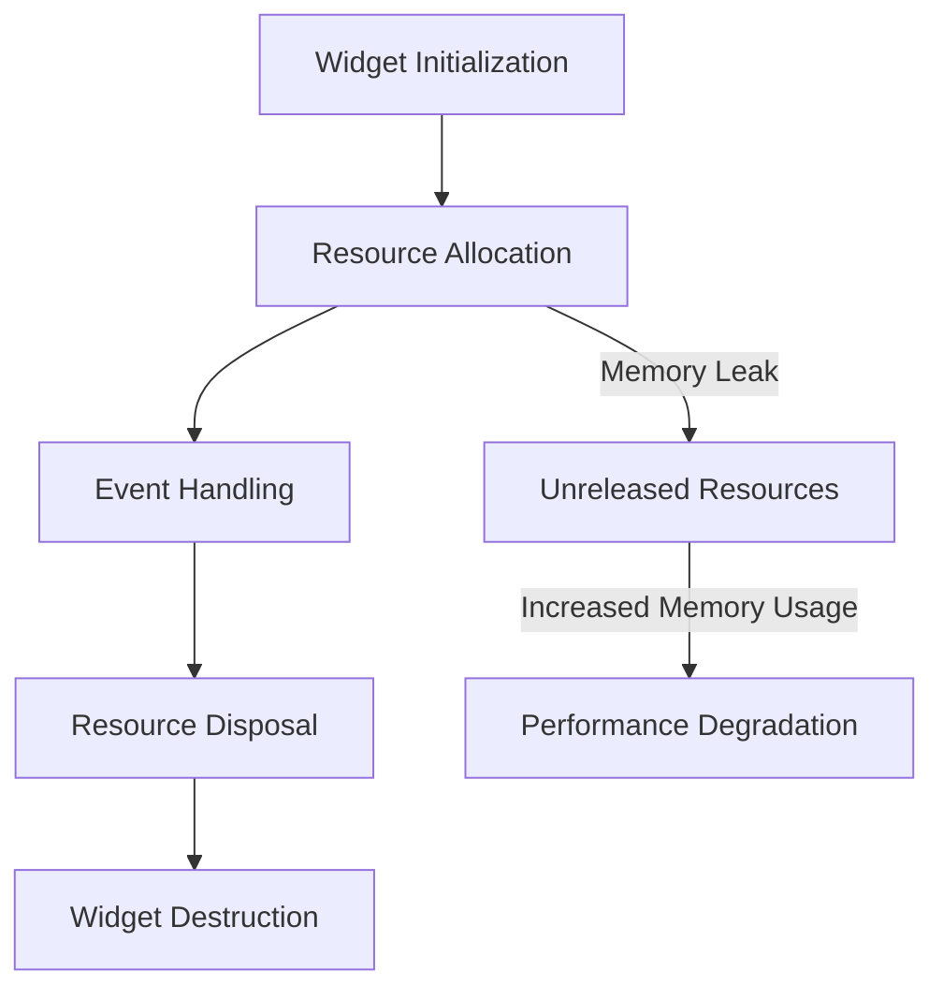

## 16.11 Memory Leaks and Resource Mismanagement

In the realm of software development, particularly with Dart and Flutter, memory leaks and resource mismanagement can significantly degrade application performance, leading to sluggishness, crashes, and a poor user experience. Understanding how to detect, prevent, and manage these issues is crucial for building robust and efficient applications. In this section, we will delve into the intricacies of memory leaks and resource mismanagement, providing you with the knowledge and tools to tackle these challenges effectively.

### Understanding Memory Leaks

Memory leaks occur when a program fails to release memory that is no longer needed, causing the application to consume more memory over time. In Dart and Flutter, memory leaks can arise from various sources, including:

- **Unreleased Streams and Listeners**: Streams and event listeners that are not properly disposed of can lead to memory leaks.
- **Persistent References**: Objects that are inadvertently held in memory due to lingering references.
- **Improper Use of Global Variables**: Global variables that are not managed correctly can retain memory unnecessarily.

#### Key Concepts

- **Garbage Collection**: Dart uses a garbage collector to automatically manage memory. However, it cannot reclaim memory if there are still references to an object, even if those references are no longer needed.
- **Weak References**: A weak reference allows the garbage collector to reclaim an object even if it is still referenced, which can be useful for preventing memory leaks.

### Detecting Memory Leaks

Detecting memory leaks involves monitoring your application's memory usage and identifying patterns that indicate a leak. Here are some strategies:

- **Profiling Tools**: Use tools like Dart DevTools to monitor memory usage and identify potential leaks.
- **Heap Snapshots**: Capture and analyze heap snapshots to understand memory allocation and retention.
- **Automated Tests**: Implement automated tests that simulate user interactions and monitor memory usage over time.

#### Example: Using Dart DevTools

Dart DevTools provides a suite of tools for profiling and debugging Dart and Flutter applications. Here's how you can use it to detect memory leaks:

1. **Launch Dart DevTools**: Start your Flutter application and launch Dart DevTools.
2. **Navigate to the Memory Tab**: This tab provides insights into memory usage, including a timeline of memory allocation.
3. **Capture Heap Snapshots**: Take snapshots at different points in your application's lifecycle to compare memory usage.
4. **Analyze Retained Objects**: Identify objects that are retained in memory longer than expected.

### Preventing Memory Leaks

Preventing memory leaks requires a proactive approach to resource management. Here are some best practices:

- **Dispose of Resources**: Implement `dispose()` methods to release resources like streams, timers, and controllers.
- **Use Weak References**: When appropriate, use weak references to prevent objects from being retained unnecessarily.
- **Avoid Global State**: Minimize the use of global variables and singletons, as they can inadvertently retain memory.

#### Code Example: Disposing of Resources

```dart
class MyWidget extends StatefulWidget {
  @override
  _MyWidgetState createState() => _MyWidgetState();
}

class _MyWidgetState extends State<MyWidget> {
  StreamSubscription<int>? _subscription;

  @override
  void initState() {
    super.initState();
    _subscription = someStream.listen((data) {
      // Handle data
    });
  }

  @override
  void dispose() {
    _subscription?.cancel(); // Dispose of the stream subscription
    super.dispose();
  }
}
```

In this example, we ensure that the stream subscription is canceled in the `dispose()` method, preventing a memory leak.

### Resource Mismanagement

Resource mismanagement occurs when an application fails to efficiently utilize resources, such as CPU, memory, and network bandwidth. This can lead to performance issues and increased operational costs.

#### Common Pitfalls

- **Inefficient Algorithms**: Using algorithms that are not optimized for performance can lead to excessive resource consumption.
- **Unnecessary Network Requests**: Making redundant network requests can waste bandwidth and slow down your application.
- **Poorly Managed State**: Inefficient state management can lead to excessive widget rebuilds and increased memory usage.

### Strategies for Efficient Resource Management

- **Optimize Algorithms**: Use efficient algorithms and data structures to minimize resource consumption.
- **Batch Network Requests**: Consolidate network requests to reduce overhead and improve performance.
- **Efficient State Management**: Use state management solutions like Provider or BLoC to manage state efficiently.

#### Code Example: Efficient State Management with Provider

```dart
class Counter with ChangeNotifier {
  int _count = 0;

  int get count => _count;

  void increment() {
    _count++;
    notifyListeners(); // Notify listeners of state changes
  }
}

void main() {
  runApp(
    ChangeNotifierProvider(
      create: (context) => Counter(),
      child: MyApp(),
    ),
  );
}
```

In this example, we use the Provider package to manage state efficiently, ensuring that only relevant parts of the widget tree are rebuilt when the state changes.

### Visualizing Memory Leaks and Resource Management

To better understand the flow of memory and resources in a Flutter application, let's visualize the lifecycle of a widget and how resources are managed.



**Diagram Description**: This diagram illustrates the lifecycle of a widget in a Flutter application, highlighting the points where resources are allocated and disposed of. It also shows how unreleased resources can lead to memory leaks and performance degradation.

### Knowledge Check

To reinforce your understanding of memory leaks and resource mismanagement, consider the following questions:

- What are the common sources of memory leaks in Dart and Flutter applications?
- How can you use Dart DevTools to detect memory leaks?
- What are some best practices for preventing memory leaks?
- How does efficient state management contribute to resource optimization?

### Try It Yourself

Experiment with the code examples provided in this section. Try modifying the `dispose()` method to see how it affects memory usage. Use Dart DevTools to monitor the impact of your changes on memory allocation and retention.

### References and Further Reading

- [Dart DevTools](https://dart.dev/tools/dart-devtools) - Official documentation for Dart DevTools.
- [Flutter Performance Best Practices](https://flutter.dev/docs/perf) - Guidelines for optimizing Flutter applications.
- [Memory Management in Dart](https://dart.dev/guides/language/memory) - An overview of memory management in Dart.

### Embrace the Journey

Remember, mastering memory management and resource optimization is an ongoing journey. As you continue to develop your skills, you'll build more efficient and high-performing applications. Keep experimenting, stay curious, and enjoy the process!

## Quiz Time!



### What is a common source of memory leaks in Dart and Flutter applications?

- [x] Unreleased Streams and Listeners
- [ ] Efficient Algorithms
- [ ] Proper Use of Global Variables
- [ ] Batch Network Requests

> **Explanation:** Unreleased streams and listeners can retain memory unnecessarily, leading to memory leaks.

### How can you detect memory leaks using Dart DevTools?

- [x] By capturing heap snapshots
- [ ] By optimizing algorithms
- [ ] By using global variables
- [ ] By batching network requests

> **Explanation:** Capturing heap snapshots in Dart DevTools allows you to analyze memory allocation and identify potential leaks.

### What is a best practice for preventing memory leaks in Flutter?

- [x] Implementing `dispose()` methods
- [ ] Using global variables
- [ ] Ignoring state management
- [ ] Making redundant network requests

> **Explanation:** Implementing `dispose()` methods ensures that resources like streams and controllers are properly released.

### What is the role of weak references in memory management?

- [x] They allow the garbage collector to reclaim objects even if they are still referenced
- [ ] They prevent objects from being garbage collected
- [ ] They increase memory retention
- [ ] They optimize network requests

> **Explanation:** Weak references allow objects to be reclaimed by the garbage collector, helping to prevent memory leaks.

### How does efficient state management contribute to resource optimization?

- [x] By minimizing widget rebuilds
- [ ] By increasing memory usage
- [ ] By making redundant network requests
- [ ] By using inefficient algorithms

> **Explanation:** Efficient state management minimizes unnecessary widget rebuilds, optimizing resource usage.

### What is a potential consequence of resource mismanagement?

- [x] Performance degradation
- [ ] Improved application speed
- [ ] Reduced memory usage
- [ ] Efficient network requests

> **Explanation:** Resource mismanagement can lead to performance degradation, affecting application speed and responsiveness.

### Which tool can be used to monitor memory usage in Dart and Flutter applications?

- [x] Dart DevTools
- [ ] Global Variables
- [ ] Batch Network Requests
- [ ] Inefficient Algorithms

> **Explanation:** Dart DevTools provides tools for monitoring memory usage and identifying potential leaks.

### What is a common pitfall in resource management?

- [x] Inefficient Algorithms
- [ ] Proper Use of Global Variables
- [ ] Efficient State Management
- [ ] Batch Network Requests

> **Explanation:** Inefficient algorithms can lead to excessive resource consumption, impacting performance.

### What is the purpose of the `dispose()` method in Flutter?

- [x] To release resources like streams and controllers
- [ ] To increase memory usage
- [ ] To make redundant network requests
- [ ] To optimize algorithms

> **Explanation:** The `dispose()` method is used to release resources and prevent memory leaks.

### True or False: Global variables are always a good practice in Dart and Flutter applications.

- [ ] True
- [x] False

> **Explanation:** Global variables can inadvertently retain memory and lead to resource mismanagement if not managed properly.


