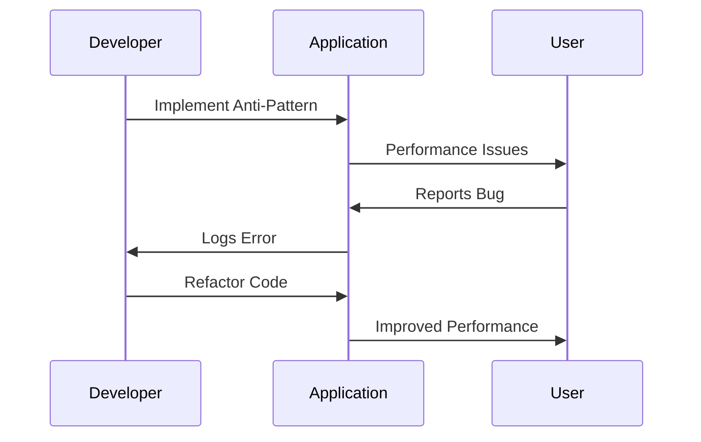

## 16.12 Case Studies: Real-World Examples of Anti-Patterns in Dart and Flutter

In this section, we delve into real-world case studies where anti-patterns in Dart and Flutter development led to significant issues. By examining these instances, we aim to provide valuable lessons learned and strategies to prevent similar pitfalls in your own projects. Understanding these anti-patterns is crucial for any developer aiming to create efficient, maintainable, and scalable applications.

### Understanding Anti-Patterns

Before we dive into the case studies, let's briefly revisit what anti-patterns are. Anti-patterns are common responses to recurring problems that are ineffective and counterproductive. They are the opposite of design patterns, which provide proven solutions to common problems. Recognizing and avoiding anti-patterns is essential for improving code quality and ensuring the success of software projects.

### Case Study 1: The Overuse of Stateful Widgets

#### The Problem

In a large-scale Flutter application, developers opted to use Stateful Widgets extensively for managing state across the app. Initially, this approach seemed straightforward and aligned with Flutter's reactive framework. However, as the application grew, the overuse of Stateful Widgets led to several issues:

- **Performance Bottlenecks**: The frequent rebuilding of widgets caused by unnecessary state changes resulted in performance degradation.
- **Complex State Management**: Managing state across multiple widgets became cumbersome and error-prone.
- **Difficult Testing**: The tightly coupled state logic made unit testing challenging.

#### Lessons Learned

1. **Adopt State Management Solutions**: Implement state management solutions like Provider, BLoC, or Riverpod to decouple state from UI components.
2. **Minimize Stateful Widgets**: Use Stateful Widgets only when necessary and prefer Stateless Widgets for UI components that do not require state management.
3. **Optimize Rebuilds**: Use keys and other optimization techniques to minimize unnecessary widget rebuilds.

#### Resolution

The development team refactored the application to use the Provider package for state management. This change significantly improved performance and made the codebase more maintainable and testable.

### Case Study 2: Mismanaging Async/Await and Futures

#### The Problem

A Dart application that heavily relied on asynchronous operations encountered issues with mismanaged async/await and Futures. Developers frequently used `await` without proper error handling, leading to unhandled exceptions and application crashes.

#### Lessons Learned

1. **Implement Error Handling**: Always handle potential errors when using async/await by wrapping calls in try-catch blocks.
2. **Use Future Chaining**: For complex asynchronous workflows, consider using Future chaining to manage dependencies between asynchronous operations.
3. **Test Asynchronous Code**: Write tests for asynchronous code to ensure it behaves as expected under various conditions.

#### Resolution

The team introduced comprehensive error handling and refactored the code to use Future chaining where appropriate. They also added unit tests for critical asynchronous operations to catch potential issues early.

### Case Study 3: Tight Coupling and Dependency Issues

#### The Problem

In a server-side Dart application, developers faced challenges with tightly coupled components and dependency issues. The application was difficult to extend and maintain due to hardcoded dependencies between modules.

#### Lessons Learned

1. **Use Dependency Injection**: Implement dependency injection to decouple components and improve testability.
2. **Follow SOLID Principles**: Adhere to SOLID principles, particularly the Dependency Inversion Principle, to create flexible and maintainable code.
3. **Modularize Code**: Break down the application into smaller, independent modules to facilitate easier maintenance and extension.

#### Resolution

The team refactored the application to use a dependency injection framework, which improved modularity and reduced coupling. This change made the application easier to maintain and extend with new features.

### Case Study 4: Excessive Widget Rebuilds

#### The Problem

A Flutter application experienced performance issues due to excessive widget rebuilds. Developers used setState indiscriminately, causing the entire widget tree to rebuild frequently.

#### Lessons Learned

1. **Optimize setState Usage**: Use setState judiciously and ensure it only triggers rebuilds for the necessary parts of the widget tree.
2. **Leverage InheritedWidget**: Use InheritedWidget or other state management solutions to propagate state changes efficiently.
3. **Profile and Optimize**: Use Flutter's performance profiling tools to identify and optimize performance bottlenecks.

#### Resolution

The development team optimized the use of setState and introduced InheritedWidget for efficient state propagation. They also used Flutter's DevTools to profile and optimize the application's performance.

### Case Study 5: Ignoring Error Handling

#### The Problem

In a Dart application, developers neglected proper error handling, leading to unhandled exceptions and application crashes. This oversight resulted in a poor user experience and frequent bug reports.

#### Lessons Learned

1. **Implement Comprehensive Error Handling**: Ensure all potential error scenarios are handled gracefully.
2. **Use Logging and Monitoring**: Implement logging and monitoring to capture and analyze errors in production.
3. **Educate the Team**: Conduct training sessions to emphasize the importance of error handling and best practices.

#### Resolution

The team introduced a centralized error handling mechanism and implemented logging and monitoring tools. They also conducted workshops to educate developers on error handling best practices.

### Case Study 6: Memory Leaks and Resource Mismanagement

#### The Problem

A Flutter application suffered from memory leaks and resource mismanagement, leading to performance degradation and crashes. Developers failed to properly dispose of resources, such as streams and controllers.

#### Lessons Learned

1. **Dispose of Resources**: Always dispose of resources like streams, controllers, and animations to prevent memory leaks.
2. **Use Lifecycle Methods**: Leverage lifecycle methods like dispose in Stateful Widgets to manage resources effectively.
3. **Conduct Regular Audits**: Perform regular code audits to identify and address potential memory leaks.

#### Resolution

The team conducted a thorough code audit to identify and fix memory leaks. They also implemented a checklist for developers to follow when managing resources in the application.

### Visualizing Anti-Patterns and Solutions

To better understand the impact of anti-patterns and their resolutions, let's visualize the process using a sequence diagram.

**Diagram Description**: This sequence diagram illustrates the cycle of implementing an anti-pattern, encountering performance issues, receiving user feedback, and refactoring the code to resolve the problem.

### Key Takeaways

- **Recognize Anti-Patterns**: Be vigilant in identifying anti-patterns in your codebase to prevent potential issues.
- **Learn from Mistakes**: Analyze past mistakes to understand their root causes and prevent them in future projects.
- **Adopt Best Practices**: Implement best practices for state management, error handling, and resource management to improve code quality.
- **Continuously Improve**: Regularly review and refactor your code to ensure it remains efficient, maintainable, and scalable.

### Try It Yourself

To reinforce your understanding of anti-patterns and their resolutions, try the following exercises:

1. **Identify Anti-Patterns**: Review a project you've worked on and identify any anti-patterns present. Consider how you might refactor the code to address these issues.
2. **Implement Solutions**: Choose one of the anti-patterns discussed in this section and implement a solution in a sample project. Experiment with different state management solutions or error handling techniques.
3. **Profile and Optimize**: Use Flutter's DevTools to profile an application and identify performance bottlenecks. Implement optimizations to improve performance.

### References and Further Reading

- [Flutter Documentation](https://flutter.dev/docs)
- [Dart Language Tour](https://dart.dev/guides/language/language-tour)
- [Effective Dart](https://dart.dev/guides/language/effective-dart)
- [State Management in Flutter](https://flutter.dev/docs/development/data-and-backend/state-mgmt)
- [Error Handling in Dart](https://dart.dev/guides/libraries/futures-error-handling)

## Quiz Time!



### What is an anti-pattern?

- [x] A common response to recurring problems that is ineffective and counterproductive
- [ ] A proven solution to a common problem
- [ ] A design pattern used in software development
- [ ] A method for optimizing code performance

> **Explanation:** An anti-pattern is a common response to recurring problems that is ineffective and counterproductive, unlike design patterns which provide proven solutions.

### Which state management solution was used to resolve the overuse of Stateful Widgets?

- [x] Provider
- [ ] Redux
- [ ] MobX
- [ ] GetX

> **Explanation:** The Provider package was used to refactor the application and improve state management.

### What is a key lesson learned from mismanaging async/await and Futures?

- [x] Implement error handling with try-catch blocks
- [ ] Use Stateful Widgets for asynchronous operations
- [ ] Avoid using async/await altogether
- [ ] Rely on synchronous code for better performance

> **Explanation:** Implementing error handling with try-catch blocks is crucial when using async/await to prevent unhandled exceptions.

### What principle should be followed to reduce tight coupling in code?

- [x] Dependency Inversion Principle
- [ ] Single Responsibility Principle
- [ ] Open/Closed Principle
- [ ] Interface Segregation Principle

> **Explanation:** The Dependency Inversion Principle helps reduce tight coupling by decoupling components and improving testability.

### How can excessive widget rebuilds be minimized?

- [x] Optimize setState usage
- [ ] Use more Stateful Widgets
- [ ] Increase widget tree depth
- [ ] Avoid using keys

> **Explanation:** Optimizing setState usage helps minimize unnecessary widget rebuilds and improve performance.

### What is a common issue caused by ignoring error handling?

- [x] Unhandled exceptions and application crashes
- [ ] Improved application performance
- [ ] Increased code readability
- [ ] Enhanced user experience

> **Explanation:** Ignoring error handling can lead to unhandled exceptions and application crashes, resulting in a poor user experience.

### What should be done to prevent memory leaks in Flutter applications?

- [x] Dispose of resources like streams and controllers
- [ ] Use more Stateful Widgets
- [ ] Avoid using lifecycle methods
- [ ] Increase application complexity

> **Explanation:** Disposing of resources like streams and controllers is essential to prevent memory leaks in Flutter applications.

### What tool can be used to profile and optimize Flutter applications?

- [x] Flutter DevTools
- [ ] Dart Analyzer
- [ ] Visual Studio Code
- [ ] Android Studio

> **Explanation:** Flutter DevTools is a powerful tool for profiling and optimizing Flutter applications.

### What is a key takeaway from the case studies?

- [x] Recognize anti-patterns and learn from mistakes
- [ ] Avoid using design patterns
- [ ] Focus solely on performance optimization
- [ ] Ignore user feedback

> **Explanation:** Recognizing anti-patterns and learning from mistakes is crucial for improving code quality and preventing future issues.

### True or False: Anti-patterns are beneficial for software development.

- [ ] True
- [x] False

> **Explanation:** Anti-patterns are not beneficial; they are ineffective and counterproductive responses to recurring problems.



Remember, this is just the beginning. As you progress, you'll build more complex and interactive applications. Keep experimenting, stay curious, and enjoy the journey!
