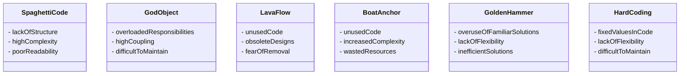

## 16.2 Common Anti-Patterns in Dart and Flutter

In software development, anti-patterns are common responses to recurring problems that are ineffective and counterproductive. Understanding and avoiding these anti-patterns is crucial for creating maintainable, efficient, and scalable applications. In this section, we will explore some of the most prevalent anti-patterns in Dart and Flutter development, providing insights into their identification and strategies for avoidance.

### Spaghetti Code

**Spaghetti Code** refers to a codebase with a complex and tangled control structure, making it difficult to understand and maintain. This anti-pattern often arises from a lack of planning, poor design, or rushed development.

#### Characteristics of Spaghetti Code

- **Lack of Structure**: The code lacks a clear and logical structure, making it difficult to follow.
- **High Complexity**: Numerous interdependencies and convoluted logic paths.
- **Poor Readability**: Difficult for developers to read and understand, leading to increased maintenance costs.

#### Example of Spaghetti Code

```dart
void processOrder(Order order) {
  if (order != null) {
    if (order.items != null && order.items.isNotEmpty) {
      for (var item in order.items) {
        if (item != null) {
          if (item.price > 0) {
            // Process item
          } else {
            // Handle error
          }
        }
      }
    }
  }
}
```

#### How to Avoid Spaghetti Code

- **Adopt a Modular Approach**: Break down complex logic into smaller, manageable functions or classes.
- **Use Design Patterns**: Implement design patterns that promote separation of concerns and improve code organization.
- **Refactor Regularly**: Continuously refactor code to improve structure and readability.

### God Object

A **God Object** is a class that knows too much or does too much, violating the Single Responsibility Principle (SRP). This anti-pattern can lead to tightly coupled code and hinder scalability.

#### Characteristics of a God Object

- **Overloaded Responsibilities**: The class handles multiple responsibilities that should be distributed across different classes.
- **High Coupling**: Other parts of the codebase are heavily dependent on this class.
- **Difficult to Maintain**: Changes to the class can have widespread effects, making maintenance challenging.

#### Example of a God Object

```dart
class OrderManager {
  List<Order> orders;
  Database database;
  NotificationService notificationService;

  void createOrder(Order order) {
    orders.add(order);
    database.saveOrder(order);
    notificationService.notifyUser(order);
  }

  void cancelOrder(Order order) {
    orders.remove(order);
    database.deleteOrder(order);
    notificationService.notifyUser(order);
  }
}
```

#### How to Avoid God Objects

- **Apply the Single Responsibility Principle**: Ensure each class has one responsibility.
- **Decouple Dependencies**: Use dependency injection to manage dependencies and reduce coupling.
- **Refactor into Smaller Classes**: Break down large classes into smaller, more focused classes.

### Lava Flow

**Lava Flow** refers to dead code or obsolete designs that remain in the codebase, often due to fear of removing them or lack of understanding of their purpose.

#### Characteristics of Lava Flow

- **Unused Code**: Code that is no longer executed or needed.
- **Obsolete Designs**: Outdated design patterns or architectures that are no longer relevant.
- **Fear of Removal**: Developers are hesitant to remove the code due to potential unknown dependencies.

#### Example of Lava Flow

```dart
class OldPaymentProcessor {
  void processPayment(Payment payment) {
    // Old payment processing logic
  }
}

// New payment processor is used instead
class NewPaymentProcessor {
  void processPayment(Payment payment) {
    // New payment processing logic
  }
}
```

#### How to Avoid Lava Flow

- **Regular Code Reviews**: Conduct regular code reviews to identify and remove dead code.
- **Automated Testing**: Implement automated tests to ensure code coverage and identify unused code.
- **Refactor and Clean Up**: Regularly refactor the codebase to remove obsolete designs and improve maintainability.

### Boat Anchor

A **Boat Anchor** is a part of a design or code that has no use but is retained in the codebase, often due to a "just in case" mentality.

#### Characteristics of a Boat Anchor

- **Unused Code or Features**: Code that is not used but kept for potential future use.
- **Increased Complexity**: Adds unnecessary complexity to the codebase.
- **Wasted Resources**: Consumes resources such as memory or processing power without providing value.

#### Example of a Boat Anchor

```dart
class FeatureToggle {
  bool isFeatureEnabled = false;

  void executeFeature() {
    if (isFeatureEnabled) {
      // Execute feature logic
    }
  }
}
```

#### How to Avoid Boat Anchors

- **Remove Unused Code**: Regularly review and remove unused code or features.
- **Focus on Current Requirements**: Implement features based on current requirements rather than potential future needs.
- **Use Feature Toggles Wisely**: Implement feature toggles with a clear plan for removal if not needed.

### Golden Hammer

The **Golden Hammer** anti-pattern occurs when a developer over-relies on a familiar technology or design pattern, applying it to every problem regardless of its suitability.

#### Characteristics of a Golden Hammer

- **Overuse of Familiar Solutions**: Applying the same solution to different problems without considering alternatives.
- **Lack of Flexibility**: Inability to adapt to new technologies or approaches.
- **Inefficient Solutions**: Solutions that are not optimal for the problem at hand.

#### Example of a Golden Hammer

```dart
// Overusing Singleton pattern for every service
class Logger {
  static final Logger _instance = Logger._internal();

  factory Logger() {
    return _instance;
  }

  Logger._internal();
}
```

#### How to Avoid the Golden Hammer

- **Evaluate Alternatives**: Consider multiple solutions before deciding on an approach.
- **Stay Informed**: Keep up-to-date with new technologies and design patterns.
- **Tailor Solutions**: Choose solutions that best fit the specific problem and context.

### Hard Coding

**Hard Coding** involves embedding input or configuration data directly into source code, making it difficult to change and maintain.

#### Characteristics of Hard Coding

- **Fixed Values in Code**: Values that should be configurable are hard-coded into the source code.
- **Lack of Flexibility**: Changes require code modifications and redeployment.
- **Difficult to Maintain**: Increases the risk of errors and makes maintenance challenging.

#### Example of Hard Coding

```dart
class ApiClient {
  final String apiUrl = "https://api.example.com";

  void fetchData() {
    // Use apiUrl to fetch data
  }
}
```

#### How to Avoid Hard Coding

- **Use Configuration Files**: Store configuration data in external files or environment variables.
- **Parameterize Inputs**: Use parameters or dependency injection to provide configurable values.
- **Implement Environment-Specific Configurations**: Use different configurations for different environments (e.g., development, testing, production).

### Visualizing Anti-Patterns

To better understand the relationships and impact of these anti-patterns, let's visualize them using a class diagram:



### Knowledge Check

Before we wrap up, let's reinforce our understanding of these anti-patterns with a few questions:

- Can you identify any anti-patterns in your current codebase?
- How can you refactor your code to eliminate these anti-patterns?
- What strategies can you implement to prevent these anti-patterns from occurring in the future?

### Try It Yourself

To solidify your understanding, try refactoring a piece of code in your project that exhibits one of these anti-patterns. Consider the following:

- Identify the anti-pattern and its characteristics.
- Plan a refactoring strategy to address the anti-pattern.
- Implement the refactoring and test the changes to ensure functionality is preserved.

### Conclusion

Avoiding anti-patterns is essential for maintaining a clean, efficient, and scalable codebase. By understanding and recognizing these common pitfalls, you can improve your development practices and create better software. Remember, this is just the beginning. As you progress, you'll build more complex and interactive applications. Keep experimenting, stay curious, and enjoy the journey!

## Quiz Time!



### What is a characteristic of Spaghetti Code?

- [x] Lack of structure
- [ ] High cohesion
- [ ] Low coupling
- [ ] Well-documented

> **Explanation:** Spaghetti Code is characterized by a lack of structure, making it difficult to understand and maintain.

### What principle does a God Object violate?

- [x] Single Responsibility Principle
- [ ] Open/Closed Principle
- [ ] Liskov Substitution Principle
- [ ] Interface Segregation Principle

> **Explanation:** A God Object violates the Single Responsibility Principle by handling multiple responsibilities.

### What is a common cause of Lava Flow?

- [x] Fear of removing unused code
- [ ] Overuse of design patterns
- [ ] Lack of documentation
- [ ] Excessive refactoring

> **Explanation:** Lava Flow often occurs due to fear of removing unused code, leading to dead code remaining in the codebase.

### What is a Boat Anchor in software development?

- [x] Unused code or features retained in the codebase
- [ ] A class with too many responsibilities
- [ ] A design pattern applied incorrectly
- [ ] A well-structured codebase

> **Explanation:** A Boat Anchor refers to unused code or features that are retained in the codebase without providing value.

### How can you avoid the Golden Hammer anti-pattern?

- [x] Evaluate multiple solutions before deciding
- [ ] Use the same solution for every problem
- [ ] Avoid learning new technologies
- [ ] Stick to familiar design patterns

> **Explanation:** To avoid the Golden Hammer, evaluate multiple solutions and choose the one that best fits the problem.

### What is a drawback of Hard Coding?

- [x] Lack of flexibility
- [ ] Improved performance
- [ ] Easier maintenance
- [ ] Increased readability

> **Explanation:** Hard Coding leads to a lack of flexibility, making it difficult to change and maintain the code.

### Which anti-pattern involves embedding input data directly into source code?

- [x] Hard Coding
- [ ] Spaghetti Code
- [ ] God Object
- [ ] Lava Flow

> **Explanation:** Hard Coding involves embedding input or configuration data directly into source code.

### What is a benefit of using configuration files instead of Hard Coding?

- [x] Increased flexibility
- [ ] Decreased readability
- [ ] Higher complexity
- [ ] Slower performance

> **Explanation:** Using configuration files increases flexibility by allowing changes without modifying the source code.

### What is a common effect of a God Object?

- [x] High coupling
- [ ] Low complexity
- [ ] Improved scalability
- [ ] Better maintainability

> **Explanation:** A God Object often leads to high coupling, making the code difficult to maintain and scale.

### True or False: Spaghetti Code is easy to maintain.

- [ ] True
- [x] False

> **Explanation:** Spaghetti Code is difficult to maintain due to its complex and tangled control structure.


