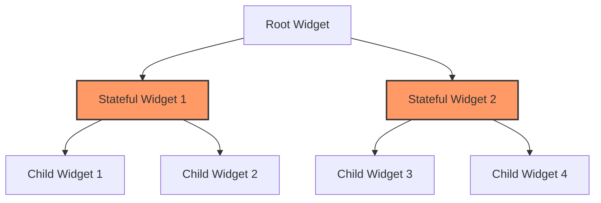

## 16.3 Overusing Stateful Widgets

In the realm of Flutter development, the choice between Stateful and Stateless Widgets is a critical decision that can significantly impact the performance, maintainability, and complexity of your application. While Stateful Widgets are powerful tools for managing dynamic content and user interactions, overusing them can lead to bloated, inefficient, and hard-to-maintain codebases. In this section, we will delve into the common pitfalls of overusing Stateful Widgets, explore best practices for state management, and provide actionable insights to help you make informed decisions in your Flutter development journey.

### Understanding Stateful vs. Stateless Widgets

Before we dive into the intricacies of overusing Stateful Widgets, let's first establish a clear understanding of the fundamental differences between Stateful and Stateless Widgets in Flutter.

#### Stateless Widgets

Stateless Widgets are immutable, meaning their properties cannot change once they are built. They are ideal for static content that does not require any form of dynamic interaction or state management. Stateless Widgets are lightweight and efficient, making them the preferred choice for rendering simple UI components.

```dart
import 'package:flutter/material.dart';

class MyStatelessWidget extends StatelessWidget {
  final String title;

  MyStatelessWidget({required this.title});

  @override
  Widget build(BuildContext context) {
    return Text(title);
  }
}
```

In the example above, `MyStatelessWidget` is a simple widget that displays a text string. Since the text does not change, a Stateless Widget is the appropriate choice.

#### Stateful Widgets

Stateful Widgets, on the other hand, are mutable and can change over time. They are used for components that need to update dynamically in response to user interactions or other events. Stateful Widgets maintain a `State` object that holds the widget's mutable state.

```dart
import 'package:flutter/material.dart';

class MyStatefulWidget extends StatefulWidget {
  @override
  _MyStatefulWidgetState createState() => _MyStatefulWidgetState();
}

class _MyStatefulWidgetState extends State<MyStatefulWidget> {
  int _counter = 0;

  void _incrementCounter() {
    setState(() {
      _counter++;
    });
  }

  @override
  Widget build(BuildContext context) {
    return Column(
      children: [
        Text('Counter: $_counter'),
        ElevatedButton(
          onPressed: _incrementCounter,
          child: Text('Increment'),
        ),
      ],
    );
  }
}
```

In this example, `MyStatefulWidget` uses a `State` object to manage a counter that increments each time a button is pressed. The `setState` method is used to update the UI when the state changes.

### The Problem with Overusing Stateful Widgets

While Stateful Widgets are essential for certain scenarios, overusing them can lead to several issues:

1. **Performance Overhead**: Stateful Widgets are heavier than Stateless Widgets because they maintain a `State` object. Overusing them can lead to unnecessary performance overhead, especially in large applications.

2. **Complexity**: Managing state within Stateful Widgets can become complex and error-prone, particularly as the application grows. This complexity can make the codebase harder to understand and maintain.

3. **Reusability**: Stateful Widgets are less reusable than Stateless Widgets because they are tightly coupled with their state logic. This can lead to code duplication and hinder modularity.

4. **Testing Challenges**: Testing Stateful Widgets can be more challenging due to their dynamic nature. This can result in longer development cycles and increased potential for bugs.

### Best Practices for Using Stateful Widgets

To avoid the pitfalls of overusing Stateful Widgets, consider the following best practices:

#### 1. Use Stateless Widgets Whenever Possible

Opt for Stateless Widgets when the UI does not need to change dynamically. This reduces complexity and improves performance.

#### 2. Separate Business Logic from UI

Adopt design patterns such as BLoC (Business Logic Component) or Provider to separate business logic from UI components. This promotes a clean architecture and makes the codebase more maintainable.

```dart
import 'package:flutter/material.dart';
import 'package:provider/provider.dart';

class CounterModel with ChangeNotifier {
  int _counter = 0;

  int get counter => _counter;

  void increment() {
    _counter++;
    notifyListeners();
  }
}

class CounterProviderExample extends StatelessWidget {
  @override
  Widget build(BuildContext context) {
    return ChangeNotifierProvider(
      create: (_) => CounterModel(),
      child: CounterWidget(),
    );
  }
}

class CounterWidget extends StatelessWidget {
  @override
  Widget build(BuildContext context) {
    final counterModel = Provider.of<CounterModel>(context);

    return Column(
      children: [
        Text('Counter: ${counterModel.counter}'),
        ElevatedButton(
          onPressed: counterModel.increment,
          child: Text('Increment'),
        ),
      ],
    );
  }
}
```

In this example, the `CounterModel` class encapsulates the business logic, while the `CounterWidget` class is responsible for rendering the UI. This separation of concerns enhances modularity and testability.

#### 3. Minimize the Scope of Stateful Widgets

When using Stateful Widgets, limit their scope to the smallest possible area of the UI that requires dynamic updates. This reduces the performance impact and simplifies state management.

#### 4. Leverage InheritedWidget or InheritedModel

For sharing state across multiple widgets, consider using `InheritedWidget` or `InheritedModel`. These classes provide a way to efficiently propagate state changes down the widget tree without the need for Stateful Widgets at every level.

```dart
import 'package:flutter/material.dart';

class CounterInheritedWidget extends InheritedWidget {
  final int counter;
  final Widget child;

  CounterInheritedWidget({required this.counter, required this.child}) : super(child: child);

  @override
  bool updateShouldNotify(CounterInheritedWidget oldWidget) {
    return oldWidget.counter != counter;
  }

  static CounterInheritedWidget? of(BuildContext context) {
    return context.dependOnInheritedWidgetOfExactType<CounterInheritedWidget>();
  }
}

class InheritedWidgetExample extends StatelessWidget {
  @override
  Widget build(BuildContext context) {
    return CounterInheritedWidget(
      counter: 0,
      child: CounterDisplay(),
    );
  }
}

class CounterDisplay extends StatelessWidget {
  @override
  Widget build(BuildContext context) {
    final counter = CounterInheritedWidget.of(context)?.counter ?? 0;

    return Text('Counter: $counter');
  }
}
```

In this example, `CounterInheritedWidget` is used to share the counter state across the widget tree, allowing `CounterDisplay` to access the state without being a Stateful Widget.

### Visualizing the Impact of Overusing Stateful Widgets

To better understand the impact of overusing Stateful Widgets, let's visualize the widget tree and state management flow.



In this diagram, `Stateful Widget 1` and `Stateful Widget 2` manage their own state, while their child widgets are stateless. Overusing Stateful Widgets can lead to a complex and inefficient widget tree, as each Stateful Widget introduces additional state management overhead.

### Try It Yourself

To solidify your understanding of Stateful and Stateless Widgets, try modifying the code examples provided in this section. Experiment with converting Stateful Widgets to Stateless Widgets where appropriate, and explore the use of design patterns such as BLoC or Provider to manage state more effectively.

### Knowledge Check

- What are the key differences between Stateful and Stateless Widgets?
- Why is it important to minimize the use of Stateful Widgets in a Flutter application?
- How can design patterns like BLoC or Provider help in managing state efficiently?
- What are the benefits of separating business logic from UI components?

### Conclusion

Overusing Stateful Widgets is a common anti-pattern in Flutter development that can lead to performance issues, increased complexity, and reduced maintainability. By understanding the appropriate use cases for Stateful and Stateless Widgets, and by adopting best practices for state management, you can build efficient, scalable, and maintainable Flutter applications. Remember, this is just the beginning. As you progress, you'll build more complex and interactive applications. Keep experimenting, stay curious, and enjoy the journey!

## Quiz Time!



### What is a primary disadvantage of overusing Stateful Widgets?

- [x] Increased complexity and performance overhead
- [ ] Improved reusability
- [ ] Simplified testing
- [ ] Enhanced modularity

> **Explanation:** Overusing Stateful Widgets can lead to increased complexity and performance overhead, making the codebase harder to maintain.

### Which widget type is ideal for static content that does not change?

- [x] Stateless Widget
- [ ] Stateful Widget
- [ ] InheritedWidget
- [ ] Provider

> **Explanation:** Stateless Widgets are ideal for static content that does not require dynamic updates.

### How can you separate business logic from UI components in Flutter?

- [x] Use design patterns like BLoC or Provider
- [ ] Use only Stateful Widgets
- [ ] Avoid using any design patterns
- [ ] Use only Stateless Widgets

> **Explanation:** Design patterns like BLoC or Provider help separate business logic from UI components, promoting a clean architecture.

### What is the role of the `setState` method in a Stateful Widget?

- [x] It updates the UI when the state changes
- [ ] It initializes the widget
- [ ] It renders static content
- [ ] It manages dependencies

> **Explanation:** The `setState` method is used to update the UI when the state of a Stateful Widget changes.

### Which of the following is a benefit of using Stateless Widgets?

- [x] Lightweight and efficient
- [ ] Complex state management
- [ ] Dynamic content updates
- [ ] Requires `setState` method

> **Explanation:** Stateless Widgets are lightweight and efficient, making them suitable for static content.

### What is a common challenge when testing Stateful Widgets?

- [x] Their dynamic nature makes testing more complex
- [ ] They are too simple to test
- [ ] They do not require any testing
- [ ] They are always error-free

> **Explanation:** The dynamic nature of Stateful Widgets can make testing more complex and challenging.

### How can you minimize the scope of Stateful Widgets?

- [x] Limit their use to the smallest possible area of the UI
- [ ] Use them for every widget
- [ ] Avoid using Stateless Widgets
- [ ] Use them only for static content

> **Explanation:** Limiting the scope of Stateful Widgets to the smallest possible area of the UI reduces performance impact and simplifies state management.

### What is the purpose of `InheritedWidget` in Flutter?

- [x] To efficiently propagate state changes down the widget tree
- [ ] To replace Stateful Widgets
- [ ] To manage static content
- [ ] To initialize the app

> **Explanation:** `InheritedWidget` is used to efficiently propagate state changes down the widget tree without the need for Stateful Widgets at every level.

### Which design pattern is commonly used for state management in Flutter?

- [x] BLoC
- [ ] MVC
- [ ] Singleton
- [ ] Factory

> **Explanation:** The BLoC (Business Logic Component) pattern is commonly used for state management in Flutter.

### True or False: Stateful Widgets are always the best choice for managing state in Flutter applications.

- [ ] True
- [x] False

> **Explanation:** Stateful Widgets are not always the best choice for managing state. They should be used judiciously, and alternatives like Stateless Widgets and state management patterns should be considered.




