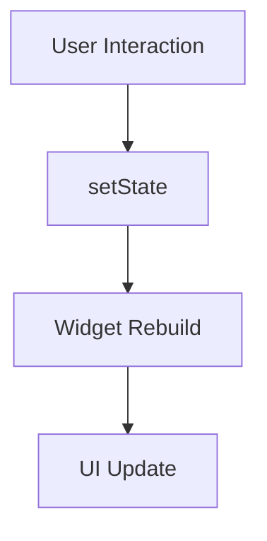
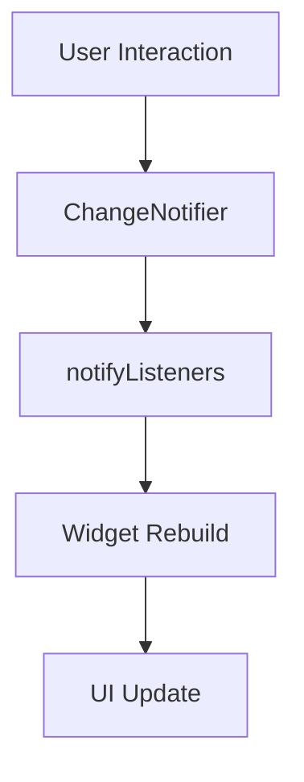
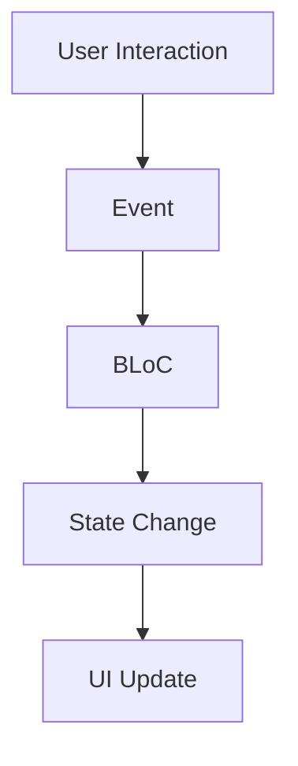

## 16.4 Improper State Management Strategies

In the realm of Flutter development, state management is a critical aspect that can make or break your application. Choosing the wrong state management strategy can lead to convoluted code, difficulties in scaling, and a host of other issues that can impede the development process. In this section, we will explore the common pitfalls associated with improper state management strategies, their consequences, and how to remedy these issues by selecting the right approach for your application's needs.

### Understanding State Management in Flutter

State management refers to the way an application handles the state of its data and UI. In Flutter, state management is crucial because it determines how your app responds to user interactions, updates its UI, and manages data flow. There are several state management solutions available in Flutter, each with its own strengths and weaknesses.

#### Key Concepts in State Management

- **State**: The information that can change over time in response to user actions or other events.
- **Stateful Widgets**: Widgets that maintain state and can rebuild themselves when their state changes.
- **Stateless Widgets**: Widgets that do not maintain any state and rely on external data to render themselves.

### Common Pitfalls in State Management

Improper state management can manifest in several ways, leading to various issues in your Flutter application. Let's explore some of the most common pitfalls:

#### 1. Overusing Stateful Widgets

**Problem**: Developers often overuse Stateful Widgets, leading to bloated and inefficient code. This can result in excessive widget rebuilds and poor performance.

**Solution**: Use Stateful Widgets only when necessary. Consider using Stateless Widgets combined with state management solutions like Provider or BLoC for better performance and cleaner code.

#### 2. Tight Coupling of UI and Business Logic

**Problem**: Mixing UI code with business logic can make your codebase difficult to maintain and test. It also violates the separation of concerns principle.

**Solution**: Separate UI and business logic by using patterns like BLoC or MVVM. This separation allows for more modular and testable code.

#### 3. Inconsistent State Management Approaches

**Problem**: Using multiple state management solutions within the same application can lead to confusion and inconsistency. It can also make the codebase harder to understand and maintain.

**Solution**: Choose a single state management approach that fits your application's needs and stick to it. Ensure that all team members are familiar with the chosen approach.

#### 4. Ignoring Asynchronous State Changes

**Problem**: Failing to handle asynchronous state changes properly can lead to race conditions and inconsistent UI states.

**Solution**: Use asynchronous programming techniques like Futures and Streams to handle state changes. Consider using packages like Riverpod or Redux for managing asynchronous state.

#### 5. Not Managing State Effectively in Complex Applications

**Problem**: As applications grow in complexity, managing state can become increasingly difficult. Without a proper strategy, you may encounter issues like state duplication and data inconsistency.

**Solution**: For complex applications, consider using advanced state management solutions like BLoC, Redux, or Riverpod. These solutions provide a structured way to manage state and ensure consistency across your application.

### Consequences of Improper State Management

Improper state management can have several negative consequences on your Flutter application:

- **Convoluted Code**: Mixing UI and business logic can lead to tangled code that is difficult to understand and maintain.
- **Performance Issues**: Overusing Stateful Widgets and not handling asynchronous state changes can result in poor performance and slow UI updates.
- **Scalability Challenges**: As your application grows, improper state management can make it difficult to scale and add new features.
- **Increased Bug Risk**: Inconsistent state management approaches can lead to bugs and unpredictable behavior in your application.

### Evaluating State Management Solutions

To avoid the pitfalls of improper state management, it's essential to evaluate and select the right state management solution for your application's needs. Here are some factors to consider:

#### 1. Application Complexity

Consider the complexity of your application. For simple applications, a basic state management solution like setState or Provider may suffice. For more complex applications, consider using advanced solutions like BLoC or Redux.

#### 2. Team Familiarity

Choose a state management solution that your team is familiar with. This will ensure that everyone can work effectively and maintain the codebase.

#### 3. Performance Requirements

Consider the performance requirements of your application. Some state management solutions may be more performant than others, depending on your use case.

#### 4. Community Support

Choose a state management solution with strong community support and documentation. This will make it easier to find resources and get help when needed.

### Popular State Management Solutions in Flutter

Let's explore some of the popular state management solutions available in Flutter:

#### 1. setState

**Overview**: The simplest state management solution in Flutter. It is suitable for small applications with minimal state management needs.

**Pros**: Easy to use and understand. No external dependencies required.

**Cons**: Not suitable for complex applications. Can lead to excessive widget rebuilds.

#### 2. Provider

**Overview**: A popular state management solution that uses the InheritedWidget mechanism to provide state to the widget tree.

**Pros**: Simple and easy to use. Suitable for both simple and complex applications.

**Cons**: Can become complex in very large applications.

#### 3. BLoC (Business Logic Component)

**Overview**: A pattern that separates business logic from UI code. It uses Streams to manage state.

**Pros**: Provides a clear separation of concerns. Suitable for complex applications.

**Cons**: Can have a steep learning curve for beginners.

#### 4. Redux

**Overview**: A predictable state container that uses a unidirectional data flow.

**Pros**: Provides a structured way to manage state. Suitable for large and complex applications.

**Cons**: Can be verbose and complex to set up.

#### 5. Riverpod

**Overview**: A modern state management solution that builds on top of Provider.

**Pros**: Simple and flexible. Provides better performance and scalability than Provider.

**Cons**: Still relatively new, so community support may be limited.

### Code Examples

Let's explore some code examples to illustrate the use of different state management solutions in Flutter.

#### Example 1: Using setState

```dart
import 'package:flutter/material.dart';

void main() => runApp(MyApp());

class MyApp extends StatelessWidget {
  @override
  Widget build(BuildContext context) {
    return MaterialApp(
      home: CounterScreen(),
    );
  }
}

class CounterScreen extends StatefulWidget {
  @override
  _CounterScreenState createState() => _CounterScreenState();
}

class _CounterScreenState extends State<CounterScreen> {
  int _counter = 0;

  void _incrementCounter() {
    setState(() {
      _counter++;
    });
  }

  @override
  Widget build(BuildContext context) {
    return Scaffold(
      appBar: AppBar(
        title: Text('Counter App'),
      ),
      body: Center(
        child: Column(
          mainAxisAlignment: MainAxisAlignment.center,
          children: <Widget>[
            Text(
              'You have pushed the button this many times:',
            ),
            Text(
              '$_counter',
              style: Theme.of(context).textTheme.headline4,
            ),
          ],
        ),
      ),
      floatingActionButton: FloatingActionButton(
        onPressed: _incrementCounter,
        tooltip: 'Increment',
        child: Icon(Icons.add),
      ),
    );
  }
}
```

**Explanation**: This example demonstrates the use of `setState` to manage a simple counter state. While this approach is suitable for small applications, it can become cumbersome in larger applications.

#### Example 2: Using Provider

```dart
import 'package:flutter/material.dart';
import 'package:provider/provider.dart';

void main() => runApp(
      ChangeNotifierProvider(
        create: (context) => Counter(),
        child: MyApp(),
      ),
    );

class MyApp extends StatelessWidget {
  @override
  Widget build(BuildContext context) {
    return MaterialApp(
      home: CounterScreen(),
    );
  }
}

class Counter with ChangeNotifier {
  int _count = 0;

  int get count => _count;

  void increment() {
    _count++;
    notifyListeners();
  }
}

class CounterScreen extends StatelessWidget {
  @override
  Widget build(BuildContext context) {
    final counter = Provider.of<Counter>(context);

    return Scaffold(
      appBar: AppBar(
        title: Text('Provider Counter App'),
      ),
      body: Center(
        child: Column(
          mainAxisAlignment: MainAxisAlignment.center,
          children: <Widget>[
            Text(
              'You have pushed the button this many times:',
            ),
            Text(
              '${counter.count}',
              style: Theme.of(context).textTheme.headline4,
            ),
          ],
        ),
      ),
      floatingActionButton: FloatingActionButton(
        onPressed: counter.increment,
        tooltip: 'Increment',
        child: Icon(Icons.add),
      ),
    );
  }
}
```

**Explanation**: This example demonstrates the use of Provider for state management. The `Counter` class extends `ChangeNotifier`, and the `notifyListeners` method is called to update the UI when the state changes.

#### Example 3: Using BLoC

```dart
import 'package:flutter/material.dart';
import 'package:flutter_bloc/flutter_bloc.dart';

void main() => runApp(MyApp());

class MyApp extends StatelessWidget {
  @override
  Widget build(BuildContext context) {
    return MaterialApp(
      home: BlocProvider(
        create: (context) => CounterCubit(),
        child: CounterScreen(),
      ),
    );
  }
}

class CounterCubit extends Cubit<int> {
  CounterCubit() : super(0);

  void increment() => emit(state + 1);
}

class CounterScreen extends StatelessWidget {
  @override
  Widget build(BuildContext context) {
    return Scaffold(
      appBar: AppBar(
        title: Text('BLoC Counter App'),
      ),
      body: Center(
        child: Column(
          mainAxisAlignment: MainAxisAlignment.center,
          children: <Widget>[
            Text(
              'You have pushed the button this many times:',
            ),
            BlocBuilder<CounterCubit, int>(
              builder: (context, count) {
                return Text(
                  '$count',
                  style: Theme.of(context).textTheme.headline4,
                );
              },
            ),
          ],
        ),
      ),
      floatingActionButton: FloatingActionButton(
        onPressed: () => context.read<CounterCubit>().increment(),
        tooltip: 'Increment',
        child: Icon(Icons.add),
      ),
    );
  }
}
```

**Explanation**: This example demonstrates the use of BLoC for state management. The `CounterCubit` class extends `Cubit`, and the `emit` method is used to update the state.

### Visualizing State Management Strategies

To better understand the different state management strategies, let's visualize them using Mermaid.js diagrams.

#### Visualizing setState



**Description**: This diagram illustrates the flow of state management using `setState`. User interactions trigger `setState`, which rebuilds the widget and updates the UI.

#### Visualizing Provider



**Description**: This diagram shows the flow of state management using Provider. User interactions update the `ChangeNotifier`, which calls `notifyListeners` to rebuild the widget and update the UI.

#### Visualizing BLoC



**Description**: This diagram represents the flow of state management using BLoC. User interactions trigger events, which are processed by the BLoC to change the state and update the UI.

### Try It Yourself

To gain a deeper understanding of state management in Flutter, try modifying the code examples provided above. Experiment with different state management solutions and observe how they affect the application's behavior. Consider the following challenges:

- Modify the `setState` example to use Provider instead.
- Add a new feature to the BLoC example that decrements the counter.
- Experiment with handling asynchronous state changes using Futures or Streams.

### Knowledge Check

To reinforce your understanding of state management strategies in Flutter, consider the following questions:

1. What are the consequences of overusing Stateful Widgets in a Flutter application?
2. How can you separate UI and business logic in a Flutter application?
3. What are the benefits of using a consistent state management approach across your application?
4. How can you handle asynchronous state changes in Flutter?
5. What factors should you consider when choosing a state management solution for your application?

### Embrace the Journey

Remember, mastering state management in Flutter is a journey. As you progress, you'll gain a deeper understanding of the different strategies and how to apply them effectively in your applications. Keep experimenting, stay curious, and enjoy the process of learning and growing as a Flutter developer.

### References and Links

For further reading on state management in Flutter, consider the following resources:

- [Flutter Documentation on State Management](https://flutter.dev/docs/development/data-and-backend/state-mgmt)
- [Provider Package Documentation](https://pub.dev/packages/provider)
- [BLoC Package Documentation](https://pub.dev/packages/flutter_bloc)
- [Redux Package Documentation](https://pub.dev/packages/redux)
- [Riverpod Package Documentation](https://pub.dev/packages/riverpod)

## Quiz Time!



### What is a common consequence of overusing Stateful Widgets in Flutter?

- [x] Poor performance due to excessive widget rebuilds
- [ ] Increased code readability
- [ ] Simplified state management
- [ ] Enhanced UI responsiveness

> **Explanation:** Overusing Stateful Widgets can lead to poor performance because it causes excessive widget rebuilds, which can slow down the application.

### How can you separate UI and business logic in a Flutter application?

- [x] By using patterns like BLoC or MVVM
- [ ] By mixing UI and business logic in the same widget
- [ ] By using only Stateless Widgets
- [ ] By avoiding the use of any state management solution

> **Explanation:** Separating UI and business logic can be achieved by using design patterns like BLoC or MVVM, which promote a clear separation of concerns.

### What is a benefit of using a consistent state management approach across your application?

- [x] It reduces confusion and makes the codebase easier to maintain
- [ ] It allows for multiple state management solutions to be used simultaneously
- [ ] It increases the complexity of the application
- [ ] It makes the application slower

> **Explanation:** Using a consistent state management approach reduces confusion and makes the codebase easier to maintain, as all team members are familiar with the chosen solution.

### How can you handle asynchronous state changes in Flutter?

- [x] By using Futures and Streams
- [ ] By avoiding asynchronous programming
- [ ] By using only synchronous state management solutions
- [ ] By ignoring asynchronous state changes

> **Explanation:** Asynchronous state changes can be handled using Futures and Streams, which allow for non-blocking operations and efficient state management.

### What factors should you consider when choosing a state management solution for your application?

- [x] Application complexity, team familiarity, performance requirements, and community support
- [ ] Only the performance requirements
- [ ] Only the application complexity
- [ ] Only the team familiarity

> **Explanation:** When choosing a state management solution, consider factors like application complexity, team familiarity, performance requirements, and community support to ensure the best fit for your needs.

### Which state management solution is suitable for small applications with minimal state management needs?

- [x] setState
- [ ] BLoC
- [ ] Redux
- [ ] Riverpod

> **Explanation:** `setState` is suitable for small applications with minimal state management needs due to its simplicity and ease of use.

### What is a disadvantage of using Redux for state management in Flutter?

- [x] It can be verbose and complex to set up
- [ ] It provides a structured way to manage state
- [ ] It is suitable for large and complex applications
- [ ] It has strong community support

> **Explanation:** A disadvantage of using Redux is that it can be verbose and complex to set up, which may not be ideal for all applications.

### Which state management solution uses the InheritedWidget mechanism?

- [x] Provider
- [ ] BLoC
- [ ] Redux
- [ ] Riverpod

> **Explanation:** Provider uses the InheritedWidget mechanism to provide state to the widget tree, making it a popular choice for state management in Flutter.

### What is a key feature of the BLoC pattern?

- [x] It separates business logic from UI code
- [ ] It mixes UI and business logic
- [ ] It uses a bidirectional data flow
- [ ] It does not use Streams

> **Explanation:** A key feature of the BLoC pattern is that it separates business logic from UI code, promoting a clear separation of concerns.

### True or False: Riverpod is a modern state management solution that builds on top of Provider.

- [x] True
- [ ] False

> **Explanation:** True. Riverpod is a modern state management solution that builds on top of Provider, offering better performance and scalability.


