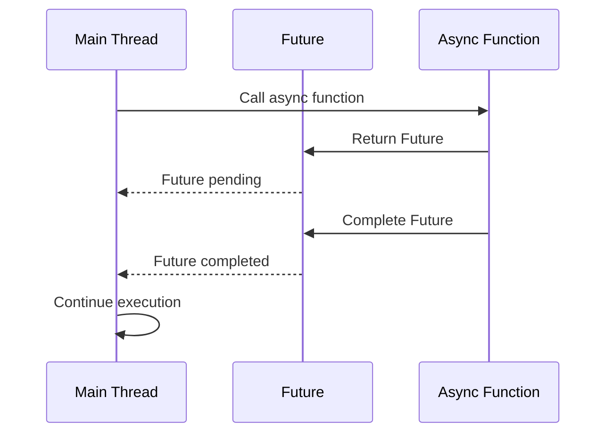

## 16.5 Mismanaging Async/Await and Futures

Asynchronous programming is a cornerstone of modern software development, especially in mobile and web applications where responsiveness is key. Dart, the language behind Flutter, provides robust support for asynchronous programming through `async`, `await`, and `Futures`. However, mismanaging these features can lead to unhandled exceptions, blocked UIs, and other performance issues. In this section, we will delve into the common pitfalls associated with async/await and Futures in Dart, and provide best practices to help you avoid these issues.

### Understanding Asynchronous Programming in Dart

Before diving into the pitfalls, let's ensure we have a solid understanding of asynchronous programming in Dart. Asynchronous programming allows your program to perform tasks without waiting for other tasks to complete, thus improving the responsiveness of your application.

#### Futures

A `Future` in Dart represents a potential value or error that will be available at some time in the future. It is a placeholder for a result that is initially unknown because the computation is incomplete.

```dart
Future<String> fetchData() async {
  return Future.delayed(Duration(seconds: 2), () => 'Data loaded');
}
```

In the above code, `fetchData` returns a `Future` that completes with a string after a delay of two seconds.

#### Async/Await

The `async` and `await` keywords in Dart are used to work with asynchronous code in a more readable way. The `async` keyword is used to mark a function as asynchronous, and `await` is used to pause the execution of the function until the awaited `Future` completes.

```dart
void main() async {
  print('Fetching data...');
  String data = await fetchData();
  print(data);
}
```

In this example, `await` pauses the execution of `main` until `fetchData` completes, allowing you to write asynchronous code that looks synchronous.

### Common Pitfalls in Asynchronous Programming

Despite the simplicity of async/await, developers often encounter pitfalls that can lead to inefficient or incorrect code. Let's explore these pitfalls and how to avoid them.

#### 1. Ignoring Unhandled Exceptions

One of the most common mistakes is ignoring exceptions in asynchronous code. If a `Future` completes with an error and it is not handled, it can lead to unhandled exceptions that crash your application.

**Solution**: Always handle exceptions using `try-catch` blocks or the `catchError` method.

```dart
Future<void> fetchDataWithErrorHandling() async {
  try {
    String data = await fetchData();
    print(data);
  } catch (e) {
    print('An error occurred: $e');
  }
}
```

#### 2. Blocking the UI Thread

In Flutter, the UI runs on the main thread. Performing long-running tasks on this thread can block the UI, leading to a poor user experience.

**Solution**: Use asynchronous programming to offload heavy computations to a separate isolate or use `compute`.

```dart
import 'package:flutter/foundation.dart';

Future<void> performHeavyTask() async {
  await compute(heavyComputation, 'input data');
}

void heavyComputation(String input) {
  // Perform heavy computation
}
```

#### 3. Forgetting to Await

Forgetting to use `await` when calling an asynchronous function can lead to unexpected behavior, as the function will not pause for the `Future` to complete.

**Solution**: Always use `await` when you need to wait for a `Future` to complete before proceeding.

```dart
void main() async {
  await fetchData(); // Ensure the Future is awaited
  print('Data fetched');
}
```

#### 4. Overusing `async`/`await`

While `async`/`await` makes asynchronous code easier to read, overusing it can lead to unnecessary complexity and performance issues.

**Solution**: Use `async`/`await` judiciously and prefer chaining `Futures` when possible.

```dart
Future<void> fetchDataChain() {
  return fetchData().then((data) {
    print(data);
  }).catchError((e) {
    print('An error occurred: $e');
  });
}
```

### Best Practices for Asynchronous Programming

To master asynchronous programming in Dart, follow these best practices:

#### 1. Use `async`/`await` for Readability

Use `async`/`await` to make your asynchronous code more readable and maintainable. It allows you to write code that looks synchronous, making it easier to understand.

#### 2. Handle Errors Gracefully

Always handle errors in your asynchronous code. Use `try-catch` blocks or the `catchError` method to catch and handle exceptions.

#### 3. Avoid Blocking the UI

Offload heavy computations to separate isolates or use the `compute` function to prevent blocking the UI thread.

#### 4. Use `await` Judiciously

Only use `await` when necessary. If you don't need to wait for a `Future` to complete before proceeding, you can omit `await`.

#### 5. Chain `Futures` When Possible

Chaining `Futures` can lead to more concise and efficient code. Use the `then` method to chain `Futures` together.

### Visualizing Asynchronous Programming

To better understand how asynchronous programming works in Dart, let's visualize the flow of a simple asynchronous operation using Mermaid.js.



**Diagram Explanation**: This sequence diagram illustrates the flow of an asynchronous operation in Dart. The main thread calls an async function, which returns a `Future`. The main thread continues execution while the `Future` is pending. Once the `Future` completes, the main thread resumes execution.

### Try It Yourself

To solidify your understanding of async/await and Futures, try modifying the code examples provided. Experiment with different error handling strategies, or try offloading a heavy computation to a separate isolate.

### Knowledge Check

- What is a `Future` in Dart, and how does it differ from a synchronous value?
- How can you handle exceptions in asynchronous code?
- Why is it important to avoid blocking the UI thread in Flutter applications?
- What are some common pitfalls when using async/await in Dart?

### Embrace the Journey

Remember, mastering asynchronous programming is a journey. As you continue to experiment and learn, you'll become more adept at writing efficient and responsive applications. Keep exploring, stay curious, and enjoy the process!

### References and Links

- [Dart Asynchronous Programming](https://dart.dev/codelabs/async-await)
- [Flutter Asynchronous Programming](https://flutter.dev/docs/cookbook/networking/fetch-data)
- [Effective Dart: Asynchronous Programming](https://dart.dev/guides/language/effective-dart/usage#asynchronous-programming)

## Quiz Time!



### What is a `Future` in Dart?

- [x] A placeholder for a value that will be available in the future
- [ ] A synchronous value
- [ ] A function that runs immediately
- [ ] A data type for storing large amounts of data

> **Explanation:** A `Future` in Dart represents a potential value or error that will be available at some time in the future.

### How can you handle exceptions in asynchronous code?

- [x] Using try-catch blocks
- [ ] Ignoring them
- [x] Using the catchError method
- [ ] Using print statements

> **Explanation:** Exceptions in asynchronous code can be handled using try-catch blocks or the catchError method.

### Why is it important to avoid blocking the UI thread in Flutter applications?

- [x] To maintain a responsive user interface
- [ ] To increase battery consumption
- [ ] To reduce code complexity
- [ ] To improve network performance

> **Explanation:** Blocking the UI thread can lead to a poor user experience as it makes the application unresponsive.

### What is the purpose of the `await` keyword in Dart?

- [x] To pause execution until a Future completes
- [ ] To run code synchronously
- [ ] To handle exceptions
- [ ] To define a function

> **Explanation:** The `await` keyword is used to pause the execution of a function until the awaited Future completes.

### What is a common pitfall when using async/await in Dart?

- [x] Forgetting to await a Future
- [ ] Using too many variables
- [ ] Writing too many comments
- [ ] Using synchronous code

> **Explanation:** Forgetting to await a Future can lead to unexpected behavior as the function will not pause for the Future to complete.

### How can you offload heavy computations in Flutter?

- [x] Using the compute function
- [ ] Running them on the main thread
- [ ] Using synchronous code
- [ ] Ignoring them

> **Explanation:** The compute function can be used to offload heavy computations to a separate isolate, preventing UI blocking.

### What is the benefit of chaining Futures?

- [x] More concise and efficient code
- [ ] Increased code complexity
- [ ] Slower execution
- [ ] More error-prone code

> **Explanation:** Chaining Futures can lead to more concise and efficient code by reducing the need for nested async/await.

### What does the `async` keyword do in Dart?

- [x] Marks a function as asynchronous
- [ ] Runs code synchronously
- [ ] Handles exceptions
- [ ] Defines a class

> **Explanation:** The `async` keyword is used to mark a function as asynchronous, allowing it to use await.

### What is a best practice for handling errors in asynchronous code?

- [x] Using try-catch blocks
- [ ] Ignoring them
- [ ] Using synchronous code
- [ ] Using print statements

> **Explanation:** Using try-catch blocks is a best practice for handling errors in asynchronous code.

### True or False: You should always use `await` when calling an asynchronous function.

- [ ] True
- [x] False

> **Explanation:** You should only use `await` when you need to wait for a Future to complete before proceeding.


