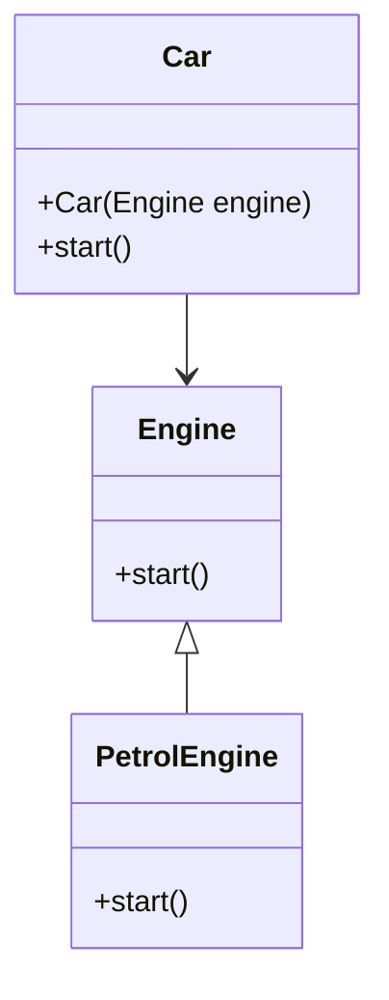

## 16.6 Tight Coupling and Dependency Issues

In the world of software development, tight coupling and dependency issues are common challenges that can significantly impact the flexibility, maintainability, and scalability of your applications. In this section, we will delve into these issues, particularly in the context of Dart and Flutter development, and explore strategies to mitigate them using design principles and patterns.

### Understanding Tight Coupling

**Tight coupling** occurs when classes or modules in a software system are highly dependent on each other. This dependency can make the system rigid and difficult to modify, as changes in one part of the system may necessitate changes in other parts. Tight coupling can lead to several problems, including:

- **Reduced Flexibility**: It becomes challenging to change or replace components without affecting others.
- **Increased Complexity**: The system becomes harder to understand and maintain.
- **Limited Reusability**: Tightly coupled components are often not reusable in other contexts.

#### Example of Tight Coupling

Consider the following example in Dart:

```dart
class Engine {
  void start() {
    print('Engine started');
  }
}

class Car {
  final Engine engine;

  Car() : engine = Engine();

  void start() {
    engine.start();
    print('Car started');
  }
}

void main() {
  Car car = Car();
  car.start();
}
```

In this example, the `Car` class is tightly coupled to the `Engine` class. The `Car` class directly creates an instance of `Engine`, making it difficult to replace the `Engine` with a different implementation without modifying the `Car` class.

### Dependency Issues

Dependency issues arise when a class or module relies heavily on other classes or modules. This can lead to problems such as:

- **Difficulty in Testing**: Dependencies can make it challenging to test components in isolation.
- **Hard to Extend**: Adding new features or modifying existing ones can be cumbersome.
- **Fragile Code**: Changes in dependencies can break the functionality of dependent components.

#### Identifying Dependency Issues

To identify dependency issues, look for the following signs:

- **Direct Instantiation**: Classes that directly instantiate other classes are often tightly coupled.
- **Hardcoded Dependencies**: Dependencies that are hardcoded within a class make it difficult to change or replace them.
- **Lack of Abstraction**: A lack of interfaces or abstract classes can indicate tight coupling.

### Solutions to Tight Coupling and Dependency Issues

To address tight coupling and dependency issues, we can apply several design principles and patterns. Let's explore some of these solutions.

#### Dependency Inversion Principle

The **Dependency Inversion Principle (DIP)** is one of the SOLID principles of object-oriented design. It states that:

1. High-level modules should not depend on low-level modules. Both should depend on abstractions.
2. Abstractions should not depend on details. Details should depend on abstractions.

By following DIP, we can reduce tight coupling and make our code more flexible and maintainable.

#### Dependency Injection

**Dependency Injection (DI)** is a design pattern that helps achieve the Dependency Inversion Principle. It involves injecting dependencies into a class, rather than the class creating them itself. This can be done through:

- **Constructor Injection**: Dependencies are provided through the class constructor.
- **Setter Injection**: Dependencies are provided through setter methods.
- **Interface Injection**: Dependencies are provided through an interface.

Let's refactor the previous example using dependency injection:

```dart
class Engine {
  void start() {
    print('Engine started');
  }
}

class Car {
  final Engine engine;

  Car(this.engine);

  void start() {
    engine.start();
    print('Car started');
  }
}

void main() {
  Engine engine = Engine();
  Car car = Car(engine);
  car.start();
}
```

In this refactored example, the `Car` class receives an `Engine` instance through its constructor, making it easier to replace the `Engine` with a different implementation.

#### Using Interfaces and Abstract Classes

Interfaces and abstract classes can help reduce tight coupling by providing a layer of abstraction between components. This allows you to change the implementation of a component without affecting its consumers.

```dart
abstract class Engine {
  void start();
}

class PetrolEngine implements Engine {
  @override
  void start() {
    print('Petrol engine started');
  }
}

class Car {
  final Engine engine;

  Car(this.engine);

  void start() {
    engine.start();
    print('Car started');
  }
}

void main() {
  Engine engine = PetrolEngine();
  Car car = Car(engine);
  car.start();
}
```

In this example, the `Car` class depends on the `Engine` interface rather than a specific implementation. This makes it easy to switch to a different engine type, such as a `DieselEngine`, without modifying the `Car` class.

### Visualizing Dependency Injection

To better understand how dependency injection works, let's visualize it using a class diagram:



This diagram shows that the `Car` class depends on the `Engine` interface, and the `PetrolEngine` class implements the `Engine` interface. This setup allows for flexible and interchangeable engine implementations.

### Try It Yourself

To reinforce your understanding of dependency injection, try modifying the code examples to:

- Implement a `DieselEngine` class that also implements the `Engine` interface.
- Use the `DieselEngine` in the `Car` class instead of the `PetrolEngine`.
- Experiment with different injection methods (constructor, setter, interface).

### Design Considerations

When applying dependency injection and other design principles, consider the following:

- **Balance Abstraction and Complexity**: While abstraction can reduce coupling, excessive abstraction can lead to complexity. Strive for a balance.
- **Use Dependency Injection Frameworks**: In larger applications, consider using dependency injection frameworks like `get_it` or `provider` in Flutter to manage dependencies efficiently.
- **Testability**: Ensure that your design allows for easy testing of components in isolation.

### Differences and Similarities

It's important to distinguish between dependency injection and other related concepts:

- **Dependency Injection vs. Service Locator**: While both patterns manage dependencies, dependency injection provides dependencies directly to a class, whereas a service locator allows a class to request dependencies from a central registry.
- **Dependency Injection vs. Factory Pattern**: The factory pattern is used to create objects, while dependency injection is used to provide existing objects to a class.

### Knowledge Check

To test your understanding of tight coupling and dependency issues, consider the following questions:

- What are the main problems associated with tight coupling?
- How does dependency injection help achieve the Dependency Inversion Principle?
- What are the different methods of dependency injection?

### Embrace the Journey

Remember, mastering design patterns and principles is a journey. As you continue to develop your skills, you'll find that applying these concepts will lead to more robust and maintainable applications. Keep experimenting, stay curious, and enjoy the journey!

### References and Links

For further reading on dependency injection and design patterns, consider the following resources:

- [SOLID Principles](https://en.wikipedia.org/wiki/SOLID)
- [Dependency Injection in Dart](https://pub.dev/packages/get_it)
- [Design Patterns: Elements of Reusable Object-Oriented Software](https://en.wikipedia.org/wiki/Design_Patterns)

## Quiz Time!



### What is tight coupling?

- [x] When classes are highly dependent on each other
- [ ] When classes are loosely connected
- [ ] When classes have no dependencies
- [ ] When classes are independent

> **Explanation:** Tight coupling occurs when classes or modules are highly dependent on each other, making the system rigid and hard to modify.


### Which principle helps reduce tight coupling?

- [x] Dependency Inversion Principle
- [ ] Single Responsibility Principle
- [ ] Open/Closed Principle
- [ ] Liskov Substitution Principle

> **Explanation:** The Dependency Inversion Principle helps reduce tight coupling by ensuring high-level modules do not depend on low-level modules, but both depend on abstractions.


### What is a benefit of using dependency injection?

- [x] Increased flexibility and testability
- [ ] Increased complexity
- [ ] Reduced code readability
- [ ] Increased coupling

> **Explanation:** Dependency injection increases flexibility and testability by allowing dependencies to be injected, making it easier to replace or mock them during testing.


### Which method is NOT a form of dependency injection?

- [ ] Constructor Injection
- [ ] Setter Injection
- [x] Direct Instantiation
- [ ] Interface Injection

> **Explanation:** Direct instantiation is not a form of dependency injection. It involves creating dependencies directly within a class, leading to tight coupling.


### What is a key difference between dependency injection and service locator?

- [x] Dependency injection provides dependencies directly, while service locator retrieves them from a registry
- [ ] Service locator provides dependencies directly, while dependency injection retrieves them from a registry
- [ ] Both patterns are identical
- [ ] Neither pattern manages dependencies

> **Explanation:** Dependency injection provides dependencies directly to a class, while a service locator allows a class to request dependencies from a central registry.


### How can interfaces help reduce tight coupling?

- [x] By providing a layer of abstraction between components
- [ ] By increasing the number of dependencies
- [ ] By making components more rigid
- [ ] By eliminating the need for dependencies

> **Explanation:** Interfaces provide a layer of abstraction, allowing components to depend on abstractions rather than concrete implementations, reducing tight coupling.


### What is a potential downside of excessive abstraction?

- [x] Increased complexity
- [ ] Reduced flexibility
- [ ] Increased coupling
- [ ] Decreased testability

> **Explanation:** While abstraction can reduce coupling, excessive abstraction can lead to increased complexity, making the system harder to understand and maintain.


### Which pattern is used to create objects?

- [ ] Dependency Injection
- [x] Factory Pattern
- [ ] Singleton Pattern
- [ ] Observer Pattern

> **Explanation:** The Factory Pattern is used to create objects, while dependency injection is used to provide existing objects to a class.


### What is the purpose of the Dependency Inversion Principle?

- [x] To ensure high-level modules do not depend on low-level modules
- [ ] To increase the number of dependencies
- [ ] To eliminate the need for interfaces
- [ ] To make modules more dependent on each other

> **Explanation:** The Dependency Inversion Principle ensures high-level modules do not depend on low-level modules, but both depend on abstractions, reducing tight coupling.


### True or False: Dependency injection can improve testability.

- [x] True
- [ ] False

> **Explanation:** True. Dependency injection improves testability by allowing dependencies to be injected, making it easier to replace or mock them during testing.




