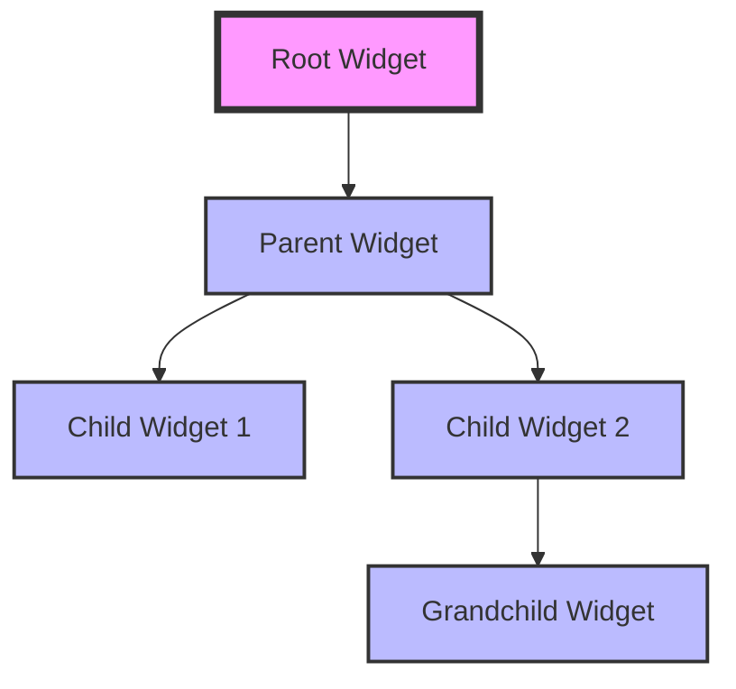

## 16.7 Excessive Widget Rebuilds

In the world of Flutter development, performance is a critical aspect that can make or break the user experience. One common anti-pattern that developers encounter is excessive widget rebuilds. This issue can lead to performance degradation, causing applications to become sluggish and unresponsive. In this section, we will delve into the causes of excessive widget rebuilds, explore strategies to avoid them, and provide practical solutions to optimize your Flutter applications.

### Understanding Widget Rebuilds

Before we dive into the problem of excessive widget rebuilds, it's essential to understand what widget rebuilds are and why they occur. In Flutter, the UI is built using a tree of widgets. Each widget describes a part of the user interface, and Flutter's rendering engine is responsible for converting this widget tree into pixels on the screen.

#### The Widget Lifecycle

Widgets in Flutter are immutable, meaning they cannot change once they are created. When the state of a widget changes, Flutter rebuilds the widget tree to reflect the new state. This process involves creating new widget instances and updating the UI accordingly. The widget lifecycle can be summarized as follows:

1. **Creation**: A widget is created and added to the widget tree.
2. **Build**: The widget's `build` method is called to describe the part of the UI it represents.
3. **Rebuild**: When the widget's state changes, the `build` method is called again to update the UI.
4. **Dispose**: The widget is removed from the widget tree and its resources are released.

#### Causes of Widget Rebuilds

Widget rebuilds are triggered by changes in the widget's state or its dependencies. Common causes of widget rebuilds include:

- **State Changes**: When the state of a `StatefulWidget` changes, it triggers a rebuild of the widget and its descendants.
- **InheritedWidget Changes**: Changes in an `InheritedWidget` can cause all widgets that depend on it to rebuild.
- **Parent Widget Rebuilds**: If a parent widget rebuilds, its child widgets will also rebuild.

While widget rebuilds are necessary for updating the UI, excessive rebuilds can lead to performance issues.

### The Problem of Excessive Widget Rebuilds

Excessive widget rebuilds occur when widgets are rebuilt more often than necessary. This can happen due to inefficient state management, improper use of keys, or not leveraging Flutter's optimization features. The consequences of excessive rebuilds include:

- **Increased CPU Usage**: Rebuilding widgets consumes CPU resources, leading to higher CPU usage and potential battery drain on mobile devices.
- **UI Jank**: Frequent rebuilds can cause UI jank, where the interface becomes unresponsive or lags during animations and interactions.
- **Poor User Experience**: A sluggish and unresponsive UI can frustrate users and lead to a poor overall experience.

### Strategies to Minimize Widget Rebuilds

To optimize performance and minimize excessive widget rebuilds, developers can employ several strategies. Let's explore these strategies in detail.

#### 1. Use `const` Constructors

One of the simplest ways to reduce widget rebuilds is by using `const` constructors. When a widget is created with a `const` constructor, it becomes a compile-time constant, and Flutter can optimize its creation and reuse.

```dart
class MyWidget extends StatelessWidget {
  const MyWidget({Key? key}) : super(key: key);

  @override
  Widget build(BuildContext context) {
    return const Text('Hello, World!');
  }
}
```

By using `const`, you ensure that the widget is only created once and reused whenever possible, reducing unnecessary rebuilds.

#### 2. Leverage Keys for Widget Identity

Keys are a powerful tool in Flutter for managing widget identity. They help Flutter differentiate between widgets that have the same type and configuration but are in different positions in the widget tree. Using keys can prevent unnecessary rebuilds when the widget tree structure changes.

```dart
class MyList extends StatelessWidget {
  final List<String> items;

  MyList({Key? key, required this.items}) : super(key: key);

  @override
  Widget build(BuildContext context) {
    return ListView(
      children: items.map((item) => Text(item, key: ValueKey(item))).toList(),
    );
  }
}
```

In this example, `ValueKey` is used to uniquely identify each `Text` widget, ensuring that Flutter can efficiently update the list without rebuilding all items.

#### 3. Efficient State Management

Efficient state management is crucial for minimizing widget rebuilds. Flutter provides several state management solutions, such as `Provider`, `BLoC`, and `Riverpod`, that help manage state changes efficiently.

- **Provider**: A simple and flexible state management solution that uses `ChangeNotifier` to notify listeners of state changes.
- **BLoC**: A pattern that separates business logic from the UI, allowing for more predictable state management.
- **Riverpod**: A modern state management library that offers improved performance and testability.

By choosing the right state management solution and organizing your state effectively, you can minimize unnecessary rebuilds and improve performance.

#### 4. Use `shouldRebuild` in Custom Widgets

When creating custom widgets, you can override the `shouldRebuild` method to control when the widget should rebuild. This method allows you to implement custom logic to determine if a rebuild is necessary.

```dart
class MyCustomWidget extends StatelessWidget {
  final int value;

  const MyCustomWidget({Key? key, required this.value}) : super(key: key);

  @override
  Widget build(BuildContext context) {
    return Text('Value: $value');
  }

  @override
  bool shouldRebuild(MyCustomWidget oldWidget) {
    return oldWidget.value != value;
  }
}
```

In this example, the widget only rebuilds if the `value` property changes, reducing unnecessary rebuilds.

#### 5. Optimize Widget Hierarchies

Optimizing widget hierarchies involves structuring your widget tree to minimize the impact of rebuilds. This can be achieved by:

- **Splitting Large Widgets**: Break down large widgets into smaller, reusable components to isolate rebuilds.
- **Using `Builder` Widgets**: Use `Builder` widgets to create parts of the widget tree that depend on specific context values, reducing rebuilds in other parts of the tree.

```dart
class MyApp extends StatelessWidget {
  @override
  Widget build(BuildContext context) {
    return MaterialApp(
      home: Scaffold(
        appBar: AppBar(title: const Text('My App')),
        body: Column(
          children: [
            const HeaderWidget(),
            Builder(
              builder: (context) {
                // This part of the tree can rebuild independently
                return Text('Current time: ${DateTime.now()}');
              },
            ),
          ],
        ),
      ),
    );
  }
}
```

By using `Builder`, you can isolate rebuilds to specific parts of the widget tree, improving performance.

### Visualizing Widget Rebuilds

To better understand the impact of widget rebuilds, let's visualize the widget tree and the rebuild process using Mermaid.js diagrams.



In this diagram, the root widget is the entry point of the widget tree. When a state change occurs in the parent widget, it triggers a rebuild of its child widgets. By optimizing the widget hierarchy and using keys, we can minimize the impact of these rebuilds.

### Practical Solutions and Code Examples

Let's explore some practical solutions and code examples to address excessive widget rebuilds in Flutter applications.

#### Example 1: Using `const` Constructors

```dart
class CounterApp extends StatelessWidget {
  const CounterApp({Key? key}) : super(key: key);

  @override
  Widget build(BuildContext context) {
    return MaterialApp(
      home: const CounterScreen(),
    );
  }
}

class CounterScreen extends StatefulWidget {
  const CounterScreen({Key? key}) : super(key: key);

  @override
  _CounterScreenState createState() => _CounterScreenState();
}

class _CounterScreenState extends State<CounterScreen> {
  int _counter = 0;

  void _incrementCounter() {
    setState(() {
      _counter++;
    });
  }

  @override
  Widget build(BuildContext context) {
    return Scaffold(
      appBar: AppBar(title: const Text('Counter')),
      body: Center(
        child: Column(
          mainAxisAlignment: MainAxisAlignment.center,
          children: <Widget>[
            const Text('You have pushed the button this many times:'),
            Text(
              '$_counter',
              style: Theme.of(context).textTheme.headline4,
            ),
          ],
        ),
      ),
      floatingActionButton: FloatingActionButton(
        onPressed: _incrementCounter,
        tooltip: 'Increment',
        child: const Icon(Icons.add),
      ),
    );
  }
}
```

In this example, we use `const` constructors for the `CounterApp` and `CounterScreen` widgets to minimize rebuilds.

#### Example 2: Leveraging Keys

```dart
class TodoList extends StatelessWidget {
  final List<String> todos;

  TodoList({Key? key, required this.todos}) : super(key: key);

  @override
  Widget build(BuildContext context) {
    return ListView.builder(
      itemCount: todos.length,
      itemBuilder: (context, index) {
        return ListTile(
          key: ValueKey(todos[index]),
          title: Text(todos[index]),
        );
      },
    );
  }
}
```

By using `ValueKey`, we ensure that each `ListTile` is uniquely identified, preventing unnecessary rebuilds when the list changes.

#### Example 3: Efficient State Management with Provider

```dart
class CounterProvider with ChangeNotifier {
  int _counter = 0;

  int get counter => _counter;

  void increment() {
    _counter++;
    notifyListeners();
  }
}

void main() {
  runApp(
    ChangeNotifierProvider(
      create: (context) => CounterProvider(),
      child: const CounterApp(),
    ),
  );
}

class CounterApp extends StatelessWidget {
  const CounterApp({Key? key}) : super(key: key);

  @override
  Widget build(BuildContext context) {
    return MaterialApp(
      home: const CounterScreen(),
    );
  }
}

class CounterScreen extends StatelessWidget {
  const CounterScreen({Key? key}) : super(key: key);

  @override
  Widget build(BuildContext context) {
    final counterProvider = Provider.of<CounterProvider>(context);

    return Scaffold(
      appBar: AppBar(title: const Text('Counter')),
      body: Center(
        child: Column(
          mainAxisAlignment: MainAxisAlignment.center,
          children: <Widget>[
            const Text('You have pushed the button this many times:'),
            Text(
              '${counterProvider.counter}',
              style: Theme.of(context).textTheme.headline4,
            ),
          ],
        ),
      ),
      floatingActionButton: FloatingActionButton(
        onPressed: counterProvider.increment,
        tooltip: 'Increment',
        child: const Icon(Icons.add),
      ),
    );
  }
}
```

In this example, we use the `Provider` package to manage state efficiently, minimizing unnecessary rebuilds.

### Try It Yourself

To reinforce your understanding of minimizing widget rebuilds, try modifying the code examples provided. Experiment with different state management solutions, use keys in various scenarios, and observe the impact on performance. Remember, practice is key to mastering these concepts.

### Knowledge Check

- What are the common causes of widget rebuilds in Flutter?
- How can `const` constructors help reduce widget rebuilds?
- Why are keys important for managing widget identity?
- What are some efficient state management solutions in Flutter?
- How can you use the `shouldRebuild` method to control widget rebuilds?

### Embrace the Journey

Remember, optimizing widget rebuilds is just one aspect of creating high-performance Flutter applications. As you continue your journey, you'll discover more techniques and patterns to enhance your development skills. Keep experimenting, stay curious, and enjoy the process of building amazing Flutter apps!

## Quiz Time!



### What is a common cause of widget rebuilds in Flutter?

- [x] State changes
- [ ] Using `const` constructors
- [ ] Efficient state management
- [ ] Using keys

> **Explanation:** State changes are a common cause of widget rebuilds in Flutter, as they trigger the `build` method to update the UI.

### How can `const` constructors help reduce widget rebuilds?

- [x] By making widgets compile-time constants
- [ ] By increasing CPU usage
- [ ] By causing UI jank
- [ ] By preventing state changes

> **Explanation:** `Const` constructors make widgets compile-time constants, allowing Flutter to optimize their creation and reuse, reducing unnecessary rebuilds.

### Why are keys important for managing widget identity?

- [x] They help Flutter differentiate between widgets with the same type and configuration
- [ ] They increase widget rebuilds
- [ ] They cause UI jank
- [ ] They prevent state changes

> **Explanation:** Keys help Flutter differentiate between widgets with the same type and configuration, preventing unnecessary rebuilds when the widget tree structure changes.

### What is an efficient state management solution in Flutter?

- [x] Provider
- [ ] Using `const` constructors
- [ ] Using keys
- [ ] Inefficient state management

> **Explanation:** Provider is an efficient state management solution in Flutter that uses `ChangeNotifier` to notify listeners of state changes.

### How can you use the `shouldRebuild` method to control widget rebuilds?

- [x] By implementing custom logic to determine if a rebuild is necessary
- [ ] By increasing widget rebuilds
- [ ] By causing UI jank
- [ ] By preventing state changes

> **Explanation:** The `shouldRebuild` method allows you to implement custom logic to determine if a rebuild is necessary, reducing unnecessary rebuilds.

### What is the consequence of excessive widget rebuilds?

- [x] Increased CPU usage
- [ ] Improved performance
- [ ] Reduced UI jank
- [ ] Enhanced user experience

> **Explanation:** Excessive widget rebuilds can lead to increased CPU usage, causing performance degradation and potential battery drain on mobile devices.

### How can you optimize widget hierarchies to minimize rebuilds?

- [x] By splitting large widgets into smaller components
- [ ] By using inefficient state management
- [ ] By causing UI jank
- [ ] By preventing state changes

> **Explanation:** Splitting large widgets into smaller, reusable components can isolate rebuilds and improve performance.

### What is the role of `Builder` widgets in optimizing widget hierarchies?

- [x] They create parts of the widget tree that depend on specific context values
- [ ] They increase widget rebuilds
- [ ] They cause UI jank
- [ ] They prevent state changes

> **Explanation:** `Builder` widgets create parts of the widget tree that depend on specific context values, reducing rebuilds in other parts of the tree.

### What is the impact of UI jank on user experience?

- [x] It causes the interface to become unresponsive or lag
- [ ] It improves performance
- [ ] It enhances user experience
- [ ] It reduces CPU usage

> **Explanation:** UI jank causes the interface to become unresponsive or lag during animations and interactions, leading to a poor user experience.

### True or False: Efficient state management can minimize unnecessary widget rebuilds.

- [x] True
- [ ] False

> **Explanation:** Efficient state management can minimize unnecessary widget rebuilds by organizing state changes effectively and notifying only relevant parts of the widget tree.


