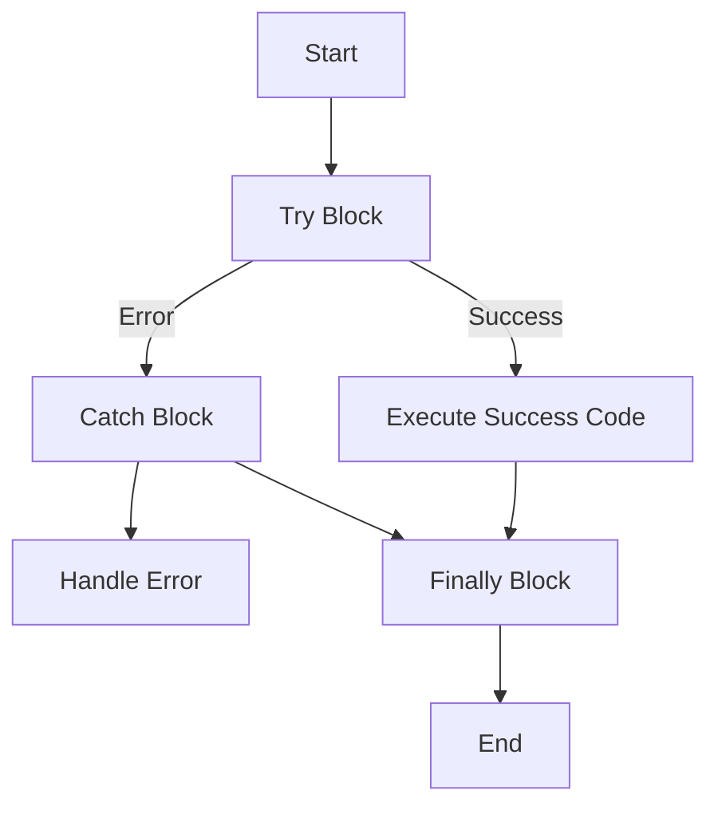

## 16.8 Ignoring Error Handling

In the realm of software development, particularly when working with Dart and Flutter, one of the most detrimental anti-patterns is ignoring error handling. This oversight can lead to application crashes, security vulnerabilities, and a poor user experience. In this section, we will delve into the importance of error handling, explore common pitfalls, and provide best practices for implementing robust error management strategies.

### Understanding Error Handling

Error handling is the process of anticipating, detecting, and responding to errors that occur during the execution of a program. In Dart, errors can arise from various sources, such as invalid user input, network failures, or unexpected conditions in the code. Proper error handling ensures that your application can gracefully recover from these situations, providing a seamless experience for the user.

#### Types of Errors in Dart

Before we dive into error handling techniques, it's essential to understand the types of errors you might encounter in Dart:

1. **Syntax Errors**: These occur when the code violates the syntax rules of the Dart language. They are typically caught during compilation.
2. **Runtime Errors**: These occur during the execution of the program. Examples include null pointer exceptions and out-of-bounds errors.
3. **Logical Errors**: These are errors in the logic of the program that lead to incorrect results. They are often the hardest to detect and fix.

### The Consequences of Ignoring Error Handling

Ignoring error handling can have severe consequences for your application:

- **Application Crashes**: Unhandled errors can cause your application to crash, leading to a poor user experience and potential data loss.
- **Security Vulnerabilities**: Errors that expose sensitive information or allow unauthorized access can compromise the security of your application.
- **Poor User Experience**: Users expect applications to handle errors gracefully. Failing to do so can lead to frustration and a negative perception of your app.
- **Maintenance Challenges**: Without proper error handling, debugging and maintaining your code becomes significantly more challenging.

### Best Practices for Error Handling in Dart

To avoid the pitfalls of ignoring error handling, consider the following best practices:

#### 1. Use Try-Catch Blocks

The try-catch block is a fundamental construct for handling exceptions in Dart. It allows you to catch and handle errors gracefully, preventing them from crashing your application.

```dart
void fetchData() {
  try {
    // Simulate a network request
    var data = fetchFromServer();
    print('Data fetched: $data');
  } catch (e) {
    print('An error occurred: $e');
  }
}
```

In this example, any errors that occur during the `fetchFromServer` call are caught and handled, preventing the application from crashing.

#### 2. Implement Custom Error Classes

Creating custom error classes can help you categorize and handle different types of errors more effectively.

```dart
class NetworkError implements Exception {
  final String message;
  NetworkError(this.message);
}

void fetchData() {
  try {
    // Simulate a network request
    throw NetworkError('Failed to connect to the server');
  } catch (e) {
    if (e is NetworkError) {
      print('Network error: ${e.message}');
    } else {
      print('An unexpected error occurred: $e');
    }
  }
}
```

By defining a `NetworkError` class, you can handle network-related errors separately from other types of errors.

#### 3. Use Finally Blocks

The `finally` block is executed regardless of whether an exception is thrown. It is useful for cleaning up resources or performing actions that must occur whether an error occurs or not.

```dart
void fetchData() {
  try {
    // Simulate a network request
    var data = fetchFromServer();
    print('Data fetched: $data');
  } catch (e) {
    print('An error occurred: $e');
  } finally {
    print('Cleanup actions');
  }
}
```

In this example, the `finally` block ensures that cleanup actions are performed regardless of whether an error occurs.

#### 4. Provide User Feedback

When an error occurs, it's important to provide meaningful feedback to the user. This can be done through error messages, alerts, or other UI elements.

```dart
void fetchData() {
  try {
    // Simulate a network request
    var data = fetchFromServer();
    print('Data fetched: $data');
  } catch (e) {
    showErrorToUser('An error occurred while fetching data. Please try again.');
  }
}

void showErrorToUser(String message) {
  // Display an error message to the user
  print('Error: $message');
}
```

Providing user feedback helps maintain a positive user experience, even when errors occur.

#### 5. Log Errors for Debugging

Logging errors is crucial for debugging and maintaining your application. It allows you to track and analyze errors that occur in production environments.

```dart
void fetchData() {
  try {
    // Simulate a network request
    var data = fetchFromServer();
    print('Data fetched: $data');
  } catch (e) {
    logError(e);
  }
}

void logError(dynamic error) {
  // Log the error for debugging purposes
  print('Logged error: $error');
}
```

By logging errors, you can gain insights into the types of errors that occur and address them proactively.

### Advanced Error Handling Techniques

In addition to the basic error handling techniques, there are advanced strategies you can employ to enhance the robustness of your application.

#### 1. Use Dart's `Error` and `Exception` Classes

Dart provides built-in `Error` and `Exception` classes that you can use to represent different types of errors. Understanding the distinction between these classes is crucial for effective error handling.

- **Error**: Represents a programmatic error that should not be caught. Examples include `AssertionError` and `TypeError`.
- **Exception**: Represents an error that can be caught and handled. Examples include `FormatException` and `IOException`.

#### 2. Implement Retry Logic

For operations that may fail due to transient issues, such as network requests, implementing retry logic can improve reliability.

```dart
Future<void> fetchDataWithRetry() async {
  int retryCount = 0;
  const maxRetries = 3;

  while (retryCount < maxRetries) {
    try {
      // Simulate a network request
      var data = await fetchFromServer();
      print('Data fetched: $data');
      return;
    } catch (e) {
      retryCount++;
      print('Retry $retryCount: An error occurred: $e');
      if (retryCount >= maxRetries) {
        print('Max retries reached. Aborting.');
        throw e;
      }
    }
  }
}
```

In this example, the `fetchDataWithRetry` function attempts to fetch data up to three times before giving up.

#### 3. Use Dart's `Future` and `Stream` Error Handling

When working with asynchronous operations, such as `Future` and `Stream`, it's important to handle errors appropriately.

```dart
Future<void> fetchDataAsync() async {
  try {
    var data = await fetchFromServer();
    print('Data fetched: $data');
  } catch (e) {
    print('An error occurred: $e');
  }
}

Stream<int> numberStream() async* {
  for (int i = 0; i < 5; i++) {
    if (i == 3) throw Exception('Error at $i');
    yield i;
  }
}

void handleStreamErrors() {
  numberStream().listen(
    (data) {
      print('Received: $data');
    },
    onError: (error) {
      print('Stream error: $error');
    },
  );
}
```

In these examples, errors are handled within asynchronous operations, ensuring that they do not go unhandled.

### Visualizing Error Handling in Dart

To better understand the flow of error handling in Dart, let's visualize it using a flowchart. This diagram illustrates the process of handling errors using try-catch-finally blocks.



**Description**: This flowchart demonstrates the flow of control in a try-catch-finally block. If the code in the try block executes successfully, the success code is executed. If an error occurs, the catch block handles the error. Regardless of the outcome, the finally block is executed.

### Common Pitfalls in Error Handling

Even with the best intentions, developers can fall into common pitfalls when implementing error handling. Here are some to watch out for:

#### 1. Catching Generic Exceptions

Catching generic exceptions can make it difficult to diagnose and fix specific issues. Instead, catch specific exceptions to handle different error types appropriately.

```dart
try {
  // Code that may throw an exception
} catch (e) {
  // Avoid catching generic exceptions
  print('An error occurred: $e');
}
```

#### 2. Swallowing Errors

Swallowing errors by catching them without taking any action can lead to silent failures and make debugging challenging.

```dart
try {
  // Code that may throw an exception
} catch (e) {
  // Avoid swallowing errors
}
```

#### 3. Overusing Try-Catch Blocks

Overusing try-catch blocks can lead to cluttered code and make it difficult to identify the root cause of errors. Use them judiciously and only where necessary.

### Try It Yourself

To solidify your understanding of error handling in Dart, try modifying the code examples provided in this section. Experiment with different types of errors, implement custom error classes, and practice logging and retry logic. By doing so, you'll gain hands-on experience and build confidence in your error handling skills.

### Knowledge Check

Before we conclude, let's summarize the key takeaways from this section:

- Error handling is crucial for maintaining application stability and providing a positive user experience.
- Use try-catch-finally blocks to handle exceptions gracefully.
- Implement custom error classes to categorize and manage different types of errors.
- Provide meaningful feedback to users when errors occur.
- Log errors for debugging and maintenance purposes.
- Avoid common pitfalls such as catching generic exceptions and swallowing errors.

### Embrace the Journey

Remember, mastering error handling is an ongoing journey. As you continue to develop your skills in Dart and Flutter, keep experimenting with different error handling techniques, stay curious, and enjoy the process. By doing so, you'll become a more proficient and confident developer, capable of building robust and reliable applications.

## Quiz Time!



### What is the primary purpose of error handling in Dart?

- [x] To anticipate, detect, and respond to errors during program execution
- [ ] To improve code readability
- [ ] To increase application performance
- [ ] To simplify code maintenance

> **Explanation:** Error handling is primarily used to anticipate, detect, and respond to errors during program execution, ensuring application stability and a positive user experience.

### Which Dart construct is used to catch and handle exceptions?

- [x] Try-catch block
- [ ] If-else statement
- [ ] Switch-case statement
- [ ] For loop

> **Explanation:** The try-catch block is used in Dart to catch and handle exceptions, preventing them from crashing the application.

### What is a common pitfall in error handling?

- [x] Catching generic exceptions
- [ ] Providing user feedback
- [ ] Logging errors
- [ ] Using custom error classes

> **Explanation:** Catching generic exceptions can make it difficult to diagnose and fix specific issues, leading to ineffective error handling.

### What is the purpose of the finally block in Dart?

- [x] To execute code regardless of whether an exception is thrown
- [ ] To catch specific exceptions
- [ ] To improve code readability
- [ ] To log errors

> **Explanation:** The finally block is executed regardless of whether an exception is thrown, making it useful for cleanup actions.

### How can you categorize and handle different types of errors effectively?

- [x] By implementing custom error classes
- [ ] By using generic exceptions
- [ ] By avoiding try-catch blocks
- [ ] By swallowing errors

> **Explanation:** Implementing custom error classes allows you to categorize and handle different types of errors effectively.

### What is a consequence of ignoring error handling in an application?

- [x] Application crashes
- [ ] Improved user experience
- [ ] Increased application performance
- [ ] Simplified code maintenance

> **Explanation:** Ignoring error handling can lead to application crashes, resulting in a poor user experience.

### Which of the following is an advanced error handling technique?

- [x] Implementing retry logic
- [ ] Using if-else statements
- [ ] Avoiding user feedback
- [ ] Swallowing errors

> **Explanation:** Implementing retry logic is an advanced error handling technique that improves reliability for operations that may fail due to transient issues.

### What should you do when an error occurs in your application?

- [x] Provide meaningful feedback to the user
- [ ] Ignore the error
- [ ] Swallow the error
- [ ] Catch generic exceptions

> **Explanation:** Providing meaningful feedback to the user helps maintain a positive user experience, even when errors occur.

### Why is logging errors important?

- [x] For debugging and maintaining the application
- [ ] To increase application performance
- [ ] To simplify code maintenance
- [ ] To improve code readability

> **Explanation:** Logging errors is crucial for debugging and maintaining the application, allowing you to track and analyze errors that occur in production environments.

### True or False: Overusing try-catch blocks can lead to cluttered code.

- [x] True
- [ ] False

> **Explanation:** Overusing try-catch blocks can lead to cluttered code and make it difficult to identify the root cause of errors. Use them judiciously and only where necessary.


