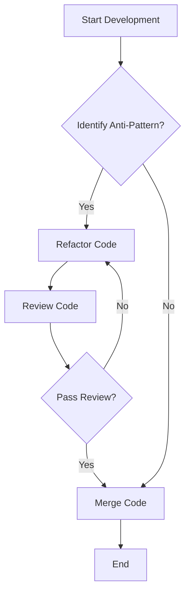

## 16.9 Avoiding Anti-Patterns

In the world of software development, anti-patterns are like the weeds in a garden. They can sprout up unexpectedly, hindering growth and productivity. In Dart and Flutter development, avoiding these anti-patterns is crucial for creating efficient, maintainable, and scalable applications. This section will guide you through identifying and avoiding common anti-patterns, ensuring your code remains robust and future-proof.

### Understanding Anti-Patterns

Before we dive into avoidance strategies, let's clarify what anti-patterns are. An anti-pattern is a common response to a recurring problem that is usually ineffective and risks being counterproductive. Unlike design patterns, which provide proven solutions, anti-patterns are pitfalls that developers should avoid.

### Common Anti-Patterns in Dart and Flutter

#### 1. Overusing Stateful Widgets

**Problem:** Over-reliance on stateful widgets can lead to complex and hard-to-maintain code. It often results in excessive widget rebuilds, impacting performance.

**Solution:** Use state management solutions like Provider, BLoC, or Riverpod to manage state outside of the widget tree. This separation of concerns leads to cleaner and more maintainable code.

```dart
// Example of using Provider for state management
class Counter with ChangeNotifier {
  int _count = 0;

  int get count => _count;

  void increment() {
    _count++;
    notifyListeners();
  }
}

// In your widget
class CounterDisplay extends StatelessWidget {
  @override
  Widget build(BuildContext context) {
    final counter = Provider.of<Counter>(context);
    return Text('Count: ${counter.count}');
  }
}
```

#### 2. Tight Coupling and Dependency Issues

**Problem:** Tight coupling occurs when components are heavily dependent on each other, making the system rigid and difficult to modify.

**Solution:** Implement dependency injection to decouple components. This approach enhances testability and flexibility.

```dart
// Using dependency injection with a service locator
class ServiceLocator {
  static final ServiceLocator _instance = ServiceLocator._internal();

  factory ServiceLocator() {
    return _instance;
  }

  ServiceLocator._internal();

  final Map<Type, dynamic> _services = {};

  void register<T>(T service) {
    _services[T] = service;
  }

  T get<T>() {
    return _services[T];
  }
}

// Registering and using a service
ServiceLocator().register<SomeService>(SomeService());

final someService = ServiceLocator().get<SomeService>();
```

#### 3. Mismanaging Async/Await and Futures

**Problem:** Incorrect handling of asynchronous operations can lead to unresponsive UIs or unexpected behavior.

**Solution:** Use async/await syntax correctly and handle exceptions properly to ensure smooth asynchronous operations.

```dart
// Correct use of async/await
Future<void> fetchData() async {
  try {
    final response = await http.get(Uri.parse('https://api.example.com/data'));
    if (response.statusCode == 200) {
      // Process data
    } else {
      throw Exception('Failed to load data');
    }
  } catch (e) {
    print('Error: $e');
  }
}
```

#### 4. Ignoring Error Handling

**Problem:** Failing to handle errors can lead to application crashes and poor user experience.

**Solution:** Implement comprehensive error handling strategies, including try-catch blocks and user-friendly error messages.

```dart
// Example of error handling
try {
  // Code that might throw an exception
} catch (e) {
  print('An error occurred: $e');
  // Show user-friendly message
}
```

### Strategies for Avoiding Anti-Patterns

#### Code Reviews

**Explain:** Regular code reviews are essential for identifying and correcting anti-patterns. They provide an opportunity for team members to share knowledge and improve code quality collectively.

**Demonstrate:** Establish a code review process where peers review each other's code before merging it into the main branch. Use tools like GitHub or GitLab for streamlined code review processes.

#### Continuous Learning

**Explain:** The tech industry evolves rapidly, and staying updated with the latest best practices and design principles is crucial.

**Provide:** Encourage team members to attend workshops, webinars, and conferences. Reading books and articles on software design can also be beneficial.

#### Testing

**Explain:** Writing tests helps detect anti-patterns early in the development process. Tests ensure that code behaves as expected and can highlight areas where anti-patterns might exist.

**Include:** Implement unit tests, integration tests, and widget tests to cover different aspects of your application.

```dart
// Example of a simple unit test
void main() {
  test('Counter value should be incremented', () {
    final counter = Counter();

    counter.increment();

    expect(counter.count, 1);
  });
}
```

### Visualizing Anti-Patterns

To better understand the impact of anti-patterns, let's visualize the concept using a flowchart that illustrates the process of identifying and resolving anti-patterns in a development workflow.



**Description:** This flowchart represents a typical development workflow where anti-patterns are identified and resolved through refactoring and code reviews.

### Knowledge Check

To reinforce your understanding, consider the following questions:

- What are the potential consequences of overusing stateful widgets?
- How can dependency injection help in avoiding tight coupling?
- Why is proper error handling crucial in application development?

### Try It Yourself

Experiment with the code examples provided. Try modifying the state management example to use a different state management solution like Riverpod. Observe how the separation of concerns improves code maintainability.

### Embrace the Journey

Remember, avoiding anti-patterns is an ongoing process. As you continue to develop your skills, you'll become more adept at recognizing and addressing these pitfalls. Keep experimenting, stay curious, and enjoy the journey of mastering Dart and Flutter development!

### References and Links

- [Dart Language Tour](https://dart.dev/guides/language/language-tour)
- [Flutter Documentation](https://flutter.dev/docs)
- [Effective Dart](https://dart.dev/guides/language/effective-dart)

## Quiz Time!



### What is an anti-pattern?

- [x] A common response to a recurring problem that is usually ineffective
- [ ] A proven solution to a recurring problem
- [ ] A design pattern used in software development
- [ ] A method for optimizing code performance

> **Explanation:** An anti-pattern is a common response to a recurring problem that is usually ineffective and risks being counterproductive.

### How can overusing stateful widgets impact your application?

- [x] It can lead to complex and hard-to-maintain code
- [ ] It simplifies the code structure
- [ ] It improves application performance
- [ ] It reduces the need for state management solutions

> **Explanation:** Overusing stateful widgets can lead to complex and hard-to-maintain code, often resulting in excessive widget rebuilds that impact performance.

### What is the benefit of using dependency injection?

- [x] It decouples components, enhancing testability and flexibility
- [ ] It increases the dependency between components
- [ ] It simplifies the code by removing the need for services
- [ ] It reduces the number of classes in the application

> **Explanation:** Dependency injection decouples components, enhancing testability and flexibility by allowing components to be easily replaced or modified.

### Why is proper error handling important?

- [x] It prevents application crashes and improves user experience
- [ ] It increases the complexity of the code
- [ ] It is only necessary for large applications
- [ ] It reduces the need for testing

> **Explanation:** Proper error handling prevents application crashes and improves user experience by providing user-friendly error messages and handling unexpected situations gracefully.

### What is the purpose of code reviews?

- [x] To identify and correct anti-patterns
- [ ] To increase the number of lines of code
- [ ] To reduce the need for testing
- [ ] To simplify the code structure

> **Explanation:** Code reviews are essential for identifying and correcting anti-patterns, improving code quality, and sharing knowledge among team members.

### How can continuous learning help in avoiding anti-patterns?

- [x] By staying updated with the latest best practices and design principles
- [ ] By reducing the need for code reviews
- [ ] By simplifying the code structure
- [ ] By increasing the number of lines of code

> **Explanation:** Continuous learning helps developers stay updated with the latest best practices and design principles, enabling them to avoid anti-patterns.

### What is the role of testing in avoiding anti-patterns?

- [x] It helps detect anti-patterns early in the development process
- [ ] It increases the complexity of the code
- [ ] It reduces the need for code reviews
- [ ] It simplifies the code structure

> **Explanation:** Testing helps detect anti-patterns early in the development process, ensuring that code behaves as expected and highlighting areas where anti-patterns might exist.

### What is the impact of tight coupling in software development?

- [x] It makes the system rigid and difficult to modify
- [ ] It simplifies the code structure
- [ ] It enhances the flexibility of the system
- [ ] It reduces the number of classes in the application

> **Explanation:** Tight coupling makes the system rigid and difficult to modify, as components are heavily dependent on each other.

### How can you avoid excessive widget rebuilds in Flutter?

- [x] By using state management solutions like Provider or BLoC
- [ ] By overusing stateful widgets
- [ ] By ignoring error handling
- [ ] By increasing the number of classes in the application

> **Explanation:** Using state management solutions like Provider or BLoC helps manage state outside of the widget tree, avoiding excessive widget rebuilds.

### True or False: Anti-patterns are beneficial for software development.

- [ ] True
- [x] False

> **Explanation:** Anti-patterns are not beneficial for software development; they are pitfalls that developers should avoid to ensure efficient, maintainable, and scalable applications.


