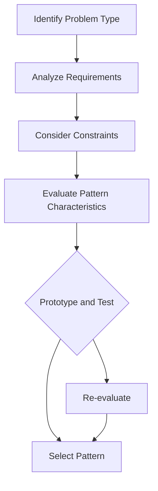

## 17.1 Selecting the Right Pattern for the Problem

In the world of software development, design patterns are invaluable tools that help developers solve common problems with proven solutions. However, the key to leveraging these patterns effectively lies in selecting the right pattern for the problem at hand. This section will guide you through the process of pattern matching, avoiding over-engineering, and maintaining adaptability in your Dart and Flutter projects.

### Understanding Problem Domains

Before diving into the selection of design patterns, it's crucial to understand the problem domain you're dealing with. This involves analyzing the requirements, constraints, and goals of your project. By thoroughly understanding the problem domain, you can identify the core challenges and determine which design patterns are best suited to address them.

#### Pattern Matching

Pattern matching is the process of identifying the most appropriate design pattern for a given problem. This involves recognizing the characteristics of the problem and mapping them to the features of various design patterns. Here are some steps to help you with pattern matching:

1. **Identify the Problem Type**: Determine whether the problem is related to object creation, structure, behavior, or concurrency. This will help you narrow down the category of design patterns to consider.

2. **Analyze Requirements**: Understand the specific requirements of your project. Are you dealing with complex object creation, dynamic behavior changes, or intricate object structures? Each of these scenarios may require a different pattern.

3. **Consider Constraints**: Take into account any constraints such as performance, scalability, and maintainability. These factors can influence the choice of pattern.

4. **Evaluate Pattern Characteristics**: Study the characteristics of various design patterns and see how they align with your problem's requirements and constraints.

5. **Prototype and Test**: Implement a prototype using the selected pattern to test its effectiveness in solving the problem. This can help you validate your choice before fully committing to it.

### Avoiding Over-Engineering

While design patterns offer elegant solutions, it's important to avoid over-engineering by applying patterns unnecessarily. Over-engineering can lead to increased complexity, reduced performance, and maintenance challenges. Here are some tips to avoid over-engineering:

- **Keep It Simple**: Always strive for simplicity. If a problem can be solved with a straightforward solution, there's no need to introduce a design pattern.

- **Evaluate Complexity**: Assess the complexity that a pattern introduces. If the added complexity outweighs the benefits, consider a simpler approach.

- **Focus on Requirements**: Ensure that the pattern addresses the actual requirements of the project. Avoid using patterns just for the sake of using them.

- **Iterate and Refactor**: Start with a simple solution and iterate as needed. Refactor your code to introduce patterns only when they provide clear benefits.

### Adaptability

Software projects are often subject to changing requirements and evolving needs. Therefore, it's essential to be adaptable and open to changing patterns as the project progresses. Here are some strategies to maintain adaptability:

- **Design for Change**: Anticipate potential changes and design your system to accommodate them. This may involve using patterns that support flexibility and extensibility.

- **Modular Architecture**: Structure your code in a modular way, allowing for easy replacement or modification of components.

- **Continuous Evaluation**: Regularly evaluate the effectiveness of the chosen pattern. If it no longer serves the project's needs, be willing to refactor and adopt a different pattern.

- **Stay Informed**: Keep up with the latest developments in design patterns and software architecture. This knowledge can help you make informed decisions when adapting to new requirements.

### Code Examples

Let's explore some code examples to illustrate the process of selecting the right pattern for a problem.

#### Example 1: Singleton Pattern

**Problem**: You need to ensure that a class has only one instance and provide a global point of access to it.

**Solution**: Use the Singleton pattern.

```dart
class Singleton {
  // Private constructor
  Singleton._privateConstructor();

  // Static instance
  static final Singleton _instance = Singleton._privateConstructor();

  // Factory method to return the instance
  factory Singleton() {
    return _instance;
  }

  void someMethod() {
    print('Singleton method called');
  }
}

void main() {
  var singleton1 = Singleton();
  var singleton2 = Singleton();

  // Both instances are the same
  print(singleton1 == singleton2); // true
}
```

In this example, the Singleton pattern ensures that only one instance of the `Singleton` class exists. This pattern is suitable when you need a single point of access to a shared resource.

#### Example 2: Strategy Pattern

**Problem**: You need to define a family of algorithms and make them interchangeable.

**Solution**: Use the Strategy pattern.

```dart
abstract class Strategy {
  void execute();
}

class ConcreteStrategyA implements Strategy {
  @override
  void execute() {
    print('Executing Strategy A');
  }
}

class ConcreteStrategyB implements Strategy {
  @override
  void execute() {
    print('Executing Strategy B');
  }
}

class Context {
  Strategy _strategy;

  Context(this._strategy);

  void setStrategy(Strategy strategy) {
    _strategy = strategy;
  }

  void executeStrategy() {
    _strategy.execute();
  }
}

void main() {
  var context = Context(ConcreteStrategyA());
  context.executeStrategy(); // Executing Strategy A

  context.setStrategy(ConcreteStrategyB());
  context.executeStrategy(); // Executing Strategy B
}
```

The Strategy pattern allows you to define a family of algorithms and make them interchangeable. This pattern is useful when you need to switch between different algorithms at runtime.

### Visualizing Pattern Selection

To better understand the process of selecting the right pattern, let's visualize it using a flowchart.



**Figure 1**: Flowchart illustrating the process of selecting the right design pattern.

### Key Takeaways

- **Understand the Problem Domain**: Thoroughly analyze the problem domain to identify the core challenges and requirements.

- **Pattern Matching**: Use pattern matching to map problem characteristics to pattern features.

- **Avoid Over-Engineering**: Strive for simplicity and avoid introducing unnecessary complexity.

- **Maintain Adaptability**: Be open to changing patterns as project requirements evolve.

- **Prototype and Test**: Validate your pattern choice through prototyping and testing.

### Try It Yourself

Experiment with the code examples provided by modifying them to suit different scenarios. For instance, try implementing a different strategy in the Strategy pattern example or create a new Singleton class with additional methods.

### References and Links

- [Design Patterns: Elements of Reusable Object-Oriented Software](https://en.wikipedia.org/wiki/Design_Patterns) - A foundational book on design patterns.
- [Dart Language Tour](https://dart.dev/guides/language/language-tour) - Official Dart documentation for language features.
- [Flutter Documentation](https://flutter.dev/docs) - Official Flutter documentation for building applications.

### Quiz Time!



### What is the first step in selecting the right design pattern for a problem?

- [x] Identify the problem type
- [ ] Evaluate pattern characteristics
- [ ] Prototype and test
- [ ] Consider constraints

> **Explanation:** Identifying the problem type helps narrow down the category of design patterns to consider.

### Why is it important to avoid over-engineering when selecting a design pattern?

- [x] To prevent increased complexity and maintenance challenges
- [ ] To ensure the use of the latest patterns
- [ ] To maximize performance at all costs
- [ ] To make the code more abstract

> **Explanation:** Over-engineering can lead to unnecessary complexity, making the code harder to maintain and understand.

### What is a key strategy for maintaining adaptability in a project?

- [x] Design for change
- [ ] Use as many patterns as possible
- [ ] Avoid refactoring
- [ ] Stick to a single pattern throughout

> **Explanation:** Designing for change involves anticipating potential changes and structuring the system to accommodate them.

### Which pattern is suitable for ensuring a class has only one instance?

- [x] Singleton Pattern
- [ ] Strategy Pattern
- [ ] Observer Pattern
- [ ] Factory Pattern

> **Explanation:** The Singleton pattern ensures that a class has only one instance and provides a global point of access to it.

### What should you do if a chosen pattern no longer serves the project's needs?

- [x] Be willing to refactor and adopt a different pattern
- [ ] Stick with the pattern regardless
- [ ] Abandon the project
- [ ] Ignore the issue

> **Explanation:** It's important to be adaptable and refactor the code to use a different pattern if the current one is no longer effective.

### What is the purpose of prototyping and testing a pattern?

- [x] To validate the pattern's effectiveness in solving the problem
- [ ] To finalize the pattern choice
- [ ] To avoid using the pattern
- [ ] To increase complexity

> **Explanation:** Prototyping and testing help validate whether the chosen pattern effectively addresses the problem.

### How can you avoid over-engineering in your project?

- [x] Start with a simple solution and iterate as needed
- [ ] Use as many patterns as possible
- [ ] Avoid testing the code
- [ ] Focus solely on performance

> **Explanation:** Starting with a simple solution and iterating allows you to introduce patterns only when they provide clear benefits.

### What is a benefit of using the Strategy pattern?

- [x] It allows for interchangeable algorithms
- [ ] It ensures a single instance of a class
- [ ] It simplifies object creation
- [ ] It provides a global point of access

> **Explanation:** The Strategy pattern allows you to define a family of algorithms and make them interchangeable.

### What is the role of constraints in pattern selection?

- [x] They influence the choice of pattern
- [ ] They are irrelevant to pattern selection
- [ ] They simplify the selection process
- [ ] They ensure the use of complex patterns

> **Explanation:** Constraints such as performance, scalability, and maintainability can influence the choice of pattern.

### True or False: It's important to keep up with the latest developments in design patterns.

- [x] True
- [ ] False

> **Explanation:** Staying informed about the latest developments in design patterns helps you make informed decisions when adapting to new requirements.



Remember, selecting the right design pattern is an art that requires a deep understanding of both the problem domain and the available patterns. As you continue to develop your skills, you'll become more adept at choosing the right pattern for the right problem. Keep experimenting, stay curious, and enjoy the journey!
