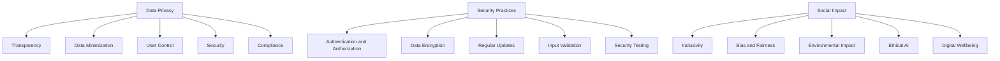

## 17.10 Ethical Considerations in Software Development

In the rapidly evolving world of software development, ethical considerations have become paramount. As developers, we wield significant power in shaping the digital landscape, and with that power comes the responsibility to ensure that our creations are not only functional and efficient but also ethical and responsible. This section delves into the critical aspects of ethical software development, focusing on data privacy, security practices, and the social impact of technology.

### Data Privacy: Respecting User Data and Adhering to Privacy Laws

Data privacy is a cornerstone of ethical software development. With the increasing amount of personal data being collected, processed, and stored by applications, it is crucial to respect user privacy and comply with relevant privacy laws.

#### Understanding Data Privacy

Data privacy refers to the protection of personal information from unauthorized access, use, or disclosure. It involves ensuring that users have control over their data and that their information is handled transparently and securely.

#### Key Principles of Data Privacy

1. **Transparency**: Clearly inform users about what data is being collected, how it is used, and who it is shared with. Provide accessible privacy policies and obtain explicit consent where necessary.

2. **Data Minimization**: Collect only the data that is necessary for the functionality of the application. Avoid over-collection and ensure that data is relevant and adequate.

3. **User Control**: Empower users to manage their data. Provide options for users to access, modify, or delete their information.

4. **Security**: Implement robust security measures to protect data from breaches and unauthorized access.

5. **Compliance**: Adhere to relevant data protection regulations such as the General Data Protection Regulation (GDPR) and the California Consumer Privacy Act (CCPA).

#### Implementing Data Privacy in Dart and Flutter

Let's explore how to implement data privacy in Dart and Flutter applications.

```dart
import 'package:flutter_secure_storage/flutter_secure_storage.dart';

// Create an instance of FlutterSecureStorage
final storage = FlutterSecureStorage();

// Function to store user data securely
Future<void> storeUserData(String key, String value) async {
  await storage.write(key: key, value: value);
}

// Function to retrieve user data securely
Future<String?> retrieveUserData(String key) async {
  return await storage.read(key: key);
}

// Function to delete user data securely
Future<void> deleteUserData(String key) async {
  await storage.delete(key: key);
}
```

In this example, we use the `flutter_secure_storage` package to securely store, retrieve, and delete user data. This package ensures that sensitive information is encrypted and stored securely on the device.

#### Try It Yourself

Experiment with the code by adding more functionality, such as updating user data or implementing user consent mechanisms before storing data.

### Security Practices: Protecting Applications from Vulnerabilities

Security is a critical aspect of ethical software development. As developers, we must ensure that our applications are secure and resilient against potential threats.

#### Understanding Security Practices

Security practices involve implementing measures to protect applications from vulnerabilities, attacks, and unauthorized access. This includes securing data, networks, and systems.

#### Key Security Practices

1. **Authentication and Authorization**: Implement strong authentication mechanisms to verify user identities and ensure that users have appropriate access levels.

2. **Data Encryption**: Encrypt sensitive data both in transit and at rest to protect it from unauthorized access.

3. **Regular Updates**: Keep software and dependencies up to date to protect against known vulnerabilities.

4. **Input Validation**: Validate and sanitize user inputs to prevent injection attacks and other vulnerabilities.

5. **Security Testing**: Conduct regular security testing, including penetration testing and vulnerability assessments, to identify and address potential security issues.

#### Implementing Security Practices in Dart and Flutter

Let's explore how to implement security practices in Dart and Flutter applications.

```dart
import 'package:encrypt/encrypt.dart';

// Function to encrypt data
String encryptData(String plainText, String key) {
  final keyBytes = Key.fromUtf8(key);
  final iv = IV.fromLength(16);
  final encrypter = Encrypter(AES(keyBytes));

  final encrypted = encrypter.encrypt(plainText, iv: iv);
  return encrypted.base64;
}

// Function to decrypt data
String decryptData(String encryptedText, String key) {
  final keyBytes = Key.fromUtf8(key);
  final iv = IV.fromLength(16);
  final encrypter = Encrypter(AES(keyBytes));

  final decrypted = encrypter.decrypt64(encryptedText, iv: iv);
  return decrypted;
}
```

In this example, we use the `encrypt` package to encrypt and decrypt data. This ensures that sensitive information is protected from unauthorized access.

#### Try It Yourself

Experiment with the code by implementing additional security features, such as hashing passwords or using secure communication protocols.

### Social Impact: Considering the Wider Implications of Software on Society

Software development has a profound impact on society, and it is essential to consider the social implications of our work.

#### Understanding Social Impact

Social impact refers to the effects that software has on individuals, communities, and society as a whole. This includes both positive and negative impacts.

#### Key Considerations for Social Impact

1. **Inclusivity**: Design software that is accessible and inclusive for all users, regardless of their abilities or backgrounds.

2. **Bias and Fairness**: Ensure that algorithms and data do not perpetuate bias or discrimination. Strive for fairness and equity in software design.

3. **Environmental Impact**: Consider the environmental impact of software, including energy consumption and resource usage.

4. **Ethical AI**: Develop artificial intelligence systems that are transparent, accountable, and aligned with ethical principles.

5. **Digital Wellbeing**: Promote digital wellbeing by designing software that encourages healthy usage patterns and prevents addiction.

#### Implementing Social Impact Considerations in Dart and Flutter

Let's explore how to implement social impact considerations in Dart and Flutter applications.

```dart
import 'package:flutter/material.dart';

// Function to create an accessible button
Widget accessibleButton(String label, VoidCallback onPressed) {
  return ElevatedButton(
    onPressed: onPressed,
    child: Text(
      label,
      style: TextStyle(fontSize: 18),
    ),
  );
}

// Function to create a theme with high contrast
ThemeData highContrastTheme() {
  return ThemeData(
    brightness: Brightness.dark,
    primaryColor: Colors.black,
    accentColor: Colors.white,
    textTheme: TextTheme(
      bodyText1: TextStyle(fontSize: 18, color: Colors.white),
    ),
  );
}
```

In this example, we create an accessible button and a high contrast theme to enhance accessibility and inclusivity in Flutter applications.

#### Try It Yourself

Experiment with the code by adding more accessibility features, such as screen reader support or customizable font sizes.

### Visualizing Ethical Considerations

To better understand the ethical considerations in software development, let's visualize the key components using a flowchart.



This flowchart illustrates the key components of ethical considerations in software development, including data privacy, security practices, and social impact.

### References and Links

For further reading on ethical considerations in software development, consider the following resources:

- [General Data Protection Regulation (GDPR)](https://gdpr.eu/)
- [California Consumer Privacy Act (CCPA)](https://oag.ca.gov/privacy/ccpa)
- [OWASP Top Ten Security Risks](https://owasp.org/www-project-top-ten/)
- [Ethical AI Guidelines](https://www.ibm.com/watson/ai-ethics/)
- [Digital Wellbeing](https://wellbeing.google/)

### Knowledge Check

To reinforce your understanding of ethical considerations in software development, consider the following questions:

1. What are the key principles of data privacy?
2. How can you implement data encryption in Dart and Flutter?
3. What are some common security practices in software development?
4. How can you ensure inclusivity in software design?
5. What is the importance of ethical AI in software development?

### Embrace the Journey

Remember, ethical considerations are an ongoing journey. As developers, we must continuously strive to build software that is not only functional but also responsible and trustworthy. Keep exploring, stay informed, and make a positive impact on the world through your work.

### Formatting and Structure

Organize your code and documentation with clear headings and subheadings. Use bullet points to break down complex information and highlight important terms or concepts using bold or italic text sparingly.

### Writing Style

Use first-person plural (we, let's) to create a collaborative feel. Avoid gender-specific pronouns and define acronyms and abbreviations upon first use.

## Quiz Time!



### What is a key principle of data privacy?

- [x] Transparency
- [ ] Complexity
- [ ] Obfuscation
- [ ] Exclusivity

> **Explanation:** Transparency involves clearly informing users about data collection and usage.

### Which package is used for secure storage in Flutter?

- [x] flutter_secure_storage
- [ ] flutter_storage
- [ ] secure_flutter
- [ ] storage_flutter

> **Explanation:** The `flutter_secure_storage` package is used for secure data storage in Flutter.

### What is a common security practice in software development?

- [x] Data Encryption
- [ ] Data Duplication
- [ ] Data Obfuscation
- [ ] Data Deletion

> **Explanation:** Data encryption is a common practice to protect sensitive information.

### How can you ensure inclusivity in software design?

- [x] Design accessible interfaces
- [ ] Limit user options
- [ ] Use complex algorithms
- [ ] Focus on aesthetics only

> **Explanation:** Designing accessible interfaces ensures inclusivity for all users.

### What is the importance of ethical AI?

- [x] Ensures transparency and accountability
- [ ] Increases complexity
- [ ] Focuses on aesthetics
- [ ] Limits user control

> **Explanation:** Ethical AI ensures transparency, accountability, and alignment with ethical principles.

### What is the role of data minimization in data privacy?

- [x] Collect only necessary data
- [ ] Collect as much data as possible
- [ ] Share data with third parties
- [ ] Encrypt all data

> **Explanation:** Data minimization involves collecting only the data necessary for the application's functionality.

### Which of the following is a social impact consideration?

- [x] Digital Wellbeing
- [ ] Data Duplication
- [ ] Data Obfuscation
- [ ] Data Deletion

> **Explanation:** Digital wellbeing is a consideration for the social impact of software.

### What is the purpose of security testing?

- [x] Identify and address potential security issues
- [ ] Increase application complexity
- [ ] Limit user access
- [ ] Focus on aesthetics

> **Explanation:** Security testing helps identify and address potential security vulnerabilities.

### How can you promote digital wellbeing in software design?

- [x] Encourage healthy usage patterns
- [ ] Limit user options
- [ ] Use complex algorithms
- [ ] Focus on aesthetics only

> **Explanation:** Promoting healthy usage patterns encourages digital wellbeing.

### True or False: Ethical considerations are an ongoing journey in software development.

- [x] True
- [ ] False

> **Explanation:** Ethical considerations require continuous effort and adaptation in software development.


