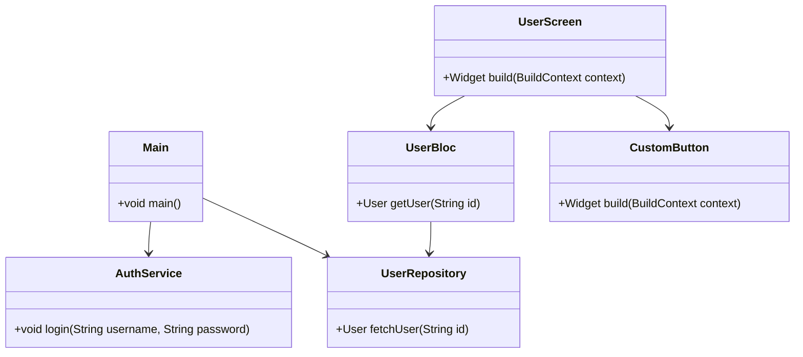

## 17.2 Code Organization and Project Structure

In the realm of software development, particularly when working with Dart and Flutter, the way you organize your code and structure your projects can significantly impact the maintainability, scalability, and overall quality of your applications. This section delves into the best practices for code organization and project structure, focusing on modular design, separation of concerns, and consistent naming conventions.

### Introduction to Code Organization

Code organization is the practice of arranging your code in a way that makes it easy to understand, maintain, and extend. A well-organized codebase can save time, reduce errors, and make collaboration more efficient. In Dart and Flutter, this involves structuring your code into modules, adhering to separation of concerns, and following consistent naming conventions.

#### Why Code Organization Matters

- **Maintainability**: A well-organized codebase is easier to maintain and update.
- **Scalability**: Proper structure allows your application to grow without becoming unwieldy.
- **Collaboration**: Clear organization facilitates teamwork and code reviews.
- **Debugging**: Easier to identify and fix issues when the code is logically arranged.

### Modular Design

Modular design is a software design technique that emphasizes separating the functionality of a program into independent, interchangeable modules. Each module contains everything necessary to execute only one aspect of the desired functionality.

#### Benefits of Modular Design

- **Reusability**: Modules can be reused across different parts of the application or in different projects.
- **Isolation**: Changes in one module have minimal impact on others.
- **Testability**: Modules can be tested independently, improving test coverage and reliability.

#### Implementing Modular Design in Dart and Flutter

1. **Define Modules**: Identify the different functionalities in your application and define them as separate modules. For example, you might have modules for authentication, data handling, and UI components.

2. **Use Packages**: Dart's package system allows you to create and use packages, which can encapsulate modules. This is particularly useful for sharing code across multiple projects.

3. **Encapsulation**: Ensure that each module has a well-defined interface and hides its internal implementation details. This can be achieved using Dart's `library` feature.

4. **Dependency Management**: Use Dart's `pubspec.yaml` to manage dependencies between modules. This ensures that each module only depends on what it needs.

#### Example of Modular Design

```dart
// lib/authentication/auth_service.dart
class AuthService {
  void login(String username, String password) {
    // Authentication logic
  }
}

// lib/data/data_service.dart
class DataService {
  void fetchData() {
    // Data fetching logic
  }
}

// lib/ui/home_screen.dart
import 'package:flutter/material.dart';
import '../authentication/auth_service.dart';
import '../data/data_service.dart';

class HomeScreen extends StatelessWidget {
  final AuthService _authService = AuthService();
  final DataService _dataService = DataService();

  @override
  Widget build(BuildContext context) {
    return Scaffold(
      appBar: AppBar(title: Text('Home')),
      body: Center(child: Text('Welcome')),
    );
  }
}
```

### Separation of Concerns

Separation of concerns is a design principle for separating a computer program into distinct sections, such that each section addresses a separate concern. A concern is a set of information that affects the code of a computer program.

#### Importance of Separation of Concerns

- **Clarity**: Each part of the codebase has a clear responsibility.
- **Maintainability**: Easier to update or replace parts of the code without affecting others.
- **Scalability**: Facilitates the addition of new features without disrupting existing functionality.

#### Applying Separation of Concerns in Dart and Flutter

1. **Divide by Functionality**: Separate your code into layers or components based on functionality, such as UI, business logic, and data access.

2. **Use Design Patterns**: Implement design patterns like MVC (Model-View-Controller), MVVM (Model-View-ViewModel), or BLoC (Business Logic Component) to enforce separation of concerns.

3. **Layered Architecture**: Organize your code into layers, where each layer has a specific responsibility. For example, the presentation layer handles UI, the domain layer handles business logic, and the data layer handles data access.

#### Example of Separation of Concerns

```dart
// lib/models/user.dart
class User {
  final String id;
  final String name;

  User(this.id, this.name);
}

// lib/repositories/user_repository.dart
import '../models/user.dart';

class UserRepository {
  User fetchUser(String id) {
    // Fetch user from data source
    return User(id, 'John Doe');
  }
}

// lib/blocs/user_bloc.dart
import '../repositories/user_repository.dart';
import '../models/user.dart';

class UserBloc {
  final UserRepository _userRepository = UserRepository();

  User getUser(String id) {
    return _userRepository.fetchUser(id);
  }
}

// lib/ui/user_screen.dart
import 'package:flutter/material.dart';
import '../blocs/user_bloc.dart';
import '../models/user.dart';

class UserScreen extends StatelessWidget {
  final UserBloc _userBloc = UserBloc();

  @override
  Widget build(BuildContext context) {
    User user = _userBloc.getUser('123');
    return Scaffold(
      appBar: AppBar(title: Text('User')),
      body: Center(child: Text('Hello, ${user.name}')),
    );
  }
}
```

### Consistent Naming Conventions

Consistent naming conventions are crucial for maintaining a readable and understandable codebase. They help developers quickly identify the purpose of a file, class, or method.

#### Best Practices for Naming Conventions

- **Descriptive Names**: Use descriptive names that convey the purpose of the entity.
- **Consistent Style**: Follow a consistent style guide, such as using camelCase for variables and methods, PascalCase for classes, and snake_case for file names.
- **Avoid Abbreviations**: Avoid using abbreviations unless they are widely recognized.
- **Prefix and Suffix**: Use prefixes or suffixes to indicate the type or purpose of a class, such as `Service`, `Controller`, or `Widget`.

#### Example of Naming Conventions

```dart
// lib/services/auth_service.dart
class AuthService {
  void login(String username, String password) {
    // Login logic
  }
}

// lib/controllers/user_controller.dart
class UserController {
  void fetchUserData() {
    // Fetch user data logic
  }
}

// lib/widgets/custom_button.dart
import 'package:flutter/material.dart';

class CustomButton extends StatelessWidget {
  final String label;
  final VoidCallback onPressed;

  CustomButton({required this.label, required this.onPressed});

  @override
  Widget build(BuildContext context) {
    return ElevatedButton(
      onPressed: onPressed,
      child: Text(label),
    );
  }
}
```

### Project Structure in Flutter

A well-structured Flutter project is essential for efficient development and maintenance. The default Flutter project structure provides a good starting point, but you may need to customize it to fit your application's needs.

#### Default Flutter Project Structure

- **lib/**: Contains the main application code.
  - **main.dart**: The entry point of the application.
  - **screens/**: Contains UI screens.
  - **widgets/**: Contains reusable widgets.
  - **models/**: Contains data models.
  - **services/**: Contains business logic and services.
  - **repositories/**: Contains data access logic.
  - **blocs/**: Contains BLoC components for state management.

- **test/**: Contains unit and widget tests.

- **assets/**: Contains images, fonts, and other assets.

- **pubspec.yaml**: Contains metadata about the project and its dependencies.

#### Customizing the Project Structure

1. **Organize by Feature**: Group related files by feature rather than type. This can make it easier to find and modify code related to a specific feature.

2. **Use Subdirectories**: Create subdirectories within the `lib/` directory to further organize your code. For example, you might have `lib/features/authentication/` for authentication-related code.

3. **Separate Business Logic**: Keep business logic separate from UI code by using patterns like BLoC or Provider.

4. **Modularize Large Projects**: For large projects, consider breaking the project into multiple packages, each with its own `pubspec.yaml`.

#### Example of a Customized Project Structure

```
my_flutter_app/
│
├── lib/
│   ├── main.dart
│   ├── features/
│   │   ├── authentication/
│   │   │   ├── login_screen.dart
│   │   │   ├── auth_service.dart
│   │   │   └── auth_bloc.dart
│   │   └── user/
│   │       ├── user_screen.dart
│   │       ├── user_repository.dart
│   │       └── user_bloc.dart
│   ├── widgets/
│   │   └── custom_button.dart
│   └── models/
│       └── user.dart
│
├── test/
│   ├── authentication_test.dart
│   └── user_test.dart
│
├── assets/
│   ├── images/
│   └── fonts/
│
└── pubspec.yaml
```

### Visualizing Project Structure

To better understand how the different components of a Flutter project fit together, let's visualize the project structure using a class diagram.



### Try It Yourself

To solidify your understanding of code organization and project structure in Dart and Flutter, try the following exercises:

1. **Refactor an Existing Project**: Take an existing Flutter project and refactor it to follow the principles of modular design and separation of concerns. Pay attention to naming conventions and project structure.

2. **Create a New Feature**: Add a new feature to your project, organizing the code into modules and ensuring that it adheres to separation of concerns.

3. **Experiment with Packages**: Create a new Dart package for a reusable module in your project. Use this package in your Flutter application.

### Knowledge Check

Before moving on, let's review some key concepts:

- **What is modular design, and why is it important?**
- **How does separation of concerns improve code maintainability?**
- **What are some best practices for naming conventions in Dart and Flutter?**
- **How can you customize the default Flutter project structure to better fit your needs?**

### Conclusion

Effective code organization and project structure are foundational to successful Dart and Flutter development. By implementing modular design, adhering to separation of concerns, and following consistent naming conventions, you can create applications that are maintainable, scalable, and easy to understand. Remember, this is just the beginning. As you progress, you'll build more complex and interactive applications. Keep experimenting, stay curious, and enjoy the journey!

## Quiz Time!



### What is the primary benefit of modular design in software development?

- [x] Reusability and isolation of code
- [ ] Faster execution of code
- [ ] Reduced memory usage
- [ ] Increased code complexity

> **Explanation:** Modular design allows for reusability and isolation of code, making it easier to maintain and extend.


### Which principle helps in dividing code based on functionality?

- [x] Separation of Concerns
- [ ] Encapsulation
- [ ] Inheritance
- [ ] Polymorphism

> **Explanation:** Separation of Concerns involves dividing code based on functionality, improving clarity and maintainability.


### What is a key advantage of using consistent naming conventions?

- [x] Improved readability and understanding
- [ ] Faster code execution
- [ ] Reduced file size
- [ ] Increased security

> **Explanation:** Consistent naming conventions improve readability and understanding of the codebase.


### How can you organize a Flutter project for better maintainability?

- [x] By organizing code into modules and using separation of concerns
- [ ] By using only one file for the entire project
- [ ] By avoiding the use of packages
- [ ] By writing all code in the main.dart file

> **Explanation:** Organizing code into modules and using separation of concerns enhances maintainability.


### What is the purpose of the `pubspec.yaml` file in a Dart project?

- [x] To manage project dependencies and metadata
- [ ] To store application data
- [ ] To define UI components
- [ ] To execute the main application logic

> **Explanation:** The `pubspec.yaml` file is used to manage project dependencies and metadata.


### Which design pattern is commonly used to enforce separation of concerns in Flutter?

- [x] BLoC (Business Logic Component)
- [ ] Singleton
- [ ] Factory
- [ ] Adapter

> **Explanation:** The BLoC pattern is commonly used in Flutter to enforce separation of concerns.


### What is the role of the `lib/` directory in a Flutter project?

- [x] To contain the main application code
- [ ] To store test files
- [ ] To hold asset files
- [ ] To manage project dependencies

> **Explanation:** The `lib/` directory contains the main application code in a Flutter project.


### Why is it important to avoid abbreviations in naming conventions?

- [x] To ensure clarity and understanding
- [ ] To reduce typing effort
- [ ] To increase code execution speed
- [ ] To decrease file size

> **Explanation:** Avoiding abbreviations ensures clarity and understanding of the code.


### How can you test individual modules in a modular design?

- [x] By testing them independently
- [ ] By testing the entire application at once
- [ ] By using only manual testing
- [ ] By avoiding tests altogether

> **Explanation:** In a modular design, individual modules can be tested independently.


### True or False: A well-organized codebase can save time and reduce errors.

- [x] True
- [ ] False

> **Explanation:** A well-organized codebase can indeed save time and reduce errors by making it easier to understand and maintain.


