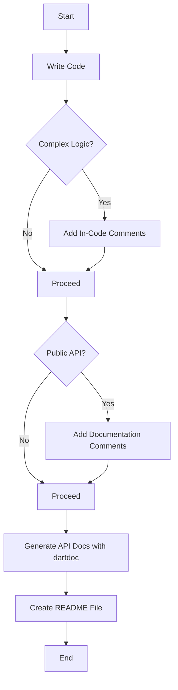

## 17.3 Documentation and Commenting

In the realm of software development, documentation and commenting are not just supplementary tasks; they are integral to the lifecycle of any project. For Dart and Flutter developers, mastering these skills can significantly enhance code readability, maintainability, and collaboration. This section delves into the best practices for documentation and commenting, focusing on in-code documentation, API documentation, and crafting effective README files.

### In-Code Documentation

In-code documentation refers to the comments and annotations within the source code that explain complex logic, clarify intent, and provide context. While code should ideally be self-explanatory, comments are invaluable for elucidating non-obvious aspects.

#### The Importance of In-Code Comments

1. **Clarifying Complex Logic**: Use comments to explain intricate algorithms or non-intuitive code segments.
2. **Providing Context**: Describe why a particular approach was chosen, especially if it deviates from the norm.
3. **Facilitating Maintenance**: Assist future developers (or your future self) in understanding and modifying the code.
4. **Enhancing Collaboration**: Improve team communication by making the codebase more accessible to all team members.

#### Best Practices for In-Code Comments

- **Be Concise and Clear**: Avoid verbose comments. Aim for clarity and brevity.
- **Use Comments Sparingly**: Over-commenting can clutter the code. Comment only when necessary.
- **Keep Comments Updated**: Ensure comments reflect the current state of the code. Outdated comments can be misleading.
- **Use TODOs and FIXMEs**: Mark areas that require attention or improvement with TODO or FIXME tags.

#### Types of In-Code Comments

1. **Single-Line Comments**: Use for brief explanations or notes.
   ```dart
   // Calculate the factorial of a number
   int factorial(int n) {
     if (n <= 1) return 1;
     return n * factorial(n - 1);
   }
   ```

2. **Multi-Line Comments**: Use for detailed explanations or documentation blocks.
   ```dart
   /*
    * This function calculates the factorial of a number using recursion.
    * It returns 1 if the input is less than or equal to 1.
    */
   ```

3. **Documentation Comments**: Use for generating API documentation with `dartdoc`.
   ```dart
   /// Calculates the factorial of a number.
   ///
   /// Returns 1 if the input is less than or equal to 1.
   int factorial(int n) {
     if (n <= 1) return 1;
     return n * factorial(n - 1);
   }
   ```

### API Documentation

API documentation is essential for any public-facing code, providing users with the necessary information to understand and utilize the API effectively. In Dart, `dartdoc` is the standard tool for generating API documentation.

#### Generating API Documentation with `dartdoc`

`dartdoc` is a command-line tool that generates HTML documentation from Dart source code. It parses documentation comments and produces a comprehensive API reference.

##### Steps to Generate API Documentation

1. **Write Documentation Comments**: Use triple-slash `///` comments to document classes, methods, and properties.
   ```dart
   /// A simple calculator class.
   class Calculator {
     /// Adds two numbers and returns the result.
     int add(int a, int b) => a + b;
   }
   ```

2. **Run `dartdoc`**: Execute the `dartdoc` command in the terminal.
   ```bash
   dartdoc
   ```

3. **View the Documentation**: Open the generated HTML files in a web browser to view the documentation.

##### Best Practices for API Documentation

- **Document Public APIs**: Focus on documenting public classes, methods, and properties.
- **Use Clear and Descriptive Language**: Ensure that the documentation is easy to understand.
- **Include Examples**: Provide code examples to demonstrate usage.
- **Keep Documentation Updated**: Regularly update the documentation to reflect changes in the API.

#### Example of API Documentation

```dart
/// A class representing a bank account.
class BankAccount {
  /// The current balance of the account.
  double balance;

  /// Creates a bank account with an initial balance.
  ///
  /// The [initialBalance] must be non-negative.
  BankAccount(double initialBalance) : balance = initialBalance;

  /// Deposits an amount into the account.
  ///
  /// The [amount] must be positive.
  void deposit(double amount) {
    if (amount > 0) {
      balance += amount;
    }
  }

  /// Withdraws an amount from the account.
  ///
  /// The [amount] must be positive and less than or equal to the current balance.
  void withdraw(double amount) {
    if (amount > 0 && amount <= balance) {
      balance -= amount;
    }
  }
}
```

### README Files

A README file is the first point of contact for anyone exploring a project. It provides an overview, installation instructions, usage examples, and other relevant information.

#### Crafting an Effective README

1. **Project Overview**: Briefly describe the project's purpose and features.
2. **Installation Instructions**: Provide step-by-step instructions for setting up the project.
3. **Usage Examples**: Include examples to demonstrate how to use the project.
4. **Contributing Guidelines**: Outline how others can contribute to the project.
5. **License Information**: Specify the project's license.

#### Example of a README File

```markdown

A simple Flutter application that demonstrates the use of design patterns.

## Features

- Singleton pattern for managing app state
- Factory pattern for creating widgets
- Observer pattern for state management

## Installation

1. Clone the repository:
   ```bash
   git clone https://github.com/username/my_flutter_app.git
   ```

2. Navigate to the project directory:
   ```bash
   cd my_flutter_app
   ```

3. Install dependencies:
   ```bash
   flutter pub get
   ```

4. Run the app:
   ```bash
   flutter run
   ```

## Usage

To use the app, simply run it on a connected device or emulator. Explore the various screens to see the design patterns in action.

## Contributing

Contributions are welcome! Please open an issue or submit a pull request.

## License

This project is licensed under the MIT License.
```

### Visualizing Documentation Practices

To better understand the flow of documentation practices, let's visualize the process using a Mermaid.js flowchart.



### Try It Yourself

To reinforce your understanding, try modifying the code examples provided:

- **Add Comments**: Add comments to the `BankAccount` class to explain the logic in the `deposit` and `withdraw` methods.
- **Generate API Documentation**: Use `dartdoc` to generate documentation for a simple Dart project.
- **Create a README**: Write a README file for a personal project, including all the essential sections.

### Knowledge Check

Before we conclude, let's review some key points:

- **What is the purpose of in-code comments?**
- **How do you generate API documentation in Dart?**
- **What are the essential sections of a README file?**

### Embrace the Journey

Remember, documentation and commenting are ongoing processes. As you continue to develop in Dart and Flutter, keep refining your documentation skills. They are crucial for creating maintainable and collaborative codebases. Keep experimenting, stay curious, and enjoy the journey!

## Quiz Time!



### What is the primary purpose of in-code comments?

- [x] To clarify complex logic and provide context
- [ ] To replace code documentation
- [ ] To increase code length
- [ ] To make code execution faster

> **Explanation:** In-code comments are primarily used to clarify complex logic and provide context, making the code more understandable and maintainable.


### Which tool is used to generate API documentation in Dart?

- [x] dartdoc
- [ ] Javadoc
- [ ] Doxygen
- [ ] Swagger

> **Explanation:** `dartdoc` is the standard tool used in Dart to generate API documentation from source code.


### What should a README file include?

- [x] Project overview, installation instructions, usage examples
- [ ] Only the project name
- [ ] Source code
- [ ] License information only

> **Explanation:** A README file should include a project overview, installation instructions, usage examples, and other relevant information.


### What type of comments are used for generating API documentation in Dart?

- [x] Documentation comments (///)
- [ ] Single-line comments (//)
- [ ] Multi-line comments (/* */)
- [ ] Inline comments

> **Explanation:** Documentation comments (///) are used in Dart for generating API documentation with `dartdoc`.


### Which of the following is a best practice for in-code comments?

- [x] Be concise and clear
- [ ] Use comments to replace code
- [ ] Over-comment every line
- [ ] Avoid using comments

> **Explanation:** It is a best practice to be concise and clear with in-code comments, ensuring they add value without cluttering the code.


### What is the role of TODO comments?

- [x] To mark areas that require attention or improvement
- [ ] To document completed tasks
- [ ] To replace documentation comments
- [ ] To increase code readability

> **Explanation:** TODO comments are used to mark areas in the code that require attention or improvement.


### How can you ensure that comments remain useful over time?

- [x] Keep comments updated with code changes
- [ ] Write comments in a different language
- [ ] Use comments to describe every line of code
- [ ] Avoid using comments

> **Explanation:** Keeping comments updated with code changes ensures they remain useful and accurate over time.


### What is the benefit of including examples in API documentation?

- [x] To demonstrate usage and improve understanding
- [ ] To increase the length of the documentation
- [ ] To replace in-code comments
- [ ] To make the documentation more complex

> **Explanation:** Including examples in API documentation helps demonstrate usage and improve understanding for users.


### Which section is NOT typically included in a README file?

- [x] Source code
- [ ] Project overview
- [ ] Installation instructions
- [ ] Usage examples

> **Explanation:** Source code is not typically included in a README file; instead, it provides an overview and instructions.


### True or False: Over-commenting can clutter the code.

- [x] True
- [ ] False

> **Explanation:** True. Over-commenting can clutter the code and make it harder to read, so comments should be used judiciously.


