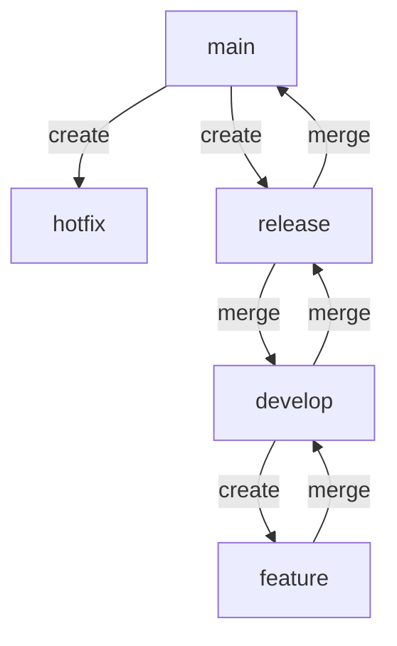
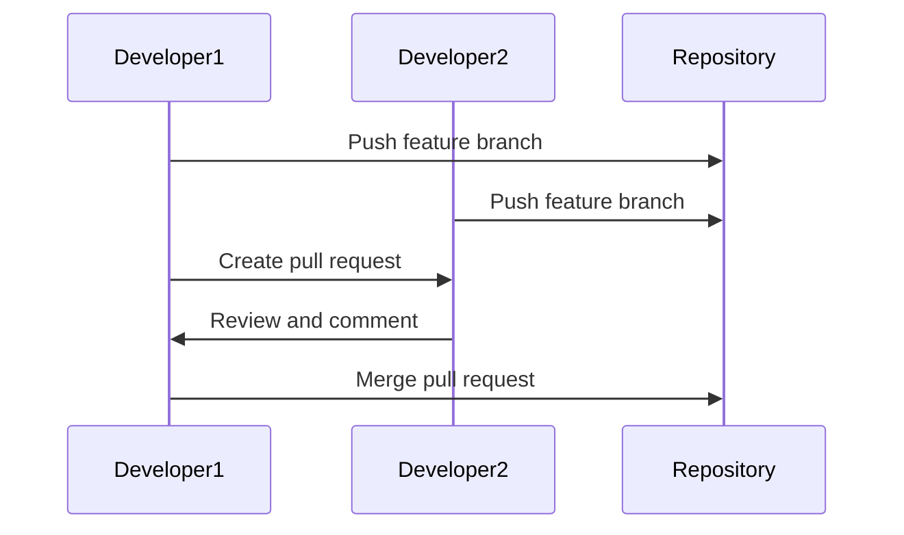

## 17.4 Version Control and Collaboration

In the realm of software development, version control and collaboration are pivotal to ensuring efficient workflows, maintaining code quality, and fostering teamwork. As Dart and Flutter developers, mastering these aspects can significantly enhance your development process. In this section, we will delve into the intricacies of using Git effectively, explore various branching strategies, and understand the importance of code reviews.

### Using Git Effectively

Git is a distributed version control system that allows developers to track changes in their codebase, collaborate with others, and manage project history. It is an essential tool for any developer, and understanding how to use it effectively can greatly improve your workflow.

#### Committing Changes Frequently with Meaningful Messages

One of the fundamental practices in using Git is committing changes frequently. This approach ensures that your work is saved incrementally, reducing the risk of losing progress. Moreover, it allows you to track the evolution of your codebase over time.

**Best Practices for Committing:**

1. **Commit Often**: Make small, frequent commits to capture incremental changes. This practice helps in isolating issues and understanding the development history.

2. **Write Meaningful Commit Messages**: A good commit message should be concise yet descriptive. It should explain the "what" and "why" of the changes. For example:

   ```bash
   git commit -m "Fix bug in user authentication flow"
   ```

3. **Use the Imperative Mood**: Write commit messages in the imperative mood, as if giving an order. This style is consistent with Git's default message for merges.

4. **Separate Subject from Body**: If a commit message requires more detail, separate the subject line from the body with a blank line. The subject should be a brief summary, while the body can provide additional context.

5. **Reference Issues or Tasks**: If your project uses an issue tracker, reference the relevant issue or task in the commit message. This practice helps in linking code changes to specific tasks or bug reports.

#### Code Example: Committing Changes

```bash
git add .

git commit -m "Implement new feature for user profile customization"

git push origin main
```

### Branching Strategies

Branching is a powerful feature in Git that allows developers to work on different features or fixes simultaneously without affecting the main codebase. Employing an effective branching strategy is crucial for organized development.

#### Git Flow

Git Flow is a popular branching strategy that provides a structured workflow for managing feature development, releases, and hotfixes. It involves the following branches:

1. **Main Branch**: The main branch (often called `main` or `master`) contains the production-ready code. It should always be stable.

2. **Develop Branch**: The `develop` branch serves as the integration branch for features. It is where the latest development changes are merged before being released.

3. **Feature Branches**: Feature branches are created from the `develop` branch to work on new features. Once a feature is complete, it is merged back into `develop`.

4. **Release Branches**: Release branches are created from `develop` when preparing for a new release. They allow for final testing and bug fixes before merging into `main`.

5. **Hotfix Branches**: Hotfix branches are created from `main` to address critical issues in production. Once fixed, they are merged back into both `main` and `develop`.

**Visualizing Git Flow**



#### Other Branching Strategies

- **GitHub Flow**: A simpler alternative to Git Flow, GitHub Flow involves a single `main` branch and short-lived feature branches. It is suitable for projects with continuous deployment.

- **GitLab Flow**: Combines elements of Git Flow and GitHub Flow, with an emphasis on environment-based branches (e.g., `staging`, `production`).

### Code Reviews

Code reviews are an integral part of maintaining code quality and fostering collaboration. They involve examining code changes made by others to ensure they meet the project's standards and requirements.

#### Benefits of Code Reviews

1. **Improved Code Quality**: Code reviews help identify bugs, inconsistencies, and potential improvements, leading to higher-quality code.

2. **Knowledge Sharing**: Reviewing code exposes team members to different parts of the codebase, promoting knowledge sharing and collective ownership.

3. **Consistency**: Code reviews enforce coding standards and best practices, ensuring consistency across the codebase.

4. **Mentorship**: Junior developers can learn from more experienced team members through feedback and discussions during code reviews.

#### Conducting Effective Code Reviews

1. **Set Clear Guidelines**: Establish clear guidelines for what should be reviewed, such as coding standards, design patterns, and performance considerations.

2. **Use Pull Requests**: Utilize pull requests to facilitate code reviews. They provide a platform for discussion and feedback before changes are merged.

3. **Focus on the Code, Not the Developer**: Provide constructive feedback that focuses on the code itself, rather than the individual who wrote it.

4. **Be Respectful and Supportive**: Encourage a positive and respectful tone in code reviews. Highlight good practices and offer suggestions for improvement.

5. **Limit the Scope**: Avoid reviewing large changes all at once. Break them down into smaller, manageable parts to ensure thorough reviews.

### Code Example: Creating a Pull Request

```bash
git checkout -b feature/new-feature

git add .
git commit -m "Add new feature for enhanced user experience"

git push origin feature/new-feature

```

### Try It Yourself

To solidify your understanding, try the following exercises:

1. **Create a Git Repository**: Initialize a new Git repository and practice committing changes with meaningful messages.

2. **Experiment with Branching**: Implement a simple Git Flow by creating feature, release, and hotfix branches. Merge them back into the main and develop branches.

3. **Conduct a Code Review**: Pair up with a colleague and review each other's code changes. Provide constructive feedback and discuss improvements.

### Visualizing Collaboration Workflow



### References and Links

- [Git Documentation](https://git-scm.com/doc)
- [Git Flow](https://nvie.com/posts/a-successful-git-branching-model/)
- [GitHub Flow](https://guides.github.com/introduction/flow/)
- [Code Review Best Practices](https://www.atlassian.com/agile/software-development/code-reviews)

### Knowledge Check

- What are the benefits of committing changes frequently in Git?
- How does Git Flow help in managing feature development and releases?
- What are the key elements of an effective code review?

### Embrace the Journey

Remember, mastering version control and collaboration is an ongoing journey. As you continue to develop your skills, you'll find new ways to enhance your workflow and improve your code quality. Keep experimenting, stay curious, and enjoy the process!

## Quiz Time!



### What is the primary purpose of using Git in software development?

- [x] To track changes in the codebase and facilitate collaboration
- [ ] To compile and run code
- [ ] To design user interfaces
- [ ] To manage server configurations

> **Explanation:** Git is a version control system used to track changes in the codebase and facilitate collaboration among developers.

### Which of the following is a benefit of committing changes frequently in Git?

- [x] It reduces the risk of losing progress
- [ ] It makes the codebase larger
- [ ] It complicates the development process
- [ ] It decreases code readability

> **Explanation:** Committing changes frequently reduces the risk of losing progress and helps in tracking the evolution of the codebase.

### What is the main branch in Git Flow used for?

- [x] Containing production-ready code
- [ ] Developing new features
- [ ] Testing experimental changes
- [ ] Storing backup files

> **Explanation:** The main branch in Git Flow contains production-ready code and should always be stable.

### What is a key benefit of conducting code reviews?

- [x] Improved code quality
- [ ] Slower development process
- [ ] Increased code complexity
- [ ] Reduced team collaboration

> **Explanation:** Code reviews help identify bugs and inconsistencies, leading to improved code quality.

### Which branching strategy is known for its simplicity and continuous deployment focus?

- [x] GitHub Flow
- [ ] Git Flow
- [ ] GitLab Flow
- [ ] Feature Branching

> **Explanation:** GitHub Flow is known for its simplicity and focus on continuous deployment.

### What should a good commit message include?

- [x] A concise yet descriptive explanation of the changes
- [ ] A detailed history of the project
- [ ] Personal opinions about the code
- [ ] Random text

> **Explanation:** A good commit message should be concise yet descriptive, explaining the changes made.

### In Git Flow, where are feature branches typically merged?

- [x] Into the develop branch
- [ ] Into the main branch
- [ ] Into the release branch
- [ ] Into the hotfix branch

> **Explanation:** In Git Flow, feature branches are typically merged into the develop branch.

### What is the purpose of a pull request in code reviews?

- [x] To facilitate discussion and feedback before merging changes
- [ ] To automatically merge changes
- [ ] To delete branches
- [ ] To compile code

> **Explanation:** A pull request facilitates discussion and feedback before changes are merged into the main codebase.

### True or False: Code reviews should focus on the developer rather than the code.

- [ ] True
- [x] False

> **Explanation:** Code reviews should focus on the code itself, not the individual who wrote it.

### What is a common practice when referencing issues in commit messages?

- [x] Including the issue or task number
- [ ] Writing in all caps
- [ ] Using emojis
- [ ] Including personal anecdotes

> **Explanation:** Including the issue or task number in commit messages helps link code changes to specific tasks or bug reports.




