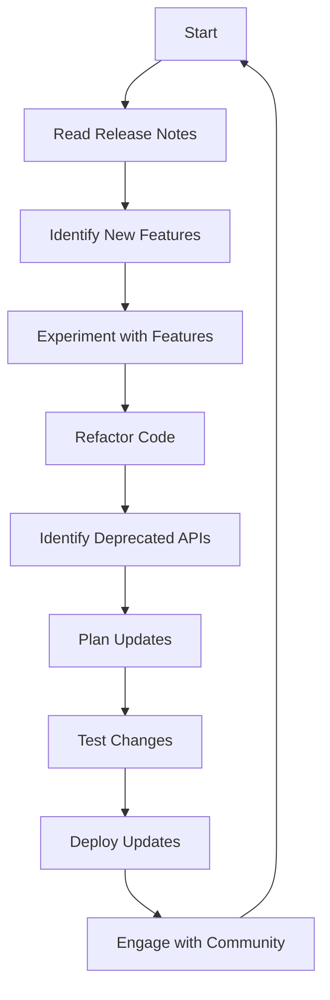

## 17.5 Keeping Up with Language and SDK Updates

In the fast-paced world of software development, staying updated with the latest language and SDK updates is crucial for maintaining a competitive edge and ensuring that your applications are efficient, secure, and feature-rich. This section will guide you through the best practices for keeping up with Dart and Flutter updates, utilizing new features, handling deprecations, and engaging with the community.

### Staying Informed

#### Following Dart and Flutter Release Notes

Release notes are the primary source of information about new features, bug fixes, and deprecations in Dart and Flutter. They provide detailed insights into what has changed and how these changes might affect your projects.

- **Dart Release Notes**: The Dart team regularly publishes release notes that detail updates to the language, libraries, and tools. These notes are available on the [Dart website](https://dart.dev/guides/whats-new).
- **Flutter Release Notes**: Similarly, the Flutter team provides comprehensive release notes for each new version. You can find these on the [Flutter website](https://flutter.dev/docs/release-notes).

#### Engaging with the Community

The Dart and Flutter communities are vibrant and active, offering a wealth of resources and support.

- **Forums and Discussion Groups**: Platforms like [Stack Overflow](https://stackoverflow.com/questions/tagged/flutter) and the [Flutter Community Slack](https://fluttercommunity.slack.com/) are excellent places to ask questions, share knowledge, and stay informed about the latest developments.
- **Social Media**: Follow the official Dart and Flutter accounts on Twitter and other social media platforms for real-time updates and announcements.
- **Meetups and Conferences**: Attend events such as Flutter Engage and DartConf to network with other developers and learn from industry experts.

### Utilizing New Features

#### Incorporating Language Enhancements

New language features can significantly enhance your code's readability, performance, and maintainability. Here are some strategies for incorporating these enhancements:

- **Experiment with New Features**: Use experimental branches in your version control system to test new features without affecting your main codebase.
- **Refactor Code**: Gradually refactor your existing code to take advantage of new language features. This can improve code quality and reduce technical debt.
- **Stay Updated with Best Practices**: Follow official documentation and community blogs to learn about best practices for using new features.

#### Code Example: Using Null Safety

Null safety is a significant feature in Dart that helps prevent null reference errors. Here's a simple example of how to use null safety in your code:

```dart
void main() {
  String? name; // Nullable variable
  name = 'Dart';
  print(name.length); // Safe access
}
```

In this example, the `String?` type indicates that the variable `name` can be null. The Dart compiler ensures that you handle null values safely, reducing runtime errors.

### Deprecation Handling

#### Updating Codebases

Deprecations are a natural part of software evolution. They signal that certain features or APIs will be removed in future releases, giving developers time to transition to newer alternatives.

- **Identify Deprecated APIs**: Use tools like the Dart analyzer to identify deprecated APIs in your codebase.
- **Plan for Updates**: Create a timeline for updating your code to replace deprecated APIs. This ensures a smooth transition and minimizes disruptions.
- **Test Thoroughly**: After making changes, thoroughly test your application to ensure that everything works as expected.

#### Code Example: Replacing Deprecated APIs

Suppose a certain API method is deprecated in a new Dart release. Here's how you might update your code:

```dart
// Old API usage
var list = List<int>();
list.add(1);

// Updated API usage
var list = <int>[];
list.add(1);
```

In this example, the old way of creating a list using `List<int>()` is replaced with the new, preferred syntax `<int>[]`.

### Visualizing the Update Process

To better understand the process of keeping up with updates, let's visualize it using a flowchart.



**Description**: This flowchart illustrates the cyclical process of staying updated with Dart and Flutter. It begins with reading release notes, experimenting with new features, refactoring code, handling deprecations, and engaging with the community.

### References and Links

- [Dart Language Updates](https://dart.dev/guides/whats-new)
- [Flutter Release Notes](https://flutter.dev/docs/release-notes)
- [Stack Overflow - Flutter](https://stackoverflow.com/questions/tagged/flutter)
- [Flutter Community Slack](https://fluttercommunity.slack.com/)

### Knowledge Check

- **Question**: What are the benefits of using null safety in Dart?
- **Exercise**: Update a small Dart project to replace deprecated APIs with their newer alternatives.

### Embrace the Journey

Remember, keeping up with language and SDK updates is an ongoing journey. As you progress, you'll become more adept at integrating new features and handling deprecations. Stay curious, engage with the community, and enjoy the process of continuous learning and improvement.

### Formatting and Structure

- **Organize your update process** with clear steps and timelines.
- **Use bullet points** to list deprecated APIs and their replacements.
- **Highlight important updates** using bold text for emphasis.

### Writing Style

- **Use first-person plural** to create a collaborative feel.
- **Avoid jargon** unless it's been previously introduced and explained.
- **Define acronyms** upon first use.

## Quiz Time!



### What is the primary source of information about new features in Dart and Flutter?

- [x] Release Notes
- [ ] Social Media
- [ ] Community Forums
- [ ] Conferences

> **Explanation:** Release notes provide detailed insights into new features, bug fixes, and deprecations.

### How can you safely access a nullable variable in Dart?

- [x] Use null safety features
- [ ] Ignore null values
- [ ] Use deprecated APIs
- [ ] Avoid using nullable variables

> **Explanation:** Null safety features in Dart help prevent null reference errors by ensuring safe access to nullable variables.

### What is the purpose of deprecations in software development?

- [x] To signal that certain features or APIs will be removed
- [ ] To introduce new features
- [ ] To improve performance
- [ ] To increase code complexity

> **Explanation:** Deprecations indicate that certain features or APIs will be removed in future releases, allowing developers to transition to newer alternatives.

### Which tool can help identify deprecated APIs in your codebase?

- [x] Dart analyzer
- [ ] Flutter inspector
- [ ] Code editor
- [ ] Version control system

> **Explanation:** The Dart analyzer can identify deprecated APIs in your codebase, helping you plan for updates.

### What is a recommended strategy for incorporating new language features?

- [x] Experiment with new features in experimental branches
- [ ] Immediately update the main codebase
- [ ] Avoid using new features
- [ ] Wait for community feedback

> **Explanation:** Using experimental branches allows you to test new features without affecting your main codebase.

### How can you engage with the Dart and Flutter communities?

- [x] Participate in forums and discussion groups
- [ ] Avoid social media
- [ ] Ignore community events
- [ ] Focus solely on official documentation

> **Explanation:** Engaging with forums and discussion groups provides valuable insights and support from the community.

### What is the benefit of attending meetups and conferences?

- [x] Networking with other developers and learning from experts
- [ ] Avoiding new updates
- [ ] Focusing on deprecated features
- [ ] Ignoring community feedback

> **Explanation:** Meetups and conferences offer opportunities to network with other developers and learn from industry experts.

### What should you do after updating your code to replace deprecated APIs?

- [x] Thoroughly test your application
- [ ] Ignore testing
- [ ] Immediately deploy updates
- [ ] Avoid further changes

> **Explanation:** Thorough testing ensures that everything works as expected after making changes to replace deprecated APIs.

### How can you stay updated with best practices for using new features?

- [x] Follow official documentation and community blogs
- [ ] Ignore new features
- [ ] Focus on deprecated APIs
- [ ] Avoid community engagement

> **Explanation:** Official documentation and community blogs provide valuable insights into best practices for using new features.

### True or False: Keeping up with language and SDK updates is a one-time task.

- [ ] True
- [x] False

> **Explanation:** Keeping up with updates is an ongoing journey that requires continuous learning and engagement with the community.


