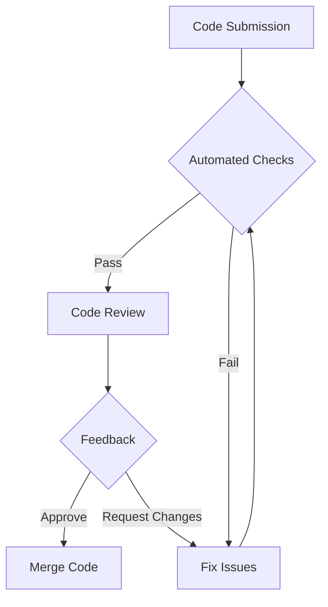

## 17.6 Code Reviews and Continuous Improvement

In the realm of software development, particularly when working with Dart and Flutter, code reviews are an indispensable part of the development process. They not only ensure code quality and consistency but also foster a culture of continuous learning and improvement. In this section, we will delve into the intricacies of code reviews, explore the mechanisms for providing constructive feedback, and discuss the integration of automated checks to maintain high standards in your codebase.

### The Importance of Code Reviews

Code reviews serve multiple purposes in a development team. They are not just about finding bugs or enforcing coding standards; they are a vital tool for knowledge sharing, mentoring, and improving the overall quality of the software. Let's explore some key benefits:

- **Quality Assurance**: Code reviews help identify bugs and potential issues before they reach production, ensuring a more robust and reliable application.
- **Knowledge Sharing**: They provide an opportunity for team members to learn from each other, spreading knowledge about the codebase and best practices.
- **Consistency**: By enforcing coding standards and guidelines, code reviews ensure that the codebase remains consistent, making it easier to maintain and scale.
- **Mentorship**: Junior developers can gain insights and learn from the feedback provided by more experienced team members, fostering a culture of continuous learning.

### Establishing an Effective Review Process

To harness the full potential of code reviews, it's crucial to establish a structured and effective review process. Here are some steps to consider:

#### Define Clear Guidelines

Establish clear guidelines for code reviews that outline what reviewers should look for and how they should provide feedback. This includes:

- **Coding Standards**: Define and document coding standards specific to Dart and Flutter, covering naming conventions, file structure, and code formatting.
- **Review Scope**: Specify the scope of the review, such as focusing on logic, performance, security, or adherence to design patterns.
- **Feedback Protocol**: Encourage constructive feedback that is specific, actionable, and respectful. Avoid personal criticism and focus on the code.

#### Assign Roles and Responsibilities

Clearly define the roles and responsibilities of the participants in the code review process:

- **Author**: The developer who wrote the code and is responsible for addressing feedback.
- **Reviewer**: The team member(s) responsible for reviewing the code and providing feedback.
- **Moderator**: In larger teams, a moderator may oversee the process to ensure guidelines are followed and resolve any disputes.

#### Use Tools to Facilitate Reviews

Leverage tools that facilitate the code review process, such as:

- **Version Control Systems**: Use platforms like GitHub, GitLab, or Bitbucket to manage code reviews through pull requests or merge requests.
- **Code Review Tools**: Consider using dedicated code review tools that integrate with your version control system, providing features like inline comments and review summaries.

### Feedback Mechanism: Encouraging Constructive Feedback

Providing and receiving feedback is a critical aspect of code reviews. Here are some strategies to encourage constructive feedback:

#### Focus on the Code, Not the Coder

Ensure that feedback is directed at the code and not the individual. This helps maintain a positive and collaborative atmosphere.

#### Be Specific and Actionable

Provide specific examples of issues and suggest actionable improvements. For example, instead of saying "This code is inefficient," provide a suggestion like "Consider using a `Map` instead of a `List` for faster lookups."

#### Highlight Positives

Acknowledge well-written code and innovative solutions. Positive reinforcement can motivate developers and encourage best practices.

#### Encourage Dialogue

Promote open communication between the author and reviewer. Encourage authors to ask questions and seek clarification on feedback.

### Automated Checks: Integrating Linters and Formatters

Automated checks are an essential component of a robust code review process. They help enforce coding standards and catch common issues before the review begins. Here’s how to integrate them effectively:

#### Use Linters

Linters analyze your code for potential errors, style issues, and adherence to coding standards. In Dart, the `dart analyze` command can be used to run static analysis on your codebase. Configure it to enforce your team's coding standards.

```dart
// Example of a linting rule in analysis_options.yaml
linter:
  rules:
    - avoid_print
    - prefer_const_constructors
```

#### Implement Code Formatters

Code formatters automatically format your code according to predefined rules, ensuring consistency across the codebase. Dart provides the `dart format` command to format your code.

```bash
dart format .
```

#### Integrate with CI/CD Pipelines

Incorporate linters and formatters into your Continuous Integration/Continuous Deployment (CI/CD) pipelines. This ensures that code is automatically checked for issues before it is merged into the main branch.

```yaml
name: Dart CI

on: [push, pull_request]

jobs:
  build:
    runs-on: ubuntu-latest

    steps:
    - uses: actions/checkout@v2
    - name: Set up Dart
      uses: dart-lang/setup-dart@v1
      with:
        sdk: 'stable'
    - name: Analyze
      run: dart analyze
    - name: Format
      run: dart format --set-exit-if-changed .
```

### Continuous Improvement: Beyond Code Reviews

Code reviews are just one part of a broader strategy for continuous improvement. Here are some additional practices to consider:

#### Conduct Retrospectives

Regularly hold retrospectives to reflect on the code review process and identify areas for improvement. Encourage team members to share their experiences and suggest enhancements.

#### Invest in Training

Provide ongoing training and resources for your team to stay updated on the latest best practices, tools, and technologies in Dart and Flutter development.

#### Foster a Culture of Learning

Encourage a culture where team members are motivated to learn and improve continuously. This can be achieved through knowledge-sharing sessions, workshops, and mentorship programs.

### Visualizing the Code Review Process

To better understand the code review process, let's visualize it using a flowchart:



**Figure 1**: This flowchart illustrates the typical code review process, starting from code submission, through automated checks, to the review and feedback stages.

### Try It Yourself

To solidify your understanding of code reviews and continuous improvement, try the following exercises:

1. **Set Up a Linter**: Configure a linter for a Dart project and experiment with different rules. Observe how it helps maintain code quality.
2. **Conduct a Code Review**: Pair up with a colleague and conduct a code review. Focus on providing constructive feedback and discussing improvements.
3. **Automate Checks**: Integrate automated checks into a CI/CD pipeline for a Flutter project. Test how it enforces coding standards.

### Knowledge Check

Before we conclude, let's summarize the key takeaways:

- Code reviews are essential for ensuring code quality, consistency, and knowledge sharing.
- Establishing clear guidelines and roles is crucial for an effective review process.
- Constructive feedback should be specific, actionable, and focused on the code.
- Automated checks with linters and formatters help enforce coding standards.
- Continuous improvement involves retrospectives, training, and fostering a learning culture.

Remember, mastering code reviews and continuous improvement is a journey. As you progress, you'll refine your processes and contribute to a more efficient and collaborative development environment. Keep experimenting, stay curious, and enjoy the journey!

## Quiz Time!



### What is a primary benefit of code reviews?

- [x] They ensure code quality and consistency.
- [ ] They replace the need for automated testing.
- [ ] They eliminate the need for documentation.
- [ ] They are only useful for junior developers.

> **Explanation:** Code reviews help ensure code quality and consistency across the codebase.

### What should feedback in code reviews focus on?

- [x] The code, not the coder.
- [ ] The coder's personal style.
- [ ] The coder's experience level.
- [ ] The coder's past mistakes.

> **Explanation:** Feedback should focus on the code itself, not the individual who wrote it.

### What is the role of a linter in the code review process?

- [x] To analyze code for potential errors and style issues.
- [ ] To automatically merge code changes.
- [ ] To replace manual code reviews.
- [ ] To generate documentation.

> **Explanation:** Linters analyze code for potential errors and style issues, helping maintain coding standards.

### How can automated checks be integrated into the development process?

- [x] By incorporating them into CI/CD pipelines.
- [ ] By running them manually after each code change.
- [ ] By using them only in production environments.
- [ ] By applying them only to new projects.

> **Explanation:** Automated checks can be integrated into CI/CD pipelines to ensure code quality before merging.

### What is a key component of continuous improvement?

- [x] Conducting regular retrospectives.
- [ ] Avoiding feedback from peers.
- [ ] Ignoring coding standards.
- [ ] Focusing solely on new features.

> **Explanation:** Regular retrospectives help identify areas for improvement and foster continuous learning.

### What is the purpose of a code review tool?

- [x] To facilitate the code review process with features like inline comments.
- [ ] To automatically fix code issues.
- [ ] To replace the need for version control systems.
- [ ] To generate code documentation.

> **Explanation:** Code review tools facilitate the review process by providing features like inline comments and review summaries.

### How can positive reinforcement be used in code reviews?

- [x] By acknowledging well-written code and innovative solutions.
- [ ] By ignoring good practices.
- [ ] By focusing only on negative feedback.
- [ ] By avoiding any form of feedback.

> **Explanation:** Positive reinforcement motivates developers and encourages best practices by acknowledging well-written code.

### What should be included in a feedback protocol?

- [x] Guidelines for providing specific, actionable, and respectful feedback.
- [ ] Instructions to avoid giving feedback.
- [ ] A focus on personal criticism.
- [ ] A requirement to approve all code changes.

> **Explanation:** A feedback protocol should include guidelines for providing specific, actionable, and respectful feedback.

### What is the role of a moderator in the code review process?

- [x] To oversee the process and resolve disputes.
- [ ] To write all the code.
- [ ] To avoid participating in reviews.
- [ ] To merge code without review.

> **Explanation:** A moderator oversees the code review process and resolves any disputes that may arise.

### True or False: Automated checks can replace the need for manual code reviews.

- [ ] True
- [x] False

> **Explanation:** Automated checks complement manual code reviews but cannot replace the need for human judgment and feedback.


