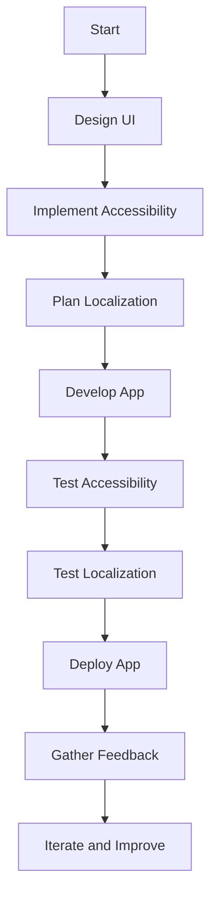

## 17.7 Accessibility and Localization

In the realm of mobile app development, creating applications that are both accessible and localized is not just a best practice but a necessity. Accessibility ensures that your app can be used by people with disabilities, while localization makes your app usable by people across different languages and cultures. In this section, we will delve into the principles of inclusive design, explore how to implement accessibility (often abbreviated as A11y), and discuss strategies for supporting multiple languages in Flutter applications.

### Introduction to Inclusive Design

Inclusive design is a design philosophy that aims to create products that are usable by as many people as possible, regardless of their abilities or disabilities. This approach not only benefits users with disabilities but also enhances the overall user experience for everyone.

#### Key Principles of Inclusive Design

1. **Equitable Use**: Ensure that your app is useful and marketable to people with diverse abilities.
2. **Flexibility in Use**: Accommodate a wide range of individual preferences and abilities.
3. **Simple and Intuitive Use**: Make the design easy to understand, regardless of the user's experience, knowledge, language skills, or concentration level.
4. **Perceptible Information**: Communicate necessary information effectively to the user, regardless of ambient conditions or the user's sensory abilities.
5. **Tolerance for Error**: Minimize hazards and the adverse consequences of accidental or unintended actions.
6. **Low Physical Effort**: Allow efficient and comfortable use with a minimum of fatigue.
7. **Size and Space for Approach and Use**: Provide appropriate size and space for approach, reach, manipulation, and use regardless of the user's body size, posture, or mobility.

### Implementing Accessibility (A11y) in Flutter

Accessibility in Flutter involves using semantic widgets, proper labeling, and ensuring that your app can be navigated using assistive technologies like screen readers. Let's explore how to implement these features effectively.

#### Using Semantic Widgets

Semantic widgets in Flutter are designed to convey meaning to assistive technologies. They help screen readers understand the structure and purpose of your app's UI components.

```dart
import 'package:flutter/material.dart';

class AccessibleButton extends StatelessWidget {
  @override
  Widget build(BuildContext context) {
    return Semantics(
      label: 'Submit Button',
      hint: 'Double tap to submit the form',
      child: ElevatedButton(
        onPressed: () {
          // Handle button press
        },
        child: Text('Submit'),
      ),
    );
  }
}
```

In the example above, the `Semantics` widget provides a label and hint for the button, which can be read by screen readers.

#### Proper Labeling

Proper labeling ensures that all interactive elements in your app are accessible. This includes buttons, text fields, and images.

```dart
import 'package:flutter/material.dart';

class AccessibleImage extends StatelessWidget {
  @override
  Widget build(BuildContext context) {
    return Semantics(
      label: 'A beautiful sunset over the mountains',
      child: Image.asset('assets/sunset.jpg'),
    );
  }
}
```

By providing a semantic label for the image, users with visual impairments can understand the content of the image through a screen reader.

#### Navigating with Assistive Technologies

Ensure that your app can be navigated using assistive technologies. This involves setting the correct focus order and providing keyboard shortcuts where applicable.

```dart
import 'package:flutter/material.dart';

class AccessibleForm extends StatelessWidget {
  @override
  Widget build(BuildContext context) {
    return FocusTraversalGroup(
      policy: OrderedTraversalPolicy(),
      child: Column(
        children: [
          TextField(
            decoration: InputDecoration(labelText: 'Name'),
          ),
          TextField(
            decoration: InputDecoration(labelText: 'Email'),
          ),
          ElevatedButton(
            onPressed: () {
              // Submit form
            },
            child: Text('Submit'),
          ),
        ],
      ),
    );
  }
}
```

The `FocusTraversalGroup` widget ensures that the focus order is logical and intuitive, making it easier for users to navigate the form using a keyboard or other assistive devices.

### Supporting Multiple Languages: Localization and Internationalization

Localization (L10n) and internationalization (i18n) are processes that allow your app to support multiple languages and cultural norms. Flutter provides robust support for these processes, making it easier to create apps that can reach a global audience.

#### Planning for Localization from the Start

To effectively localize your app, it's crucial to plan for localization from the beginning of the development process. This involves separating the app's content from its code and using resource files to store translatable text.

#### Using the `intl` Package

The `intl` package is a powerful tool for internationalization in Flutter. It provides support for formatting dates, numbers, and currencies according to different locales.

```yaml
dependencies:
  flutter:
    sdk: flutter
  intl: ^0.17.0
```

Add the `intl` package to your `pubspec.yaml` file to get started.

#### Defining Localized Strings

Create a separate file to store all translatable strings. This file can be a JSON, YAML, or ARB file.

```json
{
  "title": "Welcome",
  "greeting": "Hello, {name}!"
}
```

#### Loading Localized Strings

Use the `intl` package to load and use localized strings in your app.

```dart
import 'package:flutter/material.dart';
import 'package:intl/intl.dart';

class LocalizedGreeting extends StatelessWidget {
  final String name;

  LocalizedGreeting({required this.name});

  @override
  Widget build(BuildContext context) {
    return Text(Intl.message(
      'Hello, $name!',
      name: 'greeting',
      args: [name],
      desc: 'Greeting message',
    ));
  }
}
```

In this example, the `Intl.message` function is used to load and display a localized greeting message.

#### Switching Locales

Allow users to switch between different locales in your app. This can be done by updating the `Locale` property of the `MaterialApp` widget.

```dart
import 'package:flutter/material.dart';

class MyApp extends StatelessWidget {
  @override
  Widget build(BuildContext context) {
    return MaterialApp(
      locale: Locale('en', 'US'),
      supportedLocales: [
        Locale('en', 'US'),
        Locale('es', 'ES'),
      ],
      localizationsDelegates: [
        // Add localization delegates
      ],
      home: HomeScreen(),
    );
  }
}
```

By specifying the `supportedLocales` property, you can define the locales that your app supports.

### Visualizing Accessibility and Localization

To better understand the relationship between accessibility and localization, let's visualize the process using a flowchart.



This flowchart illustrates the iterative process of designing, developing, and improving an accessible and localized app.

### Best Practices for Accessibility and Localization

1. **Test with Real Users**: Conduct usability testing with people who have disabilities to identify accessibility issues.
2. **Use Automated Tools**: Utilize tools like Flutter's accessibility scanner to detect potential accessibility problems.
3. **Stay Updated**: Keep up with the latest accessibility guidelines and localization standards.
4. **Provide Language Options**: Allow users to choose their preferred language and locale.
5. **Consider Cultural Differences**: Be mindful of cultural differences when designing UI elements and writing content.

### Try It Yourself

Experiment with the code examples provided in this section. Try adding semantic labels to different widgets, implement localization for additional languages, and test your app's accessibility using a screen reader.

### Knowledge Check

- What is the purpose of the `Semantics` widget in Flutter?
- How can you ensure that your app is navigable using assistive technologies?
- What is the role of the `intl` package in Flutter localization?
- How can you allow users to switch between different locales in your app?

### Embrace the Journey

Remember, creating accessible and localized apps is an ongoing process. As you continue to develop your skills, you'll find new ways to make your apps more inclusive and reach a broader audience. Keep experimenting, stay curious, and enjoy the journey!

## Quiz Time!



### What is the primary goal of inclusive design?

- [x] To create products usable by as many people as possible, regardless of abilities
- [ ] To focus solely on users with disabilities
- [ ] To prioritize aesthetics over functionality
- [ ] To ensure only compliance with legal standards

> **Explanation:** Inclusive design aims to make products usable by a wide range of people, enhancing the overall user experience.

### Which widget in Flutter helps convey meaning to assistive technologies?

- [x] Semantics
- [ ] Container
- [ ] Row
- [ ] Column

> **Explanation:** The `Semantics` widget is used to provide information to assistive technologies like screen readers.

### What is the purpose of the `intl` package in Flutter?

- [x] To support internationalization and localization
- [ ] To enhance app performance
- [ ] To provide additional UI components
- [ ] To manage app state

> **Explanation:** The `intl` package is used for internationalization, helping format dates, numbers, and strings according to different locales.

### How can you allow users to switch between different locales in a Flutter app?

- [x] By updating the `Locale` property of the `MaterialApp` widget
- [ ] By using a different package manager
- [ ] By changing the app's theme
- [ ] By modifying the app's build configuration

> **Explanation:** The `Locale` property of the `MaterialApp` widget can be updated to switch between different locales.

### What is a key principle of inclusive design?

- [x] Equitable Use
- [ ] Complex Navigation
- [ ] High Physical Effort
- [ ] Exclusive Content

> **Explanation:** Equitable Use ensures that the app is useful to people with diverse abilities.

### What does the `FocusTraversalGroup` widget help with?

- [x] Ensuring logical focus order for navigation
- [ ] Styling text
- [ ] Animating widgets
- [ ] Managing app state

> **Explanation:** The `FocusTraversalGroup` widget helps manage the focus order, making navigation easier for users with assistive devices.

### Why is it important to plan for localization from the start?

- [x] To separate content from code and use resource files for translatable text
- [ ] To avoid using any third-party libraries
- [ ] To ensure the app is only available in one language
- [ ] To reduce development time

> **Explanation:** Planning for localization from the start helps manage translatable content efficiently.

### What is a benefit of using semantic labels for images?

- [x] They help users with visual impairments understand image content
- [ ] They improve image loading speed
- [ ] They enhance image resolution
- [ ] They reduce app size

> **Explanation:** Semantic labels provide descriptions that assistive technologies can read, aiding users with visual impairments.

### Which of the following is NOT a best practice for accessibility?

- [ ] Test with real users
- [ ] Use automated tools
- [ ] Stay updated with guidelines
- [x] Ignore cultural differences

> **Explanation:** Considering cultural differences is important for both accessibility and localization.

### True or False: Localization only involves translating text into different languages.

- [ ] True
- [x] False

> **Explanation:** Localization also involves adapting the app to different cultural norms and preferences, not just translating text.


