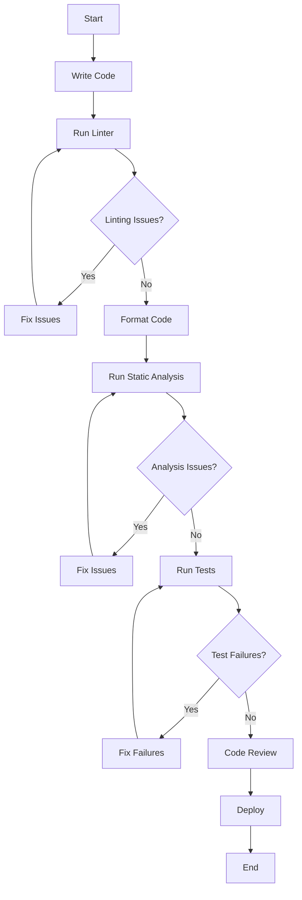

## 17.8 Maintaining Code Quality

In the realm of software development, maintaining high code quality is paramount. It ensures that your codebase is not only functional but also maintainable, scalable, and efficient. In this section, we will delve into the best practices for maintaining code quality in Dart and Flutter applications. We will explore the use of linting, formatting, and static analysis tools, and how they can help you write clean, error-free code.

### Introduction to Code Quality

Code quality refers to the degree to which code adheres to a set of standards and best practices. High-quality code is easy to understand, modify, and extend. It is also less prone to bugs and easier to test. In the context of Dart and Flutter development, maintaining code quality is crucial for building robust and scalable applications.

### The Importance of Code Quality

Maintaining code quality is essential for several reasons:

- **Readability**: High-quality code is easy to read and understand, making it easier for developers to collaborate and contribute to the codebase.
- **Maintainability**: Code that adheres to best practices is easier to maintain and extend, reducing the cost and effort required for future development.
- **Scalability**: High-quality code is more scalable, allowing applications to grow and evolve without becoming unmanageable.
- **Bug Reduction**: By following best practices, developers can reduce the number of bugs and errors in the code, leading to more stable and reliable applications.

### Linting in Dart and Flutter

Linting is the process of running a program that analyzes code for potential errors and stylistic issues. In Dart and Flutter development, linting is an essential practice for maintaining code quality.

#### Using `flutter analyze`

The `flutter analyze` command is a powerful tool for linting Flutter applications. It checks your code for potential issues and provides suggestions for improvement.

```bash
flutter analyze
```

This command will analyze your entire Flutter project and report any issues it finds. It checks for a wide range of issues, including syntax errors, unused imports, and potential bugs.

#### Configuring Lint Rules

Dart and Flutter projects can be configured with custom lint rules to enforce specific coding standards. This is done by creating an `analysis_options.yaml` file in the root of your project.

```yaml
include: package:flutter_lints/flutter.yaml

linter:
  rules:
    - avoid_print
    - prefer_const_constructors
    - unnecessary_null_checks
```

In this file, you can specify which lint rules to enable or disable. The `flutter_lints` package provides a set of recommended lint rules for Flutter projects.

#### Benefits of Linting

- **Consistency**: Linting enforces a consistent coding style across the codebase, making it easier for developers to read and understand the code.
- **Error Detection**: Linting helps catch potential errors early in the development process, reducing the likelihood of bugs in production.
- **Best Practices**: Linting encourages the use of best practices, leading to higher-quality code.

### Formatting Code with `dartfmt`

Consistent code formatting is another crucial aspect of maintaining code quality. The Dart formatter, `dartfmt`, is a tool that automatically formats your Dart code according to a set of predefined rules.

#### Using `dartfmt`

To format your Dart code, you can use the `dartfmt` command:

```bash
dartfmt -w .
```

This command will format all Dart files in the current directory and its subdirectories. The `-w` flag tells `dartfmt` to overwrite the files with the formatted code.

#### Benefits of Code Formatting

- **Readability**: Consistent formatting makes code easier to read and understand, reducing cognitive load for developers.
- **Collaboration**: When all developers follow the same formatting rules, it becomes easier to collaborate and review each other's code.
- **Focus on Logic**: Automated formatting allows developers to focus on writing logic rather than worrying about code style.

### Static Analysis in Dart

Static analysis involves examining code without executing it to find potential errors and improve code quality. Dart provides several tools for static analysis, including the Dart analyzer and third-party plugins.

#### Dart Analyzer

The Dart analyzer is a built-in tool that performs static analysis on Dart code. It checks for a wide range of issues, including type errors, unused variables, and potential bugs.

```bash
dart analyze
```

This command will analyze your Dart code and report any issues it finds. The Dart analyzer is highly configurable, allowing you to customize the analysis to suit your project's needs.

#### Third-Party Static Analysis Tools

In addition to the Dart analyzer, there are several third-party tools available for static analysis in Dart and Flutter projects. These tools provide additional features and integrations, such as:

- **SonarQube**: A popular tool for continuous inspection of code quality, providing detailed reports and metrics.
- **Codacy**: An automated code review tool that integrates with your CI/CD pipeline to ensure code quality.

#### Benefits of Static Analysis

- **Early Detection**: Static analysis helps catch potential issues early in the development process, reducing the likelihood of bugs in production.
- **Code Quality Metrics**: Static analysis tools provide metrics and reports that help developers understand and improve code quality.
- **Continuous Integration**: Integrating static analysis into your CI/CD pipeline ensures that code quality is maintained throughout the development lifecycle.

### Best Practices for Maintaining Code Quality

Maintaining code quality requires a combination of tools, processes, and practices. Here are some best practices to follow:

#### Code Reviews

Conduct regular code reviews to ensure that code adheres to best practices and meets quality standards. Code reviews provide an opportunity for developers to learn from each other and improve their skills.

#### Automated Testing

Implement automated testing to ensure that code behaves as expected and to catch potential issues early. Automated tests should cover a wide range of scenarios, including unit tests, integration tests, and end-to-end tests.

#### Continuous Integration and Delivery

Set up a continuous integration and delivery (CI/CD) pipeline to automate the process of building, testing, and deploying code. CI/CD pipelines help ensure that code quality is maintained throughout the development lifecycle.

#### Documentation

Maintain comprehensive documentation to help developers understand the codebase and its architecture. Documentation should include code comments, API documentation, and architectural diagrams.

#### Refactoring

Regularly refactor code to improve its structure and readability. Refactoring helps eliminate technical debt and ensures that code remains maintainable and scalable.

### Try It Yourself

To practice maintaining code quality in your Dart and Flutter projects, try the following exercises:

1. **Set Up Linting**: Configure linting in your Flutter project using the `flutter_lints` package. Experiment with different lint rules and observe how they affect your code.

2. **Format Code**: Use `dartfmt` to format your Dart code. Try modifying the formatting rules and see how they impact the readability of your code.

3. **Perform Static Analysis**: Run the Dart analyzer on your codebase and fix any issues it reports. Experiment with different analysis options and observe how they affect the results.

4. **Conduct a Code Review**: Pair up with another developer and conduct a code review. Provide feedback on code quality and suggest improvements.

5. **Automate Testing**: Set up automated tests for your Flutter project. Experiment with different testing frameworks and observe how they help catch potential issues.

### Visualizing Code Quality Processes

To better understand the processes involved in maintaining code quality, let's visualize the workflow using a flowchart.



**Figure 1: Code Quality Workflow**

This flowchart illustrates the typical workflow for maintaining code quality in a Dart and Flutter project. It highlights the importance of running linters, formatting code, performing static analysis, and conducting code reviews.

### Conclusion

Maintaining code quality is a continuous process that requires diligence and attention to detail. By using tools like `flutter analyze`, `dartfmt`, and the Dart analyzer, you can ensure that your codebase remains clean, maintainable, and scalable. Remember, high-quality code is the foundation of successful software development. Keep experimenting, stay curious, and enjoy the journey!

## Quiz Time!



### What is the primary purpose of linting in Dart and Flutter development?

- [x] To detect potential errors and enforce coding standards
- [ ] To compile the code into machine language
- [ ] To optimize the performance of the application
- [ ] To deploy the application to production

> **Explanation:** Linting is used to detect potential errors and enforce coding standards, ensuring code quality.

### Which command is used to format Dart code?

- [x] `dartfmt`
- [ ] `flutter build`
- [ ] `dart compile`
- [ ] `flutter run`

> **Explanation:** The `dartfmt` command is used to automatically format Dart code according to predefined rules.

### What is the role of static analysis in code quality?

- [x] To examine code without executing it to find potential errors
- [ ] To execute code and measure its performance
- [ ] To compile code into an executable format
- [ ] To deploy code to a server

> **Explanation:** Static analysis examines code without executing it to find potential errors and improve code quality.

### What is the benefit of using automated testing in maintaining code quality?

- [x] It ensures code behaves as expected and catches potential issues early
- [ ] It increases the speed of code execution
- [ ] It reduces the size of the codebase
- [ ] It automatically deploys the application

> **Explanation:** Automated testing ensures code behaves as expected and helps catch potential issues early in the development process.

### Which tool is commonly used for continuous inspection of code quality?

- [x] SonarQube
- [ ] GitHub
- [ ] Docker
- [ ] Jenkins

> **Explanation:** SonarQube is a popular tool for continuous inspection of code quality, providing detailed reports and metrics.

### What is the purpose of the `analysis_options.yaml` file in a Dart project?

- [x] To configure custom lint rules
- [ ] To store application secrets
- [ ] To define database connections
- [ ] To manage user authentication

> **Explanation:** The `analysis_options.yaml` file is used to configure custom lint rules in a Dart project.

### How does code formatting improve collaboration among developers?

- [x] By ensuring all developers follow the same formatting rules
- [ ] By reducing the number of lines of code
- [ ] By increasing the execution speed of the code
- [ ] By automatically deploying the code

> **Explanation:** Code formatting ensures all developers follow the same formatting rules, making it easier to collaborate and review each other's code.

### What is the benefit of integrating static analysis into a CI/CD pipeline?

- [x] It ensures code quality is maintained throughout the development lifecycle
- [ ] It increases the speed of code execution
- [ ] It reduces the size of the codebase
- [ ] It automatically deploys the application

> **Explanation:** Integrating static analysis into a CI/CD pipeline ensures that code quality is maintained throughout the development lifecycle.

### Why is documentation important for maintaining code quality?

- [x] It helps developers understand the codebase and its architecture
- [ ] It increases the execution speed of the code
- [ ] It reduces the number of lines of code
- [ ] It automatically deploys the application

> **Explanation:** Documentation helps developers understand the codebase and its architecture, making it easier to maintain and extend.

### True or False: Refactoring is only necessary when there are bugs in the code.

- [ ] True
- [x] False

> **Explanation:** Refactoring is necessary to improve code structure and readability, even if there are no bugs in the code.


