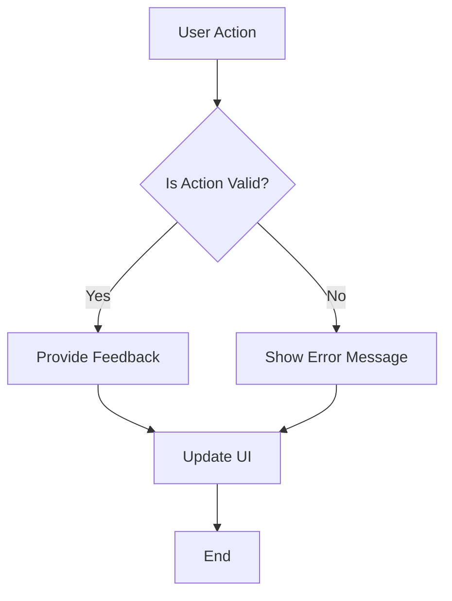
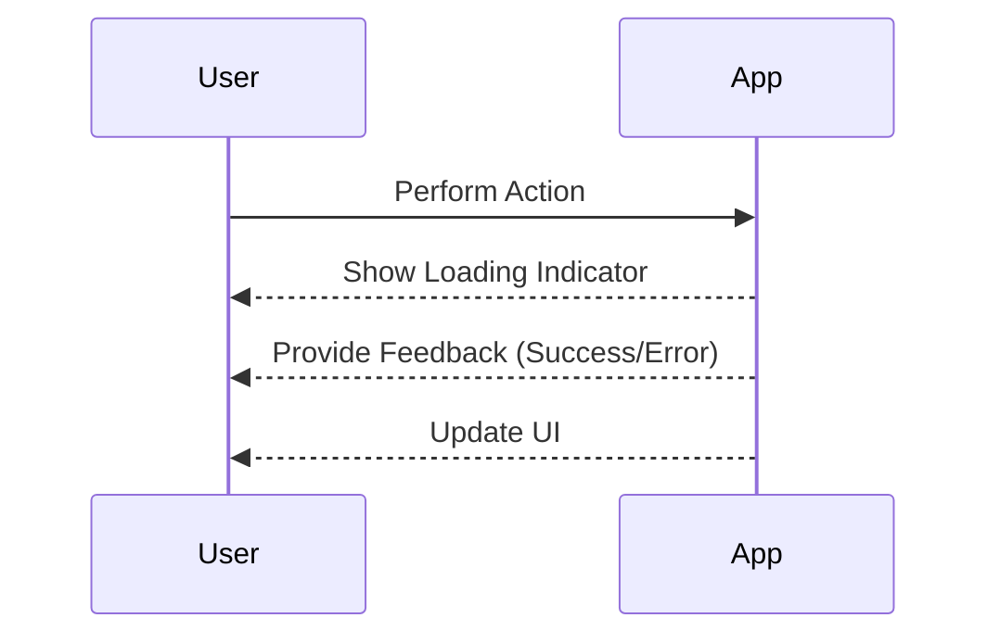

## 17.9 User Experience Considerations

In the realm of Flutter development, user experience (UX) is paramount. A well-designed application not only meets functional requirements but also delights users with its performance, intuitiveness, and responsiveness. This section delves into the critical aspects of UX in Flutter, focusing on performance optimization, intuitive design, and feedback mechanisms. By mastering these elements, developers can create applications that are not only functional but also engaging and user-friendly.

### Performance Optimization

Performance is a cornerstone of user experience. Users expect applications to be fast and responsive, with smooth animations and interactions. In Flutter, achieving optimal performance involves several strategies and best practices.

#### Ensuring Smooth Animations and Interactions

Animations play a vital role in enhancing user experience by providing visual feedback and making transitions feel natural. However, poorly optimized animations can lead to a sluggish experience. Here are some strategies to ensure smooth animations:

1. **Use the Right Widgets**: Flutter provides a rich set of widgets specifically designed for animations, such as `AnimatedContainer`, `AnimatedOpacity`, and `AnimatedPositioned`. These widgets are optimized for performance and should be used whenever possible.

2. **Leverage the `AnimationController`**: For more complex animations, use the `AnimationController` class. It provides fine-grained control over animations, allowing you to specify duration, curve, and more.

3. **Optimize Frame Rate**: Aim for a consistent 60 frames per second (FPS) to ensure smooth animations. Use the `PerformanceOverlay` widget to monitor frame rates and identify bottlenecks.

4. **Minimize Rebuilds**: Excessive widget rebuilds can degrade performance. Use the `const` keyword for widgets that do not change, and leverage the `shouldRebuild` method in `StatefulWidget` to control when a widget should be rebuilt.

5. **Profile and Debug**: Use Flutter's profiling tools, such as the `DevTools` suite, to identify performance issues. The `Flutter Inspector` can help visualize widget trees and diagnose layout issues.

```dart
// Example of using AnimatedContainer for smooth animations
class SmoothAnimationExample extends StatefulWidget {
  @override
  _SmoothAnimationExampleState createState() => _SmoothAnimationExampleState();
}

class _SmoothAnimationExampleState extends State<SmoothAnimationExample> {
  bool _isExpanded = false;

  @override
  Widget build(BuildContext context) {
    return GestureDetector(
      onTap: () {
        setState(() {
          _isExpanded = !_isExpanded;
        });
      },
      child: AnimatedContainer(
        duration: Duration(milliseconds: 300),
        curve: Curves.easeInOut,
        width: _isExpanded ? 200.0 : 100.0,
        height: _isExpanded ? 200.0 : 100.0,
        color: _isExpanded ? Colors.blue : Colors.red,
        child: Center(child: Text('Tap me')),
      ),
    );
  }
}
```

**Try It Yourself**: Modify the `duration` and `curve` properties to see how they affect the animation's smoothness. Experiment with different colors and sizes to create your unique animation.

#### Efficient Use of Isolates

Flutter's single-threaded nature can lead to performance bottlenecks, especially when performing heavy computations. Isolates provide a way to run Dart code in parallel, offloading work from the main thread.

- **Create Isolates for Heavy Tasks**: Use isolates for tasks like data parsing, image processing, or network requests that can block the UI thread.
- **Communicate with Isolates**: Use `ReceivePort` and `SendPort` to communicate between the main thread and isolates.

```dart
// Example of using Isolates for heavy computation
import 'dart:async';
import 'dart:isolate';

void heavyComputation(SendPort sendPort) {
  // Simulate heavy computation
  int result = 0;
  for (int i = 0; i < 1000000000; i++) {
    result += i;
  }
  sendPort.send(result);
}

void main() async {
  ReceivePort receivePort = ReceivePort();
  await Isolate.spawn(heavyComputation, receivePort.sendPort);

  receivePort.listen((message) {
    print('Result from isolate: $message');
    receivePort.close();
  });
}
```

**Try It Yourself**: Modify the computation logic to perform different tasks, such as calculating Fibonacci numbers or processing large datasets.

### Intuitive Design

An intuitive design aligns with user expectations and platform conventions, making applications easy to use and navigate. Here are key considerations for achieving intuitive design in Flutter applications:

#### Aligning with Platform Conventions

Users are accustomed to specific design patterns and interactions on different platforms. Aligning with these conventions enhances usability and reduces the learning curve.

- **Use Platform-Specific Widgets**: Flutter provides `Cupertino` widgets for iOS and `Material` widgets for Android. Use these widgets to create a native look and feel.

- **Follow Design Guidelines**: Adhere to platform-specific design guidelines, such as Apple's Human Interface Guidelines and Google's Material Design. These guidelines provide best practices for layout, typography, and interactions.

- **Consistent Navigation**: Use consistent navigation patterns, such as bottom navigation bars or side drawers, to help users easily find their way around the application.

```dart
// Example of using Cupertino widgets for iOS
import 'package:flutter/cupertino.dart';

class CupertinoExample extends StatelessWidget {
  @override
  Widget build(BuildContext context) {
    return CupertinoPageScaffold(
      navigationBar: CupertinoNavigationBar(
        middle: Text('Cupertino Example'),
      ),
      child: Center(
        child: CupertinoButton(
          child: Text('Press Me'),
          onPressed: () {
            print('Button Pressed');
          },
        ),
      ),
    );
  }
}
```

**Try It Yourself**: Switch between `Cupertino` and `Material` widgets to see how the application adapts to different platforms. Experiment with different navigation patterns to find what works best for your application.

#### Simplifying User Interactions

Simplifying user interactions involves reducing cognitive load and making tasks straightforward.

- **Minimize Input Requirements**: Reduce the number of inputs required from users. Use defaults, auto-fill, and smart suggestions to streamline data entry.

- **Provide Clear Instructions**: Use concise and clear instructions to guide users through tasks. Tooltips and helper texts can provide additional context.

- **Design for Accessibility**: Ensure your application is accessible to all users, including those with disabilities. Use semantic widgets, provide alternative text for images, and ensure sufficient color contrast.

```dart
// Example of simplifying user input with TextField
class SimplifiedInputExample extends StatelessWidget {
  @override
  Widget build(BuildContext context) {
    return Scaffold(
      appBar: AppBar(title: Text('Simplified Input')),
      body: Padding(
        padding: const EdgeInsets.all(16.0),
        child: TextField(
          decoration: InputDecoration(
            labelText: 'Enter your name',
            helperText: 'Please enter your full name',
            border: OutlineInputBorder(),
          ),
        ),
      ),
    );
  }
}
```

**Try It Yourself**: Add validation logic to the `TextField` to ensure the input meets specific criteria. Experiment with different input types, such as email or phone number, to see how they affect user interaction.

### Feedback Mechanisms

Feedback mechanisms provide users with meaningful responses to their actions, enhancing the overall user experience. Here are some strategies for implementing effective feedback mechanisms:

#### Providing Meaningful Responses to User Actions

Feedback can be visual, auditory, or haptic, and it should be timely and relevant.

- **Use Snackbars and Toasts**: Provide brief messages to inform users of the outcome of their actions. Use `SnackBar` for Material design and `CupertinoActionSheet` for iOS.

- **Implement Loading Indicators**: Use loading indicators to inform users that a process is ongoing. Use `CircularProgressIndicator` for indefinite processes and `LinearProgressIndicator` for determinate processes.

- **Provide Error Messages**: Display clear and concise error messages when something goes wrong. Use dialogs or inline messages to inform users of the issue and how to resolve it.

```dart
// Example of using SnackBar for feedback
class FeedbackExample extends StatelessWidget {
  @override
  Widget build(BuildContext context) {
    return Scaffold(
      appBar: AppBar(title: Text('Feedback Example')),
      body: Center(
        child: ElevatedButton(
          onPressed: () {
            ScaffoldMessenger.of(context).showSnackBar(
              SnackBar(content: Text('Action completed successfully!')),
            );
          },
          child: Text('Perform Action'),
        ),
      ),
    );
  }
}
```

**Try It Yourself**: Modify the `SnackBar` message to provide different types of feedback, such as success, error, or warning. Experiment with different feedback mechanisms, such as dialogs or notifications, to see how they affect user experience.

#### Enhancing User Engagement

Engagement is a key aspect of user experience. Engaged users are more likely to continue using the application and recommend it to others.

- **Personalize User Experience**: Use user data to personalize the experience. Display personalized content, recommendations, or greetings based on user preferences.

- **Implement Gamification Elements**: Use gamification techniques, such as badges, leaderboards, or challenges, to motivate users and increase engagement.

- **Encourage User Feedback**: Provide channels for users to give feedback, such as surveys or feedback forms. Use this feedback to improve the application and address user concerns.

```dart
// Example of personalizing user experience
class PersonalizedGreeting extends StatelessWidget {
  final String userName;

  PersonalizedGreeting({required this.userName});

  @override
  Widget build(BuildContext context) {
    return Scaffold(
      appBar: AppBar(title: Text('Personalized Greeting')),
      body: Center(
        child: Text('Welcome back, $userName!',
            style: TextStyle(fontSize: 24)),
      ),
    );
  }
}
```

**Try It Yourself**: Implement a simple form to collect user preferences and use this data to personalize the application. Experiment with different personalization techniques to see how they affect user engagement.

### Visualizing User Experience Concepts

To better understand the flow of user experience considerations, let's visualize some of these concepts using Mermaid.js diagrams.

#### Visualizing the User Interaction Flow



**Diagram Description**: This flowchart illustrates the process of handling user actions. It starts with a user action, checks if the action is valid, provides feedback, updates the UI, and ends the process.

#### Visualizing the Feedback Mechanism



**Diagram Description**: This sequence diagram shows the interaction between the user and the application when an action is performed. The application provides feedback through loading indicators and messages, and updates the UI accordingly.

### References and Links

For further reading on user experience considerations in Flutter development, consider the following resources:

- [Flutter Performance Best Practices](https://flutter.dev/docs/perf/best-practices)
- [Material Design Guidelines](https://material.io/design/)
- [Apple Human Interface Guidelines](https://developer.apple.com/design/human-interface-guidelines/)

### Knowledge Check

To reinforce your understanding of user experience considerations, consider the following questions:

1. What are some strategies for optimizing performance in Flutter applications?
2. How can you ensure your application aligns with platform conventions?
3. What are some effective feedback mechanisms for user actions?
4. How can personalization enhance user engagement?

### Embrace the Journey

Remember, creating an exceptional user experience is an ongoing journey. As you continue to develop your Flutter applications, keep experimenting with different design patterns, stay curious about new UX trends, and enjoy the process of crafting delightful user experiences.

## Quiz Time!



### What is the primary goal of performance optimization in Flutter applications?

- [x] Ensuring smooth animations and interactions
- [ ] Reducing code complexity
- [ ] Minimizing the number of widgets
- [ ] Increasing the number of features

> **Explanation:** Performance optimization focuses on ensuring smooth animations and interactions to enhance user experience.

### Which widget is specifically designed for animations in Flutter?

- [x] AnimatedContainer
- [ ] Container
- [ ] Column
- [ ] Row

> **Explanation:** `AnimatedContainer` is designed for animations, providing smooth transitions for properties like size, color, and alignment.

### How can isolates improve performance in Flutter applications?

- [x] By running Dart code in parallel
- [ ] By reducing the number of widgets
- [ ] By simplifying the UI
- [ ] By increasing the frame rate

> **Explanation:** Isolates allow Dart code to run in parallel, offloading heavy computations from the main thread and improving performance.

### What is the benefit of using platform-specific widgets in Flutter?

- [x] Aligning with platform conventions for usability
- [ ] Reducing code size
- [ ] Increasing the number of features
- [ ] Simplifying the UI

> **Explanation:** Platform-specific widgets align with platform conventions, enhancing usability and providing a native look and feel.

### Which of the following is a feedback mechanism in Flutter?

- [x] SnackBar
- [ ] Container
- [ ] ListView
- [ ] Column

> **Explanation:** `SnackBar` is a feedback mechanism used to provide brief messages to inform users of the outcome of their actions.

### How can personalization enhance user engagement?

- [x] By displaying personalized content and recommendations
- [ ] By reducing the number of features
- [ ] By simplifying the UI
- [ ] By increasing the frame rate

> **Explanation:** Personalization uses user data to display content and recommendations tailored to individual preferences, enhancing engagement.

### What is the purpose of using loading indicators in Flutter?

- [x] To inform users that a process is ongoing
- [ ] To reduce code complexity
- [ ] To increase the number of features
- [ ] To simplify the UI

> **Explanation:** Loading indicators inform users that a process is ongoing, providing visual feedback and improving user experience.

### How can you ensure your application is accessible to all users?

- [x] By using semantic widgets and ensuring sufficient color contrast
- [ ] By reducing the number of features
- [ ] By simplifying the UI
- [ ] By increasing the frame rate

> **Explanation:** Accessibility involves using semantic widgets, providing alternative text for images, and ensuring sufficient color contrast.

### What is the role of feedback mechanisms in user experience?

- [x] Providing meaningful responses to user actions
- [ ] Reducing code complexity
- [ ] Increasing the number of features
- [ ] Simplifying the UI

> **Explanation:** Feedback mechanisms provide meaningful responses to user actions, enhancing the overall user experience.

### True or False: Consistent navigation patterns help users easily find their way around the application.

- [x] True
- [ ] False

> **Explanation:** Consistent navigation patterns, such as bottom navigation bars or side drawers, help users easily find their way around the application.


