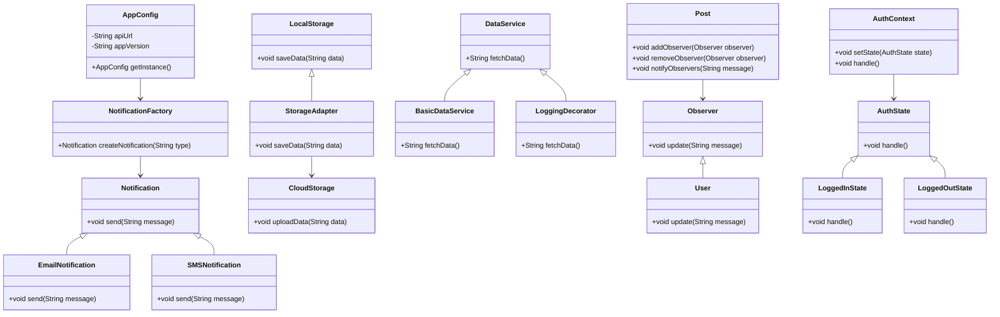

## 18.1 Building a Flutter Application Using Design Patterns

In this section, we will embark on a journey to build a comprehensive Flutter application by leveraging various design patterns. This case study will not only demonstrate the practical application of design patterns but also highlight how they can address common challenges in Flutter development. By the end of this guide, you will have a deeper understanding of how to structure your Flutter applications for maintainability, scalability, and performance.

### Project Overview

Our project is a feature-rich Flutter application that includes user authentication, data fetching, state management, and real-time updates. The app will serve as a social media platform where users can post updates, comment on posts, and receive notifications. We will explore how different design patterns can be applied to solve specific problems within this app.

### Pattern Application

#### Creational Patterns

**Singleton Pattern**

- **Intent**: Ensure a class has only one instance and provide a global point of access to it.
- **Application**: We will use the Singleton pattern to manage the app's configuration settings and user session data.

```dart
class AppConfig {
  static final AppConfig _instance = AppConfig._internal();

  factory AppConfig() {
    return _instance;
  }

  AppConfig._internal();

  String apiUrl = "https://api.example.com";
  String appVersion = "1.0.0";
}

// Usage
void main() {
  AppConfig config = AppConfig();
  print(config.apiUrl);
}
```

**Factory Method Pattern**

- **Intent**: Define an interface for creating an object, but let subclasses alter the type of objects that will be created.
- **Application**: We will use the Factory Method pattern to create different types of notifications (e.g., email, SMS, push).

```dart
abstract class Notification {
  void send(String message);
}

class EmailNotification implements Notification {
  @override
  void send(String message) {
    print("Sending email: $message");
  }
}

class SMSNotification implements Notification {
  @override
  void send(String message) {
    print("Sending SMS: $message");
  }
}

class NotificationFactory {
  static Notification createNotification(String type) {
    switch (type) {
      case 'email':
        return EmailNotification();
      case 'sms':
        return SMSNotification();
      default:
        throw Exception('Unknown notification type');
    }
  }
}

// Usage
void main() {
  Notification notification = NotificationFactory.createNotification('email');
  notification.send("Hello, World!");
}
```

#### Structural Patterns

**Adapter Pattern**

- **Intent**: Convert the interface of a class into another interface clients expect.
- **Application**: We will use the Adapter pattern to integrate third-party libraries for data storage.

```dart
class LocalStorage {
  void saveData(String data) {
    print("Saving data locally: $data");
  }
}

class CloudStorage {
  void uploadData(String data) {
    print("Uploading data to cloud: $data");
  }
}

class StorageAdapter implements LocalStorage {
  final CloudStorage cloudStorage;

  StorageAdapter(this.cloudStorage);

  @override
  void saveData(String data) {
    cloudStorage.uploadData(data);
  }
}

// Usage
void main() {
  CloudStorage cloudStorage = CloudStorage();
  LocalStorage storage = StorageAdapter(cloudStorage);
  storage.saveData("User data");
}
```

**Decorator Pattern**

- **Intent**: Attach additional responsibilities to an object dynamically.
- **Application**: We will use the Decorator pattern to add logging functionality to our data fetching service.

```dart
abstract class DataService {
  String fetchData();
}

class BasicDataService implements DataService {
  @override
  String fetchData() {
    return "Data from server";
  }
}

class LoggingDecorator implements DataService {
  final DataService dataService;

  LoggingDecorator(this.dataService);

  @override
  String fetchData() {
    String data = dataService.fetchData();
    print("Logging data: $data");
    return data;
  }
}

// Usage
void main() {
  DataService dataService = LoggingDecorator(BasicDataService());
  dataService.fetchData();
}
```

#### Behavioral Patterns

**Observer Pattern**

- **Intent**: Define a one-to-many dependency between objects so that when one object changes state, all its dependents are notified and updated automatically.
- **Application**: We will use the Observer pattern to implement real-time updates for user posts.

```dart
abstract class Observer {
  void update(String message);
}

class User implements Observer {
  final String name;

  User(this.name);

  @override
  void update(String message) {
    print("$name received update: $message");
  }
}

class Post {
  final List<Observer> _observers = [];

  void addObserver(Observer observer) {
    _observers.add(observer);
  }

  void removeObserver(Observer observer) {
    _observers.remove(observer);
  }

  void notifyObservers(String message) {
    for (var observer in _observers) {
      observer.update(message);
    }
  }
}

// Usage
void main() {
  Post post = Post();
  User user1 = User("Alice");
  User user2 = User("Bob");

  post.addObserver(user1);
  post.addObserver(user2);

  post.notifyObservers("New post available!");
}
```

**State Pattern**

- **Intent**: Allow an object to alter its behavior when its internal state changes. The object will appear to change its class.
- **Application**: We will use the State pattern to manage the authentication state of the user.

```dart
abstract class AuthState {
  void handle();
}

class LoggedInState implements AuthState {
  @override
  void handle() {
    print("User is logged in");
  }
}

class LoggedOutState implements AuthState {
  @override
  void handle() {
    print("User is logged out");
  }
}

class AuthContext {
  AuthState _state;

  AuthContext(this._state);

  void setState(AuthState state) {
    _state = state;
  }

  void handle() {
    _state.handle();
  }
}

// Usage
void main() {
  AuthContext authContext = AuthContext(LoggedOutState());
  authContext.handle();

  authContext.setState(LoggedInState());
  authContext.handle();
}
```

### Challenges and Solutions

#### Challenge 1: Managing Complex State

**Solution**: Implement the BLoC (Business Logic Component) pattern to separate business logic from UI components. This pattern helps manage complex state changes and ensures a clean separation of concerns.

```dart
import 'dart:async';

class CounterBloc {
  int _counter = 0;
  final _counterController = StreamController<int>();

  Stream<int> get counterStream => _counterController.stream;

  void increment() {
    _counter++;
    _counterController.sink.add(_counter);
  }

  void dispose() {
    _counterController.close();
  }
}

// Usage in Flutter Widget
class CounterWidget extends StatelessWidget {
  final CounterBloc bloc = CounterBloc();

  @override
  Widget build(BuildContext context) {
    return StreamBuilder<int>(
      stream: bloc.counterStream,
      builder: (context, snapshot) {
        return Column(
          children: [
            Text('Counter: ${snapshot.data}'),
            ElevatedButton(
              onPressed: bloc.increment,
              child: Text('Increment'),
            ),
          ],
        );
      },
    );
  }
}
```

#### Challenge 2: Ensuring Scalability

**Solution**: Use the Repository pattern to abstract data access and ensure scalability. This pattern allows us to switch data sources without affecting the rest of the application.

```dart
abstract class UserRepository {
  Future<String> fetchUserData();
}

class ApiUserRepository implements UserRepository {
  @override
  Future<String> fetchUserData() async {
    // Simulate network request
    await Future.delayed(Duration(seconds: 2));
    return "User data from API";
  }
}

class MockUserRepository implements UserRepository {
  @override
  Future<String> fetchUserData() async {
    return "Mock user data";
  }
}

// Usage
void main() async {
  UserRepository userRepository = ApiUserRepository();
  String data = await userRepository.fetchUserData();
  print(data);
}
```

#### Challenge 3: Handling Real-time Updates

**Solution**: Leverage the Observer pattern to handle real-time updates. This pattern allows us to notify multiple components of changes in data, ensuring that the UI remains in sync with the backend.

### Visualizing the Architecture

To better understand the architecture of our Flutter application and how design patterns fit into it, let's visualize the overall structure using a class diagram.



### Try It Yourself

Now that we've explored various design patterns and their applications, it's time to experiment with the code. Try modifying the code examples to suit different scenarios. For instance, you can:

- Implement additional notification types using the Factory Method pattern.
- Extend the Observer pattern to include more complex interactions.
- Experiment with different state management techniques using the State pattern.

### Knowledge Check

To reinforce your understanding, consider the following questions:

- How does the Singleton pattern ensure a single instance of a class?
- What are the benefits of using the Factory Method pattern?
- How can the Adapter pattern help integrate third-party libraries?
- In what scenarios would you use the Decorator pattern?
- How does the Observer pattern facilitate real-time updates?

### Embrace the Journey

Remember, this is just the beginning. As you progress, you'll build more complex and interactive Flutter applications. Keep experimenting, stay curious, and enjoy the journey!

## Quiz Time!



### What is the primary intent of the Singleton pattern?

- [x] Ensure a class has only one instance and provide a global point of access to it.
- [ ] Convert the interface of a class into another interface clients expect.
- [ ] Define an interface for creating an object, but let subclasses alter the type of objects that will be created.
- [ ] Attach additional responsibilities to an object dynamically.

> **Explanation:** The Singleton pattern ensures that a class has only one instance and provides a global point of access to it, which is crucial for managing shared resources like configuration settings.

### Which pattern is used to create different types of notifications in the example?

- [ ] Singleton Pattern
- [x] Factory Method Pattern
- [ ] Adapter Pattern
- [ ] Observer Pattern

> **Explanation:** The Factory Method pattern is used to create different types of notifications (e.g., email, SMS) by defining an interface for creating objects and allowing subclasses to alter the type of objects created.

### How does the Adapter pattern help in integrating third-party libraries?

- [x] By converting the interface of a class into another interface clients expect.
- [ ] By ensuring a class has only one instance.
- [ ] By defining an interface for creating an object.
- [ ] By attaching additional responsibilities to an object dynamically.

> **Explanation:** The Adapter pattern helps in integrating third-party libraries by converting the interface of a class into another interface that clients expect, allowing for compatibility between different systems.

### What is the purpose of the Decorator pattern?

- [ ] Ensure a class has only one instance.
- [ ] Convert the interface of a class into another interface clients expect.
- [x] Attach additional responsibilities to an object dynamically.
- [ ] Define an interface for creating an object.

> **Explanation:** The Decorator pattern is used to attach additional responsibilities to an object dynamically, providing a flexible alternative to subclassing for extending functionality.

### In the Observer pattern, what role does the `Post` class play?

- [x] It acts as the subject that notifies observers of changes.
- [ ] It acts as an observer that receives updates.
- [ ] It acts as a factory for creating observers.
- [ ] It acts as a decorator for adding functionality.

> **Explanation:** In the Observer pattern, the `Post` class acts as the subject that maintains a list of observers and notifies them of changes, ensuring that all observers are updated with the latest information.

### What is the benefit of using the State pattern for managing authentication state?

- [x] It allows an object to alter its behavior when its internal state changes.
- [ ] It ensures a class has only one instance.
- [ ] It converts the interface of a class into another interface clients expect.
- [ ] It attaches additional responsibilities to an object dynamically.

> **Explanation:** The State pattern allows an object to alter its behavior when its internal state changes, making it ideal for managing authentication states like logged in and logged out.

### How does the BLoC pattern help in managing complex state?

- [x] By separating business logic from UI components.
- [ ] By ensuring a class has only one instance.
- [ ] By converting the interface of a class into another interface clients expect.
- [ ] By attaching additional responsibilities to an object dynamically.

> **Explanation:** The BLoC pattern helps in managing complex state by separating business logic from UI components, ensuring a clean separation of concerns and making the application more maintainable.

### What is the role of the `AuthContext` class in the State pattern example?

- [x] It manages the current state and delegates behavior to the current state object.
- [ ] It acts as a factory for creating state objects.
- [ ] It acts as an observer that receives updates.
- [ ] It acts as a decorator for adding functionality.

> **Explanation:** In the State pattern example, the `AuthContext` class manages the current state and delegates behavior to the current state object, allowing for dynamic behavior changes based on the state.

### Which pattern would you use to switch data sources without affecting the rest of the application?

- [ ] Singleton Pattern
- [ ] Factory Method Pattern
- [x] Repository Pattern
- [ ] Observer Pattern

> **Explanation:** The Repository pattern abstracts data access and allows for switching data sources without affecting the rest of the application, ensuring scalability and flexibility.

### True or False: The Observer pattern is useful for implementing real-time updates in applications.

- [x] True
- [ ] False

> **Explanation:** True. The Observer pattern is useful for implementing real-time updates in applications by allowing multiple components to be notified of changes in data, ensuring that the UI remains in sync with the backend.


