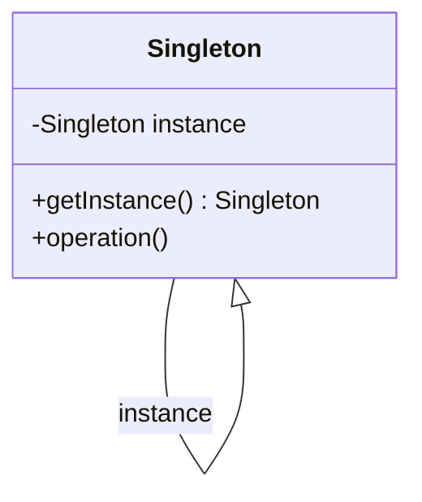
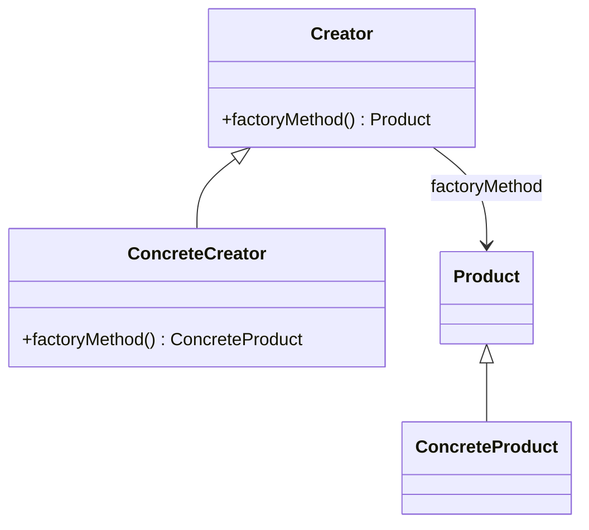

## 18.10 Code Examples and Sample Projects

In this section, we delve into the world of open source Dart and Flutter projects to see how design patterns are applied in real-world applications. By analyzing these projects, you can gain insights into best practices, learn from the community, and even contribute to the ongoing development of these projects. This is an excellent opportunity to enhance your development skills and understand the practical applications of design patterns in Dart and Flutter.

### Open Source Projects

Open source projects are a treasure trove of learning opportunities. They provide real-world examples of how developers solve problems using design patterns and best practices. By reviewing these projects, you can see how theoretical concepts are applied in practice.

#### 1. Flutter Gallery

**Overview:** The Flutter Gallery is a comprehensive showcase of Flutter's capabilities. It includes a wide range of widgets and demonstrates how to use them effectively.

**Key Design Patterns:**
- **Builder Pattern:** Used for constructing complex widgets.
- **Singleton Pattern:** Ensures a single instance of certain services.
- **Observer Pattern:** Implements reactive programming with streams.

**Code Example:**

```dart
class SingletonService {
  static final SingletonService _instance = SingletonService._internal();

  factory SingletonService() {
    return _instance;
  }

  SingletonService._internal();
  
  void performAction() {
    // Perform some action
  }
}
```

**Learning Points:**
- Understand how to manage state and dependencies in a large application.
- Explore the use of streams for reactive programming.

**Contribution Opportunities:**
- Add new widgets or improve existing ones.
- Enhance documentation and examples.

#### 2. Flutter Samples

**Overview:** Flutter Samples is a collection of open source samples that illustrate best practices for Flutter development.

**Key Design Patterns:**
- **Factory Method Pattern:** Used for creating instances of widgets.
- **Decorator Pattern:** Enhances widgets with additional functionality.

**Code Example:**

```dart
abstract class WidgetFactory {
  Widget createWidget();
}

class ButtonFactory extends WidgetFactory {
  @override
  Widget createWidget() {
    return ElevatedButton(
      onPressed: () {},
      child: Text('Button'),
    );
  }
}
```

**Learning Points:**
- Learn how to structure a Flutter project using design patterns.
- Understand the use of factory methods for widget creation.

**Contribution Opportunities:**
- Create new samples that demonstrate advanced Flutter features.
- Improve existing samples with updated best practices.

#### 3. Flutter Architecture Samples

**Overview:** This project demonstrates different architectural patterns for Flutter apps, such as BLoC, Redux, and Provider.

**Key Design Patterns:**
- **BLoC Pattern:** Manages state using streams and sinks.
- **Redux Pattern:** Implements a unidirectional data flow.
- **Provider Pattern:** Simplifies state management.

**Code Example:**

```dart
class CounterBloc {
  final _counterController = StreamController<int>();
  Stream<int> get counterStream => _counterController.stream;
  int _counter = 0;

  void increment() {
    _counter++;
    _counterController.sink.add(_counter);
  }

  void dispose() {
    _counterController.close();
  }
}
```

**Learning Points:**
- Compare different state management solutions and their trade-offs.
- Understand how to implement reactive programming in Flutter.

**Contribution Opportunities:**
- Add new architectural patterns or improve existing implementations.
- Provide detailed documentation and tutorials.

### Learning from Examples

Analyzing open source projects is an excellent way to learn how design patterns are applied in real code. Here are some tips for effectively learning from these examples:

1. **Read the Documentation:** Start by reading the project's documentation to understand its purpose and structure.

2. **Explore the Codebase:** Navigate through the codebase to see how different components interact and how design patterns are implemented.

3. **Identify Design Patterns:** Look for common design patterns and analyze how they solve specific problems.

4. **Experiment with the Code:** Modify the code to see how changes affect the application's behavior.

5. **Engage with the Community:** Join discussions, ask questions, and share your insights with the community.

### Contribution

Contributing to open source projects is a rewarding way to give back to the community and improve your skills. Here are some ways you can contribute:

1. **Fix Bugs:** Identify and fix bugs in the codebase.

2. **Add Features:** Implement new features or improve existing ones.

3. **Improve Documentation:** Enhance the project's documentation to make it more accessible to new contributors.

4. **Review Code:** Participate in code reviews to provide feedback and learn from others.

5. **Engage with the Community:** Join forums, mailing lists, and chat groups to discuss the project and share your knowledge.

### Try It Yourself

To truly master design patterns in Dart and Flutter, it's essential to practice by building your own projects. Here are some ideas to get you started:

1. **Build a To-Do App:** Implement a simple to-do app using different state management patterns like BLoC, Provider, and Redux.

2. **Create a Weather App:** Use the Factory Method and Singleton patterns to fetch and display weather data from an API.

3. **Develop a Chat Application:** Apply the Observer and Mediator patterns to manage real-time chat messages.

4. **Design a Game:** Use the Strategy and State patterns to manage game logic and state transitions.

5. **Contribute to Open Source:** Choose an open source project that interests you and start contributing.

### Visualizing Design Patterns

To enhance your understanding of design patterns, let's visualize some of the key concepts using Mermaid.js diagrams.

#### Singleton Pattern



**Description:** This diagram illustrates the Singleton pattern, where a single instance of a class is created and accessed globally.

#### Factory Method Pattern



**Description:** This diagram shows the Factory Method pattern, where a creator class defines a method for creating objects, allowing subclasses to alter the type of objects that will be created.

### Knowledge Check

To reinforce your understanding of design patterns in Dart and Flutter, try answering the following questions:

1. What is the purpose of the Singleton pattern, and how is it implemented in Dart?
2. How does the Factory Method pattern differ from the Abstract Factory pattern?
3. What are the benefits of using the BLoC pattern for state management in Flutter?
4. How can you contribute to an open source project, and what are the benefits of doing so?
5. What are some common design patterns used in Flutter applications, and how do they solve specific problems?

### Embrace the Journey

Remember, learning design patterns is a journey, not a destination. As you explore open source projects and build your own applications, you'll gain a deeper understanding of how to apply these patterns effectively. Keep experimenting, stay curious, and enjoy the process of becoming a more skilled Dart and Flutter developer.

## Quiz Time!



### What is the primary purpose of the Singleton pattern in Dart?

- [x] To ensure a class has only one instance and provide a global point of access to it.
- [ ] To create multiple instances of a class.
- [ ] To manage state across different components.
- [ ] To encapsulate a group of individual factories.

> **Explanation:** The Singleton pattern ensures that a class has only one instance and provides a global point of access to it, which is useful for managing shared resources or configurations.

### How does the Factory Method pattern differ from the Abstract Factory pattern?

- [x] Factory Method creates objects through inheritance, while Abstract Factory uses composition.
- [ ] Factory Method uses composition, while Abstract Factory uses inheritance.
- [ ] Both patterns are identical in their implementation.
- [ ] Factory Method is used for creating single objects, while Abstract Factory is used for creating families of related objects.

> **Explanation:** The Factory Method pattern relies on inheritance to create objects, allowing subclasses to alter the type of objects that will be created. In contrast, the Abstract Factory pattern uses composition to create families of related objects without specifying their concrete classes.

### What is a key benefit of using the BLoC pattern in Flutter?

- [x] It separates business logic from UI, making the code more maintainable and testable.
- [ ] It allows for direct manipulation of UI components.
- [ ] It eliminates the need for state management.
- [ ] It simplifies the creation of complex animations.

> **Explanation:** The BLoC pattern separates business logic from the UI, which enhances code maintainability and testability by keeping concerns separate.

### Which of the following is a way to contribute to an open source project?

- [x] Fixing bugs in the codebase.
- [ ] Keeping the project private.
- [ ] Avoiding community discussions.
- [ ] Ignoring documentation.

> **Explanation:** Contributing to open source projects can involve fixing bugs, adding features, improving documentation, and engaging with the community.

### What design pattern is commonly used for managing state in Flutter applications?

- [x] BLoC Pattern
- [ ] Singleton Pattern
- [ ] Factory Method Pattern
- [ ] Observer Pattern

> **Explanation:** The BLoC pattern is commonly used for managing state in Flutter applications, as it provides a clear separation between business logic and UI.

### True or False: The Decorator pattern is used to add new functionality to existing objects without altering their structure.

- [x] True
- [ ] False

> **Explanation:** True. The Decorator pattern allows for the addition of new functionality to existing objects without changing their structure, by wrapping them with new classes.

### Which pattern is used to ensure a single instance of a class is created?

- [x] Singleton Pattern
- [ ] Factory Method Pattern
- [ ] Observer Pattern
- [ ] Strategy Pattern

> **Explanation:** The Singleton pattern is used to ensure that a class has only one instance and provides a global point of access to it.

### What is a common use case for the Observer pattern in Flutter?

- [x] Implementing reactive programming with streams.
- [ ] Creating a single instance of a class.
- [ ] Managing complex animations.
- [ ] Simplifying widget creation.

> **Explanation:** The Observer pattern is commonly used in Flutter for implementing reactive programming with streams, allowing components to react to changes in data.

### Which of the following is not a benefit of contributing to open source projects?

- [ ] Improving your coding skills.
- [ ] Building a professional network.
- [ ] Gaining recognition in the community.
- [x] Keeping your work private.

> **Explanation:** Contributing to open source projects offers numerous benefits, including skill improvement, networking opportunities, and community recognition. Keeping work private is not a benefit of open source contribution.

### True or False: The Strategy pattern is used to define a family of algorithms, encapsulate each one, and make them interchangeable.

- [x] True
- [ ] False

> **Explanation:** True. The Strategy pattern defines a family of algorithms, encapsulates each one, and makes them interchangeable, allowing the algorithm to vary independently from the clients that use it.


