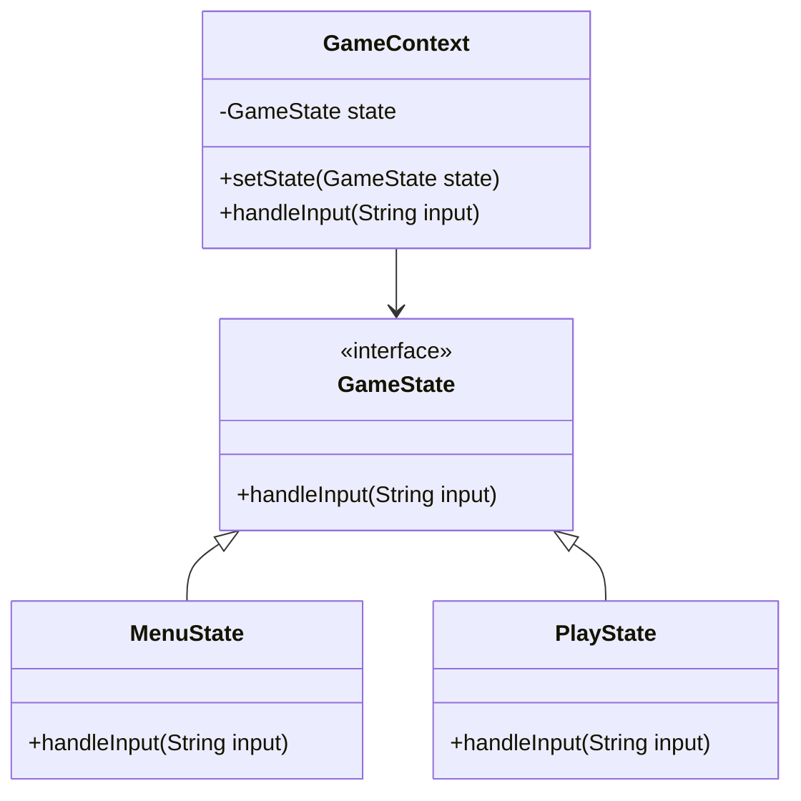
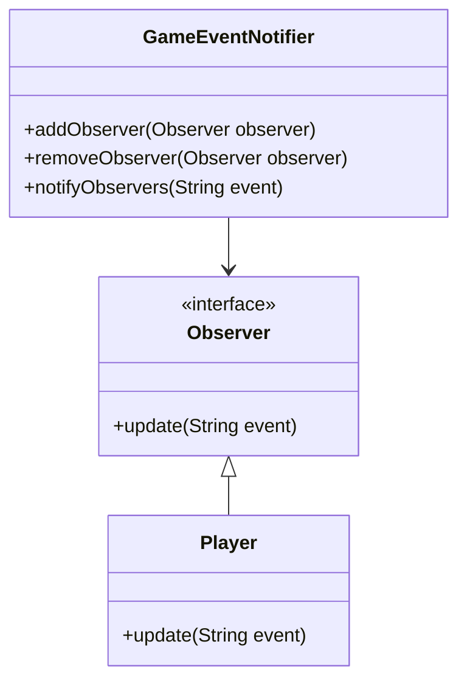
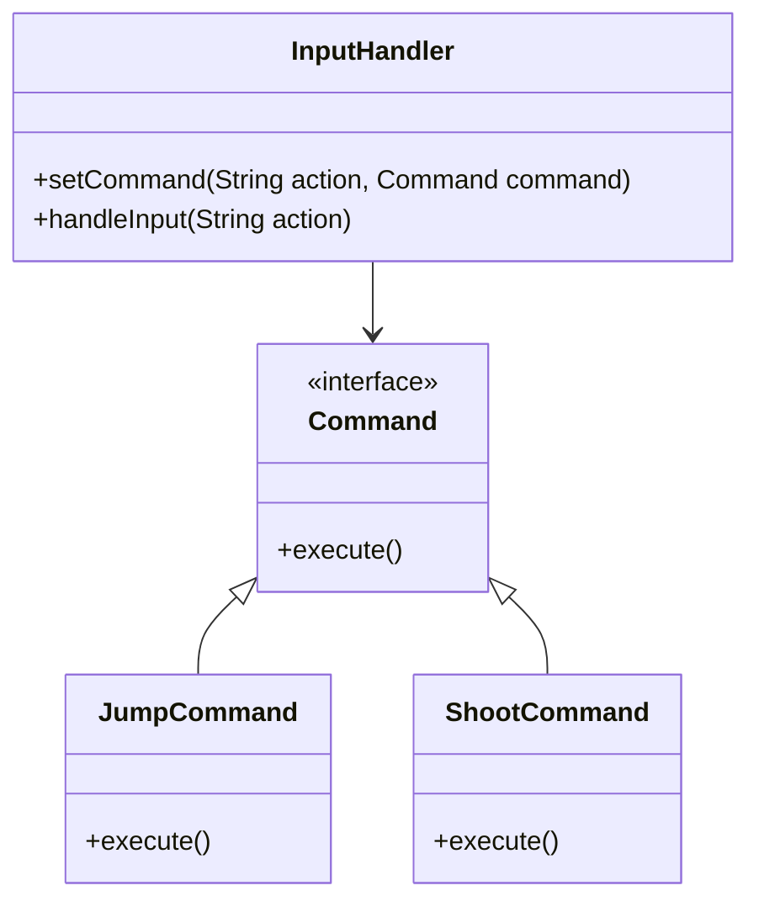

## 18.2 Design Patterns in Game Development with Dart

Game development is a complex field that requires careful planning and execution to create engaging and interactive experiences. Dart, with its robust language features and the Flutter framework, offers a powerful platform for building games. In this section, we will explore how design patterns can be effectively used in game development with Dart, focusing on real-time interactions, managing game states, and optimizing performance for smooth gameplay.

### Introduction to Game Development with Dart

Dart is a versatile language that, when combined with Flutter, provides a rich environment for developing cross-platform applications, including games. The language's features, such as strong typing, asynchronous programming, and a comprehensive standard library, make it well-suited for game development. Flutter's widget-based architecture allows for the creation of complex UIs and animations, which are essential in games.

#### Why Use Design Patterns in Game Development?

Design patterns offer proven solutions to common problems in software design. In game development, they help manage complexity, improve code reusability, and enhance maintainability. By using design patterns, developers can focus on creating engaging gameplay rather than reinventing the wheel for common tasks.

### Real-Time Interactions: Managing Game States and Object Behaviors

Real-time interactions are at the heart of any game. They involve managing game states, handling user inputs, and updating object behaviors dynamically. Let's explore some key design patterns that facilitate these tasks.

#### State Design Pattern

**Intent**: The State pattern allows an object to alter its behavior when its internal state changes. It provides a way to encapsulate state-specific behavior and delegate behavior to the current state object.

**Key Participants**:
- **Context**: Maintains an instance of a ConcreteState subclass that defines the current state.
- **State**: Defines an interface for encapsulating the behavior associated with a particular state of the Context.
- **ConcreteState**: Implements the behavior associated with a state of the Context.

**Applicability**: Use the State pattern when:
- An object's behavior depends on its state, and it must change its behavior at runtime depending on that state.
- Operations have large, multipart conditional statements that depend on the object's state.

**Sample Code Snippet**:

```dart
abstract class GameState {
  void handleInput(String input);
}

class MenuState implements GameState {
  @override
  void handleInput(String input) {
    if (input == 'start') {
      print('Starting game...');
    }
  }
}

class PlayState implements GameState {
  @override
  void handleInput(String input) {
    if (input == 'pause') {
      print('Pausing game...');
    }
  }
}

class GameContext {
  GameState _state;

  GameContext(this._state);

  void setState(GameState state) {
    _state = state;
  }

  void handleInput(String input) {
    _state.handleInput(input);
  }
}

void main() {
  GameContext game = GameContext(MenuState());
  game.handleInput('start');
  game.setState(PlayState());
  game.handleInput('pause');
}
```

**Design Considerations**: The State pattern is particularly useful in games where objects have complex state-dependent behavior. It helps avoid large conditional statements and makes the code more modular and easier to maintain.

**Differences and Similarities**: The State pattern is often confused with the Strategy pattern. While both patterns encapsulate behavior, the State pattern is used when the behavior is state-dependent, whereas the Strategy pattern is used to select an algorithm at runtime.

#### Observer Design Pattern

**Intent**: The Observer pattern defines a one-to-many dependency between objects so that when one object changes state, all its dependents are notified and updated automatically.

**Key Participants**:
- **Subject**: Knows its observers and provides an interface for attaching and detaching observer objects.
- **Observer**: Defines an updating interface for objects that should be notified of changes in a subject.
- **ConcreteSubject**: Stores state of interest to ConcreteObserver objects and sends a notification to its observers when its state changes.
- **ConcreteObserver**: Maintains a reference to a ConcreteSubject object and implements the Observer updating interface to keep its state consistent with the subject's.

**Applicability**: Use the Observer pattern when:
- A change to one object requires changing others, and you don't know how many objects need to be changed.
- An object should be able to notify other objects without making assumptions about who these objects are.

**Sample Code Snippet**:

```dart
abstract class Observer {
  void update(String event);
}

class Player implements Observer {
  final String name;

  Player(this.name);

  @override
  void update(String event) {
    print('$name received event: $event');
  }
}

class GameEventNotifier {
  final List<Observer> _observers = [];

  void addObserver(Observer observer) {
    _observers.add(observer);
  }

  void removeObserver(Observer observer) {
    _observers.remove(observer);
  }

  void notifyObservers(String event) {
    for (var observer in _observers) {
      observer.update(event);
    }
  }
}

void main() {
  GameEventNotifier notifier = GameEventNotifier();
  Player player1 = Player('Player 1');
  Player player2 = Player('Player 2');

  notifier.addObserver(player1);
  notifier.addObserver(player2);

  notifier.notifyObservers('Enemy Spotted');
}
```

**Design Considerations**: The Observer pattern is ideal for implementing event systems in games, where multiple objects need to react to changes in the game state. It promotes loose coupling between the subject and observers.

**Differences and Similarities**: The Observer pattern is similar to the Publish-Subscribe pattern, but the latter is more generalized and often used in distributed systems.

#### Command Design Pattern

**Intent**: The Command pattern encapsulates a request as an object, thereby allowing for parameterization of clients with queues, requests, and operations.

**Key Participants**:
- **Command**: Declares an interface for executing an operation.
- **ConcreteCommand**: Defines a binding between a Receiver object and an action. Implements Execute by invoking the corresponding operations on Receiver.
- **Client**: Creates a ConcreteCommand object and sets its receiver.
- **Invoker**: Asks the command to carry out the request.
- **Receiver**: Knows how to perform the operations associated with carrying out a request.

**Applicability**: Use the Command pattern when:
- You want to parameterize objects by an action to perform.
- You want to specify, queue, and execute requests at different times.
- You want to support undo.

**Sample Code Snippet**:

```dart
abstract class Command {
  void execute();
}

class JumpCommand implements Command {
  @override
  void execute() {
    print('Player jumps');
  }
}

class ShootCommand implements Command {
  @override
  void execute() {
    print('Player shoots');
  }
}

class InputHandler {
  final Map<String, Command> _commands = {};

  void setCommand(String action, Command command) {
    _commands[action] = command;
  }

  void handleInput(String action) {
    _commands[action]?.execute();
  }
}

void main() {
  InputHandler inputHandler = InputHandler();
  inputHandler.setCommand('jump', JumpCommand());
  inputHandler.setCommand('shoot', ShootCommand());

  inputHandler.handleInput('jump');
  inputHandler.handleInput('shoot');
}
```

**Design Considerations**: The Command pattern is useful for implementing input handling in games, where different commands can be mapped to user inputs. It also facilitates implementing undo functionality.

**Differences and Similarities**: The Command pattern is often compared to the Strategy pattern. While both encapsulate actions, the Command pattern focuses on executing requests, whereas the Strategy pattern focuses on selecting algorithms.

### Performance Considerations: Optimizing for Smooth Gameplay

In game development, performance is crucial. Games must run smoothly to provide a good user experience. Here are some strategies to optimize performance in Dart games:

#### Efficient State Management

Managing game states efficiently is key to performance. Use the State pattern to encapsulate state-specific behavior and avoid large conditional statements. This not only improves code readability but also enhances performance by reducing unnecessary computations.

#### Asynchronous Programming

Dart's asynchronous programming features, such as Futures and Streams, are essential for handling real-time interactions without blocking the main thread. Use these features to perform time-consuming tasks, such as loading assets or fetching data, in the background.

#### Optimizing Rendering

Rendering is one of the most performance-intensive tasks in a game. Use Flutter's widget tree efficiently to minimize rebuilds. Avoid unnecessary widget rebuilds by using keys and the `shouldRebuild` method in custom widgets.

#### Memory Management

Efficient memory management is crucial in games to prevent memory leaks and ensure smooth performance. Use Dart's garbage collector effectively and avoid retaining references to unused objects.

#### Profiling and Debugging

Use Dart's profiling and debugging tools to identify performance bottlenecks. The Dart DevTools provide a suite of tools for profiling, debugging, and inspecting Dart applications.

### Visualizing Design Patterns in Game Development

To better understand how these design patterns work together in a game, let's visualize their interactions using Mermaid.js diagrams.

#### State Pattern Diagram



**Description**: This diagram illustrates the State pattern in a game context, showing how different states (MenuState, PlayState) implement the GameState interface and are managed by the GameContext.

#### Observer Pattern Diagram



**Description**: This diagram shows the Observer pattern, where the GameEventNotifier notifies multiple Player observers of game events.

#### Command Pattern Diagram



**Description**: This diagram represents the Command pattern, where different commands (JumpCommand, ShootCommand) are executed by the InputHandler based on user input.

### Try It Yourself

To deepen your understanding, try modifying the code examples provided:

- **State Pattern**: Add a new state, such as `PauseState`, and implement its behavior.
- **Observer Pattern**: Create a new observer, such as `Enemy`, and notify it of game events.
- **Command Pattern**: Implement an `UndoCommand` to reverse actions.

### Knowledge Check

- What are the key benefits of using design patterns in game development?
- How does the State pattern help manage game states?
- What is the difference between the Observer pattern and the Publish-Subscribe pattern?
- How can the Command pattern be used to implement undo functionality in games?

### Embrace the Journey

Remember, mastering design patterns in game development is a journey. As you progress, you'll build more complex and interactive games. Keep experimenting, stay curious, and enjoy the journey!

### References and Links

- [Dart Language Tour](https://dart.dev/guides/language/language-tour)
- [Flutter Documentation](https://flutter.dev/docs)
- [Design Patterns: Elements of Reusable Object-Oriented Software](https://en.wikipedia.org/wiki/Design_Patterns)

## Quiz Time!



### What is the primary benefit of using the State pattern in game development?

- [x] It allows an object to change its behavior when its state changes.
- [ ] It reduces the number of classes needed in a game.
- [ ] It simplifies the user interface design.
- [ ] It improves the game's graphics quality.

> **Explanation:** The State pattern allows an object to alter its behavior when its internal state changes, making it ideal for managing game states.

### Which pattern is best suited for implementing an event system in a game?

- [ ] State Pattern
- [x] Observer Pattern
- [ ] Command Pattern
- [ ] Strategy Pattern

> **Explanation:** The Observer pattern is ideal for implementing event systems where multiple objects need to react to changes in the game state.

### How does the Command pattern facilitate input handling in games?

- [x] By encapsulating requests as objects, allowing for flexible input handling.
- [ ] By reducing the number of input devices needed.
- [ ] By improving the game's rendering speed.
- [ ] By simplifying the game's storyline.

> **Explanation:** The Command pattern encapsulates requests as objects, allowing for flexible mapping of user inputs to game actions.

### What is a common use case for the Observer pattern in games?

- [ ] Managing game levels
- [x] Notifying players of game events
- [ ] Rendering graphics
- [ ] Loading assets

> **Explanation:** The Observer pattern is commonly used to notify players or other game components of events, such as enemy appearances or score updates.

### Which pattern is often confused with the State pattern?

- [ ] Observer Pattern
- [x] Strategy Pattern
- [ ] Command Pattern
- [ ] Singleton Pattern

> **Explanation:** The State pattern is often confused with the Strategy pattern, but they serve different purposes. The State pattern is used for state-dependent behavior, while the Strategy pattern is for selecting algorithms.

### What is a key advantage of using design patterns in game development?

- [x] They provide proven solutions to common design problems.
- [ ] They eliminate the need for testing.
- [ ] They automatically improve game graphics.
- [ ] They reduce the game's file size.

> **Explanation:** Design patterns offer proven solutions to common design problems, improving code reusability and maintainability.

### How can the Command pattern be used to implement undo functionality?

- [x] By storing executed commands and reversing them.
- [ ] By deleting the last user input.
- [ ] By resetting the game state.
- [ ] By pausing the game.

> **Explanation:** The Command pattern can implement undo functionality by storing executed commands and providing a mechanism to reverse them.

### What is the purpose of the `notifyObservers` method in the Observer pattern?

- [ ] To change the state of the subject
- [x] To update all registered observers with new information
- [ ] To delete all observers
- [ ] To initialize the game

> **Explanation:** The `notifyObservers` method updates all registered observers with new information or events from the subject.

### How does the State pattern improve code readability?

- [x] By encapsulating state-specific behavior and avoiding large conditional statements.
- [ ] By reducing the number of lines of code.
- [ ] By using fewer classes.
- [ ] By simplifying variable names.

> **Explanation:** The State pattern improves code readability by encapsulating state-specific behavior, reducing the need for large conditional statements.

### True or False: The Observer pattern promotes loose coupling between the subject and observers.

- [x] True
- [ ] False

> **Explanation:** True. The Observer pattern promotes loose coupling by allowing subjects to notify observers of changes without knowing their details.



---
