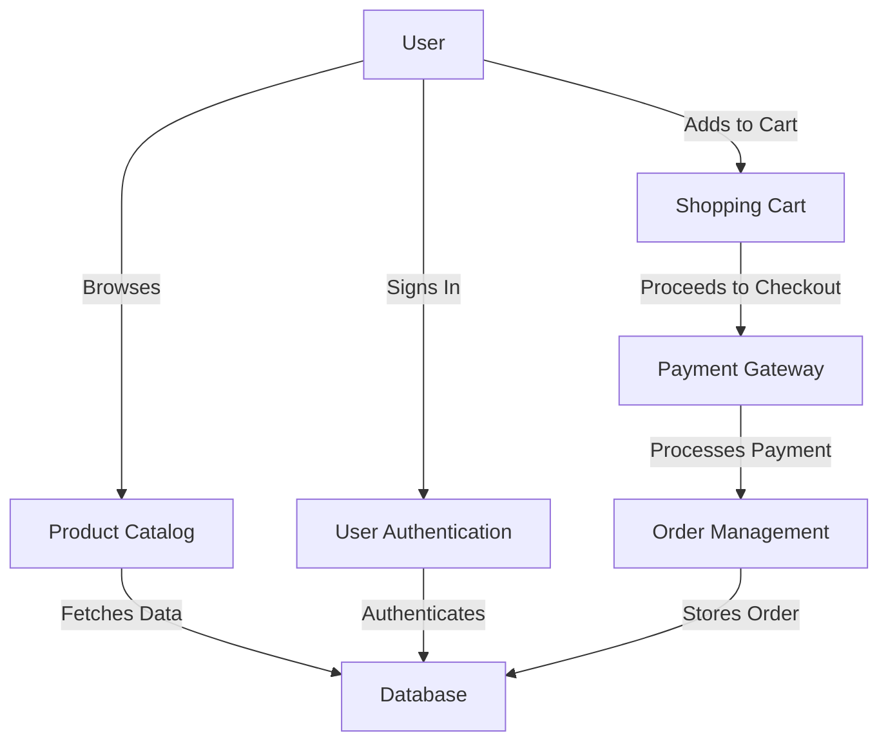

## 18.3 Implementing an E-commerce App with Flutter

In this section, we will delve into the process of building a scalable e-commerce application using Flutter. We will explore the architecture selection, state management strategies, and integration with payment gateways and databases. By the end of this guide, you will have a comprehensive understanding of how to leverage Flutter and Dart to create a robust e-commerce platform.

### Introduction

E-commerce applications are complex systems that require careful planning and execution. They involve multiple components such as user authentication, product catalogs, shopping carts, payment processing, and order management. To build a successful e-commerce app, it's crucial to choose the right architecture and design patterns that ensure scalability, maintainability, and performance.

### Architecture Selection

Choosing the right architecture is the foundation of a scalable e-commerce application. In Flutter, we have several architectural patterns to choose from, such as MVC (Model-View-Controller), MVVM (Model-View-ViewModel), and BLoC (Business Logic Component). Each pattern has its strengths and weaknesses, and the choice depends on the specific requirements of your application.

#### MVC (Model-View-Controller)

The MVC pattern is a classic architectural pattern that separates the application into three main components: Model, View, and Controller. The Model represents the data and business logic, the View displays the data, and the Controller handles user input and updates the Model.

**Advantages:**
- Clear separation of concerns.
- Easy to understand and implement.

**Disadvantages:**
- Can become complex as the application grows.
- Controllers can become bloated with logic.

#### MVVM (Model-View-ViewModel)

MVVM is an evolution of MVC that introduces the ViewModel, which acts as an intermediary between the View and the Model. The ViewModel handles the presentation logic and data binding, making it easier to manage complex UI interactions.

**Advantages:**
- Better separation of UI and business logic.
- Easier to test and maintain.

**Disadvantages:**
- Can be overkill for simple applications.
- Requires a good understanding of data binding.

#### BLoC (Business Logic Component)

BLoC is a popular pattern in Flutter that separates business logic from the UI. It uses streams to manage state and handle events, making it a reactive and scalable solution for complex applications.

**Advantages:**
- Promotes a reactive programming model.
- Scalable and testable.

**Disadvantages:**
- Steeper learning curve for beginners.
- Can be verbose for simple tasks.

### State Management

State management is a critical aspect of any e-commerce application. It involves managing the state of various components such as the shopping cart, user sessions, and product catalogs. Flutter offers several state management solutions, including Provider, Riverpod, and Redux.

#### Provider

Provider is a simple and efficient state management solution that leverages Flutter's InheritedWidget. It allows you to manage state and dependencies in a clean and scalable way.

**Advantages:**
- Easy to use and integrate.
- Good for small to medium-sized applications.

**Disadvantages:**
- Can become complex for large applications.

#### Riverpod

Riverpod is a modern state management solution that builds on the concepts of Provider. It offers improved performance, better error handling, and a more robust API.

**Advantages:**
- Improved performance and scalability.
- Better error handling and debugging tools.

**Disadvantages:**
- Newer library with a smaller community.

#### Redux

Redux is a predictable state container that is popular in the React ecosystem. It provides a single source of truth for the application state and uses actions and reducers to manage state changes.

**Advantages:**
- Predictable and testable state management.
- Good for large and complex applications.

**Disadvantages:**
- Can be verbose and boilerplate-heavy.
- Steeper learning curve.

### Integration with Payment Gateways

Integrating with payment gateways is a crucial part of any e-commerce application. It involves securely processing payments and handling transactions. Flutter provides several plugins and packages to integrate with popular payment gateways such as Stripe, PayPal, and Razorpay.

#### Stripe Integration

Stripe is a popular payment gateway that offers a robust API for processing payments. To integrate Stripe with your Flutter app, you can use the `stripe_payment` package.

```dart
import 'package:stripe_payment/stripe_payment.dart';

void main() {
  StripePayment.setOptions(
    StripeOptions(
      publishableKey: "your_publishable_key",
      merchantId: "your_merchant_id",
      androidPayMode: 'test',
    ),
  );
}

void processPayment() {
  StripePayment.paymentRequestWithCardForm(CardFormPaymentRequest())
      .then((paymentMethod) {
    // Handle successful payment
  }).catchError((error) {
    // Handle payment error
  });
}
```

**Key Steps:**
1. Set up Stripe account and obtain API keys.
2. Install and configure the `stripe_payment` package.
3. Implement payment processing logic.

#### PayPal Integration

PayPal is another widely used payment gateway. You can integrate PayPal with your Flutter app using the `flutter_braintree` package.

```dart
import 'package:flutter_braintree/flutter_braintree.dart';

void processPayPalPayment() async {
  var request = BraintreePayPalRequest(
    amount: '10.00',
    currencyCode: 'USD',
  );
  BraintreePaymentMethodNonce result = await Braintree.requestPaypalNonce(
    'your_client_token',
    request,
  );

  if (result != null) {
    // Handle successful payment
  } else {
    // Handle payment error
  }
}
```

**Key Steps:**
1. Set up PayPal account and obtain client token.
2. Install and configure the `flutter_braintree` package.
3. Implement payment processing logic.

### Database Integration

An e-commerce application requires a robust database to store and manage data such as products, orders, and user information. Flutter supports several database solutions, including Firebase Firestore, SQLite, and Hive.

#### Firebase Firestore

Firestore is a cloud-based NoSQL database that offers real-time data synchronization and scalability. It's a popular choice for Flutter apps due to its seamless integration and powerful features.

```dart
import 'package:cloud_firestore/cloud_firestore.dart';

void addProduct() {
  FirebaseFirestore.instance.collection('products').add({
    'name': 'Product Name',
    'price': 29.99,
    'description': 'Product Description',
  });
}

void fetchProducts() {
  FirebaseFirestore.instance.collection('products').get().then((querySnapshot) {
    querySnapshot.docs.forEach((doc) {
      print(doc.data());
    });
  });
}
```

**Key Steps:**
1. Set up Firebase project and configure Firestore.
2. Install and configure the `cloud_firestore` package.
3. Implement data management logic.

#### SQLite

SQLite is a lightweight, file-based database that is suitable for local data storage. It's a good choice for offline-first applications.

```dart
import 'package:sqflite/sqflite.dart';

Future<Database> initializeDatabase() async {
  return openDatabase(
    'ecommerce.db',
    version: 1,
    onCreate: (db, version) {
      return db.execute(
        'CREATE TABLE products(id INTEGER PRIMARY KEY, name TEXT, price REAL)',
      );
    },
  );
}

void insertProduct(Database db) async {
  await db.insert(
    'products',
    {'name': 'Product Name', 'price': 29.99},
    conflictAlgorithm: ConflictAlgorithm.replace,
  );
}

void fetchProducts(Database db) async {
  final List<Map<String, dynamic>> maps = await db.query('products');
  maps.forEach((map) {
    print(map);
  });
}
```

**Key Steps:**
1. Install and configure the `sqflite` package.
2. Define database schema and initialize the database.
3. Implement data management logic.

### Implementing Core Features

Now that we have a solid understanding of the architecture, state management, and integration strategies, let's implement some core features of our e-commerce app.

#### User Authentication

User authentication is a critical feature that allows users to securely access their accounts and manage their orders. We can use Firebase Authentication to implement this feature.

```dart
import 'package:firebase_auth/firebase_auth.dart';

void signUp(String email, String password) async {
  try {
    UserCredential userCredential = await FirebaseAuth.instance
        .createUserWithEmailAndPassword(email: email, password: password);
    // Handle successful sign-up
  } catch (e) {
    // Handle sign-up error
  }
}

void signIn(String email, String password) async {
  try {
    UserCredential userCredential = await FirebaseAuth.instance
        .signInWithEmailAndPassword(email: email, password: password);
    // Handle successful sign-in
  } catch (e) {
    // Handle sign-in error
  }
}
```

**Key Steps:**
1. Set up Firebase Authentication.
2. Implement sign-up and sign-in logic.
3. Handle authentication state changes.

#### Product Catalog

The product catalog is the heart of any e-commerce application. It displays the available products and allows users to browse and search for items.

```dart
import 'package:flutter/material.dart';
import 'package:cloud_firestore/cloud_firestore.dart';

class ProductCatalog extends StatelessWidget {
  @override
  Widget build(BuildContext context) {
    return StreamBuilder(
      stream: FirebaseFirestore.instance.collection('products').snapshots(),
      builder: (context, snapshot) {
        if (!snapshot.hasData) return CircularProgressIndicator();
        return ListView.builder(
          itemCount: snapshot.data.docs.length,
          itemBuilder: (context, index) {
            var product = snapshot.data.docs[index];
            return ListTile(
              title: Text(product['name']),
              subtitle: Text('\$${product['price']}'),
            );
          },
        );
      },
    );
  }
}
```

**Key Steps:**
1. Fetch product data from the database.
2. Display products in a list or grid view.
3. Implement search and filter functionality.

#### Shopping Cart

The shopping cart allows users to add, remove, and manage items before proceeding to checkout.

```dart
import 'package:flutter/material.dart';

class ShoppingCart extends StatefulWidget {
  @override
  _ShoppingCartState createState() => _ShoppingCartState();
}

class _ShoppingCartState extends State<ShoppingCart> {
  List<Map<String, dynamic>> cartItems = [];

  void addToCart(Map<String, dynamic> product) {
    setState(() {
      cartItems.add(product);
    });
  }

  void removeFromCart(Map<String, dynamic> product) {
    setState(() {
      cartItems.remove(product);
    });
  }

  @override
  Widget build(BuildContext context) {
    return ListView.builder(
      itemCount: cartItems.length,
      itemBuilder: (context, index) {
        var item = cartItems[index];
        return ListTile(
          title: Text(item['name']),
          subtitle: Text('\$${item['price']}'),
          trailing: IconButton(
            icon: Icon(Icons.remove),
            onPressed: () => removeFromCart(item),
          ),
        );
      },
    );
  }
}
```

**Key Steps:**
1. Implement add to cart and remove from cart functionality.
2. Display cart items and total price.
3. Handle cart state changes.

### Try It Yourself

Now that we've covered the core features, it's time to experiment and extend the functionality of your e-commerce app. Here are some suggestions:

- **Implement Wishlist**: Allow users to save products for later.
- **Add Reviews and Ratings**: Enable users to leave reviews and rate products.
- **Implement Order History**: Display past orders and order details.
- **Enhance UI/UX**: Improve the user interface and user experience with animations and transitions.

### Visualizing the Architecture

To better understand the architecture of our e-commerce app, let's visualize the components and their interactions using a Mermaid.js diagram.



**Diagram Description:**
- The user interacts with the product catalog, shopping cart, and user authentication components.
- The shopping cart connects to the payment gateway for processing payments.
- The database stores product data, user information, and order details.

### Knowledge Check

Before we conclude, let's reinforce what we've learned with some questions and exercises:

1. **What are the key differences between MVC, MVVM, and BLoC patterns?**
2. **How does the Provider package help in managing state in Flutter?**
3. **What are the steps to integrate Stripe with a Flutter app?**
4. **How can you implement a search feature in the product catalog?**
5. **What are the benefits of using Firebase Firestore for an e-commerce app?**

### Conclusion

Building an e-commerce app with Flutter involves selecting the right architecture, managing state effectively, and integrating with external services like payment gateways and databases. By leveraging Flutter's powerful features and design patterns, you can create a scalable and maintainable e-commerce platform.

Remember, this is just the beginning. As you progress, you'll build more complex and interactive applications. Keep experimenting, stay curious, and enjoy the journey!

## Quiz Time!



### What is the primary advantage of using the BLoC pattern in Flutter?

- [x] It promotes a reactive programming model.
- [ ] It simplifies the UI code.
- [ ] It reduces the number of files in the project.
- [ ] It eliminates the need for state management.

> **Explanation:** The BLoC pattern promotes a reactive programming model by using streams to manage state and handle events.

### Which state management solution is known for its simplicity and efficiency in Flutter?

- [x] Provider
- [ ] Redux
- [ ] Riverpod
- [ ] BLoC

> **Explanation:** Provider is known for its simplicity and efficiency, making it a popular choice for small to medium-sized applications.

### What package is commonly used for integrating Stripe payments in Flutter?

- [x] stripe_payment
- [ ] flutter_braintree
- [ ] paypal_flutter
- [ ] payment_gateway

> **Explanation:** The `stripe_payment` package is commonly used for integrating Stripe payments in Flutter applications.

### What is the main purpose of the ViewModel in the MVVM pattern?

- [x] To handle presentation logic and data binding.
- [ ] To manage user input and update the Model.
- [ ] To display data to the user.
- [ ] To store application state.

> **Explanation:** The ViewModel in MVVM handles presentation logic and data binding, acting as an intermediary between the View and the Model.

### Which database solution is suitable for offline-first applications in Flutter?

- [x] SQLite
- [ ] Firebase Firestore
- [ ] MongoDB
- [ ] MySQL

> **Explanation:** SQLite is a lightweight, file-based database suitable for offline-first applications.

### What is the role of the Controller in the MVC pattern?

- [x] To handle user input and update the Model.
- [ ] To display data to the user.
- [ ] To manage application state.
- [ ] To store business logic.

> **Explanation:** The Controller in MVC handles user input and updates the Model accordingly.

### How does the `flutter_braintree` package help in Flutter development?

- [x] It integrates PayPal payments.
- [ ] It provides UI components for e-commerce apps.
- [ ] It manages state in Flutter applications.
- [ ] It simplifies database integration.

> **Explanation:** The `flutter_braintree` package helps integrate PayPal payments into Flutter applications.

### What is a key benefit of using Firebase Authentication in a Flutter app?

- [x] It provides secure user authentication.
- [ ] It simplifies UI design.
- [ ] It reduces code complexity.
- [ ] It enhances app performance.

> **Explanation:** Firebase Authentication provides secure user authentication, making it a reliable choice for managing user accounts.

### Which pattern is known for having a single source of truth for application state?

- [x] Redux
- [ ] Provider
- [ ] BLoC
- [ ] MVVM

> **Explanation:** Redux is known for having a single source of truth for application state, making it predictable and testable.

### True or False: The MVVM pattern is an evolution of the MVC pattern.

- [x] True
- [ ] False

> **Explanation:** The MVVM pattern is indeed an evolution of the MVC pattern, introducing the ViewModel to handle presentation logic and data binding.


