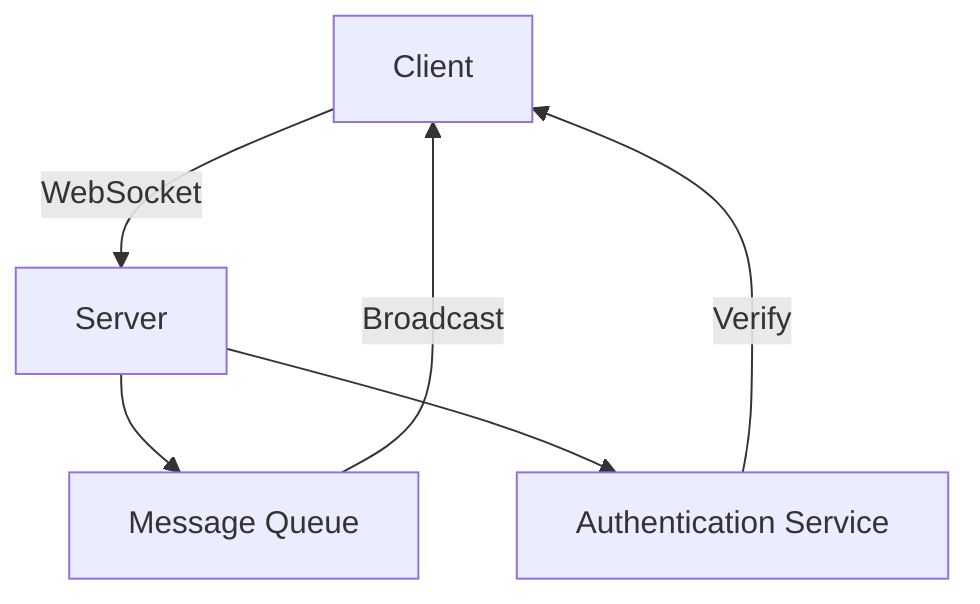

## 18.4 Real-Time Chat Application

In this section, we delve into the development of a real-time chat application using Dart and Flutter. This case study will guide you through the essential components of building a robust, scalable, and secure chat application. We will explore communication patterns using WebSockets and Streams, concurrency handling for managing multiple chat rooms and message queues, and security measures to ensure secure message transmission and user authentication.

### Introduction to Real-Time Communication

Real-time communication is a critical aspect of modern applications, enabling instant data exchange between clients and servers. In a chat application, this means messages are delivered to users as soon as they are sent, without the need for manual refreshes. To achieve this, we leverage WebSockets, a protocol that provides full-duplex communication channels over a single TCP connection.

#### WebSockets: The Backbone of Real-Time Communication

WebSockets are ideal for real-time applications due to their low latency and persistent connection capabilities. Unlike HTTP, which is request-response based, WebSockets allow for continuous data exchange, making them perfect for chat applications.

#### Streams: Managing Data Flow in Dart

Dart's Streams provide a way to handle asynchronous data sequences, making them a natural fit for real-time applications. Streams can be used to listen for incoming messages and update the UI accordingly.

### Setting Up the Project

Let's start by setting up a new Flutter project. Open your terminal and run the following command:

```bash
flutter create real_time_chat
```

Navigate to the project directory:

```bash
cd real_time_chat
```

### Implementing WebSocket Communication

To implement WebSocket communication, we need to establish a connection between the client and the server. For this example, we'll use a simple WebSocket server. You can use any WebSocket server of your choice or set up a local server using Node.js or Python.

#### Establishing a WebSocket Connection

First, add the `web_socket_channel` package to your `pubspec.yaml` file:

```yaml
dependencies:
  flutter:
    sdk: flutter
  web_socket_channel: ^2.1.0
```

Run `flutter pub get` to install the package.

Next, create a new Dart file `websocket_service.dart` to manage WebSocket connections:

```dart
import 'package:web_socket_channel/io.dart';
import 'package:web_socket_channel/web_socket_channel.dart';

class WebSocketService {
  final WebSocketChannel channel;

  WebSocketService(String url)
      : channel = IOWebSocketChannel.connect(url);

  void sendMessage(String message) {
    channel.sink.add(message);
  }

  Stream get messages => channel.stream;

  void dispose() {
    channel.sink.close();
  }
}
```

In this code, we establish a WebSocket connection using the `IOWebSocketChannel.connect` method. The `sendMessage` function sends messages to the server, while the `messages` getter listens for incoming messages.

### Building the Chat UI

Now, let's build a simple chat UI using Flutter. Create a new Dart file `chat_screen.dart`:

```dart
import 'package:flutter/material.dart';
import 'websocket_service.dart';

class ChatScreen extends StatefulWidget {
  @override
  _ChatScreenState createState() => _ChatScreenState();
}

class _ChatScreenState extends State<ChatScreen> {
  final WebSocketService _webSocketService =
      WebSocketService('ws://yourserver.com/socket');
  final TextEditingController _controller = TextEditingController();
  final List<String> _messages = [];

  @override
  void initState() {
    super.initState();
    _webSocketService.messages.listen((message) {
      setState(() {
        _messages.add(message);
      });
    });
  }

  void _sendMessage() {
    if (_controller.text.isNotEmpty) {
      _webSocketService.sendMessage(_controller.text);
      _controller.clear();
    }
  }

  @override
  void dispose() {
    _webSocketService.dispose();
    super.dispose();
  }

  @override
  Widget build(BuildContext context) {
    return Scaffold(
      appBar: AppBar(title: Text('Real-Time Chat')),
      body: Column(
        children: [
          Expanded(
            child: ListView.builder(
              itemCount: _messages.length,
              itemBuilder: (context, index) {
                return ListTile(
                  title: Text(_messages[index]),
                );
              },
            ),
          ),
          Padding(
            padding: const EdgeInsets.all(8.0),
            child: Row(
              children: [
                Expanded(
                  child: TextField(
                    controller: _controller,
                    decoration: InputDecoration(hintText: 'Enter message'),
                  ),
                ),
                IconButton(
                  icon: Icon(Icons.send),
                  onPressed: _sendMessage,
                ),
              ],
            ),
          ),
        ],
      ),
    );
  }
}
```

In this UI, we use a `ListView` to display messages and a `TextField` for input. The `IconButton` sends the message when pressed.

### Concurrency Handling

Managing multiple chat rooms and message queues requires effective concurrency handling. Dart's asynchronous programming model, with its support for `async` and `await`, makes it easier to manage concurrent tasks.

#### Handling Multiple Chat Rooms

To handle multiple chat rooms, we can create a separate WebSocket connection for each room. This allows us to manage messages independently for each room.

```dart
class ChatRoomService {
  final Map<String, WebSocketService> _rooms = {};

  void joinRoom(String roomName, String url) {
    if (!_rooms.containsKey(roomName)) {
      _rooms[roomName] = WebSocketService(url);
    }
  }

  void leaveRoom(String roomName) {
    _rooms[roomName]?.dispose();
    _rooms.remove(roomName);
  }

  WebSocketService? getRoomService(String roomName) {
    return _rooms[roomName];
  }
}
```

In this code, we maintain a map of room names to WebSocket services, allowing us to join and leave rooms dynamically.

### Security Measures

Security is paramount in any application, especially in real-time communication where sensitive data is exchanged. Here, we focus on secure message transmission and user authentication.

#### Secure Message Transmission

To ensure secure message transmission, always use `wss://` (WebSocket Secure) instead of `ws://`. This encrypts the data using TLS, preventing eavesdropping and tampering.

#### User Authentication

Implementing user authentication involves verifying user credentials before allowing access to the chat service. This can be achieved using OAuth, JWT (JSON Web Tokens), or any other authentication mechanism.

```dart
class AuthService {
  Future<bool> authenticate(String username, String password) async {
    // Implement authentication logic
    return true; // Return true if authentication is successful
  }
}
```

### Visualizing the Architecture

Below is a diagram illustrating the architecture of our real-time chat application, showing the interaction between the client, server, and WebSocket connections.



**Figure 1: Real-Time Chat Application Architecture**

### Try It Yourself

Now that we've covered the basics, try modifying the code to add new features:

- **Add User Avatars**: Display user avatars next to messages.
- **Implement Typing Indicators**: Show when a user is typing.
- **Support Media Messages**: Allow users to send images or videos.

### Knowledge Check

Before we conclude, let's review some key concepts:

- **WebSockets** provide a persistent connection for real-time communication.
- **Streams** in Dart handle asynchronous data sequences.
- **Concurrency** is managed using Dart's `async` and `await`.
- **Security** involves using secure connections and authenticating users.

### Conclusion

Building a real-time chat application with Dart and Flutter involves understanding communication patterns, concurrency handling, and security measures. By leveraging WebSockets and Streams, we can create a responsive and interactive chat experience. Remember, this is just the beginning. As you progress, you'll build more complex and interactive applications. Keep experimenting, stay curious, and enjoy the journey!

## Quiz Time!



### What protocol is primarily used for real-time communication in chat applications?

- [x] WebSockets
- [ ] HTTP
- [ ] FTP
- [ ] SMTP

> **Explanation:** WebSockets provide full-duplex communication channels, making them ideal for real-time applications like chat.

### Which Dart feature is used to handle asynchronous data sequences?

- [x] Streams
- [ ] Futures
- [ ] Isolates
- [ ] Generators

> **Explanation:** Streams in Dart are used to handle asynchronous data sequences, allowing for real-time updates.

### What is the primary benefit of using `wss://` over `ws://`?

- [x] Secure data transmission
- [ ] Faster connection
- [ ] Lower latency
- [ ] Easier implementation

> **Explanation:** `wss://` encrypts data using TLS, ensuring secure transmission.

### How can you manage multiple chat rooms in a Dart application?

- [x] Use separate WebSocket connections for each room
- [ ] Use a single WebSocket connection for all rooms
- [ ] Use HTTP requests for each room
- [ ] Use FTP connections for each room

> **Explanation:** Managing multiple chat rooms can be achieved by creating separate WebSocket connections for each room.

### What is a common method for authenticating users in a chat application?

- [x] OAuth
- [ ] FTP
- [ ] SMTP
- [ ] DNS

> **Explanation:** OAuth is a common authentication method used to verify user credentials.

### What is the role of the `AuthService` class in the example?

- [x] To authenticate users
- [ ] To send messages
- [ ] To manage chat rooms
- [ ] To encrypt data

> **Explanation:** The `AuthService` class is responsible for authenticating users before they can access the chat service.

### Which Flutter widget is used to display a list of messages?

- [x] ListView
- [ ] GridView
- [ ] Stack
- [ ] Column

> **Explanation:** `ListView` is used to display a scrollable list of messages in Flutter.

### What is the purpose of the `dispose` method in the `WebSocketService` class?

- [x] To close the WebSocket connection
- [ ] To send a message
- [ ] To authenticate a user
- [ ] To encrypt data

> **Explanation:** The `dispose` method is used to close the WebSocket connection and clean up resources.

### How can you enhance the chat application to support media messages?

- [x] Allow users to send images or videos
- [ ] Use HTTP for media messages
- [ ] Use FTP for media messages
- [ ] Use SMTP for media messages

> **Explanation:** Enhancing the chat application to support media messages involves allowing users to send images or videos.

### True or False: Streams in Dart can be used to listen for incoming messages in a chat application.

- [x] True
- [ ] False

> **Explanation:** Streams are used to handle asynchronous data sequences, making them suitable for listening to incoming messages.


