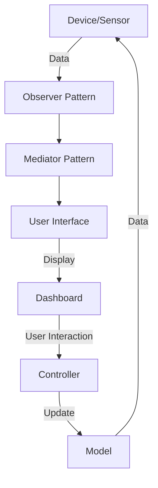

## 18.5 Applying Design Patterns in IoT Systems with Flutter

The Internet of Things (IoT) is revolutionizing the way we interact with the world around us, enabling devices to communicate and exchange data seamlessly. Flutter, with its robust framework and Dart language, provides an excellent platform for developing IoT applications. In this section, we will delve into how design patterns can be effectively applied in IoT systems using Flutter, focusing on device communication, data handling, and user interface design.

### Introduction to IoT Systems with Flutter

IoT systems consist of interconnected devices that collect and exchange data. These systems often involve sensors, actuators, and other hardware components that communicate with each other and with cloud services. Flutter, known for its cross-platform capabilities, is increasingly being used to develop IoT applications due to its ability to create high-performance, visually appealing interfaces.

#### Key Components of IoT Systems

1. **Devices and Sensors**: These are the physical components that collect data from the environment.
2. **Communication Protocols**: Protocols such as MQTT, HTTP, and WebSockets facilitate data exchange between devices and servers.
3. **Data Processing and Storage**: Data collected by devices is processed and stored for analysis and decision-making.
4. **User Interface**: The UI presents data to users, allowing them to monitor and control IoT devices.

### Device Communication: Integrating with Hardware and Sensors

Effective communication between devices and sensors is crucial in IoT systems. Flutter can be used to interface with hardware components, enabling seamless data exchange.

#### Using the Observer Pattern for Device Communication

The Observer pattern is ideal for managing communication between devices and sensors. It allows objects to subscribe to and receive updates from a subject, making it suitable for event-driven data handling in IoT systems.

**Intent**: Define a one-to-many dependency between objects so that when one object changes state, all its dependents are notified and updated automatically.

**Key Participants**:
- **Subject**: Maintains a list of observers and notifies them of any state changes.
- **Observer**: Defines an updating interface for objects that should be notified of changes in a subject.
- **ConcreteSubject**: Stores state of interest to ConcreteObservers and sends notifications.
- **ConcreteObserver**: Implements the Observer interface to keep its state consistent with the subject's.

#### Sample Code Snippet: Observer Pattern in Flutter

```dart
// Subject interface
abstract class Sensor {
  void registerObserver(Observer observer);
  void removeObserver(Observer observer);
  void notifyObservers();
}

// ConcreteSubject
class TemperatureSensor implements Sensor {
  List<Observer> _observers = [];
  double _temperature;

  double get temperature => _temperature;

  set temperature(double value) {
    _temperature = value;
    notifyObservers();
  }

  @override
  void registerObserver(Observer observer) {
    _observers.add(observer);
  }

  @override
  void removeObserver(Observer observer) {
    _observers.remove(observer);
  }

  @override
  void notifyObservers() {
    for (var observer in _observers) {
      observer.update(_temperature);
    }
  }
}

// Observer interface
abstract class Observer {
  void update(double temperature);
}

// ConcreteObserver
class DisplayUnit implements Observer {
  @override
  void update(double temperature) {
    print('Temperature updated: $temperature');
  }
}

void main() {
  var sensor = TemperatureSensor();
  var displayUnit = DisplayUnit();

  sensor.registerObserver(displayUnit);
  sensor.temperature = 25.0; // This will notify the display unit
}
```

**Design Considerations**: The Observer pattern is particularly useful in IoT systems where multiple components need to react to changes in sensor data. It decouples the subject from its observers, allowing for flexible and scalable system design.

### Data Handling: Using Observer and Mediator Patterns for Event-Driven Data

In IoT systems, data handling is a critical aspect that involves collecting, processing, and distributing data efficiently. The Observer and Mediator patterns can be leveraged to manage data flow and communication between components.

#### Mediator Pattern for Centralized Communication

The Mediator pattern centralizes communication between components, reducing dependencies and simplifying interactions.

**Intent**: Define an object that encapsulates how a set of objects interact. The Mediator promotes loose coupling by keeping objects from referring to each other explicitly.

**Key Participants**:
- **Mediator**: Defines an interface for communicating with Colleague objects.
- **ConcreteMediator**: Implements cooperative behavior by coordinating Colleague objects.
- **Colleague**: Each Colleague communicates with its Mediator whenever it would have otherwise communicated with another Colleague.

#### Sample Code Snippet: Mediator Pattern in Flutter

```dart
// Mediator interface
abstract class Mediator {
  void notify(Object sender, String event);
}

// ConcreteMediator
class SensorMediator implements Mediator {
  TemperatureSensor _temperatureSensor;
  DisplayUnit _displayUnit;

  SensorMediator(this._temperatureSensor, this._displayUnit) {
    _temperatureSensor.setMediator(this);
    _displayUnit.setMediator(this);
  }

  @override
  void notify(Object sender, String event) {
    if (sender is TemperatureSensor && event == 'temperatureChanged') {
      _displayUnit.update(_temperatureSensor.temperature);
    }
  }
}

// Colleague interface
abstract class Colleague {
  void setMediator(Mediator mediator);
}

// ConcreteColleague
class TemperatureSensor extends Colleague {
  Mediator _mediator;
  double _temperature;

  double get temperature => _temperature;

  set temperature(double value) {
    _temperature = value;
    _mediator.notify(this, 'temperatureChanged');
  }

  @override
  void setMediator(Mediator mediator) {
    _mediator = mediator;
  }
}

// ConcreteColleague
class DisplayUnit extends Colleague {
  Mediator _mediator;

  @override
  void setMediator(Mediator mediator) {
    _mediator = mediator;
  }

  void update(double temperature) {
    print('Temperature updated: $temperature');
  }
}

void main() {
  var temperatureSensor = TemperatureSensor();
  var displayUnit = DisplayUnit();
  var mediator = SensorMediator(temperatureSensor, displayUnit);

  temperatureSensor.temperature = 30.0; // This will notify the display unit through the mediator
}
```

**Design Considerations**: The Mediator pattern is beneficial in IoT systems where multiple components need to interact without direct dependencies. It simplifies communication and enhances system maintainability.

### User Interface: Presenting Data in Dashboards and Real-Time Monitoring

The user interface in IoT systems plays a crucial role in presenting data to users. Flutter's rich UI toolkit allows developers to create interactive dashboards and real-time monitoring applications.

#### Using the MVC Pattern for UI Design

The Model-View-Controller (MVC) pattern is a popular architectural pattern for designing user interfaces. It separates the application logic into three interconnected components, promoting organized and maintainable code.

**Intent**: Separate the application's concerns into three components: Model, View, and Controller.

**Key Participants**:
- **Model**: Represents the data and business logic.
- **View**: Displays the data to the user and sends user commands to the Controller.
- **Controller**: Handles user input and updates the Model.

#### Sample Code Snippet: MVC Pattern in Flutter

```dart
// Model
class TemperatureModel {
  double _temperature;

  double get temperature => _temperature;

  set temperature(double value) {
    _temperature = value;
  }
}

// View
class TemperatureView {
  void displayTemperature(double temperature) {
    print('Current Temperature: $temperature');
  }
}

// Controller
class TemperatureController {
  TemperatureModel _model;
  TemperatureView _view;

  TemperatureController(this._model, this._view);

  void updateTemperature(double temperature) {
    _model.temperature = temperature;
    _view.displayTemperature(_model.temperature);
  }
}

void main() {
  var model = TemperatureModel();
  var view = TemperatureView();
  var controller = TemperatureController(model, view);

  controller.updateTemperature(28.0); // This will update the model and display the temperature
}
```

**Design Considerations**: The MVC pattern is ideal for IoT applications with complex user interfaces. It promotes separation of concerns, making the application easier to manage and extend.

### Visualizing IoT System Architecture with Flutter

To better understand the architecture of an IoT system using Flutter, let's visualize the components and their interactions using a Mermaid.js diagram.



**Diagram Description**: This diagram illustrates the flow of data in an IoT system using Flutter. Devices and sensors collect data, which is managed using the Observer and Mediator patterns. The user interface presents data in dashboards, allowing users to interact with the system. The MVC pattern is used to manage the UI components.

### Try It Yourself: Experimenting with IoT Patterns in Flutter

To deepen your understanding of applying design patterns in IoT systems with Flutter, try modifying the code examples provided. Here are some suggestions:

1. **Extend the Observer Pattern**: Add more observers to the `TemperatureSensor` class and see how they react to temperature changes.
2. **Enhance the Mediator Pattern**: Introduce additional sensors and display units, and modify the `SensorMediator` to handle multiple events.
3. **Customize the MVC Pattern**: Create a more complex model with additional data points, and update the view to display this information.

### Knowledge Check

- **Question**: What are the key components of an IoT system?
- **Question**: How does the Observer pattern facilitate device communication in IoT systems?
- **Question**: What is the role of the Mediator pattern in data handling?
- **Question**: How does the MVC pattern enhance user interface design in IoT applications?

### Conclusion

Applying design patterns in IoT systems with Flutter enables developers to create efficient, scalable, and maintainable applications. By leveraging patterns such as Observer, Mediator, and MVC, we can manage device communication, data handling, and user interface design effectively. Remember, this is just the beginning. As you progress, you'll build more complex and interactive IoT applications. Keep experimenting, stay curious, and enjoy the journey!

## Quiz Time!



### What is the primary role of the Observer pattern in IoT systems?

- [x] To manage event-driven data communication between devices and sensors.
- [ ] To centralize communication between components.
- [ ] To separate application concerns into three components.
- [ ] To handle user input and update the model.

> **Explanation:** The Observer pattern is used to manage event-driven data communication between devices and sensors, allowing objects to subscribe to and receive updates from a subject.

### Which pattern is used to centralize communication between components in IoT systems?

- [ ] Observer Pattern
- [x] Mediator Pattern
- [ ] MVC Pattern
- [ ] Singleton Pattern

> **Explanation:** The Mediator pattern centralizes communication between components, reducing dependencies and simplifying interactions.

### What are the three components of the MVC pattern?

- [x] Model, View, Controller
- [ ] Subject, Observer, Mediator
- [ ] Device, Sensor, Dashboard
- [ ] Publisher, Subscriber, Broker

> **Explanation:** The MVC pattern separates the application's concerns into three components: Model, View, and Controller.

### How does the Mediator pattern benefit IoT systems?

- [x] It simplifies communication and enhances system maintainability.
- [ ] It allows objects to subscribe to and receive updates from a subject.
- [ ] It separates application concerns into three components.
- [ ] It manages event-driven data communication between devices and sensors.

> **Explanation:** The Mediator pattern simplifies communication and enhances system maintainability by centralizing interactions between components.

### What is the primary purpose of the View component in the MVC pattern?

- [x] To display data to the user and send user commands to the Controller.
- [ ] To manage event-driven data communication between devices and sensors.
- [ ] To centralize communication between components.
- [ ] To handle user input and update the model.

> **Explanation:** The View component in the MVC pattern displays data to the user and sends user commands to the Controller.

### How can the Observer pattern be extended in an IoT system?

- [x] By adding more observers to the subject class.
- [ ] By centralizing communication between components.
- [ ] By separating application concerns into three components.
- [ ] By handling user input and updating the model.

> **Explanation:** The Observer pattern can be extended by adding more observers to the subject class, allowing multiple components to react to changes.

### What is the role of the Controller in the MVC pattern?

- [x] To handle user input and update the model.
- [ ] To manage event-driven data communication between devices and sensors.
- [ ] To centralize communication between components.
- [ ] To display data to the user and send user commands to the Controller.

> **Explanation:** The Controller in the MVC pattern handles user input and updates the model.

### Which pattern is ideal for managing complex user interfaces in IoT applications?

- [ ] Observer Pattern
- [ ] Mediator Pattern
- [x] MVC Pattern
- [ ] Singleton Pattern

> **Explanation:** The MVC pattern is ideal for managing complex user interfaces in IoT applications, promoting separation of concerns.

### What is the benefit of using Flutter for IoT applications?

- [x] It provides a robust framework for creating high-performance, visually appealing interfaces.
- [ ] It centralizes communication between components.
- [ ] It manages event-driven data communication between devices and sensors.
- [ ] It separates application concerns into three components.

> **Explanation:** Flutter provides a robust framework for creating high-performance, visually appealing interfaces, making it suitable for IoT applications.

### True or False: The Mediator pattern is used to manage event-driven data communication between devices and sensors.

- [ ] True
- [x] False

> **Explanation:** The Mediator pattern centralizes communication between components, while the Observer pattern manages event-driven data communication between devices and sensors.


