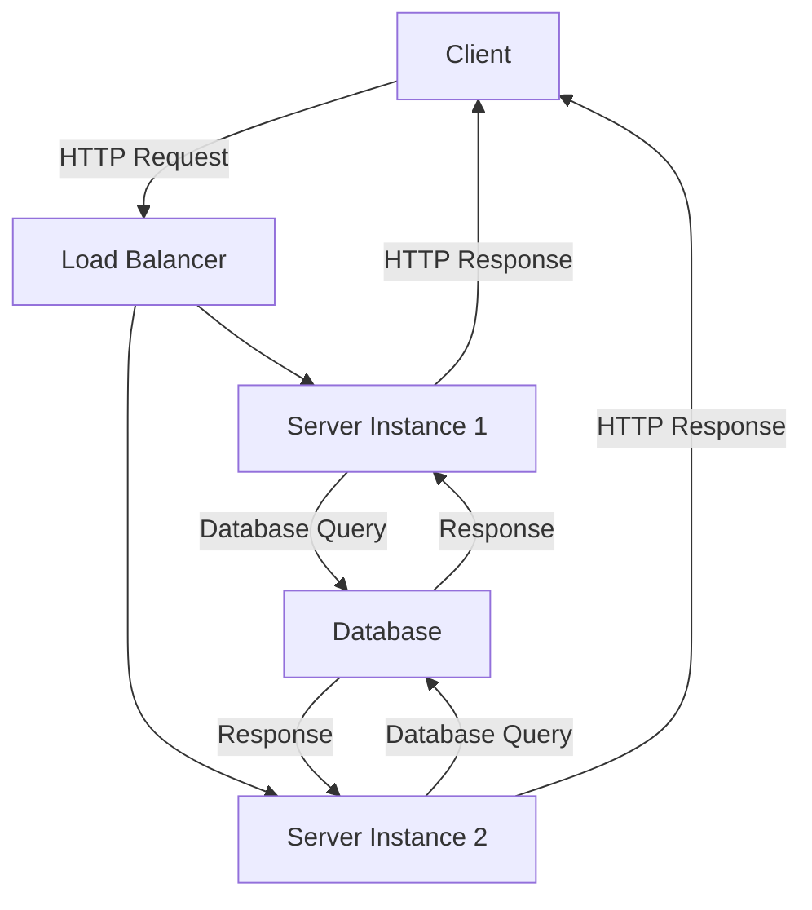

## 18.6 Server-Side Dart Applications

In recent years, Dart has emerged as a versatile language not only for building client-side applications with Flutter but also for developing robust server-side applications. This section delves into the world of server-side Dart applications, exploring how to leverage Dart's features and design patterns to create scalable, high-performance backend solutions.

### Using Dart on the Backend

Dart's capabilities extend beyond mobile and web development, offering a powerful platform for server-side applications. With the `dart:io` library, developers can build server applications that handle HTTP requests, manage file systems, and perform network operations. Dart's asynchronous programming model, combined with its strong typing and modern syntax, makes it an excellent choice for backend development.

#### Key Features of Dart for Server-Side Development

1. **Asynchronous Programming**: Dart's `async` and `await` keywords simplify asynchronous programming, allowing you to write non-blocking code that scales efficiently.
2. **Strong Typing**: Dart's type system helps catch errors at compile time, improving code reliability and maintainability.
3. **Cross-Platform**: Dart runs on multiple platforms, making it suitable for developing cross-platform server applications.
4. **Rich Standard Library**: The `dart:io` library provides comprehensive support for file, socket, and HTTP operations.

#### Setting Up a Dart Server

To get started with server-side Dart, you'll need to set up a basic Dart server. Here's a simple example:

```dart
import 'dart:io';

void main() async {
  final server = await HttpServer.bind(
    InternetAddress.loopbackIPv4,
    8080,
  );
  print('Listening on localhost:${server.port}');

  await for (HttpRequest request in server) {
    request.response
      ..write('Hello, Dart Server!')
      ..close();
  }
}
```

In this example, we create an HTTP server that listens on port 8080 and responds with a simple message. This basic setup serves as a foundation for more complex server applications.

### Patterns Implemented

Design patterns play a crucial role in structuring server-side applications, promoting code reuse, and enhancing maintainability. In this section, we'll explore how to implement the Repository, Singleton, and Factory patterns in Dart.

#### Repository Pattern

The Repository pattern abstracts data access logic, providing a clean separation between the data layer and the business logic. This pattern is particularly useful in server-side applications where data access is a frequent operation.

**Intent**: To encapsulate data access logic and provide a uniform interface for data operations.

**Key Participants**:
- **Repository**: Defines methods for accessing data.
- **Data Source**: The actual source of data, such as a database or API.

**Applicability**: Use the Repository pattern when you need to separate data access logic from business logic, making it easier to swap data sources or mock data in tests.

**Sample Code Snippet**:

```dart
abstract class UserRepository {
  Future<User> getUserById(String id);
}

class ApiUserRepository implements UserRepository {
  @override
  Future<User> getUserById(String id) async {
    // Simulate an API call
    return User(id, 'John Doe');
  }
}

class User {
  final String id;
  final String name;

  User(this.id, this.name);
}
```

In this example, `UserRepository` defines the contract for data access, while `ApiUserRepository` implements the actual data retrieval logic.

#### Singleton Pattern

The Singleton pattern ensures that a class has only one instance and provides a global point of access to it. This pattern is useful for managing shared resources, such as configuration settings or database connections.

**Intent**: To restrict the instantiation of a class to a single object.

**Key Participants**:
- **Singleton**: The class that is restricted to a single instance.

**Applicability**: Use the Singleton pattern when you need to control access to a shared resource or ensure a single point of access to a service.

**Sample Code Snippet**:

```dart
class DatabaseConnection {
  static final DatabaseConnection _instance = DatabaseConnection._internal();

  factory DatabaseConnection() {
    return _instance;
  }

  DatabaseConnection._internal();

  void connect() {
    print('Connected to the database');
  }
}

void main() {
  var db1 = DatabaseConnection();
  var db2 = DatabaseConnection();

  print(identical(db1, db2)); // true
}
```

In this example, `DatabaseConnection` is a singleton class, ensuring that only one instance exists throughout the application.

#### Factory Pattern

The Factory pattern provides an interface for creating objects, allowing subclasses to alter the type of objects that will be created. This pattern is useful for managing object creation logic in a flexible and scalable way.

**Intent**: To define an interface for creating objects, allowing subclasses to decide which class to instantiate.

**Key Participants**:
- **Factory**: The interface or abstract class defining the method for creating objects.
- **Concrete Factory**: Implements the factory method to create specific objects.

**Applicability**: Use the Factory pattern when you need to manage complex object creation logic or when the exact type of object to be created is determined at runtime.

**Sample Code Snippet**:

```dart
abstract class Logger {
  void log(String message);
}

class ConsoleLogger implements Logger {
  @override
  void log(String message) {
    print('Console: $message');
  }
}

class FileLogger implements Logger {
  @override
  void log(String message) {
    // Write to a file
    print('File: $message');
  }
}

class LoggerFactory {
  static Logger getLogger(String type) {
    if (type == 'console') {
      return ConsoleLogger();
    } else if (type == 'file') {
      return FileLogger();
    }
    throw Exception('Unknown logger type');
  }
}

void main() {
  var logger = LoggerFactory.getLogger('console');
  logger.log('Hello, Factory Pattern!');
}
```

In this example, `LoggerFactory` provides a method for creating different types of loggers based on the input type.

### Scalability

Scalability is a critical consideration in server-side applications, ensuring that the application can handle increased load and maintain performance. Dart's asynchronous programming model, combined with design patterns, provides a solid foundation for building scalable applications.

#### Designing for High Availability

High availability ensures that your application remains operational even in the face of failures. To achieve high availability, consider the following strategies:

1. **Load Balancing**: Distribute incoming requests across multiple servers to prevent any single server from becoming a bottleneck.
2. **Redundancy**: Deploy multiple instances of your application to ensure that if one instance fails, others can take over.
3. **Failover Mechanisms**: Implement automatic failover mechanisms to switch to backup systems in case of failure.

#### Load Handling

Handling increased load requires efficient resource management and optimization. Here are some strategies to consider:

1. **Asynchronous Processing**: Use Dart's asynchronous features to handle multiple requests concurrently without blocking.
2. **Caching**: Implement caching mechanisms to reduce the load on the server by storing frequently accessed data.
3. **Database Optimization**: Optimize database queries and use indexing to improve data retrieval performance.

### Visualizing Server-Side Dart Architecture

To better understand the architecture of a server-side Dart application, let's visualize the components and their interactions using a Mermaid.js diagram.



**Diagram Description**: This diagram illustrates a typical server-side Dart architecture with load balancing. Clients send HTTP requests to a load balancer, which distributes the requests to multiple server instances. Each server instance interacts with a database to retrieve data and sends the response back to the client.

### Try It Yourself

To deepen your understanding, try modifying the code examples provided in this section. Here are some suggestions:

1. **Extend the Repository Pattern**: Add methods for creating, updating, and deleting users in the `UserRepository` interface.
2. **Enhance the Singleton Pattern**: Implement a configuration manager using the Singleton pattern to manage application settings.
3. **Experiment with the Factory Pattern**: Create additional logger types, such as a `NetworkLogger` that sends logs to a remote server.

### Knowledge Check

Before moving on, let's reinforce what we've learned:

- **What is the primary benefit of using the Repository pattern in server-side applications?**
- **How does the Singleton pattern ensure a single instance of a class?**
- **In what scenarios is the Factory pattern particularly useful?**

### Embrace the Journey

Remember, mastering server-side Dart applications is a journey. As you continue to explore and experiment with Dart's features and design patterns, you'll gain the skills needed to build scalable, high-performance backend solutions. Stay curious, keep experimenting, and enjoy the process!

### References and Links

For further reading and exploration, consider the following resources:

- [Dart Language Tour](https://dart.dev/guides/language/language-tour)
- [Asynchronous Programming in Dart](https://dart.dev/codelabs/async-await)
- [Design Patterns in Dart](https://refactoring.guru/design-patterns/dart)

## Quiz Time!



### What is the primary benefit of using the Repository pattern in server-side applications?

- [x] It separates data access logic from business logic.
- [ ] It ensures a single instance of a class.
- [ ] It provides an interface for creating objects.
- [ ] It handles asynchronous operations efficiently.

> **Explanation:** The Repository pattern abstracts data access logic, providing a clean separation between the data layer and the business logic.

### How does the Singleton pattern ensure a single instance of a class?

- [x] By using a private constructor and a static instance.
- [ ] By implementing an interface.
- [ ] By using asynchronous programming.
- [ ] By separating data access logic.

> **Explanation:** The Singleton pattern uses a private constructor and a static instance to ensure that only one instance of the class exists.

### In what scenarios is the Factory pattern particularly useful?

- [x] When the exact type of object to be created is determined at runtime.
- [ ] When you need to separate data access logic.
- [ ] When you need to ensure a single instance of a class.
- [ ] When handling asynchronous operations.

> **Explanation:** The Factory pattern is useful for managing complex object creation logic, especially when the exact type of object to be created is determined at runtime.

### What is a key feature of Dart for server-side development?

- [x] Asynchronous programming with `async` and `await`.
- [ ] Strong typing.
- [ ] Cross-platform capabilities.
- [ ] Rich standard library.

> **Explanation:** Dart's asynchronous programming model, using `async` and `await`, simplifies writing non-blocking code that scales efficiently.

### Which pattern is used to manage shared resources like configuration settings?

- [x] Singleton Pattern
- [ ] Repository Pattern
- [ ] Factory Pattern
- [ ] Observer Pattern

> **Explanation:** The Singleton pattern is used to manage shared resources, ensuring a single point of access to a service.

### What is the purpose of load balancing in server-side applications?

- [x] To distribute incoming requests across multiple servers.
- [ ] To ensure a single instance of a class.
- [ ] To manage object creation logic.
- [ ] To separate data access logic.

> **Explanation:** Load balancing distributes incoming requests across multiple servers to prevent any single server from becoming a bottleneck.

### Which pattern provides an interface for creating objects?

- [x] Factory Pattern
- [ ] Singleton Pattern
- [ ] Repository Pattern
- [ ] Observer Pattern

> **Explanation:** The Factory pattern provides an interface for creating objects, allowing subclasses to decide which class to instantiate.

### What is a benefit of using Dart's asynchronous programming model?

- [x] It allows writing non-blocking code that scales efficiently.
- [ ] It ensures a single instance of a class.
- [ ] It separates data access logic.
- [ ] It provides an interface for creating objects.

> **Explanation:** Dart's asynchronous programming model allows writing non-blocking code that scales efficiently, making it suitable for server-side applications.

### What is a common strategy for achieving high availability in server-side applications?

- [x] Redundancy
- [ ] Singleton Pattern
- [ ] Factory Pattern
- [ ] Observer Pattern

> **Explanation:** Redundancy involves deploying multiple instances of your application to ensure that if one instance fails, others can take over.

### True or False: Dart is only suitable for client-side applications.

- [ ] True
- [x] False

> **Explanation:** Dart is suitable for both client-side and server-side applications, offering powerful features for backend development.


