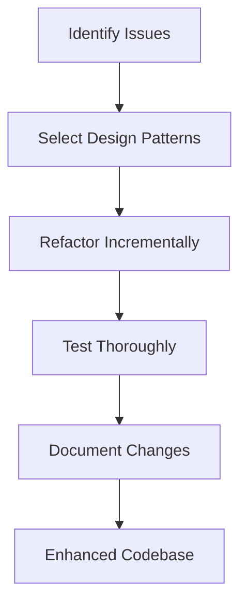

## 18.7 Refactoring Legacy Dart/Flutter Applications

Refactoring legacy applications is a crucial task for developers aiming to enhance the maintainability, performance, and scalability of their software. In this section, we will explore the process of refactoring legacy Dart and Flutter applications. We'll cover how to identify issues in existing codebases, gradually introduce design patterns, and achieve improved outcomes.

### Understanding Legacy Code

Legacy code refers to an existing codebase that is often outdated, difficult to maintain, or lacking in modern best practices. It may have been developed using older versions of Dart or Flutter, or without the use of design patterns. Refactoring such code involves restructuring it without altering its external behavior, aiming to improve its internal structure.

#### Characteristics of Legacy Code

- **Lack of Documentation**: Often, legacy code lacks proper documentation, making it challenging to understand the original intent.
- **Complex Dependencies**: Legacy applications may have tightly coupled components, leading to complex dependencies.
- **Outdated Practices**: Use of deprecated features or practices that are no longer recommended.
- **Poor Test Coverage**: Legacy code often lacks comprehensive tests, making changes risky.

### Assessment: Identifying Issues in Existing Codebases

Before refactoring, it's essential to assess the current state of the codebase. This involves identifying areas that need improvement and understanding the impact of potential changes.

#### Steps to Assess a Legacy Codebase

1. **Code Review**: Conduct a thorough review of the code to identify areas of concern, such as code smells, duplicated code, and complex logic.
2. **Dependency Analysis**: Examine dependencies to identify tightly coupled components that may hinder refactoring efforts.
3. **Performance Profiling**: Use profiling tools to identify performance bottlenecks.
4. **Test Coverage Analysis**: Evaluate the existing test coverage to identify gaps and areas that require additional testing.

#### Common Issues in Legacy Dart/Flutter Applications

- **State Management Problems**: Inefficient or outdated state management techniques.
- **UI Performance Issues**: Unoptimized widget trees leading to poor UI performance.
- **Code Duplication**: Repeated code blocks that increase maintenance overhead.
- **Lack of Modularity**: Monolithic code structures that are hard to modify or extend.

### Pattern Integration: Gradually Introducing Design Patterns

Design patterns provide proven solutions to common software design problems. Integrating design patterns into a legacy codebase can significantly improve its structure and maintainability.

#### Steps to Integrate Design Patterns

1. **Identify Suitable Patterns**: Determine which design patterns are most applicable to the issues identified in the assessment phase.
2. **Refactor Incrementally**: Gradually introduce patterns to minimize disruption and reduce the risk of introducing new bugs.
3. **Test Thoroughly**: Ensure that each refactoring step is accompanied by thorough testing to verify that the application's behavior remains unchanged.
4. **Document Changes**: Maintain clear documentation of the refactoring process to aid future maintenance efforts.

#### Key Design Patterns for Dart/Flutter

- **Singleton Pattern**: Useful for managing shared resources or services.
- **Provider Pattern**: Facilitates efficient state management and dependency injection.
- **Builder Pattern**: Helps construct complex objects step by step.
- **Observer Pattern**: Enables reactive programming by allowing components to subscribe to changes.

### Outcome: Enhanced Maintainability and Performance

The ultimate goal of refactoring is to achieve a codebase that is easier to maintain, extend, and optimize. By integrating design patterns and addressing identified issues, developers can significantly enhance the application's maintainability and performance.

#### Benefits of Refactoring

- **Improved Readability**: Cleaner code that is easier to understand and modify.
- **Reduced Complexity**: Simplified code structures that reduce cognitive load.
- **Enhanced Performance**: Optimized code paths and reduced resource usage.
- **Better Testability**: Increased test coverage and easier testing of individual components.

### Code Examples

Let's explore some code examples to illustrate the refactoring process in a Dart/Flutter application.

#### Example 1: Refactoring with the Singleton Pattern

Suppose we have a legacy application with multiple instances of a configuration manager. We can refactor it using the Singleton pattern to ensure a single instance is used throughout the application.

```dart
// Before Refactoring: Multiple instances of ConfigurationManager
class ConfigurationManager {
  void loadConfig() {
    // Load configuration
  }
}

// Usage
var config1 = ConfigurationManager();
var config2 = ConfigurationManager();
config1.loadConfig();
config2.loadConfig();

// After Refactoring: Singleton Pattern
class ConfigurationManager {
  static final ConfigurationManager _instance = ConfigurationManager._internal();

  factory ConfigurationManager() {
    return _instance;
  }

  ConfigurationManager._internal();

  void loadConfig() {
    // Load configuration
  }
}

// Usage
var config = ConfigurationManager();
config.loadConfig();
```

#### Example 2: Refactoring with the Provider Pattern

Consider a legacy application with a tightly coupled state management system. We can refactor it using the Provider pattern to decouple state management from the UI.

```dart
// Before Refactoring: Tightly coupled state management
class Counter {
  int value = 0;

  void increment() {
    value++;
  }
}

// Usage in UI
class CounterWidget extends StatelessWidget {
  final Counter counter = Counter();

  @override
  Widget build(BuildContext context) {
    return Text('Counter: ${counter.value}');
  }
}

// After Refactoring: Provider Pattern
class Counter with ChangeNotifier {
  int _value = 0;

  int get value => _value;

  void increment() {
    _value++;
    notifyListeners();
  }
}

// Usage in UI
class CounterWidget extends StatelessWidget {
  @override
  Widget build(BuildContext context) {
    final counter = Provider.of<Counter>(context);

    return Text('Counter: ${counter.value}');
  }
}
```

### Visualizing the Refactoring Process

To better understand the refactoring process, let's visualize the transformation of a legacy codebase using a flowchart.



**Figure 1: Refactoring Process Flowchart**

### Try It Yourself

To gain hands-on experience with refactoring, try modifying the provided code examples. Experiment with different design patterns and observe how they impact the code's structure and performance.

### References and Links

- [Dart Language Tour](https://dart.dev/guides/language/language-tour)
- [Flutter Documentation](https://flutter.dev/docs)
- [Refactoring Guru](https://refactoring.guru/)

### Knowledge Check

- What are the key characteristics of legacy code?
- How can design patterns improve a legacy codebase?
- What are the benefits of using the Singleton pattern in Dart?

### Embrace the Journey

Refactoring legacy applications is a rewarding journey that enhances your skills and improves the software you work on. Remember, this is just the beginning. As you progress, you'll build more robust and maintainable applications. Keep experimenting, stay curious, and enjoy the journey!

### Quiz Time!



### What is a common issue found in legacy Dart/Flutter applications?

- [x] Poor test coverage
- [ ] Excessive use of modern design patterns
- [ ] Over-optimization of code
- [ ] Lack of UI components

> **Explanation:** Legacy applications often lack comprehensive tests, making changes risky.

### Which design pattern is useful for managing shared resources in Dart?

- [x] Singleton Pattern
- [ ] Observer Pattern
- [ ] Factory Pattern
- [ ] Strategy Pattern

> **Explanation:** The Singleton pattern ensures a class has only one instance and provides a global point of access to it.

### What is the first step in assessing a legacy codebase?

- [x] Code Review
- [ ] Refactoring
- [ ] Testing
- [ ] Documentation

> **Explanation:** Conducting a thorough code review helps identify areas of concern, such as code smells and complex logic.

### How can the Provider pattern benefit a legacy application?

- [x] By decoupling state management from the UI
- [ ] By increasing code duplication
- [ ] By tightly coupling components
- [ ] By reducing test coverage

> **Explanation:** The Provider pattern facilitates efficient state management and dependency injection, decoupling state management from the UI.

### What is a benefit of refactoring legacy code?

- [x] Improved readability
- [ ] Increased complexity
- [ ] Reduced testability
- [ ] Decreased performance

> **Explanation:** Refactoring leads to cleaner code that is easier to understand and modify.

### Which tool can be used to identify performance bottlenecks in a legacy application?

- [x] Profiling tools
- [ ] Code editors
- [ ] Version control systems
- [ ] Text processors

> **Explanation:** Profiling tools help identify performance bottlenecks by analyzing the application's runtime behavior.

### What should accompany each refactoring step?

- [x] Thorough testing
- [ ] Code duplication
- [ ] Increased complexity
- [ ] Reduced documentation

> **Explanation:** Thorough testing ensures that the application's behavior remains unchanged after refactoring.

### What is the purpose of documenting changes during refactoring?

- [x] To aid future maintenance efforts
- [ ] To increase code complexity
- [ ] To reduce code readability
- [ ] To eliminate test coverage

> **Explanation:** Maintaining clear documentation of the refactoring process helps future maintenance efforts.

### True or False: Refactoring should be done all at once to minimize disruption.

- [ ] True
- [x] False

> **Explanation:** Refactoring should be done incrementally to minimize disruption and reduce the risk of introducing new bugs.

### What is the ultimate goal of refactoring a legacy codebase?

- [x] Enhanced maintainability and performance
- [ ] Increased code duplication
- [ ] Reduced test coverage
- [ ] Decreased readability

> **Explanation:** The ultimate goal of refactoring is to achieve a codebase that is easier to maintain, extend, and optimize.


