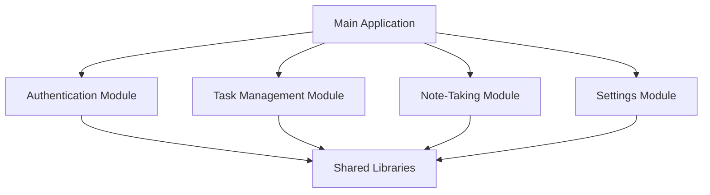
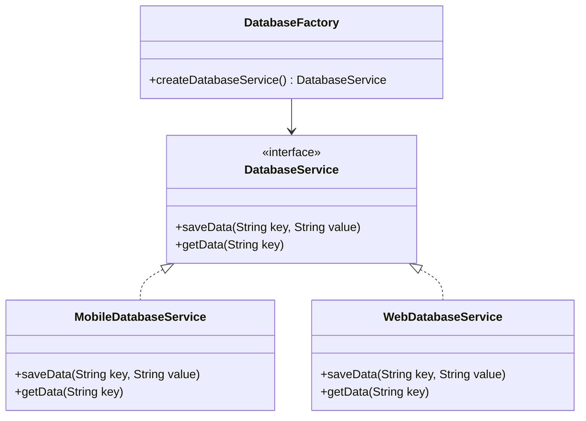

## 18.8 Patterns in Cross-Platform Development with Dart

In today's fast-paced digital world, the demand for applications that run seamlessly across multiple platforms is higher than ever. Dart, with its robust ecosystem and the powerful Flutter framework, offers a compelling solution for cross-platform development. This section delves into the design patterns that facilitate code reuse and platform abstractions, enabling developers to build efficient, maintainable, and scalable applications for mobile, web, and desktop environments.

### Introduction to Cross-Platform Development with Dart

Cross-platform development refers to the practice of writing code that can run on multiple operating systems and devices with minimal modification. Dart, as a language, and Flutter, as a framework, provide a unified approach to building applications that can target iOS, Android, web, and desktop platforms. This capability is crucial for reducing development time, costs, and complexity.

#### Key Benefits of Cross-Platform Development

- **Code Reuse**: Write once, run anywhere. This reduces duplication and maintenance overhead.
- **Consistent User Experience**: Ensure a uniform look and feel across different platforms.
- **Faster Time to Market**: Develop and deploy applications more quickly by leveraging shared codebases.
- **Cost Efficiency**: Minimize resources by maintaining a single codebase.

### Sharing Code: Maximizing Code Reuse

One of the primary goals in cross-platform development is maximizing code reuse. This involves identifying common functionalities and abstracting them into shared modules or libraries. Dart's language features, such as its strong typing, asynchronous programming capabilities, and support for mixins and extensions, make it well-suited for this task.

#### Strategies for Code Reuse

1. **Modular Architecture**: Break down your application into smaller, reusable modules. Each module should encapsulate a specific functionality or feature that can be used across different parts of the application.

2. **Shared Libraries**: Create libraries for common functionalities such as networking, data storage, and authentication. These libraries can be imported and used across different platforms.

3. **Platform-Specific Code**: While the goal is to maximize shared code, some platform-specific code is inevitable. Use conditional imports and platform checks to handle these cases.

4. **Use of Mixins and Extensions**: Dart's mixins and extensions allow you to add functionality to existing classes without modifying them. This is particularly useful for extending platform-specific classes with shared functionality.

#### Example: Creating a Shared Networking Library

Let's consider a simple example of creating a shared networking library that can be used across mobile, web, and desktop platforms.

```dart
import 'dart:convert';
import 'package:http/http.dart' as http;

class NetworkService {
  final String baseUrl;

  NetworkService(this.baseUrl);

  Future<Map<String, dynamic>> get(String endpoint) async {
    final response = await http.get(Uri.parse('$baseUrl$endpoint'));
    if (response.statusCode == 200) {
      return jsonDecode(response.body);
    } else {
      throw Exception('Failed to load data');
    }
  }

  Future<Map<String, dynamic>> post(String endpoint, Map<String, dynamic> data) async {
    final response = await http.post(
      Uri.parse('$baseUrl$endpoint'),
      headers: {'Content-Type': 'application/json'},
      body: jsonEncode(data),
    );
    if (response.statusCode == 200) {
      return jsonDecode(response.body);
    } else {
      throw Exception('Failed to post data');
    }
  }
}
```

In this example, the `NetworkService` class provides a simple interface for making HTTP GET and POST requests. This class can be used across different platforms without modification.

### Platform Abstractions: Using Factory and Adapter Patterns

While sharing code is essential, handling platform-specific differences is equally important. The Factory and Adapter design patterns are instrumental in creating abstractions that manage these differences effectively.

#### Factory Pattern

The Factory pattern provides a way to create objects without specifying the exact class of object that will be created. This is particularly useful in cross-platform development, where different platforms may require different implementations of a service or component.

##### Example: Platform-Specific Database Factory

Consider a scenario where you need to use different database solutions on mobile and web platforms. You can use the Factory pattern to abstract the creation of the database service.

```dart
abstract class DatabaseService {
  void saveData(String key, String value);
  String? getData(String key);
}

class MobileDatabaseService implements DatabaseService {
  @override
  void saveData(String key, String value) {
    // Implementation for mobile
  }

  @override
  String? getData(String key) {
    // Implementation for mobile
    return null;
  }
}

class WebDatabaseService implements DatabaseService {
  @override
  void saveData(String key, String value) {
    // Implementation for web
  }

  @override
  String? getData(String key) {
    // Implementation for web
    return null;
  }
}

class DatabaseFactory {
  static DatabaseService createDatabaseService() {
    if (isMobilePlatform()) {
      return MobileDatabaseService();
    } else {
      return WebDatabaseService();
    }
  }

  static bool isMobilePlatform() {
    // Logic to determine if the platform is mobile
    return true;
  }
}
```

In this example, the `DatabaseFactory` class provides a method to create the appropriate `DatabaseService` implementation based on the platform.

#### Adapter Pattern

The Adapter pattern allows incompatible interfaces to work together. It acts as a bridge between two incompatible interfaces, making it an ideal choice for integrating platform-specific APIs with a common interface.

##### Example: Adapting Platform-Specific APIs

Suppose you have a platform-specific API for accessing device sensors. You can use the Adapter pattern to create a common interface for accessing sensor data.

```dart
abstract class SensorData {
  double getTemperature();
}

class MobileSensorData implements SensorData {
  @override
  double getTemperature() {
    // Mobile-specific implementation
    return 25.0;
  }
}

class WebSensorData implements SensorData {
  @override
  double getTemperature() {
    // Web-specific implementation
    return 20.0;
  }
}

class SensorAdapter implements SensorData {
  final SensorData _sensorData;

  SensorAdapter(this._sensorData);

  @override
  double getTemperature() {
    return _sensorData.getTemperature();
  }
}

void main() {
  SensorData sensorData;
  if (isMobilePlatform()) {
    sensorData = SensorAdapter(MobileSensorData());
  } else {
    sensorData = SensorAdapter(WebSensorData());
  }

  print('Temperature: ${sensorData.getTemperature()}');
}
```

In this example, the `SensorAdapter` class adapts the platform-specific implementations to a common interface, allowing the application to access sensor data without worrying about platform differences.

### Case Study: Developing Applications That Run Seamlessly Across Platforms

To illustrate the application of these patterns in a real-world scenario, let's consider a case study of developing a cross-platform application using Dart and Flutter.

#### Project Overview

The project involves creating a productivity application that allows users to manage tasks and notes. The application should run on iOS, Android, web, and desktop platforms, providing a consistent user experience across all devices.

#### Architecture and Design

1. **Modular Architecture**: The application is divided into modules for authentication, task management, note-taking, and settings. Each module is designed to be reusable and platform-agnostic.

2. **Shared Libraries**: Common functionalities such as networking, data storage, and authentication are implemented as shared libraries. These libraries use the Factory and Adapter patterns to handle platform-specific differences.

3. **Platform-Specific Code**: Platform-specific code is isolated using conditional imports and platform checks. This ensures that the shared codebase remains clean and maintainable.

#### Implementation Details

- **Authentication Module**: The authentication module uses a shared library for handling user authentication. The library supports multiple authentication providers, such as email/password, Google, and Facebook.

- **Task Management Module**: The task management module provides a common interface for managing tasks. It uses the Factory pattern to create platform-specific implementations for data storage.

- **Note-Taking Module**: The note-taking module allows users to create and manage notes. It uses the Adapter pattern to integrate with platform-specific APIs for accessing device storage.

- **Settings Module**: The settings module provides a common interface for managing application settings. It uses shared libraries for handling preferences and configurations.

#### Code Example: Task Management Module

```dart
abstract class TaskService {
  void addTask(String task);
  List<String> getTasks();
}

class MobileTaskService implements TaskService {
  @override
  void addTask(String task) {
    // Mobile-specific implementation
  }

  @override
  List<String> getTasks() {
    // Mobile-specific implementation
    return [];
  }
}

class WebTaskService implements TaskService {
  @override
  void addTask(String task) {
    // Web-specific implementation
  }

  @override
  List<String> getTasks() {
    // Web-specific implementation
    return [];
  }
}

class TaskFactory {
  static TaskService createTaskService() {
    if (isMobilePlatform()) {
      return MobileTaskService();
    } else {
      return WebTaskService();
    }
  }
}

void main() {
  TaskService taskService = TaskFactory.createTaskService();
  taskService.addTask('Complete the project');
  print('Tasks: ${taskService.getTasks()}');
}
```

In this example, the `TaskFactory` class provides a method to create the appropriate `TaskService` implementation based on the platform.

### Design Considerations

When developing cross-platform applications with Dart, it's important to consider the following design considerations:

- **Performance**: Ensure that the application performs well on all target platforms. Use platform-specific optimizations where necessary.

- **User Experience**: Provide a consistent user experience across platforms. Use platform-specific UI components and design guidelines to enhance the user experience.

- **Testing**: Test the application thoroughly on all target platforms. Use automated testing tools to ensure that the application behaves as expected.

- **Maintenance**: Keep the codebase clean and maintainable. Use design patterns to manage complexity and facilitate code reuse.

### Differences and Similarities with Other Patterns

While the Factory and Adapter patterns are commonly used in cross-platform development, they are often confused with other patterns such as the Singleton and Proxy patterns. It's important to understand the differences and similarities between these patterns to use them effectively.

- **Factory vs. Singleton**: The Factory pattern is used to create objects, while the Singleton pattern ensures that a class has only one instance. Both patterns can be used together to manage object creation and lifecycle.

- **Adapter vs. Proxy**: The Adapter pattern is used to make incompatible interfaces work together, while the Proxy pattern provides a surrogate or placeholder for another object. Both patterns can be used to manage access to objects and interfaces.

### Visualizing Cross-Platform Development Patterns

To better understand the application of these patterns, let's visualize the architecture of a cross-platform application using Mermaid.js diagrams.

#### Modular Architecture Diagram



**Description**: This diagram illustrates the modular architecture of a cross-platform application. The main application is divided into modules, each of which uses shared libraries for common functionalities.

#### Factory Pattern Diagram



**Description**: This class diagram illustrates the Factory pattern used to create platform-specific database services. The `DatabaseFactory` class provides a method to create the appropriate `DatabaseService` implementation based on the platform.

### Try It Yourself

To deepen your understanding of cross-platform development patterns, try modifying the code examples provided in this section. Experiment with different platform-specific implementations and see how the Factory and Adapter patterns can be used to manage platform differences.

### Knowledge Check

Before moving on, take a moment to review the key concepts covered in this section. Consider the following questions:

- How can the Factory pattern be used to manage platform-specific differences in a cross-platform application?
- What are the benefits of using the Adapter pattern in cross-platform development?
- How can shared libraries be used to maximize code reuse in a cross-platform application?

### Conclusion

Cross-platform development with Dart and Flutter offers a powerful approach to building applications that run seamlessly across mobile, web, and desktop platforms. By leveraging design patterns such as Factory and Adapter, developers can maximize code reuse, manage platform-specific differences, and create efficient, maintainable applications. As you continue your journey in cross-platform development, remember to experiment, stay curious, and embrace the challenges and opportunities that come your way.

## Quiz Time!



### What is the primary goal of cross-platform development?

- [x] Maximizing code reuse
- [ ] Minimizing code complexity
- [ ] Enhancing platform-specific features
- [ ] Reducing application size

> **Explanation:** The primary goal of cross-platform development is to maximize code reuse across different platforms, reducing duplication and maintenance overhead.

### Which design pattern is used to create objects without specifying the exact class of object that will be created?

- [x] Factory Pattern
- [ ] Adapter Pattern
- [ ] Singleton Pattern
- [ ] Proxy Pattern

> **Explanation:** The Factory pattern provides a way to create objects without specifying the exact class of object that will be created, making it useful for managing platform-specific differences.

### How does the Adapter pattern help in cross-platform development?

- [x] It allows incompatible interfaces to work together.
- [ ] It ensures a class has only one instance.
- [ ] It provides a surrogate for another object.
- [ ] It manages object creation.

> **Explanation:** The Adapter pattern allows incompatible interfaces to work together, making it ideal for integrating platform-specific APIs with a common interface.

### What is a key benefit of using shared libraries in cross-platform development?

- [x] Code reuse across different platforms
- [ ] Enhanced platform-specific features
- [ ] Reduced application size
- [ ] Improved user experience

> **Explanation:** Shared libraries enable code reuse across different platforms, reducing duplication and maintenance overhead.

### Which pattern is commonly confused with the Factory pattern?

- [x] Singleton Pattern
- [ ] Adapter Pattern
- [ ] Proxy Pattern
- [ ] Observer Pattern

> **Explanation:** The Factory pattern is often confused with the Singleton pattern, but they serve different purposes. The Factory pattern is used for object creation, while the Singleton pattern ensures a class has only one instance.

### What is the role of the `DatabaseFactory` class in the provided example?

- [x] To create the appropriate `DatabaseService` implementation based on the platform
- [ ] To manage database connections
- [ ] To provide a common interface for database operations
- [ ] To store database credentials

> **Explanation:** The `DatabaseFactory` class provides a method to create the appropriate `DatabaseService` implementation based on the platform, using the Factory pattern.

### How can platform-specific code be isolated in a cross-platform application?

- [x] Using conditional imports and platform checks
- [ ] By creating separate codebases for each platform
- [ ] By using only shared libraries
- [ ] By avoiding platform-specific features

> **Explanation:** Platform-specific code can be isolated using conditional imports and platform checks, ensuring that the shared codebase remains clean and maintainable.

### What is a key consideration when developing cross-platform applications?

- [x] Performance on all target platforms
- [ ] Minimizing code complexity
- [ ] Enhancing platform-specific features
- [ ] Reducing application size

> **Explanation:** Ensuring that the application performs well on all target platforms is a key consideration in cross-platform development.

### Which pattern provides a surrogate or placeholder for another object?

- [x] Proxy Pattern
- [ ] Factory Pattern
- [ ] Adapter Pattern
- [ ] Singleton Pattern

> **Explanation:** The Proxy pattern provides a surrogate or placeholder for another object, managing access to it.

### True or False: The Adapter pattern is used to ensure a class has only one instance.

- [ ] True
- [x] False

> **Explanation:** False. The Adapter pattern is used to allow incompatible interfaces to work together, not to ensure a class has only one instance.


