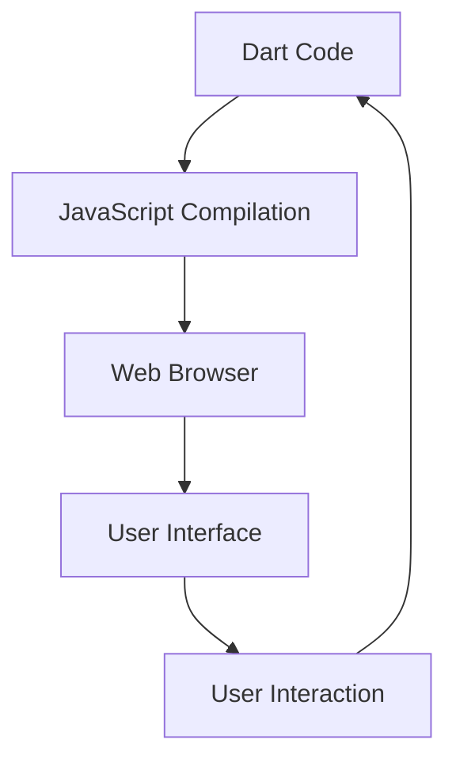

## 18.9 Using Dart in Web Development

In the ever-evolving landscape of web development, Dart has emerged as a powerful language for building client-side applications. With its strong typing, modern syntax, and robust tooling, Dart offers a compelling alternative to JavaScript for web developers. In this section, we will explore how to use Dart for web development, focusing on building dynamic client-side applications with AngularDart. We will delve into design patterns like MVC (Model-View-Controller) and Observer, and discuss strategies for optimizing performance to ensure fast load times and smooth interactions.

### Introduction to Dart for Web Development

Dart is a versatile language developed by Google, designed to be easy to learn and efficient to use. While it is widely known for its role in Flutter for mobile app development, Dart is also a powerful tool for building web applications. Dart's ability to compile to JavaScript makes it a viable option for client-side web development, allowing developers to write code in Dart and run it in any modern web browser.

#### Key Features of Dart for Web Development

- **Strong Typing**: Dart's static type system helps catch errors at compile time, reducing runtime errors and improving code quality.
- **Modern Syntax**: Dart's syntax is clean and concise, making it easy to read and write.
- **Tooling Support**: Dart comes with a rich set of tools, including the Dart DevTools for debugging and performance analysis.
- **Interoperability**: Dart can easily interoperate with JavaScript, allowing developers to leverage existing JavaScript libraries and frameworks.

### Building Client-Side Applications with AngularDart

AngularDart is a web application framework that leverages Dart's capabilities to build dynamic and scalable web applications. It is a variant of the popular Angular framework, tailored specifically for Dart. AngularDart provides a component-based architecture, making it easy to build reusable UI components and manage application state.

#### Setting Up AngularDart

To get started with AngularDart, you need to set up your development environment. Follow these steps:

1. **Install Dart**: Download and install the Dart SDK from the [official Dart website](https://dart.dev/get-dart).
2. **Set Up Your IDE**: Use an IDE like Visual Studio Code or IntelliJ IDEA, both of which have excellent support for Dart.
3. **Create a New AngularDart Project**: Use the Dart command-line tool to create a new AngularDart project:
   ```bash
   dart create -t web-angular my_angular_dart_app
   ```
4. **Run Your Application**: Navigate to your project directory and run the application:
   ```bash
   cd my_angular_dart_app
   webdev serve
   ```

### Applying MVC and Observer Patterns

Design patterns play a crucial role in structuring and organizing code in web applications. In this section, we will explore how to apply the MVC and Observer patterns in AngularDart applications.

#### MVC Pattern in AngularDart

The MVC pattern divides an application into three interconnected components: Model, View, and Controller. This separation of concerns makes it easier to manage and scale applications.

- **Model**: Represents the data and business logic of the application.
- **View**: Handles the presentation layer and user interface.
- **Controller**: Acts as an intermediary between the Model and View, processing user input and updating the Model.

**Example: Implementing MVC in AngularDart**

Let's create a simple AngularDart application that uses the MVC pattern to manage a list of tasks.

```dart
// model.dart
class Task {
  String name;
  bool isCompleted;

  Task(this.name, this.isCompleted);
}

// task_service.dart
import 'model.dart';

class TaskService {
  final List<Task> _tasks = [];

  List<Task> get tasks => _tasks;

  void addTask(String name) {
    _tasks.add(Task(name, false));
  }

  void toggleTaskCompletion(Task task) {
    task.isCompleted = !task.isCompleted;
  }
}

// task_component.dart
import 'package:angular/angular.dart';
import 'task_service.dart';

@Component(
  selector: 'task-list',
  templateUrl: 'task_component.html',
  directives: [coreDirectives],
)
class TaskComponent {
  final TaskService _taskService;

  TaskComponent(this._taskService);

  List<Task> get tasks => _taskService.tasks;

  void addTask(String name) {
    _taskService.addTask(name);
  }

  void toggleCompletion(Task task) {
    _taskService.toggleTaskCompletion(task);
  }
}

// task_component.html
<div>
  <h2>Task List</h2>
  <ul>
    <li *ngFor="let task of tasks">
      <input type="checkbox" [checked]="task.isCompleted" (change)="toggleCompletion(task)">
      {{ task.name }}
    </li>
  </ul>
  <input #taskName>
  <button (click)="addTask(taskName.value)">Add Task</button>
</div>
```

In this example, the `TaskService` acts as the Model, managing the list of tasks. The `TaskComponent` serves as the Controller, handling user interactions and updating the Model. The HTML template represents the View, displaying the list of tasks and providing input fields for user interaction.

#### Observer Pattern in AngularDart

The Observer pattern is a behavioral design pattern that allows an object, known as the subject, to maintain a list of its dependents, called observers, and notify them of any state changes. This pattern is particularly useful for implementing event-driven architectures and dynamic user interfaces.

**Example: Implementing Observer Pattern in AngularDart**

Let's extend our task management application to use the Observer pattern for real-time updates.

```dart
// observer.dart
abstract class Observer {
  void update();
}

abstract class Subject {
  void attach(Observer observer);
  void detach(Observer observer);
  void notify();
}

// task_subject.dart
import 'observer.dart';
import 'model.dart';

class TaskSubject implements Subject {
  final List<Observer> _observers = [];
  final List<Task> _tasks = [];

  List<Task> get tasks => _tasks;

  void addTask(String name) {
    _tasks.add(Task(name, false));
    notify();
  }

  void toggleTaskCompletion(Task task) {
    task.isCompleted = !task.isCompleted;
    notify();
  }

  @override
  void attach(Observer observer) {
    _observers.add(observer);
  }

  @override
  void detach(Observer observer) {
    _observers.remove(observer);
  }

  @override
  void notify() {
    for (var observer in _observers) {
      observer.update();
    }
  }
}

// task_component.dart
import 'package:angular/angular.dart';
import 'task_subject.dart';

@Component(
  selector: 'task-list',
  templateUrl: 'task_component.html',
  directives: [coreDirectives],
)
class TaskComponent implements Observer {
  final TaskSubject _taskSubject;

  TaskComponent(this._taskSubject) {
    _taskSubject.attach(this);
  }

  List<Task> get tasks => _taskSubject.tasks;

  void addTask(String name) {
    _taskSubject.addTask(name);
  }

  void toggleCompletion(Task task) {
    _taskSubject.toggleTaskCompletion(task);
  }

  @override
  void update() {
    // Update the view when notified
  }
}
```

In this example, the `TaskSubject` class implements the Subject interface, managing a list of tasks and notifying observers of any changes. The `TaskComponent` class implements the Observer interface, updating the view whenever the task list changes.

### Performance Optimization in Dart Web Applications

Performance is a critical aspect of web development. Users expect fast load times and smooth interactions, and any delays can lead to a poor user experience. In this section, we will explore strategies for optimizing the performance of Dart web applications.

#### Code Splitting and Lazy Loading

Code splitting is a technique that divides your application into smaller chunks, which can be loaded on demand. This reduces the initial load time by only loading the code necessary for the current view.

**Example: Implementing Code Splitting in AngularDart**

```dart
import 'package:angular/angular.dart';
import 'package:angular_router/angular_router.dart';

@Component(
  selector: 'my-app',
  template: '<router-outlet [routes]="routes"></router-outlet>',
  directives: [routerDirectives],
)
class AppComponent {
  final List<RouteDefinition> routes = [
    RouteDefinition(
      path: 'home',
      component: loadHomeComponent,
    ),
    RouteDefinition(
      path: 'about',
      component: loadAboutComponent,
    ),
  ];
}

Future<ComponentFactory> loadHomeComponent() async {
  return await loadLibrary().then((_) => HomeComponentNgFactory);
}

Future<ComponentFactory> loadAboutComponent() async {
  return await loadLibrary().then((_) => AboutComponentNgFactory);
}
```

In this example, we define routes for the application and use lazy loading to load components only when needed.

#### Caching and Service Workers

Caching is another effective way to improve performance by storing frequently accessed data locally. Service workers can be used to cache resources and serve them from the cache, reducing network requests and improving load times.

**Example: Implementing Service Workers in AngularDart**

```dart
import 'dart:html';

void main() {
  if ('serviceWorker' in window.navigator) {
    window.navigator.serviceWorker.register('/service_worker.js');
  }
}
```

In this example, we register a service worker that can cache resources and serve them from the cache.

### Try It Yourself

To deepen your understanding of Dart for web development, try modifying the examples provided in this section. Here are some suggestions:

- **Extend the Task Management Application**: Add features such as task categories, due dates, and priority levels.
- **Implement Additional Design Patterns**: Explore other design patterns, such as the Singleton or Factory patterns, and integrate them into your application.
- **Optimize Performance**: Experiment with different performance optimization techniques, such as minification and tree shaking, and measure their impact on load times.

### Visualizing Dart's Role in Web Development

To better understand how Dart fits into the web development ecosystem, let's visualize the architecture of a Dart web application using a Mermaid.js diagram.



**Diagram Description**: This diagram illustrates the flow of a Dart web application. Dart code is compiled to JavaScript, which runs in the web browser. The browser renders the user interface, which responds to user interactions and updates the Dart code.

### References and Links

For further reading and exploration, consider the following resources:

- [Dart Official Website](https://dart.dev/)
- [AngularDart Documentation](https://angulardart.dev/)
- [MDN Web Docs on JavaScript](https://developer.mozilla.org/en-US/docs/Web/JavaScript)
- [W3Schools JavaScript Tutorial](https://www.w3schools.com/js/)

### Knowledge Check

Before moving on, take a moment to reflect on what you've learned. Consider the following questions:

- How does Dart's strong typing benefit web development?
- What are the key components of the MVC pattern, and how do they interact?
- How can the Observer pattern be used to implement real-time updates in a web application?
- What are some strategies for optimizing the performance of Dart web applications?

### Embrace the Journey

Remember, mastering Dart for web development is a journey. As you continue to explore and experiment, you'll gain a deeper understanding of the language and its capabilities. Keep pushing the boundaries, stay curious, and enjoy the process of building dynamic and engaging web applications.

## Quiz Time!



### What is the primary advantage of using Dart for web development?

- [x] Strong typing and modern syntax
- [ ] Lack of tooling support
- [ ] Limited interoperability with JavaScript
- [ ] Complex syntax

> **Explanation:** Dart's strong typing and modern syntax help catch errors at compile time and improve code quality, making it a compelling choice for web development.

### Which design pattern divides an application into Model, View, and Controller components?

- [x] MVC Pattern
- [ ] Observer Pattern
- [ ] Singleton Pattern
- [ ] Factory Pattern

> **Explanation:** The MVC pattern divides an application into Model, View, and Controller components, separating concerns and making it easier to manage and scale applications.

### What is the role of the Observer pattern in web development?

- [x] Allows objects to notify dependents of state changes
- [ ] Divides an application into three components
- [ ] Provides a way to create objects
- [ ] Ensures a class has only one instance

> **Explanation:** The Observer pattern allows an object, known as the subject, to maintain a list of its dependents, called observers, and notify them of any state changes.

### How can code splitting improve the performance of a Dart web application?

- [x] By dividing the application into smaller chunks loaded on demand
- [ ] By increasing the initial load time
- [ ] By reducing the number of components
- [ ] By caching all resources

> **Explanation:** Code splitting divides the application into smaller chunks, which can be loaded on demand, reducing the initial load time and improving performance.

### What is the purpose of a service worker in a web application?

- [x] To cache resources and serve them from the cache
- [ ] To compile Dart code to JavaScript
- [ ] To divide the application into components
- [ ] To manage user interactions

> **Explanation:** Service workers can cache resources and serve them from the cache, reducing network requests and improving load times.

### Which of the following is NOT a key feature of Dart for web development?

- [ ] Strong typing
- [ ] Modern syntax
- [x] Lack of tooling support
- [ ] Interoperability with JavaScript

> **Explanation:** Dart offers strong typing, modern syntax, and interoperability with JavaScript, along with robust tooling support.

### What is the main benefit of using AngularDart for web development?

- [x] Component-based architecture for building reusable UI components
- [ ] Lack of support for Dart
- [ ] Complex setup process
- [ ] Limited scalability

> **Explanation:** AngularDart provides a component-based architecture, making it easy to build reusable UI components and manage application state.

### How does the MVC pattern improve code organization?

- [x] By separating concerns into Model, View, and Controller components
- [ ] By combining all concerns into a single component
- [ ] By eliminating the need for a controller
- [ ] By focusing solely on the view

> **Explanation:** The MVC pattern separates concerns into Model, View, and Controller components, improving code organization and scalability.

### What is the primary function of the Controller in the MVC pattern?

- [x] To act as an intermediary between the Model and View
- [ ] To manage the user interface
- [ ] To store application data
- [ ] To compile Dart code

> **Explanation:** The Controller acts as an intermediary between the Model and View, processing user input and updating the Model.

### True or False: Dart can only be used for mobile app development.

- [ ] True
- [x] False

> **Explanation:** Dart is a versatile language that can be used for both mobile app development with Flutter and web development with AngularDart.


