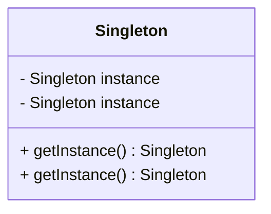
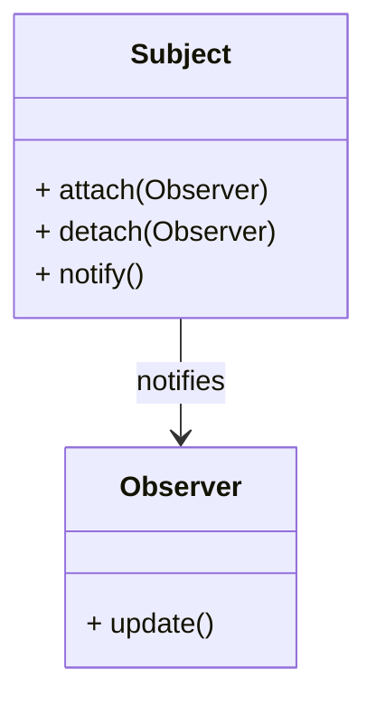

## 19.1 Recap of Key Concepts

As we reach the conclusion of our comprehensive guide on mastering Dart design patterns for effective Flutter development, it's essential to revisit and integrate the key concepts we've explored. This recap will help reinforce your understanding and appreciation of design patterns, their interrelations, and their critical role in software development.

### Summarizing Learnings

#### Introduction to Design Patterns in Dart

Design patterns are proven solutions to common software design problems. In Dart, they help developers create scalable, maintainable, and efficient applications. We explored the types of design patterns: creational, structural, behavioral, and concurrency patterns, each serving a unique purpose in software architecture.

#### Principles of Object-Oriented Design in Dart

Object-oriented programming (OOP) is the foundation of many design patterns. We delved into OOP fundamentals, emphasizing principles like composition over inheritance, SOLID principles, and DRY (Don't Repeat Yourself). These principles guide developers in creating robust and flexible code.

#### Dart Language Features and Best Practices

Dart's language features, such as null safety, asynchronous programming, and extension methods, are crucial for implementing design patterns effectively. We discussed best practices, including error handling, generics, and the use of isolates for concurrency, to enhance Dart development.

#### Creational Design Patterns in Dart

Creational patterns focus on object creation mechanisms. We covered patterns like Singleton, Factory Method, and Builder, which provide flexibility and control over object instantiation. These patterns are vital for managing object lifecycles and dependencies.

#### Structural Design Patterns in Dart

Structural patterns deal with object composition. Patterns like Adapter, Decorator, and Proxy help developers create complex structures by composing objects. These patterns enhance code modularity and reusability, essential for building scalable applications.

#### Behavioral Design Patterns in Dart

Behavioral patterns focus on object interaction and responsibility. We explored patterns like Strategy, Observer, and Command, which define clear communication and collaboration between objects. These patterns are crucial for implementing dynamic and flexible behavior in applications.

#### Idiomatic Dart Patterns

Idiomatic patterns leverage Dart's unique features to solve common problems. We discussed using mixins for code reuse, effective use of extension methods, and handling state in Flutter applications. These patterns help developers write clean, idiomatic Dart code.

#### Concurrency Patterns in Dart

Concurrency patterns address the challenges of parallel execution. We examined patterns like async/await, streams, and isolates, which enable efficient and responsive applications. Understanding these patterns is essential for managing concurrency in Dart.

#### State Management Patterns in Flutter

State management is a critical aspect of Flutter development. We explored patterns like Provider, BLoC, and Redux, which offer different approaches to managing state in Flutter applications. These patterns help developers build responsive and maintainable UIs.

#### Functional Programming Patterns in Dart

Functional programming (FP) patterns emphasize immutability and pure functions. We covered concepts like higher-order functions, currying, and functional reactive programming. FP patterns promote clean and predictable code, reducing side effects.

#### Reactive Programming Patterns in Dart

Reactive programming patterns focus on data flow and change propagation. We discussed working with streams, observables, and reactive state management. These patterns are essential for building responsive and interactive applications.

#### Networking and Data Patterns in Dart

Networking and data patterns address data access and manipulation. We explored patterns like Repository, Data Transfer Object, and handling real-time data with WebSockets. These patterns ensure efficient and reliable data handling in applications.

#### Security Patterns in Dart and Flutter

Security patterns focus on protecting applications from vulnerabilities. We covered authentication, secure data storage, and secure communication. Implementing these patterns is crucial for safeguarding user data and maintaining application integrity.

#### Performance Optimization Patterns

Performance optimization patterns enhance application efficiency. We discussed widget build optimization, lazy loading, and caching strategies. These patterns help developers create smooth and performant applications.

#### Testing and Design Patterns

Testing patterns ensure code reliability and quality. We explored unit testing, widget testing, and test-driven development (TDD). These patterns are essential for maintaining high standards in software development.

#### Anti-Patterns

Anti-patterns are common pitfalls in software design. We identified anti-patterns like overusing stateful widgets and mismanaging async/await. Recognizing and avoiding these anti-patterns is crucial for writing clean and efficient code.

#### Best Practices

Best practices guide developers in effective software development. We discussed selecting the right pattern, code organization, and maintaining code quality. Adhering to best practices ensures successful and sustainable projects.

#### Case Studies

Case studies provide practical insights into applying design patterns. We examined building a Flutter application, implementing an e-commerce app, and refactoring legacy applications. These examples demonstrate the real-world application of design patterns.

### Integrating Knowledge

Understanding how design patterns interrelate is key to mastering them. Each pattern addresses specific challenges, but they often work together to create comprehensive solutions. For example, creational patterns can be combined with structural patterns to manage object creation and composition effectively. Similarly, behavioral patterns can enhance the interaction between objects created using creational patterns.

### Importance of Design Patterns

Design patterns are invaluable tools in software development. They provide a shared language for developers, enabling effective communication and collaboration. Patterns also promote best practices, leading to code that is easier to understand, maintain, and extend. By mastering design patterns, developers can create high-quality software that meets user needs and withstands the test of time.

### Visualizing Design Patterns

To aid understanding, let's visualize some key design patterns using Mermaid.js diagrams.

#### Singleton Pattern

**Description:** The Singleton pattern ensures a class has only one instance and provides a global point of access to it.

#### Observer Pattern

**Description:** The Observer pattern defines a one-to-many dependency between objects so that when one object changes state, all its dependents are notified and updated automatically.

### Try It Yourself

Experiment with the code examples provided throughout this guide. Modify them to suit your needs and observe how design patterns can be adapted to different scenarios. This hands-on approach will deepen your understanding and help you apply these concepts in your projects.

### References and Links

For further reading, explore the following resources:

- [MDN Web Docs](https://developer.mozilla.org/)
- [W3Schools](https://www.w3schools.com/)
- [Dart Language Tour](https://dart.dev/guides/language/language-tour)
- [Flutter Documentation](https://flutter.dev/docs)

### Knowledge Check

To reinforce your learning, consider the following questions:

1. How do creational patterns differ from structural patterns?
2. What are the benefits of using the Singleton pattern?
3. How can the Observer pattern be applied in a Flutter application?
4. What is the role of state management patterns in Flutter?
5. How do functional programming patterns enhance code quality?

### Embrace the Journey

Remember, mastering design patterns is a journey. As you continue to explore and apply these concepts, you'll become more adept at creating efficient and maintainable software. Stay curious, keep experimenting, and enjoy the process of learning and growth.

## Quiz Time!



### What is the primary purpose of design patterns in software development?

- [x] To provide proven solutions to common design problems
- [ ] To increase code complexity
- [ ] To replace programming languages
- [ ] To eliminate the need for testing

> **Explanation:** Design patterns offer established solutions to recurring design challenges, enhancing code maintainability and scalability.

### Which principle emphasizes the importance of preferring composition over inheritance?

- [x] SOLID Principles
- [ ] DRY Principle
- [ ] KISS Principle
- [ ] YAGNI Principle

> **Explanation:** The SOLID principles, particularly the "Liskov Substitution Principle," advocate for composition over inheritance to enhance flexibility and reusability.

### What is a key benefit of using the Singleton pattern?

- [x] Ensures a class has only one instance
- [ ] Increases the number of class instances
- [ ] Simplifies object creation
- [ ] Eliminates the need for constructors

> **Explanation:** The Singleton pattern restricts a class to a single instance, providing a global point of access to it.

### How does the Observer pattern facilitate communication between objects?

- [x] By defining a one-to-many dependency
- [ ] By creating a one-to-one relationship
- [ ] By eliminating dependencies
- [ ] By using inheritance

> **Explanation:** The Observer pattern establishes a one-to-many dependency, allowing objects to be notified and updated automatically when a subject changes state.

### What is the role of state management patterns in Flutter applications?

- [x] To manage and synchronize application state
- [ ] To increase application complexity
- [ ] To eliminate the need for UI updates
- [ ] To replace Flutter widgets

> **Explanation:** State management patterns help manage and synchronize application state, ensuring responsive and maintainable UIs.

### How do functional programming patterns improve code quality?

- [x] By promoting immutability and pure functions
- [ ] By increasing code complexity
- [ ] By eliminating the need for testing
- [ ] By using inheritance

> **Explanation:** Functional programming patterns emphasize immutability and pure functions, reducing side effects and enhancing code predictability.

### Which pattern is commonly used for handling real-time data in Dart?

- [x] Observer Pattern
- [ ] Singleton Pattern
- [ ] Factory Method Pattern
- [ ] Builder Pattern

> **Explanation:** The Observer pattern is often used for handling real-time data, as it allows objects to be notified of changes in state.

### What is a key characteristic of creational design patterns?

- [x] They focus on object creation mechanisms
- [ ] They deal with object composition
- [ ] They define object interaction
- [ ] They eliminate the need for constructors

> **Explanation:** Creational design patterns focus on object creation mechanisms, providing flexibility and control over object instantiation.

### How do structural patterns enhance code modularity?

- [x] By composing objects to form complex structures
- [ ] By increasing code complexity
- [ ] By eliminating the need for classes
- [ ] By using inheritance

> **Explanation:** Structural patterns enhance code modularity by composing objects to form complex structures, promoting reusability and scalability.

### True or False: Anti-patterns are beneficial solutions to common design problems.

- [ ] True
- [x] False

> **Explanation:** Anti-patterns are common pitfalls in software design that should be avoided to maintain code quality and efficiency.



