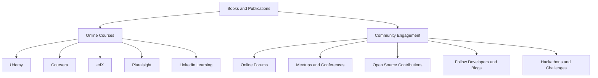

## 19.2 Continuing Education and Resources

As we conclude our comprehensive guide on mastering Dart design patterns for effective Flutter development, it's crucial to recognize that learning is an ongoing journey. The technology landscape is ever-evolving, and staying updated with the latest trends, tools, and techniques is essential for maintaining a competitive edge. In this section, we will explore various resources that can aid in your continuous learning and professional growth as a Dart and Flutter developer.

### Books and Publications

Books are a timeless resource for deepening your understanding of complex topics. Here are some highly recommended books and publications that can enhance your knowledge of Dart, Flutter, and design patterns:

1. **"Flutter in Action" by Eric Windmill**  
   This book provides a comprehensive introduction to Flutter, covering everything from the basics to advanced topics. It includes practical examples and detailed explanations, making it an excellent resource for both beginners and experienced developers.

2. **"Dart: Up and Running" by Kathy Walrath and Seth Ladd**  
   This book offers a thorough introduction to the Dart programming language. It covers essential concepts and features, providing a solid foundation for building web and mobile applications.

3. **"Design Patterns: Elements of Reusable Object-Oriented Software" by Erich Gamma, Richard Helm, Ralph Johnson, and John Vlissides**  
   Known as the "Gang of Four" book, this classic text is a must-read for any software developer. It introduces the concept of design patterns and provides detailed descriptions of 23 patterns that can be applied to object-oriented design.

4. **"Clean Code: A Handbook of Agile Software Craftsmanship" by Robert C. Martin**  
   While not specific to Dart or Flutter, this book is invaluable for understanding the principles of writing clean, maintainable code. It emphasizes the importance of code readability and simplicity, which are crucial for effective software development.

5. **"Effective Dart" by the Dart Team**  
   This online resource, available on the [Dart website](https://dart.dev/guides/language/effective-dart), provides guidelines and best practices for writing Dart code. It covers topics such as style, documentation, and performance, helping you write more efficient and idiomatic Dart code.

### Online Courses

Online courses offer a flexible and interactive way to learn new skills and concepts. Here are some platforms and courses that provide advanced training in Dart and Flutter:

1. **Udemy**  
   Udemy offers a wide range of courses on Dart and Flutter, catering to different skill levels. Some popular courses include "The Complete Flutter Development Bootcamp with Dart" by Angela Yu and "Flutter & Dart - The Complete Guide" by Maximilian Schwarzmüller. These courses cover everything from the basics to advanced topics, with hands-on projects and real-world examples.

2. **Coursera**  
   Coursera partners with top universities and organizations to offer high-quality courses. The "Flutter App Development" specialization by the University of Michigan is a comprehensive program that covers Flutter fundamentals, state management, and advanced topics like animations and testing.

3. **edX**  
   edX provides courses from leading institutions, including a "Flutter Development for Beginners" course by the University of Toronto. This course introduces Flutter and Dart, covering essential concepts and providing hands-on experience with building mobile applications.

4. **Pluralsight**  
   Pluralsight offers a variety of courses on Dart and Flutter, focusing on different aspects of development. Their "Flutter: Getting Started" course provides a solid introduction to Flutter, while "Flutter: Advanced" delves into more complex topics like state management and performance optimization.

5. **LinkedIn Learning**  
   LinkedIn Learning offers courses on Flutter and Dart, taught by industry experts. Their "Flutter Essential Training" course covers the fundamentals of Flutter development, while "Advanced Flutter: Beyond the Basics" explores more advanced topics like animations and custom widgets.

### Community Engagement

Engaging with the developer community is an excellent way to stay updated with the latest trends, share knowledge, and collaborate on projects. Here are some ways to get involved:

1. **Join Online Forums and Communities**  
   - **Stack Overflow**: Participate in discussions, ask questions, and share your knowledge with other developers. The Dart and Flutter tags are active communities where you can find solutions to common problems and learn from others' experiences.
   - **Reddit**: The r/FlutterDev and r/dartlang subreddits are great places to discuss Flutter and Dart, share resources, and connect with other developers.

2. **Attend Meetups and Conferences**  
   - **Flutter Meetups**: Join local Flutter meetups to network with other developers, attend talks, and participate in workshops. You can find meetups in your area on [Meetup.com](https://www.meetup.com/).
   - **Flutter Engage**: Attend Flutter Engage, an annual event hosted by Google, to learn about the latest updates and features in Flutter. The event includes talks, workshops, and networking opportunities.

3. **Contribute to Open Source Projects**  
   - **GitHub**: Contribute to open-source Dart and Flutter projects on GitHub. This is a great way to gain experience, collaborate with other developers, and give back to the community.
   - **Dart and Flutter Packages**: Explore the [pub.dev](https://pub.dev/) repository for Dart and Flutter packages. Contribute to existing packages or create your own to share with the community.

4. **Follow Influential Developers and Blogs**  
   - **Medium**: Follow Flutter and Dart publications on Medium, such as Flutter Community and Dartlang. These publications feature articles, tutorials, and insights from experienced developers.
   - **Twitter**: Follow influential developers and organizations on Twitter to stay updated with the latest news and trends in the Dart and Flutter ecosystem.

5. **Participate in Hackathons and Coding Challenges**  
   - **Hackathons**: Join hackathons to work on exciting projects, collaborate with other developers, and showcase your skills. Platforms like Devpost and Hackathon.com list upcoming hackathons you can participate in.
   - **Coding Challenges**: Participate in coding challenges on platforms like LeetCode, HackerRank, and CodeSignal to improve your problem-solving skills and compete with other developers.

### Visualizing Your Learning Path

To help you visualize your learning path and the resources available, here is a flowchart illustrating the different avenues for continuing education and community engagement:

### Knowledge Check

To reinforce your understanding of the resources available for continuing education in Dart and Flutter, consider the following questions:

- What are some recommended books for learning Dart and Flutter?
- Which online platforms offer advanced courses in Flutter development?
- How can you engage with the Dart and Flutter developer community?
- What are the benefits of contributing to open-source projects?
- How can participating in hackathons and coding challenges enhance your skills?

### Embrace the Journey

Remember, this is just the beginning of your journey in mastering Dart and Flutter development. As you progress, you'll encounter new challenges and opportunities for growth. Keep experimenting, stay curious, and enjoy the journey! The resources and community support available to you are invaluable assets in your continuous learning and professional development.

## Quiz Time!



### Which book is known as the "Gang of Four" book and introduces design patterns?

- [ ] "Flutter in Action"
- [ ] "Dart: Up and Running"
- [x] "Design Patterns: Elements of Reusable Object-Oriented Software"
- [ ] "Clean Code: A Handbook of Agile Software Craftsmanship"

> **Explanation:** "Design Patterns: Elements of Reusable Object-Oriented Software" by Erich Gamma, Richard Helm, Ralph Johnson, and John Vlissides is known as the "Gang of Four" book and introduces design patterns.

### Which online platform offers the "Flutter App Development" specialization by the University of Michigan?

- [ ] Udemy
- [x] Coursera
- [ ] edX
- [ ] Pluralsight

> **Explanation:** Coursera offers the "Flutter App Development" specialization by the University of Michigan.

### What is the primary focus of the book "Clean Code" by Robert C. Martin?

- [ ] Dart programming language
- [ ] Flutter development
- [x] Writing clean, maintainable code
- [ ] Design patterns

> **Explanation:** "Clean Code: A Handbook of Agile Software Craftsmanship" by Robert C. Martin focuses on writing clean, maintainable code.

### Which online resource provides guidelines and best practices for writing Dart code?

- [ ] "Flutter in Action"
- [ ] "Dart: Up and Running"
- [x] "Effective Dart"
- [ ] "Clean Code"

> **Explanation:** "Effective Dart" is an online resource that provides guidelines and best practices for writing Dart code.

### What are some ways to engage with the Dart and Flutter developer community?

- [x] Join online forums
- [x] Attend meetups and conferences
- [ ] Avoid open-source contributions
- [x] Follow influential developers and blogs

> **Explanation:** Engaging with the community can be done by joining online forums, attending meetups and conferences, and following influential developers and blogs.

### Which platform lists upcoming hackathons you can participate in?

- [ ] Stack Overflow
- [ ] Reddit
- [x] Devpost
- [ ] Medium

> **Explanation:** Devpost is a platform that lists upcoming hackathons you can participate in.

### What is the benefit of contributing to open-source projects?

- [x] Gain experience
- [x] Collaborate with other developers
- [ ] Keep knowledge to yourself
- [x] Give back to the community

> **Explanation:** Contributing to open-source projects allows you to gain experience, collaborate with other developers, and give back to the community.

### Which online platform offers courses from leading institutions, including a "Flutter Development for Beginners" course?

- [ ] Udemy
- [ ] Coursera
- [x] edX
- [ ] Pluralsight

> **Explanation:** edX offers courses from leading institutions, including a "Flutter Development for Beginners" course by the University of Toronto.

### What is the primary focus of the book "Flutter in Action" by Eric Windmill?

- [x] Comprehensive introduction to Flutter
- [ ] Dart programming language
- [ ] Design patterns
- [ ] Writing clean code

> **Explanation:** "Flutter in Action" by Eric Windmill provides a comprehensive introduction to Flutter.

### True or False: Participating in coding challenges can enhance your problem-solving skills.

- [x] True
- [ ] False

> **Explanation:** Participating in coding challenges can enhance your problem-solving skills and allow you to compete with other developers.


