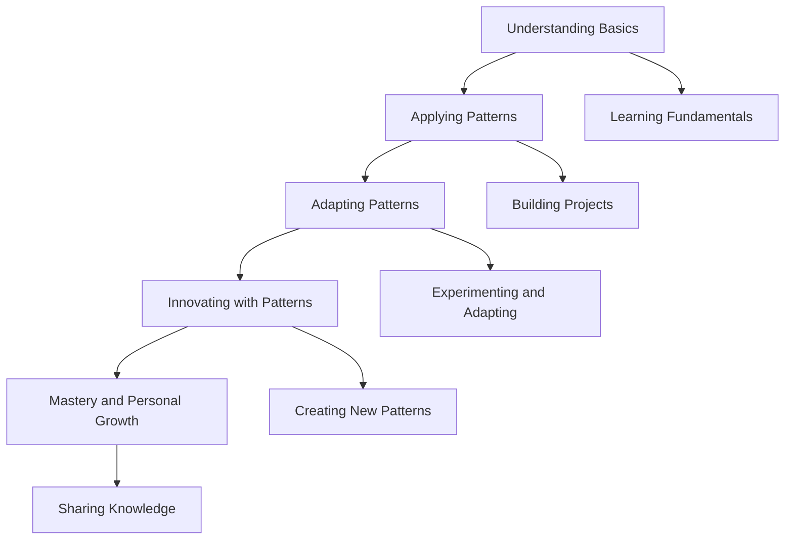

## 19.3 Final Thoughts on Design Patterns in Dart

As we reach the conclusion of our comprehensive guide on mastering Dart design patterns, it's essential to reflect on the journey we've undertaken. Design patterns are more than just templates or blueprints for solving common software design problems; they are a testament to the collective wisdom of the software engineering community. In this section, we will explore the adaptation and evolution of design patterns, the role of innovation in using these patterns, and how they contribute to personal growth as a developer.

### Adaptation and Evolution: Encouraging Flexibility in Applying Patterns

Design patterns are not rigid rules but flexible guidelines that can be adapted to suit the specific needs of a project. The ability to adapt a pattern to fit a particular context is a crucial skill for any developer. Let's delve into how we can encourage flexibility and adaptability in applying design patterns.

#### Understanding the Context

Before applying a design pattern, it's vital to understand the context in which it will be used. This involves analyzing the problem at hand, the constraints of the project, and the goals you aim to achieve. By thoroughly understanding the context, you can determine whether a pattern is suitable or if it needs to be adapted.

#### Customizing Patterns

Customization is key to making design patterns work for your specific needs. This might involve modifying the structure of a pattern, combining multiple patterns, or even creating a new pattern inspired by existing ones. For example, in Flutter development, you might combine the BLoC pattern with the Provider pattern to manage state more effectively.

#### Embracing Change

Software development is an ever-evolving field, and design patterns must evolve with it. As new technologies and methodologies emerge, patterns may need to be re-evaluated and adapted. Staying informed about industry trends and being open to change will ensure that your use of design patterns remains relevant and effective.

#### Code Example: Adapting the Singleton Pattern

Let's consider an example of adapting the Singleton pattern in Dart. The Singleton pattern ensures that a class has only one instance and provides a global point of access to it. However, in a Flutter application, you might need to adapt this pattern to work with dependency injection.

```dart
class SingletonService {
  SingletonService._privateConstructor();

  static final SingletonService _instance = SingletonService._privateConstructor();

  factory SingletonService() {
    return _instance;
  }

  void someServiceMethod() {
    // Implementation of the service method
  }
}

// Adapting Singleton with Dependency Injection
class MyApp extends StatelessWidget {
  @override
  Widget build(BuildContext context) {
    return Provider<SingletonService>(
      create: (_) => SingletonService(),
      child: MaterialApp(
        home: HomeScreen(),
      ),
    );
  }
}
```

In this example, we adapt the Singleton pattern to work with the Provider package, allowing for more flexible dependency management.

### Innovation: Using Patterns as a Foundation for Creative Solutions

Design patterns provide a solid foundation for building robust and maintainable software. However, they should not stifle creativity. Instead, they should serve as a springboard for innovation.

#### Building on Patterns

Once you have mastered the basics of design patterns, you can begin to innovate by building on them. This might involve creating new patterns that address specific challenges in your projects or finding novel ways to combine existing patterns.

#### Encouraging Experimentation

Experimentation is at the heart of innovation. Don't be afraid to try new approaches and test the limits of design patterns. This might involve using patterns in unconventional ways or exploring how they can be applied to new domains, such as IoT or machine learning.

#### Leveraging Dart's Features

Dart offers unique language features that can enhance the implementation of design patterns. For example, Dart's mixins and extension methods can be used to add functionality to classes without modifying their source code, enabling more flexible and reusable designs.

#### Code Example: Innovating with the Builder Pattern

The Builder pattern is used to construct complex objects step by step. Let's see how we can innovate with this pattern in Dart by using fluent interfaces.

```dart
class Pizza {
  String dough;
  String sauce;
  String topping;

  Pizza._builder(PizzaBuilder builder)
      : dough = builder.dough,
        sauce = builder.sauce,
        topping = builder.topping;
}

class PizzaBuilder {
  String dough;
  String sauce;
  String topping;

  PizzaBuilder setDough(String dough) {
    this.dough = dough;
    return this;
  }

  PizzaBuilder setSauce(String sauce) {
    this.sauce = sauce;
    return this;
  }

  PizzaBuilder setTopping(String topping) {
    this.topping = topping;
    return this;
  }

  Pizza build() {
    return Pizza._builder(this);
  }
}

// Usage
void main() {
  Pizza pizza = PizzaBuilder()
      .setDough('Thin Crust')
      .setSauce('Tomato')
      .setTopping('Pepperoni')
      .build();

  print('Pizza with ${pizza.dough}, ${pizza.sauce}, and ${pizza.topping}');
}
```

In this example, we use a fluent interface to make the Builder pattern more intuitive and readable.

### Personal Growth: Leveraging Design Patterns to Become a Better Developer

Mastering design patterns is a journey that contributes significantly to personal growth as a developer. It enhances your problem-solving skills, improves your ability to communicate complex ideas, and increases your confidence in tackling challenging projects.

#### Developing Problem-Solving Skills

Design patterns teach you to approach problems systematically. By understanding the underlying principles of patterns, you can apply them to a wide range of scenarios, making you a more versatile and effective problem solver.

#### Enhancing Communication

Design patterns provide a common language for developers. By using patterns, you can communicate complex design ideas more clearly and concisely, facilitating better collaboration with your team.

#### Building Confidence

As you gain experience with design patterns, you'll become more confident in your ability to design and implement complex systems. This confidence will empower you to take on more challenging projects and push the boundaries of what you can achieve.

#### Continuous Learning

The world of software development is constantly changing, and design patterns are no exception. By staying curious and committed to continuous learning, you can keep your skills sharp and stay ahead of the curve.

### Visualizing the Journey: A Roadmap to Mastery

To help visualize the journey of mastering design patterns, let's use a roadmap diagram that outlines the key stages of learning and applying design patterns in Dart.



This roadmap illustrates the progression from understanding the basics of design patterns to achieving mastery and personal growth.

### Embrace the Journey

Remember, mastering design patterns is not a destination but a journey. As you continue to explore and apply these patterns, you'll discover new ways to enhance your development skills and create innovative solutions. Keep experimenting, stay curious, and enjoy the journey!

### References and Further Reading

- [Design Patterns: Elements of Reusable Object-Oriented Software](https://en.wikipedia.org/wiki/Design_Patterns) - The seminal book by Erich Gamma, Richard Helm, Ralph Johnson, and John Vlissides.
- [Dart Language Tour](https://dart.dev/guides/language/language-tour) - Official Dart documentation for understanding language features.
- [Flutter Documentation](https://flutter.dev/docs) - Comprehensive resource for Flutter development.

## Quiz Time!



### What is the primary purpose of design patterns in software development?

- [x] To provide proven solutions to common design problems
- [ ] To enforce strict coding standards
- [ ] To replace the need for documentation
- [ ] To limit creativity in software design

> **Explanation:** Design patterns offer proven solutions to common design problems, helping developers create more efficient and maintainable code.

### How can design patterns be adapted to suit specific project needs?

- [x] By customizing the pattern structure
- [ ] By strictly following the pattern as defined
- [ ] By avoiding the use of patterns altogether
- [ ] By using patterns only in large projects

> **Explanation:** Customizing the pattern structure allows developers to adapt design patterns to fit specific project requirements.

### What role does innovation play in using design patterns?

- [x] It allows developers to build on patterns for creative solutions
- [ ] It restricts the use of patterns to predefined scenarios
- [ ] It eliminates the need for patterns
- [ ] It discourages experimentation with patterns

> **Explanation:** Innovation enables developers to build on existing patterns, creating new solutions and enhancing creativity.

### How can design patterns contribute to personal growth as a developer?

- [x] By enhancing problem-solving skills
- [x] By improving communication with team members
- [ ] By reducing the need for learning new technologies
- [ ] By limiting the scope of projects

> **Explanation:** Design patterns enhance problem-solving skills and improve communication, contributing to personal growth as a developer.

### What is a key benefit of using fluent interfaces in design patterns?

- [x] They make code more readable and intuitive
- [ ] They enforce strict coding practices
- [ ] They eliminate the need for documentation
- [ ] They restrict the use of patterns

> **Explanation:** Fluent interfaces make code more readable and intuitive, enhancing the usability of design patterns.

### Why is it important to understand the context before applying a design pattern?

- [x] To determine the suitability of the pattern
- [ ] To ensure strict adherence to the pattern
- [ ] To avoid using patterns altogether
- [ ] To limit the scope of the project

> **Explanation:** Understanding the context helps determine whether a pattern is suitable and how it can be adapted to fit the project.

### How can Dart's unique features enhance the implementation of design patterns?

- [x] By using mixins and extension methods for flexibility
- [ ] By enforcing strict pattern adherence
- [ ] By eliminating the need for patterns
- [ ] By restricting the use of patterns

> **Explanation:** Dart's mixins and extension methods add flexibility, enhancing the implementation of design patterns.

### What is the significance of continuous learning in mastering design patterns?

- [x] It keeps skills sharp and relevant
- [ ] It eliminates the need for patterns
- [ ] It restricts the use of patterns
- [ ] It limits creativity in software design

> **Explanation:** Continuous learning ensures that developers stay updated with industry trends and maintain relevant skills.

### How can experimentation with design patterns lead to innovation?

- [x] By exploring unconventional uses of patterns
- [ ] By strictly adhering to predefined patterns
- [ ] By avoiding the use of patterns
- [ ] By limiting the scope of projects

> **Explanation:** Experimentation allows developers to explore new ways of using patterns, leading to innovative solutions.

### True or False: Design patterns are rigid rules that must be followed exactly.

- [ ] True
- [x] False

> **Explanation:** Design patterns are flexible guidelines that can be adapted to fit specific project needs.


