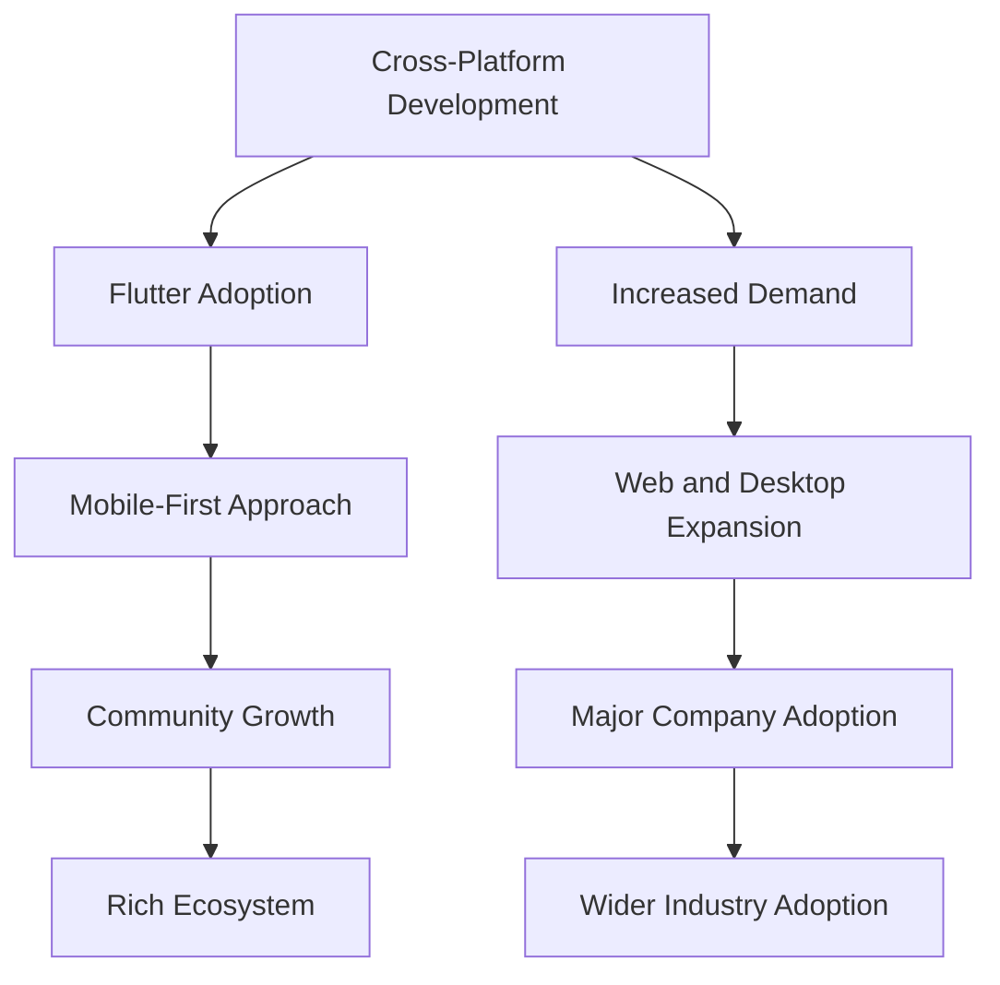

## 19.4 The Future of Dart and Flutter

As we delve into the future of Dart and Flutter, we find ourselves at the intersection of language evolution, industry trends, and burgeoning career opportunities. This section aims to provide a comprehensive overview of what lies ahead for these technologies, how they fit into the broader tech landscape, and the potential paths for developers looking to harness their power.

### Language and Framework Evolution

#### Anticipating Upcoming Features

Dart and Flutter have consistently evolved to meet the demands of modern software development. As we look to the future, several key areas of evolution stand out:

1. **Enhanced Language Features**: Dart continues to evolve with features that enhance developer productivity and code safety. Anticipate improvements in type inference, pattern matching, and enhanced async capabilities. These features aim to make Dart more expressive and efficient for developers.

2. **Improved Performance**: Performance optimizations remain a priority for both Dart and Flutter. Expect enhancements in the Dart VM and Flutter's rendering engine to deliver faster execution times and smoother animations, crucial for high-performance applications.

3. **Expanded Platform Support**: Flutter's promise of "write once, run anywhere" is becoming more robust. With ongoing efforts to support more platforms, including web, desktop, and embedded systems, Flutter is poised to become a truly universal framework.

4. **Tooling and Developer Experience**: The Flutter and Dart teams are committed to improving the developer experience. Look forward to more powerful debugging tools, enhanced IDE support, and streamlined workflows that make building and deploying applications more efficient.

5. **Integration with Emerging Technologies**: As technologies like AI, AR/VR, and IoT continue to grow, Dart and Flutter are expected to integrate more seamlessly with these domains. This integration will open new possibilities for innovative applications.

#### Code Example: Future Dart Features

Let's explore a hypothetical code snippet that demonstrates potential future features in Dart, such as enhanced pattern matching and async capabilities:

```dart
// Hypothetical Dart code with enhanced pattern matching and async capabilities

Future<void> processData(List<dynamic> data) async {
  for (var item in data) {
    switch (item) {
      case int value when value > 0:
        print('Positive integer: $value');
        break;
      case String text:
        print('String: $text');
        break;
      case Future<int> futureValue:
        var result = await futureValue;
        print('Future resolved to: $result');
        break;
      default:
        print('Unknown type');
    }
  }
}

void main() async {
  var data = [42, 'Hello', Future.value(99)];
  await processData(data);
}
```

In this example, we see a hypothetical use of pattern matching with conditions (`when`) and enhanced async handling, illustrating how future Dart features could simplify complex logic.

### Industry Trends

#### Observing How Dart and Flutter Fit into the Broader Tech Landscape

Dart and Flutter have carved out a significant niche in the tech landscape, and several industry trends highlight their growing importance:

1. **Cross-Platform Development**: The demand for cross-platform solutions is on the rise, and Flutter's ability to deliver native-like performance across multiple platforms makes it a preferred choice for many developers and organizations.

2. **Mobile-First Approach**: With the proliferation of mobile devices, Flutter's strong mobile development capabilities position it as a leading framework for building responsive and engaging mobile applications.

3. **Web and Desktop Expansion**: As Flutter expands its support for web and desktop applications, it is becoming a more versatile tool for developers looking to create a unified codebase for multiple platforms.

4. **Community and Ecosystem Growth**: The Dart and Flutter communities are vibrant and growing, contributing to a rich ecosystem of packages and tools that enhance development capabilities and foster innovation.

5. **Adoption by Major Companies**: Companies like Google, Alibaba, and BMW have adopted Flutter for their applications, signaling confidence in its capabilities and encouraging wider adoption across industries.

#### Visualizing Industry Trends

To better understand how Dart and Flutter fit into the broader tech landscape, let's visualize these industry trends using a flowchart:



This flowchart illustrates the interconnected trends driving the adoption and growth of Dart and Flutter in the tech industry.

### Opportunities

#### Exploring Career Paths and Market Demands

The future of Dart and Flutter is not only about technological advancements but also about the opportunities they create for developers:

1. **Growing Demand for Flutter Developers**: As more companies adopt Flutter for cross-platform development, the demand for skilled Flutter developers is on the rise. This trend presents lucrative career opportunities for developers proficient in Flutter.

2. **Diverse Application Domains**: Dart and Flutter are being used in diverse domains, from mobile and web applications to IoT and embedded systems. This diversity allows developers to explore various industries and application types.

3. **Freelancing and Entrepreneurship**: The versatility of Flutter makes it an excellent choice for freelancers and entrepreneurs looking to build and deploy applications quickly and efficiently.

4. **Continuous Learning and Skill Development**: The evolving nature of Dart and Flutter encourages continuous learning, allowing developers to stay at the forefront of technology and enhance their skill sets.

5. **Community Engagement and Contribution**: The open-source nature of Dart and Flutter provides opportunities for developers to contribute to the community, gain recognition, and collaborate with other experts.

#### Try It Yourself: Exploring Career Opportunities

To explore the career opportunities in Dart and Flutter, consider the following exercises:

- **Research Job Listings**: Look for job listings that require Dart and Flutter skills. Note the industries and roles that are most prevalent.
- **Build a Portfolio**: Create a portfolio of projects that showcase your skills in Dart and Flutter. Include a variety of applications to demonstrate your versatility.
- **Engage with the Community**: Join online forums, attend meetups, and contribute to open-source projects to connect with other developers and stay informed about the latest trends.

### Conclusion

The future of Dart and Flutter is bright, with continuous advancements in language features, growing industry adoption, and expanding career opportunities. As developers, we have the chance to be part of this exciting journey, leveraging Dart and Flutter to build innovative and impactful applications.

Remember, this is just the beginning. As you progress, you'll build more complex and interactive applications. Keep experimenting, stay curious, and enjoy the journey!

## Quiz Time!



### What is one of the anticipated future features of Dart?

- [x] Enhanced pattern matching
- [ ] Removal of async capabilities
- [ ] Decreased platform support
- [ ] Reduced community engagement

> **Explanation:** Enhanced pattern matching is one of the anticipated future features of Dart, aimed at making the language more expressive and efficient.

### Which industry trend highlights Flutter's importance?

- [x] Cross-platform development
- [ ] Decreased mobile usage
- [ ] Limited web support
- [ ] Declining community growth

> **Explanation:** Cross-platform development is a key industry trend that highlights Flutter's importance due to its ability to deliver native-like performance across multiple platforms.

### What is a potential career opportunity for Flutter developers?

- [x] Freelancing and entrepreneurship
- [ ] Limited job availability
- [ ] Decreased demand for mobile apps
- [ ] Reduced skill development

> **Explanation:** Freelancing and entrepreneurship are potential career opportunities for Flutter developers, given Flutter's versatility and efficiency in building applications.

### How does Flutter fit into the mobile-first approach?

- [x] Strong mobile development capabilities
- [ ] Limited mobile support
- [ ] Focus on desktop applications
- [ ] Decreased mobile adoption

> **Explanation:** Flutter fits into the mobile-first approach due to its strong mobile development capabilities, making it a leading framework for building responsive mobile applications.

### What is a benefit of engaging with the Dart and Flutter community?

- [x] Continuous learning and skill development
- [ ] Limited collaboration opportunities
- [ ] Decreased recognition
- [ ] Reduced access to resources

> **Explanation:** Engaging with the Dart and Flutter community offers continuous learning and skill development opportunities, allowing developers to stay informed and enhance their expertise.

### Which companies have adopted Flutter for their applications?

- [x] Google, Alibaba, BMW
- [ ] Only small startups
- [ ] No major companies
- [ ] Limited to tech companies

> **Explanation:** Companies like Google, Alibaba, and BMW have adopted Flutter for their applications, signaling confidence in its capabilities and encouraging wider adoption.

### What is a key focus for future Dart and Flutter tooling?

- [x] Improved developer experience
- [ ] Reduced IDE support
- [ ] Limited debugging tools
- [ ] Decreased workflow efficiency

> **Explanation:** A key focus for future Dart and Flutter tooling is improving the developer experience, with enhancements in debugging tools, IDE support, and workflow efficiency.

### How does Flutter's platform support impact its adoption?

- [x] Expands its versatility
- [ ] Limits its use to mobile only
- [ ] Reduces its appeal for web development
- [ ] Decreases its adoption in embedded systems

> **Explanation:** Flutter's expanding platform support increases its versatility, making it a more attractive option for developers looking to create applications for multiple platforms.

### What is a potential benefit of Dart's integration with emerging technologies?

- [x] Opens new possibilities for innovative applications
- [ ] Limits its use to traditional applications
- [ ] Decreases its relevance in modern tech
- [ ] Reduces its appeal for developers

> **Explanation:** Dart's integration with emerging technologies opens new possibilities for innovative applications, allowing developers to explore new domains and create cutting-edge solutions.

### True or False: The future of Dart and Flutter is limited to mobile applications.

- [ ] True
- [x] False

> **Explanation:** False. The future of Dart and Flutter is not limited to mobile applications; they are expanding to web, desktop, and embedded systems, making them versatile tools for various platforms.


