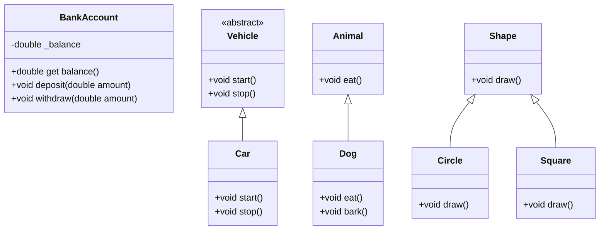

## 2.1 Object-Oriented Programming (OOP) Fundamentals

Object-Oriented Programming (OOP) is a paradigm that uses "objects" to design applications and computer programs. It utilizes several core principles to create modular, reusable, and scalable code. In Dart, OOP is a fundamental aspect that enhances the development of robust Flutter applications. Let's delve into the key OOP concepts: encapsulation, abstraction, inheritance, and polymorphism.

### Encapsulation

**Encapsulation** is the bundling of data with the methods that operate on that data. It restricts direct access to some of an object's components, which can prevent the accidental modification of data. Encapsulation is achieved using classes in Dart.

#### Key Concepts of Encapsulation

- **Data Hiding**: Protects the internal state of an object from unintended interference and misuse.
- **Public and Private Members**: Dart uses underscores (_) to denote private members.
- **Getter and Setter Methods**: Provide controlled access to private properties.

#### Code Example: Encapsulation in Dart

```dart
class BankAccount {
  // Private member variable
  double _balance;

  // Constructor
  BankAccount(this._balance);

  // Getter for balance
  double get balance => _balance;

  // Method to deposit money
  void deposit(double amount) {
    if (amount > 0) {
      _balance += amount;
    }
  }

  // Method to withdraw money
  void withdraw(double amount) {
    if (amount > 0 && amount <= _balance) {
      _balance -= amount;
    }
  }
}

void main() {
  var account = BankAccount(1000);
  account.deposit(500);
  account.withdraw(200);
  print('Current balance: ${account.balance}');
}
```

In this example, the `_balance` variable is private, and access to it is controlled through the `balance` getter and the `deposit` and `withdraw` methods.

### Abstraction

**Abstraction** is the concept of hiding the complex reality while exposing only the necessary parts. It helps in reducing programming complexity and effort. In Dart, abstraction is achieved using abstract classes and interfaces.

#### Key Concepts of Abstraction

- **Abstract Classes**: Cannot be instantiated and are used to define common behavior for subclasses.
- **Interfaces**: Define a contract that implementing classes must fulfill.

#### Code Example: Abstraction in Dart

```dart
abstract class Vehicle {
  void start();
  void stop();
}

class Car implements Vehicle {
  @override
  void start() {
    print('Car started');
  }

  @override
  void stop() {
    print('Car stopped');
  }
}

void main() {
  Vehicle myCar = Car();
  myCar.start();
  myCar.stop();
}
```

Here, `Vehicle` is an abstract class with two methods, `start` and `stop`. The `Car` class implements these methods, providing specific functionality.

### Inheritance

**Inheritance** allows a class to inherit properties and methods from another class. It promotes code reusability and establishes a subtype from an existing object.

#### Key Concepts of Inheritance

- **Base Class (Superclass)**: The class being inherited from.
- **Derived Class (Subclass)**: The class that inherits from the base class.
- **Method Overriding**: Allows a subclass to provide a specific implementation of a method already defined in its superclass.

#### Code Example: Inheritance in Dart

```dart
class Animal {
  void eat() {
    print('Animal is eating');
  }
}

class Dog extends Animal {
  @override
  void eat() {
    print('Dog is eating');
  }

  void bark() {
    print('Dog is barking');
  }
}

void main() {
  Dog myDog = Dog();
  myDog.eat(); // Calls overridden method
  myDog.bark();
}
```

In this example, `Dog` inherits from `Animal` and overrides the `eat` method to provide specific behavior.

### Polymorphism

**Polymorphism** allows objects to be treated as instances of their parent class. It enables a single interface to represent different underlying forms (data types).

#### Key Concepts of Polymorphism

- **Compile-time Polymorphism**: Achieved through method overloading.
- **Runtime Polymorphism**: Achieved through method overriding.

#### Code Example: Polymorphism in Dart

```dart
class Shape {
  void draw() {
    print('Drawing a shape');
  }
}

class Circle extends Shape {
  @override
  void draw() {
    print('Drawing a circle');
  }
}

class Square extends Shape {
  @override
  void draw() {
    print('Drawing a square');
  }
}

void main() {
  List<Shape> shapes = [Circle(), Square()];
  for (var shape in shapes) {
    shape.draw(); // Calls the overridden method
  }
}
```

In this example, both `Circle` and `Square` override the `draw` method of the `Shape` class, demonstrating polymorphism.

### Visualizing OOP Concepts

To better understand these concepts, let's visualize the relationships between classes using a class diagram.



This diagram illustrates the inheritance and implementation relationships between classes, highlighting how OOP principles are applied in Dart.

### Try It Yourself

To deepen your understanding, try modifying the code examples:

- **Encapsulation**: Add a method to transfer funds between two `BankAccount` objects.
- **Abstraction**: Create a new class `Bike` that implements the `Vehicle` interface.
- **Inheritance**: Add a new subclass `Cat` that extends `Animal` and overrides the `eat` method.
- **Polymorphism**: Add a new shape class `Triangle` and include it in the list of shapes to draw.

### Knowledge Check

- **What is encapsulation, and why is it important?**
- **How does abstraction simplify code complexity?**
- **What are the benefits of using inheritance in Dart?**
- **How does polymorphism enhance flexibility in code?**

### Embrace the Journey

Remember, mastering OOP in Dart is a journey. As you continue to explore these concepts, you'll find new ways to apply them in your Flutter applications. Keep experimenting, stay curious, and enjoy the process of learning and growing as a developer.

## Quiz Time!



### What is encapsulation in OOP?

- [x] Bundling data with methods that operate on the data
- [ ] Hiding complex implementation details
- [ ] Creating new classes from existing ones
- [ ] Ability to process objects differently

> **Explanation:** Encapsulation involves bundling the data with the methods that operate on the data, restricting access to some of the object's components.

### Which keyword is used in Dart to denote private members?

- [x] _
- [ ] private
- [ ] #
- [ ] $

> **Explanation:** In Dart, an underscore (_) is used to denote private members.

### What is the purpose of abstraction in OOP?

- [x] Hiding complex implementation details and showing only necessary features
- [ ] Creating new classes from existing ones
- [ ] Bundling data with methods that operate on the data
- [ ] Ability to process objects differently

> **Explanation:** Abstraction hides complex implementation details and shows only the necessary features to reduce complexity.

### How is inheritance implemented in Dart?

- [x] Using the `extends` keyword
- [ ] Using the `implements` keyword
- [ ] Using the `with` keyword
- [ ] Using the `override` keyword

> **Explanation:** Inheritance in Dart is implemented using the `extends` keyword.

### What is polymorphism in OOP?

- [x] Ability to process objects differently based on their data type or class
- [ ] Hiding complex implementation details
- [ ] Creating new classes from existing ones
- [ ] Bundling data with methods that operate on the data

> **Explanation:** Polymorphism allows objects to be processed differently based on their data type or class.

### Which of the following is an example of runtime polymorphism?

- [x] Method overriding
- [ ] Method overloading
- [ ] Operator overloading
- [ ] Constructor overloading

> **Explanation:** Runtime polymorphism is achieved through method overriding.

### What is the role of an abstract class in Dart?

- [x] Define common behavior for subclasses
- [ ] Provide a specific implementation of a method
- [ ] Create new classes from existing ones
- [ ] Bundle data with methods that operate on the data

> **Explanation:** An abstract class defines common behavior for subclasses and cannot be instantiated.

### How can polymorphism be demonstrated in Dart?

- [x] By overriding methods in subclasses
- [ ] By using private members
- [ ] By implementing interfaces
- [ ] By using abstract classes

> **Explanation:** Polymorphism is demonstrated by overriding methods in subclasses.

### What is the benefit of using inheritance?

- [x] Code reusability
- [ ] Hiding complex implementation details
- [ ] Ability to process objects differently
- [ ] Bundling data with methods that operate on the data

> **Explanation:** Inheritance promotes code reusability by allowing a class to inherit properties and methods from another class.

### True or False: In Dart, a class can inherit from multiple classes.

- [ ] True
- [x] False

> **Explanation:** Dart does not support multiple inheritance directly; a class can only inherit from one superclass.


