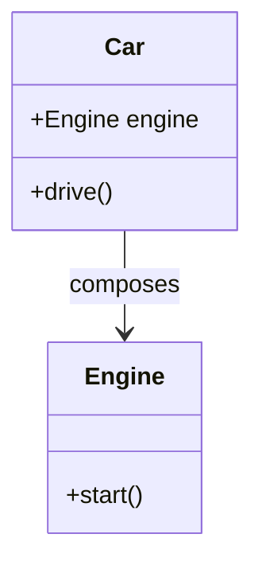

## 2.2 Composition Over Inheritance

In the realm of object-oriented programming (OOP), the debate between composition and inheritance is a longstanding one. Both are fundamental concepts that allow developers to create flexible and reusable code. However, as software design has evolved, the principle of "Composition Over Inheritance" has gained prominence. This principle suggests that you should favor composing objects over subclassing them. In this section, we will delve into the definition, advantages, and practical implementation of composition over inheritance in Dart, using classes, mixins, and interfaces.

### Definition and Advantages

**Composition Over Inheritance** is a design principle that encourages developers to achieve polymorphic behavior and code reuse by assembling objects rather than relying on a class hierarchy. This approach offers several advantages:

1. **Flexibility**: Composition allows for more flexible code. You can change the behavior of a class at runtime by composing it with different objects, whereas inheritance is static and determined at compile time.

2. **Reusability**: By composing objects, you can reuse existing components in new ways without modifying their source code. This promotes the DRY (Don't Repeat Yourself) principle.

3. **Encapsulation**: Composition provides better encapsulation. The internal details of composed objects are hidden, reducing the risk of unintended interactions.

4. **Avoiding the Fragile Base Class Problem**: Inheritance can lead to the fragile base class problem, where changes in a base class can inadvertently affect derived classes. Composition mitigates this risk by decoupling classes.

5. **Simplified Testing**: Composed objects can be tested independently, making unit testing more straightforward.

### Implementing Composition in Dart

Dart, with its rich set of features, provides several ways to implement composition, including classes, mixins, and interfaces. Let's explore each of these in detail.

#### Using Classes for Composition

In Dart, you can achieve composition by including instances of other classes as fields within a class. This allows you to delegate responsibilities to these composed objects.

```dart
class Engine {
  void start() {
    print('Engine started');
  }
}

class Car {
  final Engine engine;

  Car(this.engine);

  void drive() {
    engine.start();
    print('Car is driving');
  }
}

void main() {
  Engine engine = Engine();
  Car car = Car(engine);
  car.drive();
}
```

In this example, the `Car` class composes an `Engine` object. The `Car` class delegates the responsibility of starting the engine to the `Engine` class, demonstrating how composition can be used to build complex behavior from simpler components.

#### Using Mixins for Composition

Mixins in Dart allow you to reuse a class's functionality in multiple class hierarchies. They provide a way to compose behavior without using inheritance.

```dart
mixin Flyable {
  void fly() {
    print('Flying');
  }
}

class Bird with Flyable {
  void chirp() {
    print('Chirping');
  }
}

void main() {
  Bird bird = Bird();
  bird.chirp();
  bird.fly();
}
```

Here, the `Flyable` mixin is composed into the `Bird` class, allowing `Bird` to gain flying capabilities without inheriting from a base class. Mixins are a powerful tool for composition, enabling code reuse across unrelated classes.

#### Using Interfaces for Composition

Interfaces in Dart define a contract that classes can implement. They are another way to achieve composition by specifying what methods a class should have.

```dart
abstract class Logger {
  void log(String message);
}

class ConsoleLogger implements Logger {
  @override
  void log(String message) {
    print('Log: $message');
  }
}

class Application {
  final Logger logger;

  Application(this.logger);

  void run() {
    logger.log('Application started');
  }
}

void main() {
  Logger logger = ConsoleLogger();
  Application app = Application(logger);
  app.run();
}
```

In this example, the `Application` class composes a `Logger` interface. This allows for flexibility in choosing different logging implementations, such as `ConsoleLogger`, without changing the `Application` class.

### Real-World Scenarios

Let's explore some real-world scenarios where composition is more advantageous than inheritance.

#### Scenario 1: UI Components in Flutter

In Flutter, building UI components using composition is a common practice. Widgets are composed of other widgets, allowing for highly customizable and reusable UI elements.

```dart
class CustomButton extends StatelessWidget {
  final String label;
  final VoidCallback onPressed;

  CustomButton({required this.label, required this.onPressed});

  @override
  Widget build(BuildContext context) {
    return ElevatedButton(
      onPressed: onPressed,
      child: Text(label),
    );
  }
}
```

In this example, `CustomButton` is composed of an `ElevatedButton` widget. This approach allows developers to create custom buttons with specific behavior and styling without subclassing the `ElevatedButton`.

#### Scenario 2: Game Development

In game development, entities often have various behaviors like moving, jumping, or attacking. Using composition, you can create these behaviors as separate components and compose them into game entities.

```dart
class MoveComponent {
  void move() {
    print('Moving');
  }
}

class JumpComponent {
  void jump() {
    print('Jumping');
  }
}

class Player {
  final MoveComponent moveComponent;
  final JumpComponent jumpComponent;

  Player(this.moveComponent, this.jumpComponent);

  void performActions() {
    moveComponent.move();
    jumpComponent.jump();
  }
}

void main() {
  Player player = Player(MoveComponent(), JumpComponent());
  player.performActions();
}
```

Here, the `Player` class composes `MoveComponent` and `JumpComponent`, allowing it to perform both actions. This modular approach makes it easy to add or remove behaviors as needed.

### Visualizing Composition Over Inheritance

To better understand the concept of composition over inheritance, let's visualize it using a class diagram.



In this diagram, the `Car` class composes an `Engine` class, illustrating the relationship between the two. The `Car` class uses the `Engine` class to perform its operations, demonstrating the principle of composition.

### Key Participants

- **Component Classes**: These are the building blocks that provide specific functionality. In our examples, `Engine`, `Flyable`, and `Logger` are component classes.
- **Composite Classes**: These classes assemble component classes to create complex behavior. `Car`, `Bird`, and `Application` are composite classes in our examples.

### Applicability

Consider using composition over inheritance when:

- You need to change behavior at runtime.
- You want to avoid the limitations of a rigid class hierarchy.
- You aim to achieve better code reuse and encapsulation.
- You want to reduce the risk of the fragile base class problem.

### Design Considerations

When implementing composition over inheritance, keep the following considerations in mind:

- **Balance**: While composition offers flexibility, it can lead to increased complexity if overused. Strive for a balance between composition and inheritance.
- **Performance**: Composing many small objects can have performance implications. Profile your application to ensure it meets performance requirements.
- **Readability**: Ensure that composed classes are well-documented and intuitive to understand.

### Differences and Similarities

Composition and inheritance are often confused, but they serve different purposes:

- **Inheritance**: Establishes an "is-a" relationship. Use it when a subclass should be a type of the superclass.
- **Composition**: Establishes a "has-a" relationship. Use it when a class should have certain behaviors or properties.

### Try It Yourself

To solidify your understanding of composition over inheritance, try modifying the code examples provided:

- Add a `Stop` method to the `Engine` class and update the `Car` class to use it.
- Create a new mixin for `Swimmable` and compose it into a `Fish` class.
- Implement a new `FileLogger` class that writes logs to a file and use it in the `Application` class.

### Knowledge Check

Before moving on, take a moment to reflect on the key takeaways:

- Composition allows for more flexible and reusable code compared to inheritance.
- Dart provides classes, mixins, and interfaces to implement composition.
- Real-world scenarios, such as UI components and game development, benefit from composition.

### Embrace the Journey

Remember, mastering composition over inheritance is a journey. As you continue to explore Dart and Flutter, you'll discover more opportunities to apply this principle. Keep experimenting, stay curious, and enjoy the process of building robust and maintainable applications.

## Quiz Time!



### What is the primary advantage of using composition over inheritance?

- [x] Flexibility in changing behavior at runtime
- [ ] Simplicity in class hierarchy
- [ ] Easier to implement
- [ ] Faster execution time

> **Explanation:** Composition allows for more flexible code by enabling behavior changes at runtime, unlike inheritance which is static.

### Which Dart feature allows for code reuse across unrelated classes?

- [ ] Interfaces
- [x] Mixins
- [ ] Abstract classes
- [ ] Inheritance

> **Explanation:** Mixins provide a way to reuse code across unrelated classes, enabling composition.

### What problem does composition help avoid that is common with inheritance?

- [x] Fragile base class problem
- [ ] Code duplication
- [ ] Lack of polymorphism
- [ ] Inconsistent interfaces

> **Explanation:** Composition helps avoid the fragile base class problem by decoupling classes.

### In the provided code example, what does the `Car` class compose?

- [x] Engine
- [ ] Wheel
- [ ] Door
- [ ] Transmission

> **Explanation:** The `Car` class composes an `Engine` object to perform its operations.

### Which of the following is a real-world scenario where composition is beneficial?

- [x] UI components in Flutter
- [ ] Simple arithmetic operations
- [ ] Basic data storage
- [ ] Static configuration settings

> **Explanation:** UI components in Flutter benefit from composition due to their customizable and reusable nature.

### What is a key consideration when using composition over inheritance?

- [x] Balance between flexibility and complexity
- [ ] Ensuring all classes are abstract
- [ ] Using only static methods
- [ ] Avoiding encapsulation

> **Explanation:** While composition offers flexibility, it can lead to increased complexity if overused, so balance is key.

### What relationship does inheritance establish?

- [x] "Is-a" relationship
- [ ] "Has-a" relationship
- [ ] "Uses-a" relationship
- [ ] "Depends-on" relationship

> **Explanation:** Inheritance establishes an "is-a" relationship between classes.

### What relationship does composition establish?

- [ ] "Is-a" relationship
- [x] "Has-a" relationship
- [ ] "Uses-a" relationship
- [ ] "Depends-on" relationship

> **Explanation:** Composition establishes a "has-a" relationship, allowing classes to have certain behaviors or properties.

### Which of the following is NOT a benefit of composition?

- [ ] Better encapsulation
- [ ] Reusability
- [x] Simplified class hierarchy
- [ ] Flexibility

> **Explanation:** While composition offers many benefits, it can sometimes lead to more complex class hierarchies.

### True or False: Composition allows for behavior changes at runtime.

- [x] True
- [ ] False

> **Explanation:** Composition allows for behavior changes at runtime by composing objects with different behaviors.


